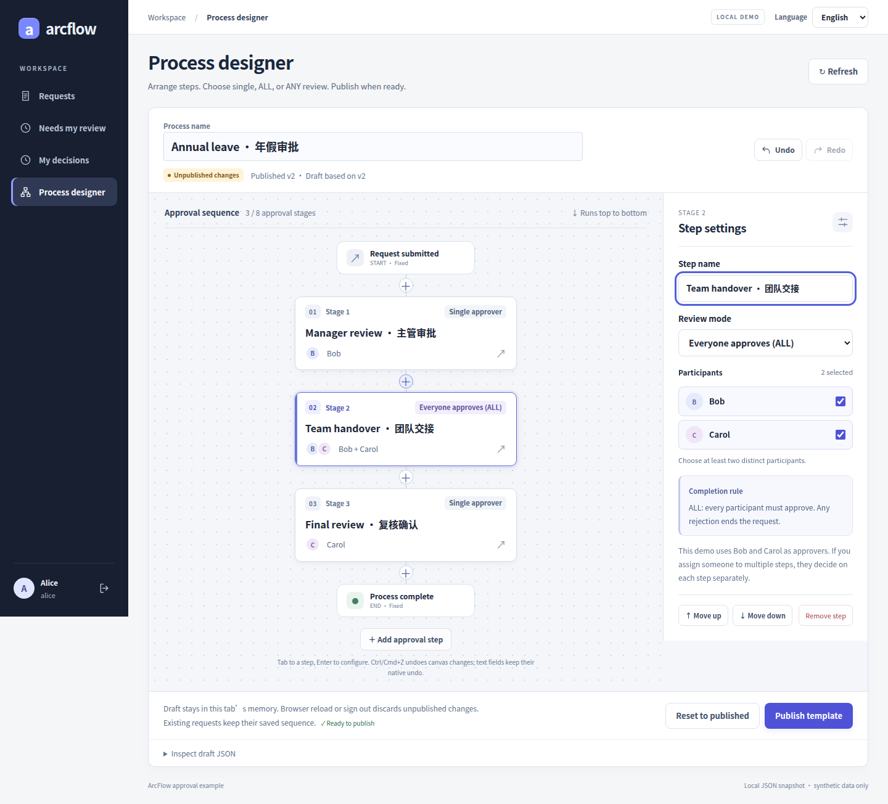
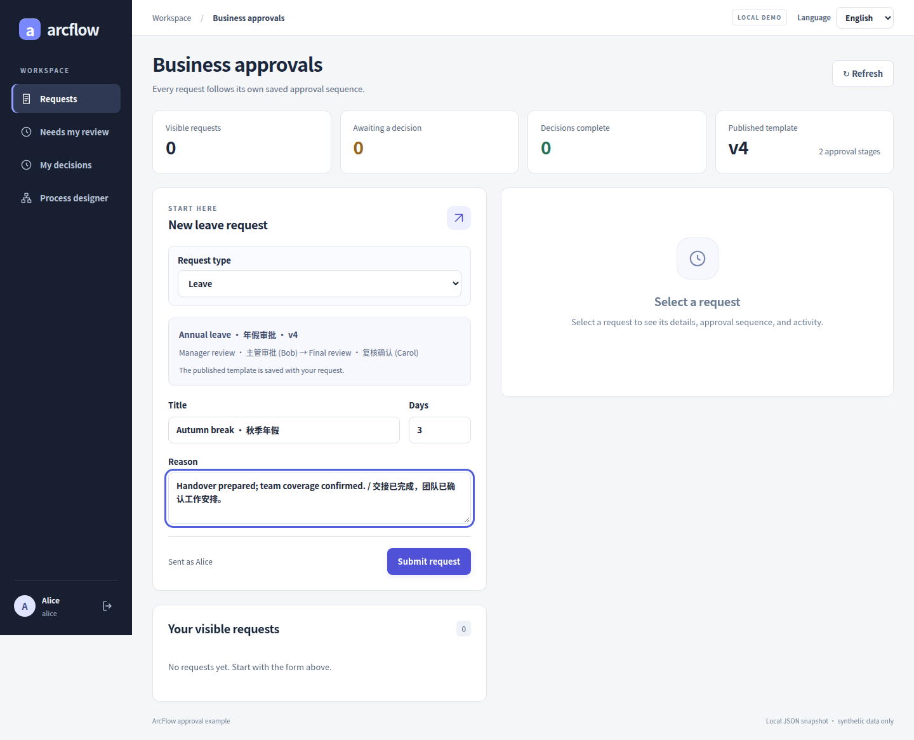
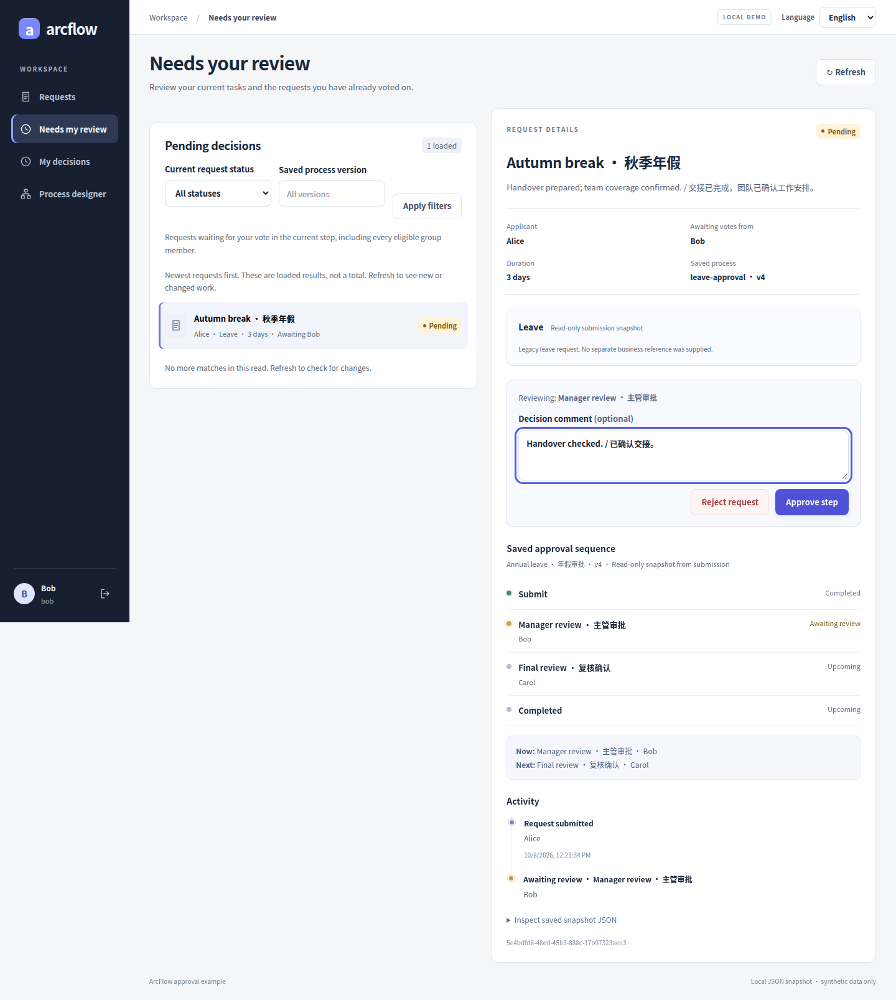
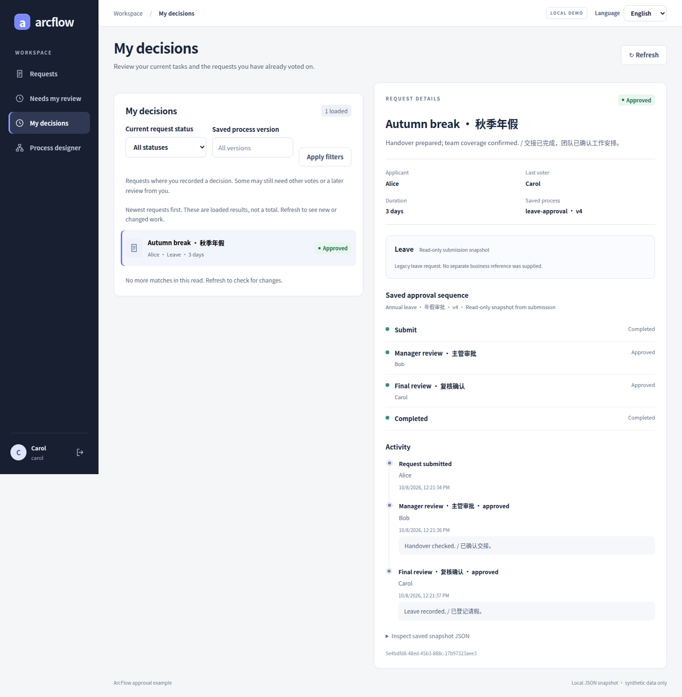
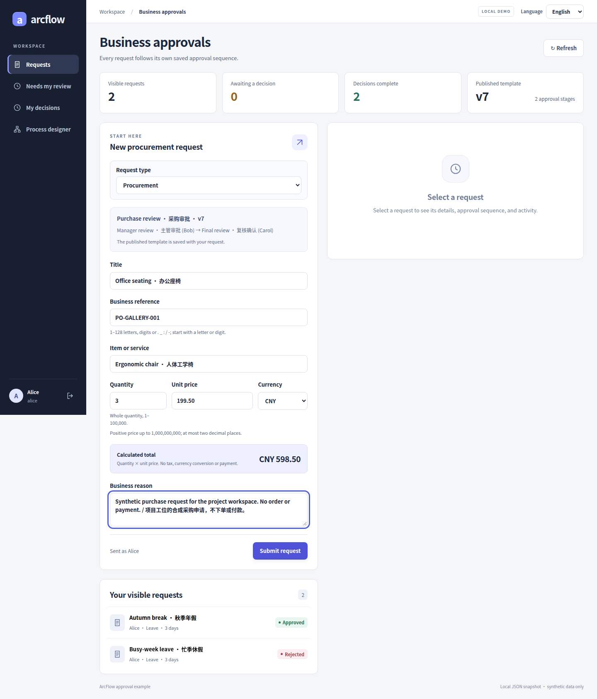
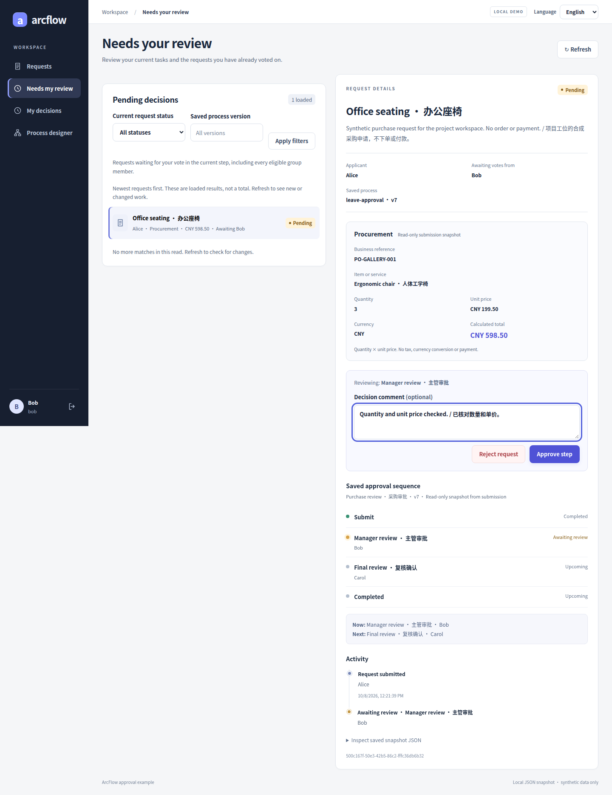
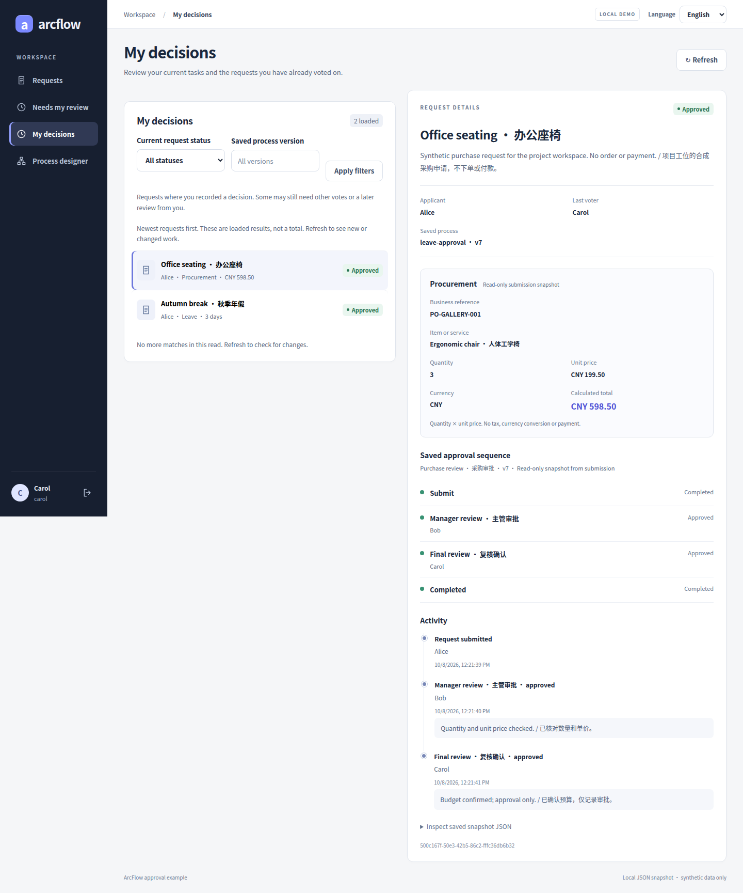
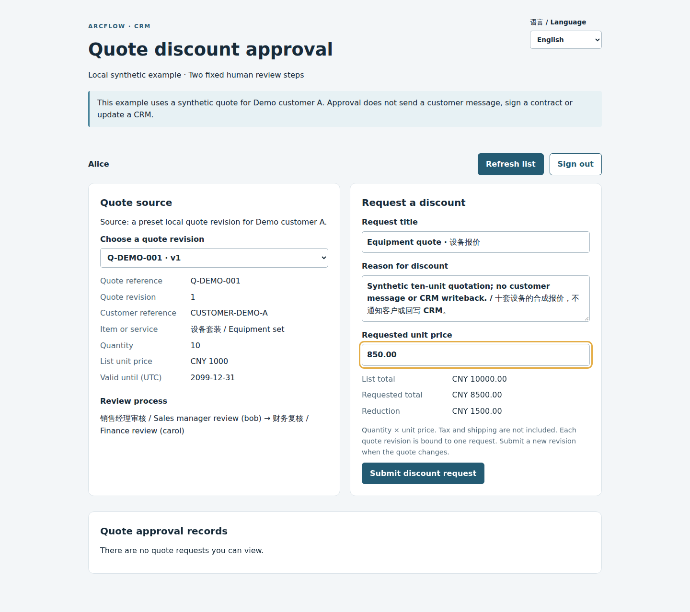
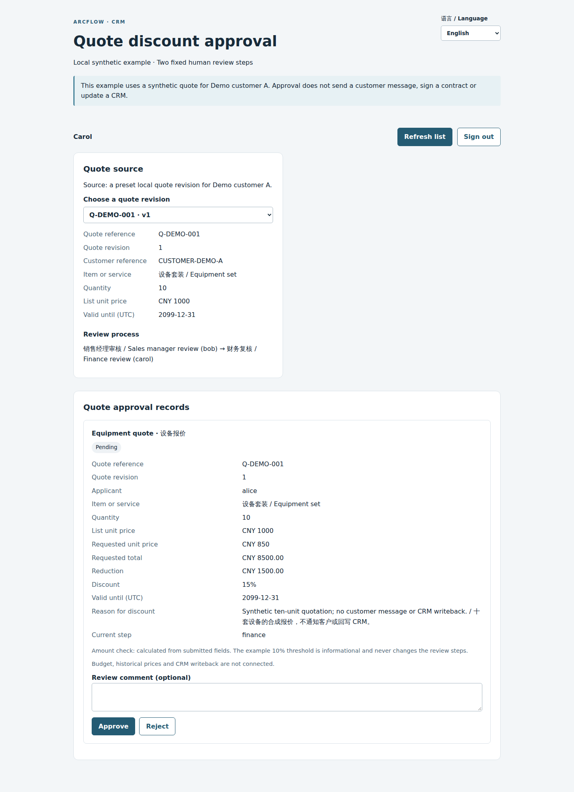
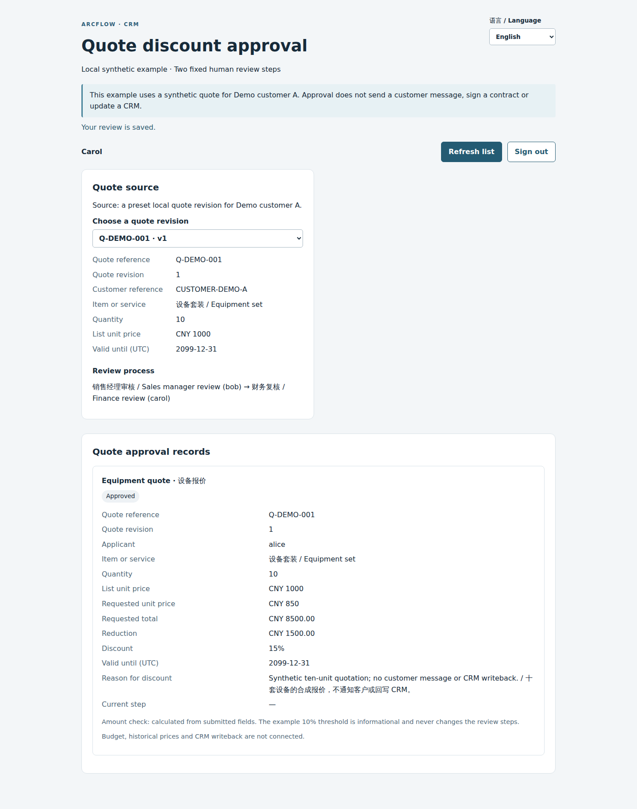

# ArcFlow

<!-- Legacy fragments remain entry points after the language split. -->
<a id="arcflow弧流"></a>
<a id="crm--报价折扣"></a>
<a id="erp--采购"></a>
<a id="oa--请假"></a>
<a id="oa--费用报销"></a>
<a id="一键本地试用一个终端"></a>
<a id="业务案例"></a>
<a id="业务表单与场景"></a>
<a id="人员身份与权限"></a>
<a id="付款合同与条件路由"></a>
<a id="任务处理与记录"></a>
<a id="先完成一次请假审批"></a>
<a id="先完成一笔请假审批"></a>
<a id="先看流程设计器"></a>
<a id="只运行-java-内核"></a>
<a id="可靠性存储与恢复"></a>
<a id="审批能力一览"></a>
<a id="审批规则与表决"></a>
<a id="快速开始"></a>
<a id="接到你的应用"></a>
<a id="文档与源码"></a>
<a id="每种业务都看完整过程"></a>
<a id="流程设计与版本"></a>
<a id="看看实际页面"></a>
<a id="设计流程与处理审批"></a>
<a id="集成客户端与内核"></a>

<!-- topic:overview -->

[Documentation index](docs/README.en.md) · [Documentation standard](docs/DOCUMENTATION_STANDARD.en.md) · [OpenAPI contracts](docs/api/README.en.md)

Add approval flows to a Java application. Set up steps and reviewers in the Vue designer, then track each request with its original process version and decision history.

Start with the leave-request demo: submit a request, switch accounts to approve it, and check the result. The RuoYi example shows how to connect approvals to an existing application.

[简体中文](README.md) · [Capabilities](#approval-capabilities-at-a-glance) · [Quick start](#quick-start) · [Business examples](#business-examples) · [RuoYi setup](examples/ruoyi-vue3/README.en.md) · [Developer guide](docs/development/README.en.md#en) · [API reference](docs/api/API_REFERENCE.en.md) · [Docs](#docs-and-source)

[](https://github.com/JamesCube/ArcFlow/actions/workflows/ci.yml)
[](https://github.com/JamesCube/ArcFlow/actions/workflows/approval-demo.yml)
[](https://github.com/JamesCube/ArcFlow/actions/workflows/ruoyi-integration.yml)

Five more galleries: [Travel](docs/galleries/travel.en.md) · [Seal use](docs/galleries/seal-use.en.md) · [Receiving](docs/galleries/receiving.en.md) · [Payment](docs/galleries/payment.en.md) · [Contracts](docs/galleries/contract.en.md). Start with each designer, then inspect forms, validation, saved approvals and conditional routes; [104 historical originals and sources](docs/galleries/README.en.md).

<a id="designer-preview"></a>

## Start with the flow designer

Arrange manager review, a team group and final review in one sequence. Select a stage to configure people and ALL/ANY rules, validate and publish. Submitted requests retain their own version.

[](docs/images/gallery/designer-02-insert-all-en.png)

[Sequential / single](docs/DESIGNER_GALLERY.en.md#sequential) · [Insert / ALL](docs/DESIGNER_GALLERY.en.md#all) · [Reorder](docs/DESIGNER_GALLERY.en.md#reorder) · [Undo](docs/DESIGNER_GALLERY.en.md#undo) · [ANY](docs/DESIGNER_GALLERY.en.md#any) · [Validation](docs/DESIGNER_GALLERY.en.md#validation) · [Publish](docs/DESIGNER_GALLERY.en.md#publish) · [Saved versions](docs/DESIGNER_GALLERY.en.md#versions)

Real application screens with synthetic data. Click for full resolution or follow the [designer gallery](docs/DESIGNER_GALLERY.en.md) through each operation and result. [Try locally](#quick-start)

<a id="design-and-review"></a>

## Approval capabilities at a glance

Explore seven groups, from process configuration and permissions to task handling, forms and storage. The repository separates **the synchronous Java DAG core, approval domain/storage, and host/UI examples**. Human approvals and persistence live in the latter two.

✅ Implemented within the stated scope · 🟡 Bounded support with integration/client limits · — Not implemented. This remains a source preview, without a production-readiness guarantee.

[Run first](#quick-start) · [Full capabilities with code/test evidence](docs/CAPABILITIES.en.md#en) · [Existing cases and proposed expansion](docs/CAPABILITIES.en.md#en-scenarios)

Go straight to a case: [OA leave](docs/CASE_GALLERY.en.md#oa) · [Expense reimbursement](docs/EXPENSE_SCENARIO.en.md#gallery) · [ERP procurement](docs/CASE_GALLERY.en.md#erp) · [CRM quotes](docs/CASE_GALLERY.en.md#crm)

### Flow design and versions
| Capability | Status | Current scope |
| --- | --- | --- |
| [Ordered stages](docs/DESIGNER_GALLERY.en.md#sequential) | ✅ | Fixed start → 1–8 approval stages → fixed end |
| [Insert a stage](docs/DESIGNER_GALLERY.en.md#all) | ✅ | Insert at a chosen position; remove stages while keeping at least one |
| [Reorder stages](docs/DESIGNER_GALLERY.en.md#reorder) | ✅ | Move stages up/down while retaining IDs; no arbitrary edges |
| [Stage inspector](docs/DESIGNER_GALLERY.en.md#any) | ✅ | Configure names, assigned people and SINGLE/ALL/ANY in the inspector |
| [Draft undo/redo](docs/DESIGNER_GALLERY.en.md#undo) | 🟡 | Standalone tab-local undo/redo; no durable drafts |
| [Publication conflicts](docs/DESIGNER_GALLERY.en.md#publish) | ✅ | Validate and publish a new version; stale expected versions are rejected |
| [Pinned process version](docs/DESIGNER_GALLERY.en.md#versions) | ✅ | Existing requests keep the rules, people and version saved at submission |
| [Restricted conditional routing](docs/CONDITIONAL_ROUTING.en.md) | 🟡 | Payment net total, receipt exceptions, and contract terms select additional human reviews; frozen at submission, limited to three standalone scenarios |

[Limits, missing features and test evidence](docs/CAPABILITIES.en.md#en-design)

### Approval rules and voting
| Capability | Status | Current scope |
| --- | --- | --- |
| Single reviewer | ✅ | One approval advances; rejection ends the request |
| [ALL groups](docs/DESIGNER_GALLERY.en.md#votes) | ✅ | 2–16 distinct fixed members; all must approve, any rejection ends it |
| [ANY groups](docs/CASE_GALLERY.en.md#other-clients) | ✅ | One approval advances; only unanimous rejection ends it |
| Same reviewer in later stages | ✅ | One person may appear in several stages and must decide at each |

[Limits, missing features and test evidence](docs/CAPABILITIES.en.md#en-rules)

### People, identity and permissions
| Capability | Status | Current scope |
| --- | --- | --- |
| Host identity directory | 🟡 | Hosts provide active users and publication eligibility through ActorDirectory |
| [Standalone demo picker](docs/DESIGNER_GALLERY.en.md#all) | 🟡 | Standalone uses Alice/Bob/Carol; reviewer choices are Bob and Carol |
| [Native RuoYi users](docs/CASE_GALLERY.en.md#other-clients) | ✅ | Select fixed RuoYi users; reuse native login, menus and button permissions |
| Request visibility | ✅ | Applicants/effective-path participants can see requests; skipped-only assignments grant no access; administrators cannot vote as others |
| Dynamic role resolution | — | No dynamic role, department or direct-manager resolution |

[Limits, missing features and test evidence](docs/CAPABILITIES.en.md#en-people)

### Task handling and history
| Capability | Status | Current scope |
| --- | --- | --- |
| [Pending worklist](docs/CASE_GALLERY.en.md#oa-inbox) | ✅ | Show current-stage requests awaiting this member, including every group member |
| [Handled worklist](docs/CASE_GALLERY.en.md#oa-pending-next) | ✅ | Requires this actor’s saved vote; the request may still await others |
| Cursor paging and filters | ✅ | 1–100 rows; status/version filters and actor-bound cursors |
| [Decision notes](docs/CASE_GALLERY.en.md#oa-approved) | ✅ | Notes accompany votes; no chat or note rewriting through retries |
| [Per-person history](docs/CASE_GALLERY.en.md#erp-approved) | ✅ | Retain each actor’s decision, stage, time and note |
| Withdraw a request | — | No operation withdraws a submitted request |
| Return to a previous stage | — | Rejection is terminal; no return-to-stage or edit-and-resubmit |

[Limits, missing features and test evidence](docs/CAPABILITIES.en.md#en-tasks)

### Business forms and scenarios
| Capability | Status | Current scope |
| --- | --- | --- |
| [OA leave form](docs/CASE_GALLERY.en.md#oa-form) | ✅ | Title, reason and 1–365 whole days; standalone/RuoYi authoring |
| [ERP procurement form](docs/CASE_GALLERY.en.md#erp-form) | ✅ | One item, quantity, exact unit price and currency; no ordering/payment |
| [CRM quote-discount form](docs/CASE_GALLERY.en.md#crm-form) | 🟡 | Isolated synthetic case with manager → finance review; outside shared workspaces |
| [Immutable business snapshot](docs/CASE_GALLERY.en.md#erp-submitted) | ✅ | Business fields are read-only after submission |
| [Expense reimbursement](docs/EXPENSE_SCENARIO.en.md#gallery) | 🟡 | Dedicated scenario workspace with a configurable flow and 1–20 expense lines; no payment, receipt upload or RuoYi/H5 screens |
| Visual form designer | — | Forms are code-defined; no field drag/drop or form-schema publishing |

[Limits, missing features and test evidence](docs/CAPABILITIES.en.md#en-forms)

### Reliability, storage and recovery
| Capability | Status | Current scope |
| --- | --- | --- |
| Submission idempotency | ✅ | Generic keys are optional; all six scenarios require applicant-scoped keys; same intent replays, changed intent conflicts |
| Decision idempotency | ✅ | Same member/stage retry adds no vote; opposite decisions conflict |
| Concurrent state updates | ✅ | Revision checks/atomic updates protect approval state, not external effects |
| Local JSON recovery | 🟡 | Default file persistence/reopen recovery; one writer only |
| Transactional JDBC storage | ✅ | Optional transactional adapter requiring wiring/migration; see tested DB scope |
| Transactional outbox | — | No reliable external message delivery or joint business-table transactions |

[Limits, missing features and test evidence](docs/CAPABILITIES.en.md#en-reliability)

### Integration, clients and core
| Capability | Status | Current scope |
| --- | --- | --- |
| Standalone Spring Boot + Vue | 🟡 | Bilingual workspace with fixed demo identities and local JSON |
| Native RuoYi-Vue + Vue3 | 🟡 | Native host reference integration; approvals do not automatically use RuoYi MySQL |
| [H5 browser client](docs/CASE_GALLERY.en.md#other-clients) | 🟡 | View/review leave and procurement; no mobile authoring, designer, quotes or expenses |
| Synchronous DAG execution | ✅ | No third-party runtime dependencies; synchronous serial core without human waits |
| Enterprise platform identity | — | Feishu/WeCom/DingTalk adapters remain unconfigured placeholders |

[Limits, missing features and test evidence](docs/CAPABILITIES.en.md#en-integration)

The full catalog also lists each missing capability separately: arbitrary forks/joins, majority voting, added reviewers, claiming, delegation, CC, batch decisions, reminders, escalation, attachments, tenant isolation, asynchronous execution and BPMN. Expense, receiving, payment, and contract forms support repeating lines; procurement and quotes remain single-item. A compiled, versioned scenario catalog exists, without template installation/cloning or arbitrary-field publication. See the [proposed implementation sequence](docs/CAPABILITIES.en.md#en-next) for additional scenarios and form design.

[Run locally](#quick-start) · [Follow the business journeys](#business-examples) · [Full capability catalog](docs/CAPABILITIES.en.md#en)

<a id="try-one-leave-approval"></a>
<a id="fast-local-tryout-one-terminal"></a>

## Quick start

On Linux, macOS or WSL, the recommended setup is Git, Python 3.9+, a full JDK 17+, Maven 3.9+, and Node 22.22.2+ within 22.x, including npm. The [full version ranges](docs/TRYOUT.en.md#requirements) include other supported versions. No database is needed.

```bash
git clone https://github.com/JamesCube/ArcFlow.git
cd ArcFlow
python3 scripts/tryout.py
```

Open the URL printed in your terminal. The launcher also tells you where to find the local file containing the demo passwords.

1. **Submit as Alice.** Create a leave request with test data.
2. **Review as Bob.** Sign out, sign in as Bob, and approve the request in **Needs my review**.
3. **Check as Alice.** Sign back in to see the result, saved process and decision history.

To try two steps, use Alice's designer to add Carol after Bob, publish, and submit a new request.

The same launch also runs the other cases. Choose **Procurement** under **Request type** in the main workspace; open `/quote-discount.html` for quotes, or `/scenarios.html` for the six expense, travel, seal-use, receiving, payment, and contract scenarios. Use the same UI origin and demo passwords, signing in again on separate pages. See [the original three business cases](docs/GETTING_STARTED.en.md#try-other-cases-en) for their entry points, the [Expense contract](docs/EXPENSE_SCENARIO.en.md) for fields, review and retry rules, and the [Expense gallery](docs/EXPENSE_SCENARIO.en.md#gallery) for real screens.

Ctrl-C stops the services and deletes that run's data. Use the [manual setup](docs/GETTING_STARTED.en.md#english) if you want to keep the data. The current version is `0.1.0-SNAPSHOT`; run it locally with test data. APIs may change.

## Business examples

The leave demo is the starting point for applying approvals to other business tasks. Here's where each example stands:

| Application | What gets reviewed | Status |
| --- | --- | --- |
| **Smart CRM** | Quote discounts: sales submits a quote, a manager checks the discount, and finance reviews the amount | [Runnable isolated synthetic case](docs/CRM_QUOTE_CASE.en.md) with its own Chinese/English page; shared workspaces and a real CRM are not connected |
| **Office automation (OA)** | Leave requests: an employee enters the duration and reason; assigned reviewers decide in order | [Runnable](docs/GETTING_STARTED.en.md#english), including the RuoYi example |
| **ERP** | Purchase requests: enter the item, quantity and unit price, then review the need and cost | [Runnable API and standalone/RuoYi forms](docs/PROCUREMENT_UI.en.md), with procurement review on H5 |
| **OA expenses** | 1–20 expense lines with dates, categories, amounts and synthetic receipt references; expense review followed by finance | [Merged standalone scenario](docs/EXPENSE_SCENARIO.en.md) on `/scenarios.html`; no payments, uploads or invoice verification |
| **OA travel** | Destination, dates, purpose, and exact budget for 1–90 calendar days | [Dedicated travel scenario](docs/TRAVEL_SCENARIO.en.md); no booking, reimbursement, or payment |
| **OA seal use** | Synthetic document references, seal category, purpose, and copy count | [Dedicated seal-use scenario](docs/SEAL_USE_SCENARIO.en.md); no stamping or signing |
| **ERP receiving** | 1–20 lines of received, accepted, and rejected quantities with exception notes | [Dedicated receiving scenario](docs/RECEIVING_SCENARIO.en.md), with optional conditions; no live PO balances or stock posting |
| **ERP payments** | Invoice allocations, declared settled amounts, deductions, and net request totals | [Dedicated payment scenario](docs/PAYMENT_CONTRACT_SCENARIOS.en.md), with optional conditions; no money transfer or balance lock |
| **CRM contracts** | Terms, dates, payment milestones, and acceptance criteria | [Dedicated contract scenario](docs/PAYMENT_CONTRACT_SCENARIOS.en.md), with optional conditions; no signing or CRM writeback |

The quote case uses synthetic customer data and fixed sales-manager → finance human review through a separate `/api/crm` service and `/quote-discount.html` page. The shared standalone, RuoYi and H5 workspaces do not support quotes yet. AI features, a real CRM connection, customer notifications and business writeback aren't implemented. See [CRM compatibility and release gates](docs/CRM_COMPATIBILITY_READINESS.en.md) for verification status.

Expense uses compiled, versioned `ScenarioCatalog` metadata, dedicated `/api/scenarios/oa-expense` routes and its own data file. The form fields are fixed; the designer configures 1–8 fixed-reviewer stages. Shared workspaces, RuoYi, H5 and real finance systems are not connected to this case.

Current main has six `/scenarios.html` entries: Expense, Travel, Seal-use, Receiving, Payment and Contract; Receiving also has `/receiving.html`. Each binds its own type, process and file. Payment/Receiving/Contract may use [restricted conditions](docs/CONDITIONAL_ROUTING.en.md). These implementations are merged in source; check browser, database and release acceptance for the exact commit separately. The original unified candidate's HTTP 403/1010 image-download failures and missing independent pixel review remain [historical evidence](docs/UNIFIED_SCENARIO_INTEGRATION.en.md), not a pass/fail conclusion about current CI.

### Follow each business case through the workflow

<a id="see-the-cases"></a>

#### OA · Leave

| Entry | In review | Approved |
| --- | --- | --- |
| [](docs/images/gallery/oa-01-form-en.png) | [](docs/images/gallery/oa-03-inbox-en.png) | [](docs/images/gallery/oa-05-approved-en.png) |

[Six-state journey: entry, submitted, pending, next stage, approved and rejected](docs/CASE_GALLERY.en.md#oa)

#### ERP · Procurement

| Entry | In review | Approved |
| --- | --- | --- |
| [](docs/images/gallery/erp-01-form-en.png) | [](docs/images/gallery/erp-03-review-en.png) | [](docs/images/gallery/erp-05-approved-en.png) |

[Six-state journey: entry, submitted, pending, next stage, approved and rejected](docs/CASE_GALLERY.en.md#erp)

#### CRM · Quote discounts

| Entry | In review | Approved |
| --- | --- | --- |
| [](docs/images/gallery/crm-01-form-en.png) | [](docs/images/gallery/crm-04-finance-review-en.png) | [](docs/images/gallery/crm-05-approved-en.png) |

[Six-state journey: entry, submitted, pending, next stage, approved and rejected](docs/CASE_GALLERY.en.md#crm)

The original three-case, designer, group, RuoYi and H5 galleries contain 33 distinct scenes and 61 Chinese/English originals; that count excludes Expense. Each image shows its actual state. Quotes retain their separate entry point. [RuoYi and H5](docs/CASE_GALLERY.en.md#other-clients) · [Versions and provenance](docs/CASE_GALLERY.en.md#provenance)

#### OA · Expenses

[Expense gallery: 8 state/viewport combinations and 16 real Chinese/English originals](docs/EXPENSE_SCENARIO.en.md#gallery), counted separately. It covers the catalog, entry, process configuration, submitted/pending, current reviewer, 390px narrow-screen review, approved and rejected states, using synthetic data. Capture provenance and hashes are included in the gallery.

## Connect an application

The RuoYi example adds approval pages to its native menus and reuses existing accounts and permissions. For another Java application, start with the approval domain and storage interfaces.

Current `main` registers nine business types: leave, procurement, quote discounts, expenses, travel, seal use, receiving, payment requests, and contract approval. Generic standalone/RuoYi document endpoints accept only leave and procurement. Quotes have a dedicated host; the other six types use the standalone scenario catalog and dedicated hosts requiring `Idempotency-Key`. Types, process identities, and stores remain isolated; approval never changes the business snapshot. See [architecture and extension](docs/development/ARCHITECTURE.en.md#en) and the [API reference](docs/api/API_REFERENCE.en.md).

| Module or example | What it covers |
| --- | --- |
| [approval-domain](examples/approval-domain/README.en.md) | Approval rules, process versions, state transitions and the `ApprovalStore` interface |
| [Spring Boot backend](examples/approval-demo/backend/README.en.md) | HTTP endpoints, identity checks and host configuration |
| [RuoYi integration](examples/ruoyi-vue3/README.en.md) | Setup for RuoYi-Vue + RuoYi-Vue3 |
| [JDBC storage](examples/approval-jdbc/README.en.md) | Database persistence for approval data and audit history |

The current reader strictly accepts JSON wrappers 1–13. Definition schemas 2/3/4 and SQL revision 3 are separate version systems. New types raise the file wrapper when content requires it; publishing schema 4 immediately requires wrapper 13. Reading never upgrades a file, and writing never downgrades one. Stop incompatible readers/writers and back up every scenario file before upgrading. Restoring an older backup loses later changes. Unchanged SQL revision 3 does not imply old-binary compatibility; existing databases still require explicit migration and member backfill. See [persistence and migration](docs/development/PERSISTENCE.en.md#en) for the version matrix, file locations, and rollout steps.

Both demos store approval data in local JSON and support one instance. RuoYi's MySQL database holds users, roles and menus; it doesn't automatically store approvals. JDBC needs explicit setup and migrations. Actor-scoped pending/handled pagination is available. Tenant isolation, transactions spanning business tables, and an outbox aren't implemented yet.

Restricted conditions are limited to the standalone payment, receiving, and contract scenarios. Dynamic role resolution, timers, withdrawal and delegation are still missing. Native apps, mini-programs, Feishu, WeCom and DingTalk integrations are unfinished. There's no production-readiness guarantee or BPMN compatibility. See the [roadmap](docs/ROADMAP.en.md) for planned work.

## Run just the Java core

The synchronous DAG runner works on its own, with no third-party runtime dependencies or Spring requirement:

```bash
mvn verify
java -cp target/classes com.arcflow.example.QuickStart
```

[QuickStart.java](src/main/java/com/arcflow/example/QuickStart.java) runs handlers in dependency order. The core doesn't persist execution state or wait for people. Running it again reruns every node, and external actions aren't automatically rolled back.

## Docs and source

[Developer guide](docs/development/README.en.md#en) · [API reference](docs/api/API_REFERENCE.en.md) · [API examples](docs/api/examples/README.en.md) · [First approval and troubleshooting](docs/GETTING_STARTED.en.md#english) · [Expense scenario](docs/EXPENSE_SCENARIO.en.md) · [Expense gallery](docs/EXPENSE_SCENARIO.en.md#gallery) · [Group approval rules](docs/PARALLEL_APPROVAL.en.md) · [Submission idempotency](docs/SUBMISSION_IDEMPOTENCY.en.md) · [Integration design](docs/INTEGRATION_DESIGN.en.md) · [Contributing](CONTRIBUTING.en.md)

[Open an issue](https://github.com/JamesCube/ArcFlow/issues) with the commit, environment, command and error details if something fails. Remove credentials and real personal data first.

For a pinned version, download a Source code archive from the [`v0.1.0-alpha.3` source preview](https://github.com/JamesCube/ArcFlow/releases/tag/v0.1.0-alpha.3), extract it, and run `python3 scripts/tryout.py`. That tag is a historical snapshot, not current `main`; do not assume it contains every scenario or conditional-routing feature listed here. Read the release's upgrade notes before using existing data.

The earlier [`v0.1.0-alpha.2`](https://github.com/JamesCube/ArcFlow/releases/tag/v0.1.0-alpha.2) does not include alpha.3's standalone-host dependency upgrade, post-read identity-check fixes, or root build changes. [`v0.1.0-alpha.1`](https://github.com/JamesCube/ArcFlow/releases/tag/v0.1.0-alpha.1) is an older sequential-approval version without the current designer, ALL/ANY, JDBC or typed business documents.

[Apache License 2.0](LICENSE). Separately downloaded RuoYi projects keep their MIT licenses. This project isn't endorsed by RuoYi upstream.


## Payment, contract, and conditional review

Current `main` includes ERP payment requests and CRM contract approval in the six-scenario catalog. Payments reconcile invoice amounts, previously settled amounts, allocations, deductions, and net requested totals. Contracts capture term deviations, dates, payment milestones, and acceptance criteria, with exact milestone-total validation. Both reuse SINGLE/ALL/ANY and immutable process versions through isolated APIs/stores. They do not make payments, sign contracts, or write to external systems. See the [business and workflow contract](docs/PAYMENT_CONTRACT_SCENARIOS.en.md).

Payment, receiving, and contract scenarios support restricted definition-schema-4 conditions. The server retains full definitions, published versions, and the route frozen at submission. JSON wrappers support 13; SQL revision 3 is unchanged. Older schema-2/3 requests retain their original paths. See [routing semantics](docs/CONDITIONAL_ROUTING.en.md) and [migration guidance](docs/development/PERSISTENCE.en.md#en). Local-candidate notes and test counts in focused guides are historical checkpoints; check CI for the source revision you use rather than treating them as current-commit or production-deployment guarantees.
