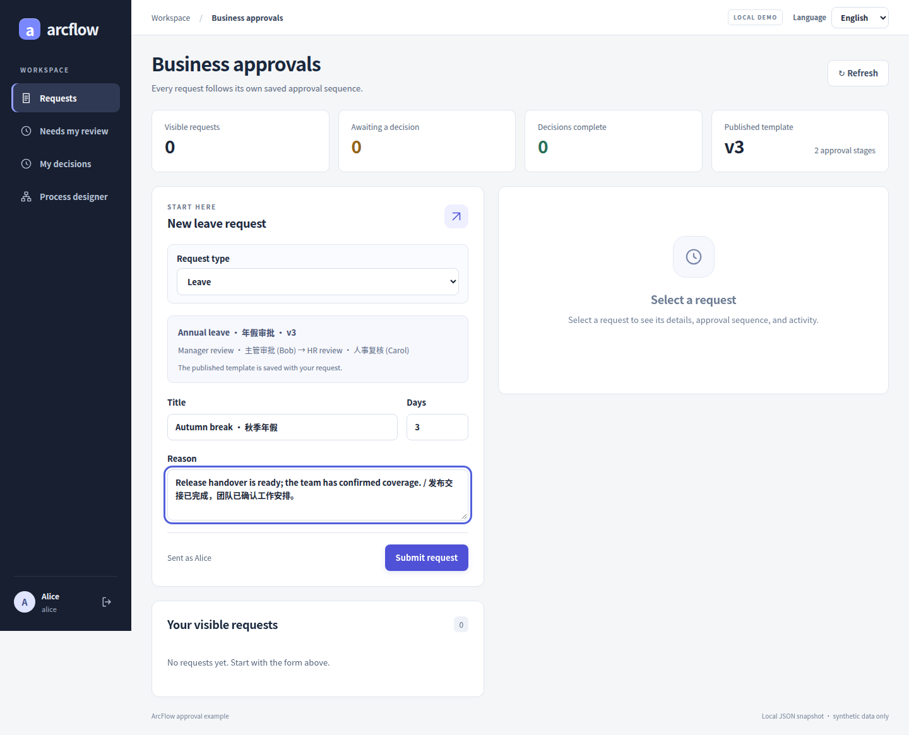
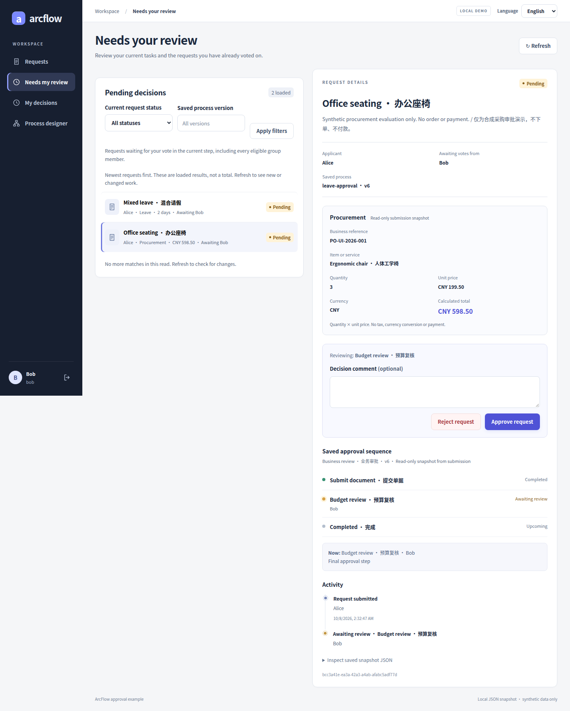
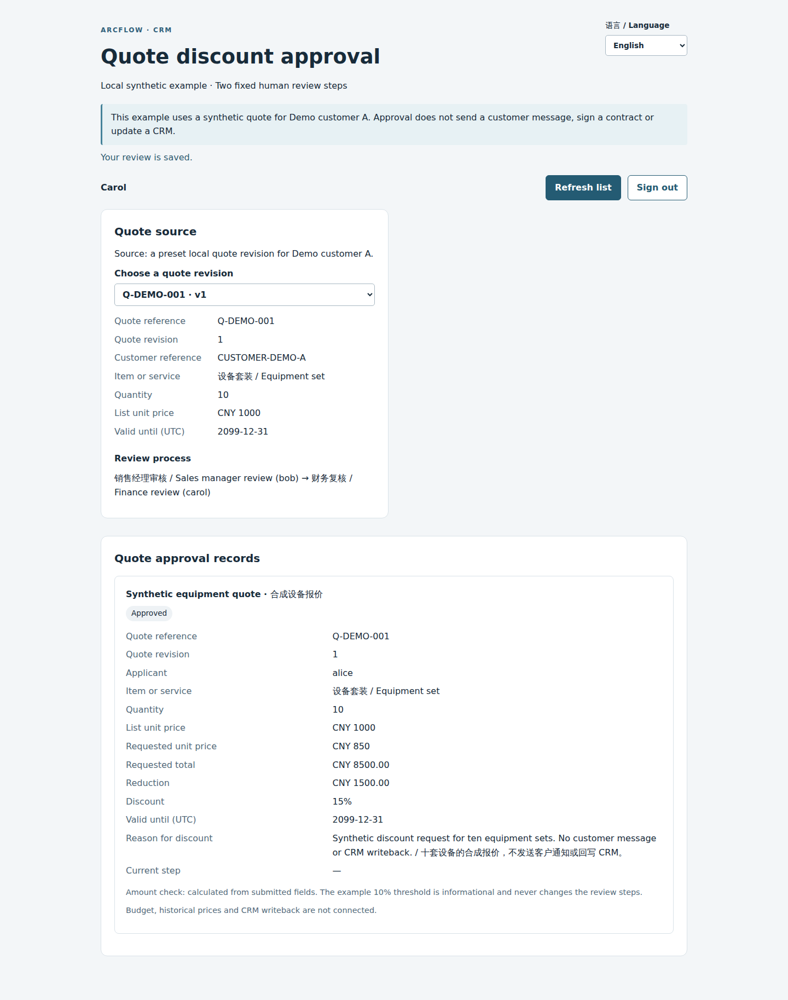

# ArcFlow

Add approval flows to a Java application. Set up steps and reviewers in the Vue designer, then track each request with its original process version and decision history.

Start with the leave-request demo: submit a request, switch accounts to approve it, and check the result. The RuoYi example shows how to connect approvals to an existing application.

[简体中文](README.md) · [Quick start](#quick-start) · [Business examples](#business-examples) · [RuoYi setup](examples/ruoyi-vue3/README.md) · [Docs](#docs-and-source)

[](https://github.com/JamesCube/ArcFlow/actions/workflows/ci.yml)
[](https://github.com/JamesCube/ArcFlow/actions/workflows/approval-demo.yml)
[](https://github.com/JamesCube/ArcFlow/actions/workflows/ruoyi-integration.yml)

<a id="try-one-leave-approval"></a>
<a id="fast-local-tryout-one-terminal"></a>

## Quick start

On Linux, macOS or WSL, the recommended setup is Git, Python 3.9+, a full JDK 17+, Maven 3.9+, and Node 22.22.2+ within 22.x, including npm. The [full version ranges](docs/TRYOUT.md#requirements) include other supported versions. No database is needed.

```bash
git clone https://github.com/JamesCube/ArcFlow.git
cd ArcFlow
python3 scripts/tryout.py
```

Open the URL printed in your terminal. The launcher also tells you where to find the local file containing the demo passwords.

1. **Submit as Alice.** Create a leave request with test data.
2. **Review as Bob.** Sign out, sign in as Bob, and approve the request in **Needs my review**.
3. **Check as Alice.** Sign back in to see the result, saved process and decision history.

To try two steps, use Alice's designer to add Carol after Bob, publish, and submit a new request.

The same launch also runs procurement and quote approvals. Choose **Procurement** under **Request type** in the workspace. For quotes, open the separate `/quote-discount.html` URL printed in your terminal and sign in again with the same password file. See [the three business cases](docs/GETTING_STARTED.md#try-other-cases-en) for sample values, reviewers and entry points.

Ctrl-C stops the services and deletes that run's data. Use the [manual setup](docs/GETTING_STARTED.md#english) if you want to keep the data. The current version is `0.1.0-SNAPSHOT`; run it locally with test data. APIs may change.

## Business examples

The leave demo is the starting point for applying approvals to other business tasks. Here's where each example stands:

| Application | What gets reviewed | Status |
| --- | --- | --- |
| **Smart CRM** | Quote discounts: sales submits a quote, a manager checks the discount, and finance reviews the amount | [Runnable isolated synthetic case](docs/CRM_QUOTE_CASE.md) with its own Chinese/English page; shared workspaces and a real CRM are not connected |
| **Office automation (OA)** | Leave requests: an employee enters the duration and reason; assigned reviewers decide in order | [Runnable](docs/GETTING_STARTED.md#english), including the RuoYi example |
| **ERP** | Purchase requests: enter the item, quantity and unit price, then review the need and cost | [Runnable API and standalone/RuoYi forms](docs/PROCUREMENT_UI.md), with procurement review on H5 |

The quote case uses synthetic customer data and fixed sales-manager → finance human review through a separate `/api/crm` service and `/quote-discount.html` page. The shared standalone, RuoYi and H5 workspaces do not support quotes yet. AI features, a real CRM connection, customer notifications and business writeback aren't implemented. See [CRM compatibility and release gates](docs/CRM_COMPATIBILITY_READINESS.md) for verification status.

### See the cases

| OA · Leave | ERP · Procurement | CRM · Quote discount |
| --- | --- | --- |
| [](docs/CASE_GALLERY.md#oa) | [](docs/CASE_GALLERY.md#erp) | [](docs/CASE_GALLERY.md#crm) |
| Enter the duration and reason. | Check the quantity, unit price and total. | Review a quote through two fixed human steps. |

Actual running-app captures with synthetic data. [Open the gallery](docs/CASE_GALLERY.md) for full-size images, the designer, RuoYi and H5. [Capture versions and sources](docs/CASE_GALLERY.md#provenance).

## Design and review

- **Single reviewers, ALL and ANY groups.** A process has 1–8 steps. ALL requires everyone's approval and rejects on the first rejection. ANY passes on the first approval and rejects only when everyone rejects.
- **A saved process for each request.** Publishing a new version doesn't reroute requests already submitted.
- **Worklists, notes and history.** The server checks who can view and review requests, saves decisions, and lets you retry the same decision for the same step without adding another history entry. See [submission idempotency](docs/SUBMISSION_IDEMPOTENCY.md) for retrying a failed submission.
- **Desktop and H5.** The standalone UI supports English and Chinese. There's also a separate [mobile-browser approval client](examples/approval-mobile/README.md).

Pending and handled tabs page through every ALL/ANY member’s work. See the [member inbox contract](docs/MEMBER_INBOX.md) and [business documents](docs/BUSINESS_DOCUMENTS.md).

## Connect an application

The RuoYi example adds approval pages to its native menus and reuses existing accounts and permissions. For another Java application, start with the approval domain and storage interfaces.

The domain supports typed leave, procurement and quote-discount documents with a shared approval state machine, audit history and submission retries. General Java/HTTP examples and standalone/RuoYi workspaces retain leave and procurement support. Quote HTTP submission is available only through the dedicated host, which also checks the source revision, business read access and quote owner; generic document endpoints reject quotes. Business snapshots remain immutable during review. See the [business-document contract](docs/BUSINESS_DOCUMENTS.md) for fields, endpoints and upgrade limits.

| Module or example | What it covers |
| --- | --- |
| [approval-domain](examples/approval-domain/README.md) | Approval rules, process versions, state transitions and the `ApprovalStore` interface |
| [Spring Boot backend](examples/approval-demo/backend/README.md) | HTTP endpoints, identity checks and host configuration |
| [RuoYi integration](examples/ruoyi-vue3/README.md) | Setup for RuoYi-Vue + RuoYi-Vue3 |
| [JDBC storage](examples/approval-jdbc/README.md) | Database persistence for approval data and audit history |

Typed leave and procurement writes require at least JSON snapshot schema 5. The first quote write upgrades the snapshot to schema 6, which later writes retain. Upgrade all readers and stop old writers before enabling quotes; schema-5-only binaries cannot read them, and mixed-version writers are unsupported. Member worklists retain SQL revision 3; CRM adds no SQL migration. Existing databases still need the explicit migration and bounded backfill.

Both demos store approval data in local JSON and support one instance. RuoYi's MySQL database holds users, roles and menus; it doesn't automatically store approvals. JDBC needs explicit setup and migrations. Actor-scoped pending/handled pagination is available. Tenant isolation, transactions spanning business tables, and an outbox aren't implemented yet.

Conditional routing, dynamic role resolution, timers, withdrawal and delegation are also missing. Native apps, mini-programs, Feishu, WeCom and DingTalk integrations are unfinished. There's no production-readiness guarantee or BPMN compatibility. See the [roadmap](docs/ROADMAP.md) for planned work.

## Run just the Java core

The synchronous DAG runner works on its own, with no third-party runtime dependencies or Spring requirement:

```bash
mvn verify
java -cp target/classes com.arcflow.example.QuickStart
```

[QuickStart.java](src/main/java/com/arcflow/example/QuickStart.java) runs handlers in dependency order. The core doesn't persist execution state or wait for people. Running it again reruns every node, and external actions aren't automatically rolled back.

## Docs and source

[First approval and troubleshooting](docs/GETTING_STARTED.md#english) · [Group approval rules](docs/PARALLEL_APPROVAL.md) · [Submission idempotency](docs/SUBMISSION_IDEMPOTENCY.md) · [Integration design](docs/INTEGRATION_DESIGN.md) · [Contributing](CONTRIBUTING.md)

[Open an issue](https://github.com/JamesCube/ArcFlow/issues) with the commit, environment, command and error details if something fails. Remove credentials and real personal data first.

The published [`v0.1.0-alpha.1`](https://github.com/JamesCube/ArcFlow/releases/tag/v0.1.0-alpha.1) is an older sequential-approval version. It doesn't include the current designer, ALL/ANY, JDBC or typed business documents. Use current source to try those features.

[Apache License 2.0](LICENSE). Separately downloaded RuoYi projects keep their MIT licenses. This project isn't endorsed by RuoYi upstream.
