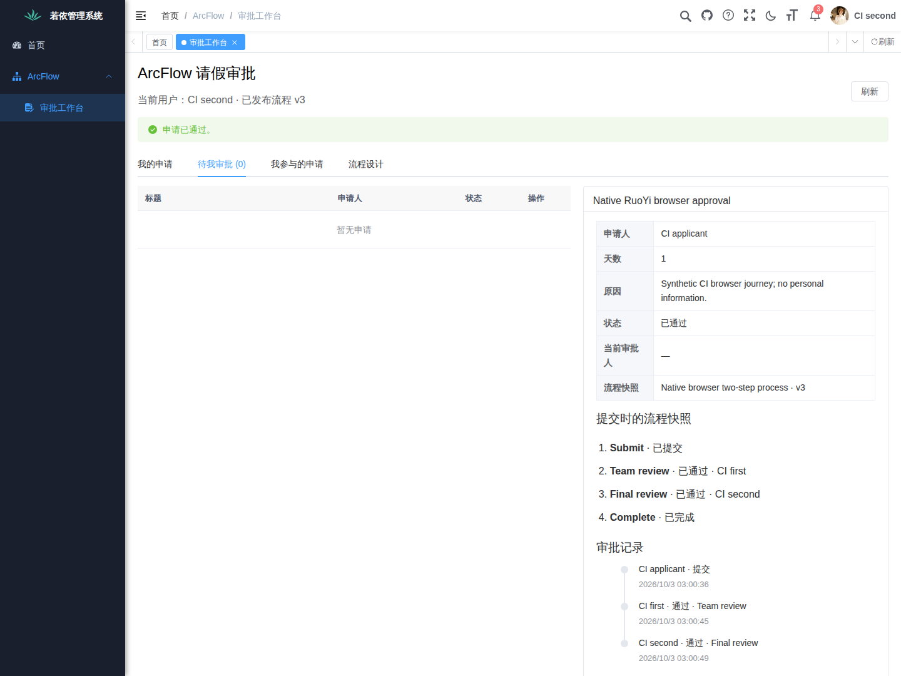
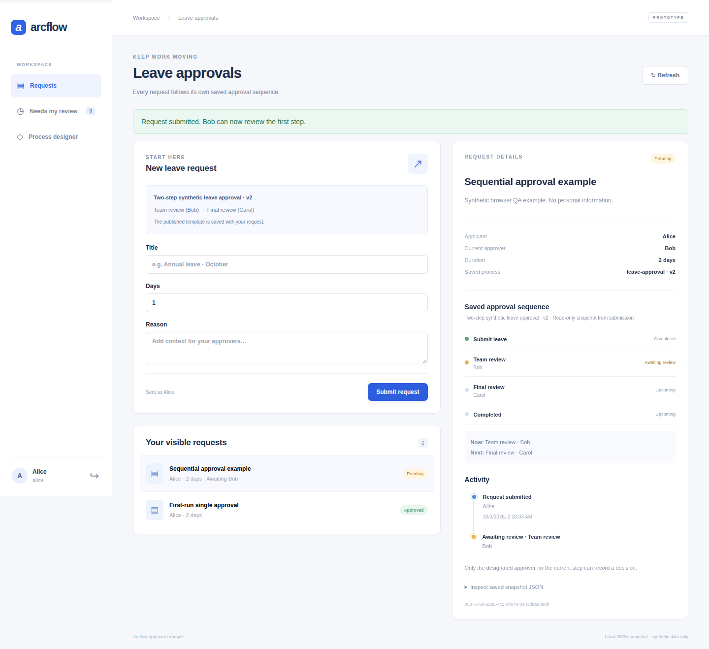

# ArcFlow

A small Java DAG core, a runnable Vue approval designer, and a reference integration with the official RuoYi applications.

[简体中文](README.md) · [First approval](docs/GETTING_STARTED.md#english) · [RuoYi setup](examples/ruoyi-vue3/README.md) · [Contributing](CONTRIBUTING.md)

[](https://github.com/JamesCube/ArcFlow/actions/workflows/ci.yml)
[](https://github.com/JamesCube/ArcFlow/actions/workflows/approval-demo.yml)
[](https://github.com/JamesCube/ArcFlow/actions/workflows/ruoyi-integration.yml)

**Experimental, `0.1.0-SNAPSHOT`. APIs may change. Run the examples on localhost with synthetic data only; they are not production approval services.**

## Open-source integration in action: RuoYi × ArcFlow

Design, publish and complete a two-step approval inside the official RuoYi menu and permission system.

[](docs/images/ruoyi-native-process-editor.png)

**Native workspace · Process design.** RuoYi navigation surrounds the ArcFlow page. Team review → Final review uses assignees from RuoYi users. Actual Chromium capture with synthetic test accounts.

[](docs/images/ruoyi-native-approved-history.png)

**Complete approval · Saved snapshot and history.** Both assigned reviewers have approved in order. The request retains its submitted v3 definition and step-by-step history. Click either image for the original 1440 px capture.

[Explore the case and test evidence →](docs/RUOYI_SHOWCASE.md#english) · [Set up the pinned integration →](examples/ruoyi-vue3/README.md)

Captured by the [native browser CI at `48f9b68`](https://github.com/JamesCube/ArcFlow/actions/runs/37091568795), not a concept mockup. RuoYi owns login, users, menus and permissions; ArcFlow owns approval definitions and state. This RuoYi example still uses single-writer local JSON approval persistence. This localhost, synthetic-data example is neither production-ready nor endorsed by upstream.

## Standalone alternative: no RuoYi environment needed



Actual Chromium screenshot using synthetic data: Alice’s request stores the published Bob → Carol approval sequence. Captured by the [browser CI journey](https://github.com/JamesCube/ArcFlow/actions/runs/37089823338) at source `0543a06`. This is the standalone UI, not the RuoYi host.

## Choose your starting point

| You want to… | Start here | Requirements |
| --- | --- | --- |
| Try a leave request and visual sequential designer | [Standalone demo](#try-one-leave-approval) | JDK 17+, Maven 3.9+, Node 22.22.2+ within 22.x, npm; no database |
| Add the example to real RuoYi login, menus and permissions | [Official RuoYi overlay](examples/ruoyi-vue3/README.md) | Git, Python 3, Java 17, Maven 3.9+, Node 22, MySQL 8.4, Redis 7.4 |
| Inspect or embed the synchronous Java DAG | [Core example](#run-just-the-java-core) | Full JDK 17+; Maven 3.9+ for a normal build |

Start with the standalone demo if you only want to evaluate the approval flow. The RuoYi example downloads exact pinned upstream commits and uses native RuoYi identity; it is a separate host of the same approval domain, not another skin for the demo login.

## Try one leave approval

### Fast local tryout (one terminal)

With Python 3.9+ and the build tools installed, run:

```bash
python3 scripts/tryout.py
```

It checks prerequisites and ports, builds the demo, generates private demo passwords, then prints the loopback URL and credentials-file path. Ctrl-C stops both services and deletes this run’s data. No database or system-tool installation. See [TRYOUT](docs/TRYOUT.md) for exact versions, port overrides, source bundles and troubleshooting. This launches the standalone host; [RuoYi setup](examples/ruoyi-vue3/README.md) remains separate.

### Manual startup (keep local data)

Use Bash (Linux, macOS, or WSL), Git, and the prerequisites above. Initial dependency downloads require network access. From a new checkout, run in terminal 1:

```bash
git clone https://github.com/JamesCube/ArcFlow.git
cd ArcFlow
mvn install
mvn -f examples/approval-domain/pom.xml install

# Private local demo state; reuse this absolute path when restarting.
umask 077
mkdir -p "$PWD/examples/approval-demo/backend/data"
export APPROVAL_DATA_FILE="$PWD/examples/approval-demo/backend/data/requests.json"

# Choose three different demo-only passwords, each at least 12 characters.
read -rs -p 'Alice demo password: ' APPROVAL_ALICE_PASSWORD; echo
read -rs -p 'Bob demo password: ' APPROVAL_BOB_PASSWORD; echo
read -rs -p 'Carol demo password: ' APPROVAL_CAROL_PASSWORD; echo
export APPROVAL_ALICE_PASSWORD APPROVAL_BOB_PASSWORD APPROVAL_CAROL_PASSWORD
mvn -f examples/approval-demo/backend/pom.xml spring-boot:run
```

In terminal 2, from the same checkout:

```bash
cd examples/approval-ui
npm ci
npm run dev
```

Open **http://localhost:5173**:

1. Sign in as **Alice** with the password you just set. Submit a request titled `Demo leave`, reason `Synthetic test`, for `1` day.
2. Sign out, sign in as **Bob**, open **Needs my review**, select the request, and approve it.
3. Sign back in as Alice. The request is **approved**, with its definition snapshot and activity history.

A fresh data file starts with one Bob approval. To explore the designer, sign in as Alice, open **Process designer**, add a Carol step after Bob, and publish. Submit a new request: Bob's approval advances it to Carol; Carol's approval completes it. Existing requests keep their original version.

[Full walkthrough, restart checks and troubleshooting →](docs/GETTING_STARTED.md#english)

## What works today

| Capability | Java core | Standalone / RuoYi examples |
| --- | --- | --- |
| Validated DAG, synchronous sequential handlers | Implemented | Used to validate and normalize submissions |
| Add, remove, reorder and assign 1–8 approval steps | Not a core feature | Implemented in Vue |
| Versioned publication and immutable request definitions | Not a core feature | Implemented in the shared approval domain |
| Ordered human decisions, rejection, per-step retry protection | Not a core feature | Implemented; only the current assigned approver can act |
| Identity and authorization | Supplied by the embedding app | Demo accounts / native RuoYi users, roles and permissions |
| Restart persistence | None | Demo defaults to single-writer JSON; optional [JDBC adapter](examples/approval-jdbc/README.md) adds database transactions and persisted audit |
| Fixed-participant ALL / ANY groups | Outside the core | [Domain + JSON/JDBC implemented](docs/PARALLEL_APPROVAL.md); standalone Vue / HTTP supports group editing and participant votes; RuoYi remains sequential-only |
| Conditional routes, timers, delegation | Not implemented | Not implemented |
| BPMN XML / BPMN 2.0 compatibility | Not implemented | Not implemented |

The core has no third-party runtime dependencies and does not require Spring. Approval HTTP APIs and Vue screens live in the examples; there is no published Spring Boot Starter or Maven Central artifact.

## Architecture and boundaries

```text
Standalone Vue UI → Spring Boot demo host ─┐
                                         ├→ approval-domain → ArcFlow Java DAG
Official RuoYi Vue UI → RuoYi host ────────┘        │            (submission checks)
                                                  └→ ApprovalStore: JSON / optional JDBC
```

- `approval-domain` owns human waiting, ordered transitions, definition snapshots and the persistence SPI. The core never waits for a person.
- See [transactional approval storage](examples/approval-jdbc/README.md) for JDBC wiring, `arc_` migrations, and PostgreSQL / H2 verification and experimental MySQL 8 checks. This optional module does not automatically change either demonstration.
- RuoYi's MySQL database stores users, roles and menus. Approval state still uses a private local JSON file. Multiple instances and network filesystems are unsupported.
- The first JDBC slice covers competing service instances, revision checks, per-step idempotent retries, rollback and pinned process versions. Tenant isolation, pagination, submission idempotency keys, joint business-data transactions and outbox are absent. No general production-readiness, high-throughput, distributed-transaction or exactly-once claim is made. The standalone demo's pinned framework/support limitations are documented in its [README](examples/approval-demo/README.md).
- Core DAG branches express dependencies, not parallel execution or conditional routes. All roots run; ready nodes run in declaration order. String variables share one namespace, and later writes win.
- Every core execution starts fresh. Re-execution reruns all nodes; failed handlers or listeners do not roll back external side effects. Synchronous event callbacks are not a persistence mechanism. Handlers/listeners must manage their own thread safety and business idempotency.
- Submission has no idempotency key. After an uncertain response, refresh before resubmitting. Same-decision retries are protected per saved approval step; see the [sequential contract](docs/SEQUENTIAL_APPROVAL.md).

## Run just the Java core

From the repository root:

```bash
mvn verify
java -cp target/classes com.arcflow.example.QuickStart
```

Expected output:

```text
[validate, price, summary]
Order DEMO-001: 120
```

With a full JDK, `bash scripts/test.sh` runs the core checks and example without Maven or dependency downloads. It does **not** start or verify the approval applications. See the complete [QuickStart.java](src/main/java/com/arcflow/example/QuickStart.java).

## Explore and contribute

- [Core and handler/event SPI](src/main/java/com/arcflow/) · [Core tests](src/test/java/com/arcflow/)
- [Shared approval domain](examples/approval-domain/) · [Standalone backend](examples/approval-demo/backend/README.md) · [Vue UI](examples/approval-ui/README.md)
- [Official RuoYi integration and attribution](examples/ruoyi-vue3/README.md) · [Sequential contract](docs/SEQUENTIAL_APPROVAL.md)
- [Contributing](CONTRIBUTING.md) · [Roadmap](docs/ROADMAP.md) · [Integration design](docs/INTEGRATION_DESIGN.md)

Useful contributions include reproducible first-run reports, regression tests for permission/retry boundaries, and focused documentation fixes. Include your commit, OS, Java/Node versions, command, expected result and actual result in [bug reports](https://github.com/JamesCube/ArcFlow/issues). Discuss new state-machine or persistence behavior before implementing it. Do not attach credentials or real personnel data.

CI badges track `main`; inspect the workflow run for the exact commit you are evaluating. Builds and API tests are not proof of browser coverage or production readiness.

## License

[Apache License 2.0](LICENSE). The separately fetched official RuoYi projects retain their MIT licenses. This integration does not imply upstream endorsement.
