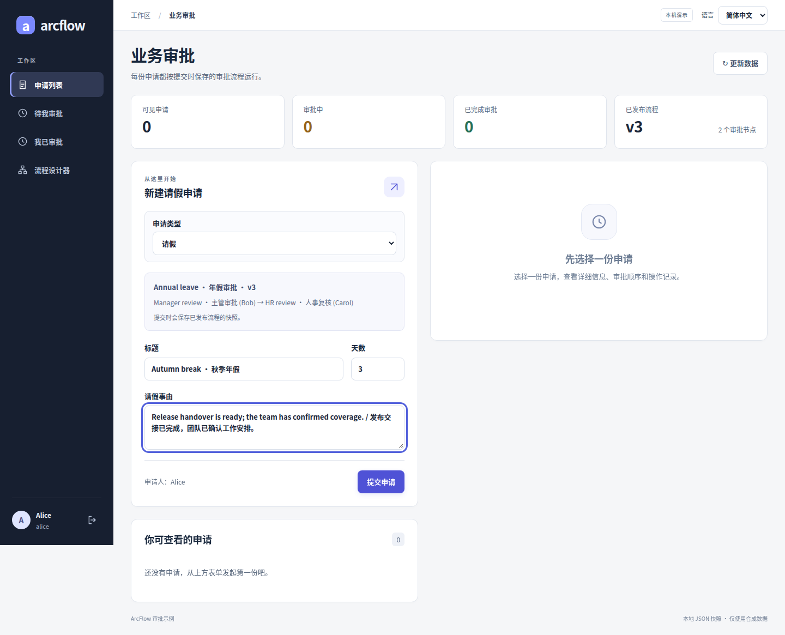
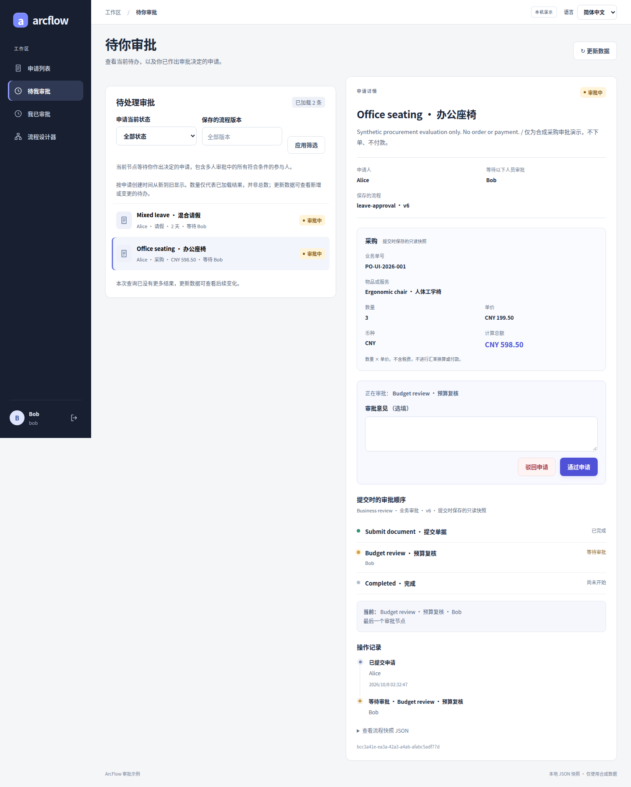
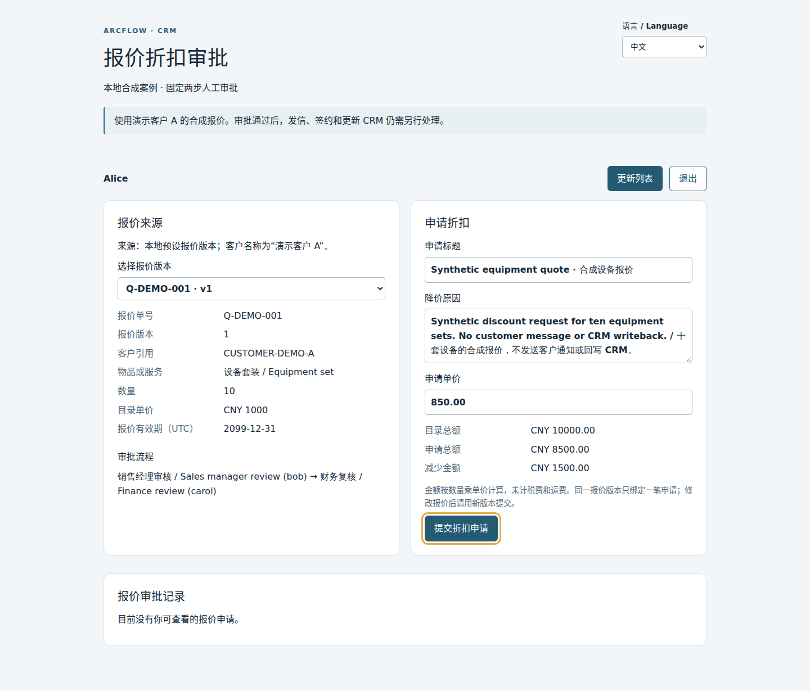

# ArcFlow｜弧流

给 Java 业务系统加审批流程。在 Vue 设计器里配置步骤和审批人，申请按顺序处理，提交时的流程版本和每次审批记录都会保存。

先从仓库里的请假示例跑起：发起申请、切换账号审批，再查看结果。需要接到现有系统时，可以参考若依集成。

[English](README.en.md) · [能力清单](#审批能力一览) · [快速开始](#快速开始) · [业务案例](#业务案例) · [接入若依](examples/ruoyi-vue3/README.md) · [文档](#文档与源码)

[](https://github.com/JamesCube/ArcFlow/actions/workflows/ci.yml)
[](https://github.com/JamesCube/ArcFlow/actions/workflows/approval-demo.yml)
[](https://github.com/JamesCube/ArcFlow/actions/workflows/ruoyi-integration.yml)

<a id="设计流程与处理审批"></a>

## 审批能力一览

适合给现有 Java／若依业务系统接入固定人员、多级人工审批。仓库分为**同步 DAG 内核、审批领域与存储、可运行示例**；人工审批和持久化由后两层提供。

✅ 已实现 · 🟡 有明确边界 · — 未实现。以下描述当前源码，预览版仍需按实际场景验证。

| 能力 | 状态 | 目前支持到哪里 |
| --- | --- | --- |
| **单人／会签／或签** | ✅ | 1–8 级顺序审批；ALL 全员同意、任一拒绝即驳回；ANY 任一同意即通过、全员拒绝才驳回 |
| **可视化设计与版本** | ✅ | 编辑、插入、排序、配置审批人、校验并发布；每份申请保留提交时的流程与业务快照 |
| **待办、已办与审批记录** | ✅ | 按登录成员分页，覆盖 ALL／ANY 每位参与人；保存逐人意见、决定和时间 |
| **重复请求与并发保护** | ✅ | 可选提交幂等键、同一步骤／成员的决定重试、修订号 CAS；不代表外部业务操作只执行一次 |
| **持久化存储** | 🟡 | 默认 JSON 单写者；可选 JDBC 事务存储，已有 PostgreSQL、MySQL 8.0／8.4、H2 测试，须显式接入与迁移 |
| **业务单据** | 🟡 | 请假、采购可提交和审批；报价折扣在隔离的合成 CRM 案例中运行，共享工作区暂不支持报价 |
| **桌面、若依与移动端** | 🟡 | 独立 Vue 与原生若依工作台可运行；H5 仅查看与审批，不提供手机发起、设计器或企业 SSO |
| **零依赖 Java DAG 内核** | ✅ | 无第三方运行时依赖；校验依赖图并同步串行执行，不保存运行状态或等待人工任务 |
| **高级流程与企业能力** | — | 条件路由、定时催办／升级、撤回、转办、租户隔离、outbox、BPMN 兼容性均未实现 |

[查看完整能力清单、限制与代码／测试依据](docs/CAPABILITIES.md#zh) · [直接运行示例](#快速开始) · [看看实际页面](#看看实际页面)

<a id="先完成一笔请假审批"></a>
<a id="先完成一次请假审批"></a>
<a id="一键本地试用一个终端"></a>

## 快速开始

在 Linux、macOS 或 WSL 上，准备 Git、Python 3.9+、完整 JDK 17+、Maven 3.9+ 和 Node 22.22.2+（22.x，含 npm）。这是推荐组合；[完整版本范围](docs/TRYOUT.md#requirements)也列出了其他可用版本。不需要数据库。

```bash
git clone https://github.com/JamesCube/ArcFlow.git
cd ArcFlow
python3 scripts/tryout.py
```

打开终端打印的地址，从它提示的本地密码文件中获取演示账号密码：

1. **Alice 发起。** 填一份测试请假申请。
2. **Bob 审批。** 退出 Alice，换 Bob 登录，在待办中同意申请。
3. **Alice 查看。** 重新登录，查看结果、流程和审批记录。

想多加一级审批，就用 Alice 在设计器中给 Bob 后面加上 Carol，发布后再提交一份新申请。

同一次启动也能试采购和报价：采购在当前工作区的“申请类型”中选择；报价打开终端打印的 `/quote-discount.html` 独立页面，使用同一份密码文件重新登录。各案例的填写示例、审批顺序和入口见[三种业务案例](docs/GETTING_STARTED.md#try-other-cases-zh)。

按 Ctrl-C 会停止服务并删除这次试用数据。需要保留数据时，按[手动启动说明](docs/GETTING_STARTED.md#简体中文)运行。当前版本为 `0.1.0-SNAPSHOT`，请在本机使用测试数据；API 仍会调整。

## 业务案例

从 OA 请假开始，再把审批接到采购、报价等业务中。各个案例的进度如下：

| 应用 | 审批内容 | 当前进度 |
| --- | --- | --- |
| **智能 CRM** | 报价折扣：销售提交报价，经理核对折扣，财务复核金额 | [隔离的合成案例](docs/CRM_QUOTE_CASE.md)可运行，含独立中英文页面；尚未接入共享工作区或真实 CRM |
| **OA** | 请假申请：填写天数和事由，由指定审批人逐步处理 | [可以运行](docs/GETTING_STARTED.md#简体中文)，也有若依示例 |
| **ERP** | 采购申请：填写物品、数量和单价，审核采购需求与金额 | [接口与独立／若依表单](docs/PROCUREMENT_UI.md)均可运行，H5 可查看并审批采购单 |

报价案例使用合成客户和固定的销售经理 → 财务两步人工审批，通过专用 `/api/crm` 服务和 `/quote-discount.html` 页面运行。共享独立端、若依和 H5 工作区尚不支持报价；AI 功能、真实 CRM 连接、客户通知和业务回写均未实现。验收状态见 [CRM 兼容性与发布门槛](docs/CRM_COMPATIBILITY_READINESS.md)。

### 看看实际页面

| OA · 请假 | ERP · 采购 | CRM · 报价折扣 |
| --- | --- | --- |
| [](docs/CASE_GALLERY.md#oa) | [](docs/CASE_GALLERY.md#erp) | [](docs/CASE_GALLERY.md#crm) |
| 填写天数和事由，按发布的流程审批。 | 核对数量、单价和合计，保留审批记录。 | 在独立页面完成两步人工报价审核。 |

以上为运行中应用的真实截图，使用合成数据。[打开图集](docs/CASE_GALLERY.md)可看原图、设计器、若依和 H5 页面。[截图版本与来源](docs/CASE_GALLERY.md#provenance)。

## 接到你的应用

若依示例把审批页面放进原生菜单，复用现有账号和权限。接其他 Java 应用时，可以从审批领域库及存储接口开始。

领域库支持类型化请假、采购和报价折扣单，共用审批状态机、历史记录和提交重试。通用 Java／HTTP 示例及独立与若依工作区保留请假、采购体验；报价 HTTP 入口仅由专用宿主提供，额外核对源报价版本、业务读权和归属销售，通用单据入口拒绝报价。审批期间业务快照保持不变。字段、接口和升级限制见[业务单据契约](docs/BUSINESS_DOCUMENTS.md)。

| 从哪里看 | 用途 |
| --- | --- |
| [approval-domain](examples/approval-domain/README.md) | 审批规则、流程版本、状态流转及 `ApprovalStore` 接口 |
| [Spring Boot 后端](examples/approval-demo/backend/README.md) | HTTP 接口、身份校验和宿主配置 |
| [若依集成](examples/ruoyi-vue3/README.md) | RuoYi-Vue + RuoYi-Vue3 的接入步骤 |
| [JDBC 存储](examples/approval-jdbc/README.md) | 用数据库保存审批数据和审计记录 |

类型化请假与采购写入至少使用 JSON 快照 schema 5；首次报价写入升级到 schema 6，后续写入不会降级。启用报价前须升级全部读取端并停止旧写入端；只支持 schema 5 的程序不能读取报价，也不支持新旧版本混写。成员待办索引继续使用 SQL revision 3，CRM 不新增 SQL 迁移；旧数据库仍需要显式迁移与分批回填。

两个演示默认把审批数据写进本地 JSON，只支持单实例。若依的 MySQL 保存的是用户、角色和菜单，审批不会自动改用数据库。JDBC 需要显式接入和迁移；已提供成员待办／已办分页。租户隔离、业务表联合事务及 outbox 仍未实现。

条件路由、动态角色解析、定时器、撤回和转办也还没有实现。App、小程序和飞书／企微／钉钉接入尚未完成；目前没有生产就绪承诺或 BPMN 兼容性。后续工作见[路线图](docs/ROADMAP.md)。

## 只运行 Java 内核

同步 DAG 内核可以单独使用，无第三方运行时依赖，不要求 Spring：

```bash
mvn verify
java -cp target/classes com.arcflow.example.QuickStart
```

[QuickStart.java](src/main/java/com/arcflow/example/QuickStart.java) 演示了按依赖顺序执行处理器。内核不保存运行状态，也不会等待人工审批；重跑会重新执行所有节点，外部操作不会自动回滚。

## 文档与源码

[首次审批与排障](docs/GETTING_STARTED.md#简体中文) · [分组审批规则](docs/PARALLEL_APPROVAL.md) · [提交幂等](docs/SUBMISSION_IDEMPOTENCY.md) · [集成设计](docs/INTEGRATION_DESIGN.md) · [贡献说明](CONTRIBUTING.md)

遇到问题请[提 issue](https://github.com/JamesCube/ArcFlow/issues)，附上提交版本、运行环境、命令和错误信息，去掉密码及真实个人数据。

需要固定版本时，可从[源码预览 `v0.1.0-alpha.3`](https://github.com/JamesCube/ArcFlow/releases/tag/v0.1.0-alpha.3) 下载 Source code 压缩包，解压后运行 `python3 scripts/tryout.py`。升级已有数据前，先看发布页的升级说明。

[`v0.1.0-alpha.2`](https://github.com/JamesCube/ArcFlow/releases/tag/v0.1.0-alpha.2) 不包含 alpha.3 的独立宿主依赖升级、读取后身份复核修订和根构建修订。[`v0.1.0-alpha.1`](https://github.com/JamesCube/ArcFlow/releases/tag/v0.1.0-alpha.1) 是早期顺序审批版本，不包含当前设计器、ALL/ANY、JDBC 和类型化业务单据。

[Apache License 2.0](LICENSE)。另行下载的若依项目保留 MIT 许可证；本项目未获得若依上游背书。

