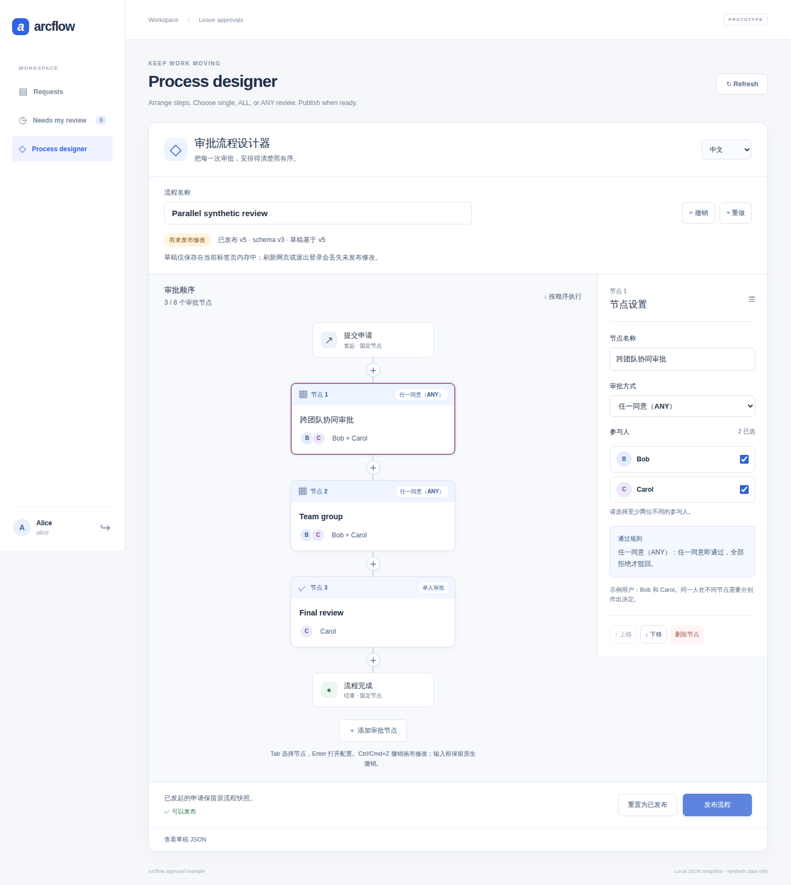
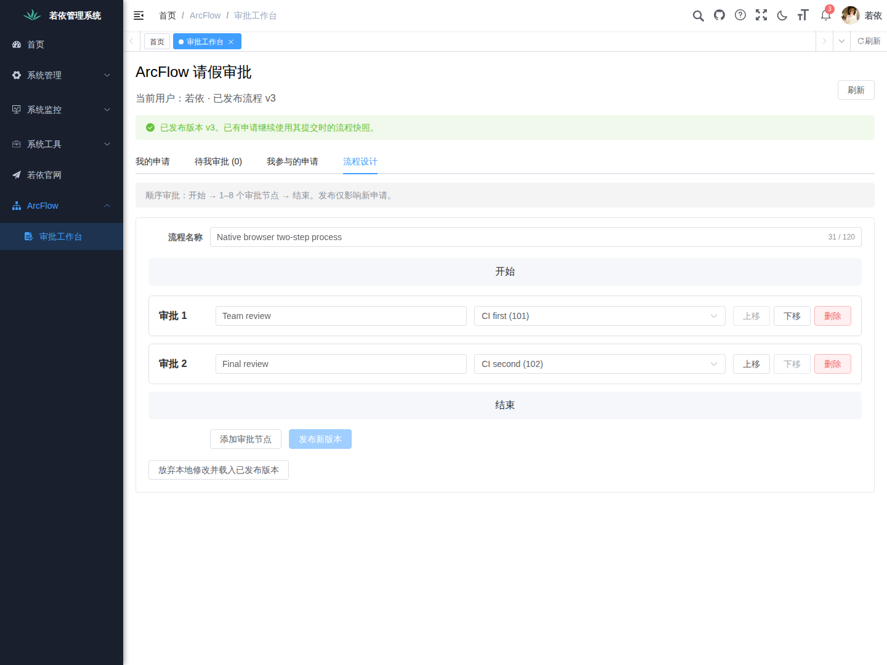

# ArcFlow｜弧流

给 Java 业务系统加审批流程。在 Vue 设计器里配置步骤和审批人，申请按顺序处理，提交时的流程版本和每次审批记录都会保存。

先从仓库里的请假示例跑起：发起申请、切换账号审批，再查看结果。需要接到现有系统时，可以参考若依集成。

[English](README.en.md) · [快速开始](#快速开始) · [业务案例](#业务案例) · [接入若依](examples/ruoyi-vue3/README.md) · [文档](#文档与源码)

[](https://github.com/JamesCube/ArcFlow/actions/workflows/ci.yml)
[](https://github.com/JamesCube/ArcFlow/actions/workflows/approval-demo.yml)
[](https://github.com/JamesCube/ArcFlow/actions/workflows/ruoyi-integration.yml)

<a id="先完成一笔请假审批"></a>
<a id="先完成一次请假审批"></a>
<a id="一键本地试用一个终端"></a>

## 快速开始

在 Linux、macOS 或 WSL 上，准备 Git、Python 3.9+、完整 JDK 17+、Maven 3.9+ 和 Node 22.22.2+（22.x，含 npm）。这是推荐组合；[完整版本范围](docs/TRYOUT.md#requirements)也列出了其他可用版本。不需要数据库。

```bash
git clone https://github.com/JamesCube/ArcFlow.git
cd ArcFlow
python3 scripts/tryout.py
```

打开终端打印的地址，从它提示的本地密码文件中获取演示账号密码：

1. **Alice 发起。** 填一份测试请假申请。
2. **Bob 审批。** 退出 Alice，换 Bob 登录，在待办中同意申请。
3. **Alice 查看。** 重新登录，查看结果、流程和审批记录。

想多加一级审批，就用 Alice 在设计器中给 Bob 后面加上 Carol，发布后再提交一份新申请。

同一次启动也能试采购和报价：采购在当前工作区的“申请类型”中选择；报价打开终端打印的 `/quote-discount.html` 独立页面，使用同一份密码文件重新登录。各案例的填写示例、审批顺序和入口见[三种业务案例](docs/GETTING_STARTED.md#try-other-cases-zh)。

按 Ctrl-C 会停止服务并删除这次试用数据。需要保留数据时，按[手动启动说明](docs/GETTING_STARTED.md#简体中文)运行。当前版本为 `0.1.0-SNAPSHOT`，请在本机使用测试数据；API 仍会调整。

## 业务案例

从 OA 请假开始，再把审批接到采购、报价等业务中。各个案例的进度如下：

| 应用 | 审批内容 | 当前进度 |
| --- | --- | --- |
| **智能 CRM** | 报价折扣：销售提交报价，经理核对折扣，财务复核金额 | [隔离的合成案例](docs/CRM_QUOTE_CASE.md)可运行，含独立中英文页面；尚未接入共享工作区或真实 CRM |
| **OA** | 请假申请：填写天数和事由，由指定审批人逐步处理 | [可以运行](docs/GETTING_STARTED.md#简体中文)，也有若依示例 |
| **ERP** | 采购申请：填写物品、数量和单价，审核采购需求与金额 | [接口与独立／若依表单](docs/PROCUREMENT_UI.md)均可运行，H5 可查看并审批采购单 |

报价案例使用合成客户和固定的销售经理 → 财务两步人工审批，通过专用 `/api/crm` 服务和 `/quote-discount.html` 页面运行。共享独立端、若依和 H5 工作区尚不支持报价；AI 功能、真实 CRM 连接、客户通知和业务回写均未实现。验收状态见 [CRM 兼容性与发布门槛](docs/CRM_COMPATIBILITY_READINESS.md)。

## 设计流程与处理审批

| Vue 设计器 | 若依中的审批页面 |
| --- | --- |
| [](docs/images/designer-desktop-836e605.png) | [](docs/images/ruoyi-native-process-editor.png) |
| 配置步骤、审批人和通过规则。[更多截图](docs/DESIGNER_SHOWCASE.md#简体中文) | 沿用若依的登录、用户、菜单和权限。[接入说明](examples/ruoyi-vue3/README.md) |

图片展示较早版本，点击可看原图；截图版本和来源见[设计器图集](docs/DESIGNER_SHOWCASE.md#简体中文)与[若依图集](docs/RUOYI_SHOWCASE.md#简体中文)。

- **单人审批、会签和或签。** 一个流程支持 1–8 个步骤。ALL 需全员同意，任一人拒绝就驳回；ANY 有一人同意就通过，所有人拒绝才驳回。
- **每份申请保留自己的流程。** 发布新版本后，已提交申请继续按原版本审批。
- **待办、意见和记录。** 服务端检查谁能看、谁能审批，保存处理结果。重复提交同一步骤的相同决定，不会新增审批记录。提交失败后的重试方式见[幂等说明](docs/SUBMISSION_IDEMPOTENCY.md)。
- **桌面和 H5。** 独立界面可以切换中英文，也有单独的[手机浏览器审批页面](examples/approval-mobile/README.md)。

待办和已办使用服务端成员分页，包含 ALL／ANY 分组中的每位参与人。采购单展示数量、单价、币种和精确金额，H5 只负责审批。[成员查询](docs/MEMBER_INBOX.md) · [业务单据](docs/BUSINESS_DOCUMENTS.md)。

## 接到你的应用

若依示例把审批页面放进原生菜单，复用现有账号和权限。接其他 Java 应用时，可以从审批领域库及存储接口开始。

领域库支持类型化请假、采购和报价折扣单，共用审批状态机、历史记录和提交重试。通用 Java／HTTP 示例及独立与若依工作区保留请假、采购体验；报价 HTTP 入口仅由专用宿主提供，额外核对源报价版本、业务读权和归属销售，通用单据入口拒绝报价。审批期间业务快照保持不变。字段、接口和升级限制见[业务单据契约](docs/BUSINESS_DOCUMENTS.md)。

| 从哪里看 | 用途 |
| --- | --- |
| [approval-domain](examples/approval-domain/README.md) | 审批规则、流程版本、状态流转及 `ApprovalStore` 接口 |
| [Spring Boot 后端](examples/approval-demo/backend/README.md) | HTTP 接口、身份校验和宿主配置 |
| [若依集成](examples/ruoyi-vue3/README.md) | RuoYi-Vue + RuoYi-Vue3 的接入步骤 |
| [JDBC 存储](examples/approval-jdbc/README.md) | 用数据库保存审批数据和审计记录 |

类型化请假与采购写入至少使用 JSON 快照 schema 5；首次报价写入升级到 schema 6，后续写入不会降级。启用报价前须升级全部读取端并停止旧写入端；只支持 schema 5 的程序不能读取报价，也不支持新旧版本混写。成员待办索引继续使用 SQL revision 3，CRM 不新增 SQL 迁移；旧数据库仍需要显式迁移与分批回填。

两个演示默认把审批数据写进本地 JSON，只支持单实例。若依的 MySQL 保存的是用户、角色和菜单，审批不会自动改用数据库。JDBC 需要显式接入和迁移；已提供成员待办／已办分页。租户隔离、业务表联合事务及 outbox 仍未实现。

条件路由、动态角色解析、定时器、撤回和转办也还没有实现。App、小程序和飞书／企微／钉钉接入尚未完成；目前没有生产就绪承诺或 BPMN 兼容性。后续工作见[路线图](docs/ROADMAP.md)。

## 只运行 Java 内核

同步 DAG 内核可以单独使用，无第三方运行时依赖，不要求 Spring：

```bash
mvn verify
java -cp target/classes com.arcflow.example.QuickStart
```

[QuickStart.java](src/main/java/com/arcflow/example/QuickStart.java) 演示了按依赖顺序执行处理器。内核不保存运行状态，也不会等待人工审批；重跑会重新执行所有节点，外部操作不会自动回滚。

## 文档与源码

[首次审批与排障](docs/GETTING_STARTED.md#简体中文) · [分组审批规则](docs/PARALLEL_APPROVAL.md) · [提交幂等](docs/SUBMISSION_IDEMPOTENCY.md) · [集成设计](docs/INTEGRATION_DESIGN.md) · [贡献说明](CONTRIBUTING.md)

遇到问题请[提 issue](https://github.com/JamesCube/ArcFlow/issues)，附上提交版本、运行环境、命令和错误信息，去掉密码及真实个人数据。

已有的 [`v0.1.0-alpha.1`](https://github.com/JamesCube/ArcFlow/releases/tag/v0.1.0-alpha.1) 是早期顺序审批版本，不包含当前设计器、ALL/ANY、JDBC 和类型化业务单据；试用以上功能请使用当前源码。

[Apache License 2.0](LICENSE)。另行下载的若依项目保留 MIT 许可证；本项目未获得若依上游背书。
