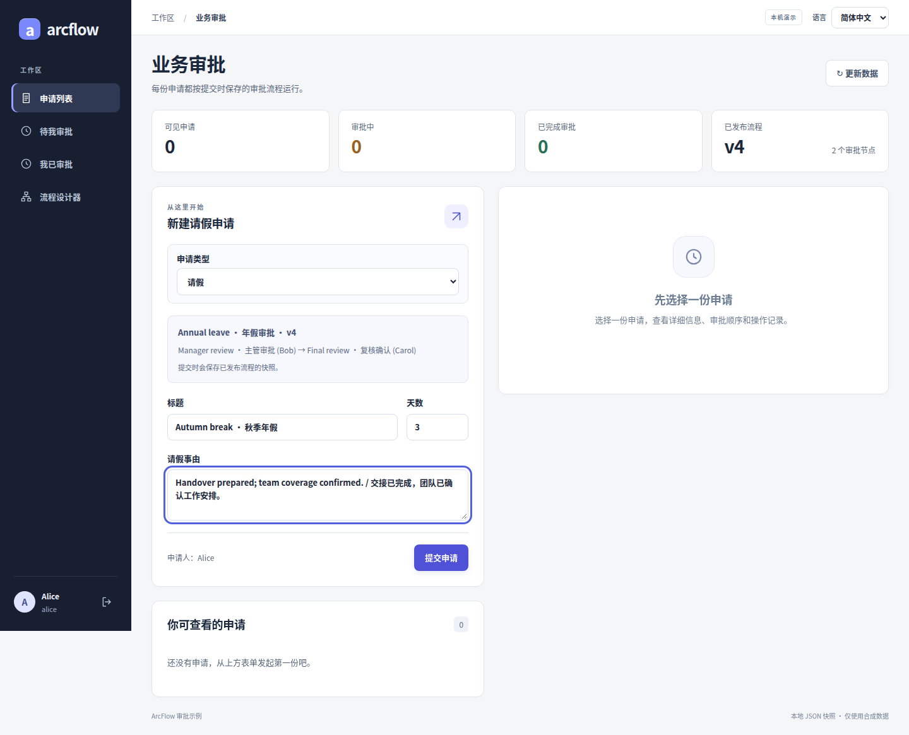
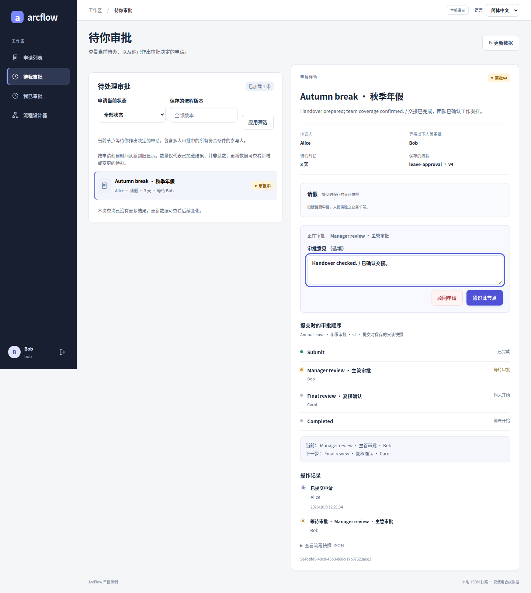
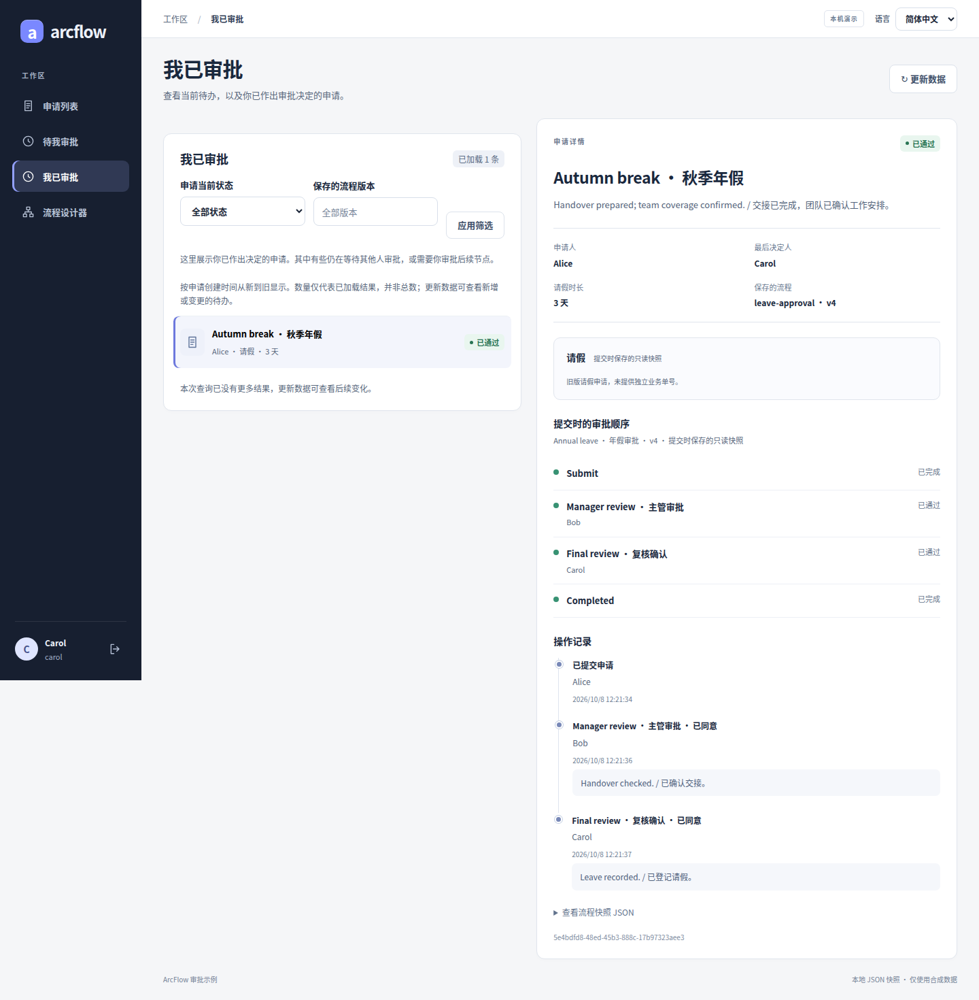
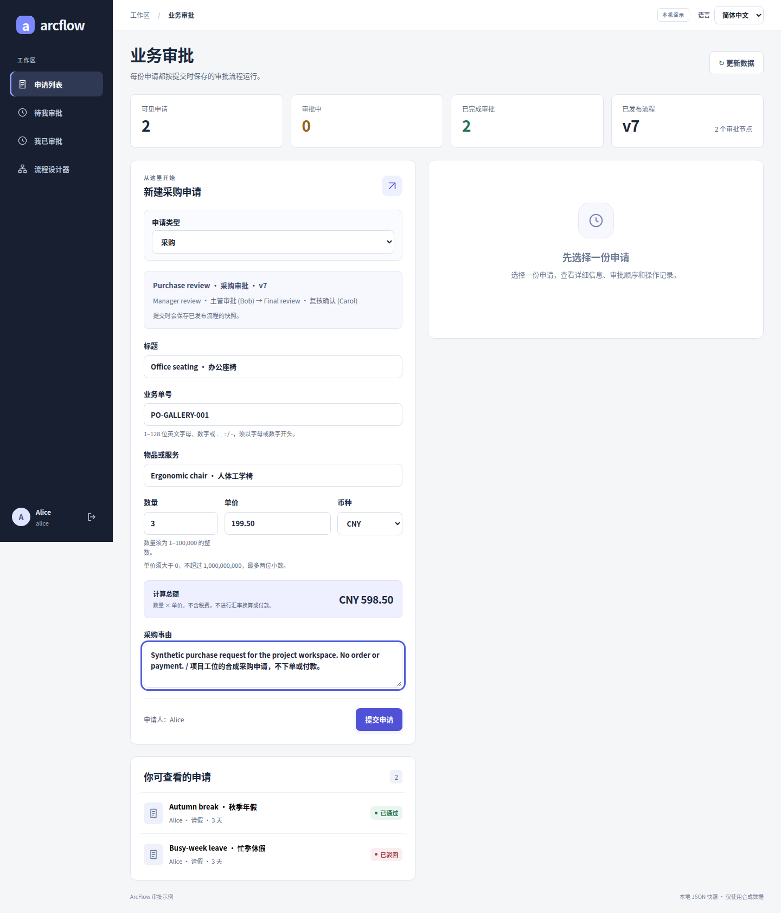
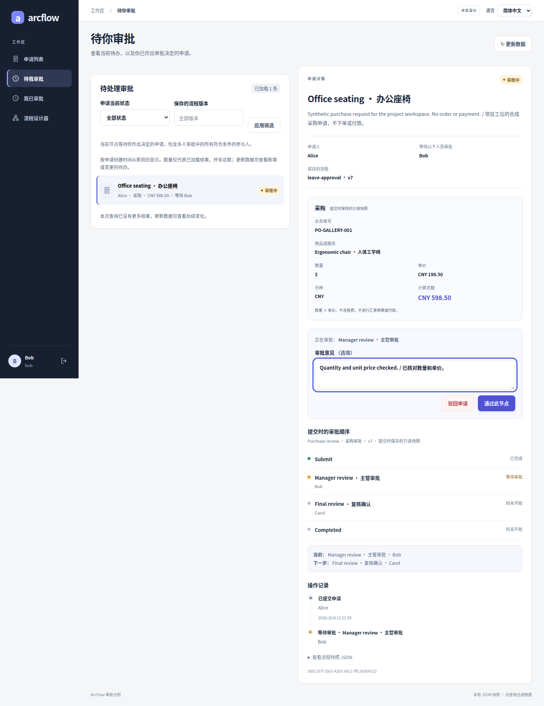
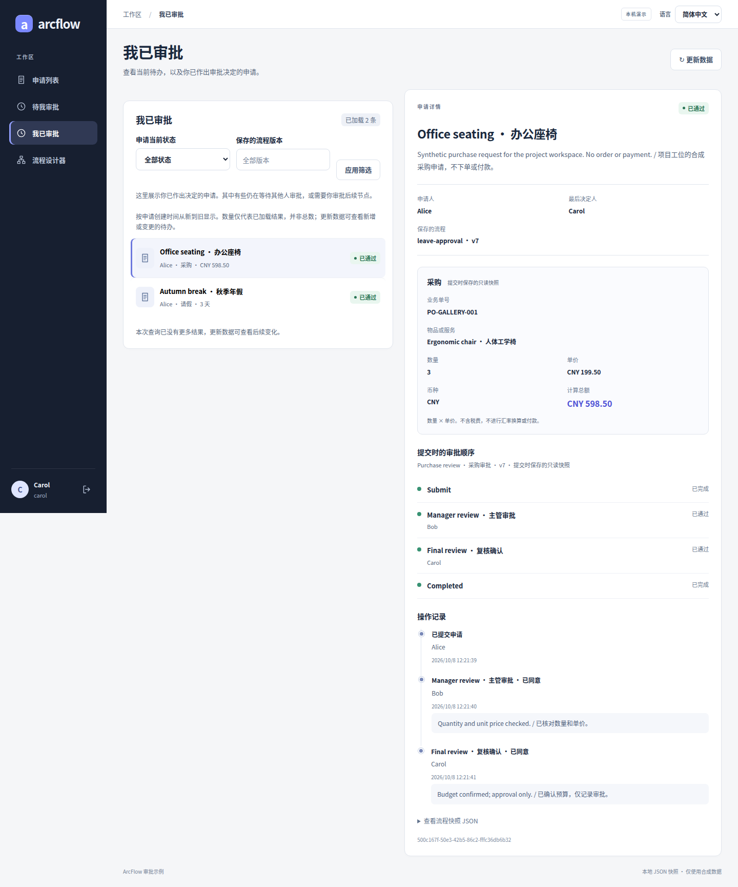
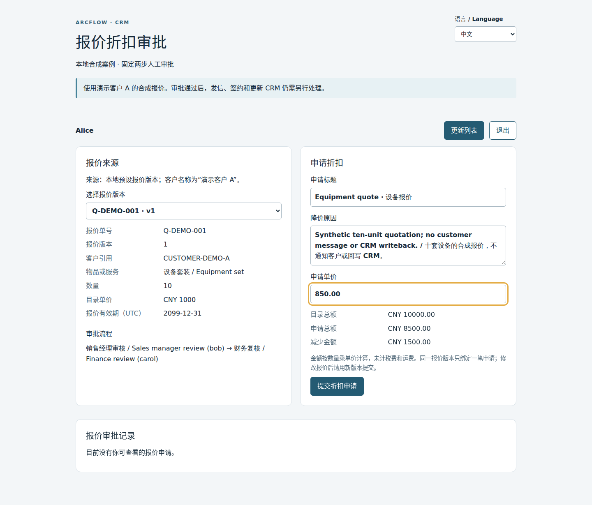
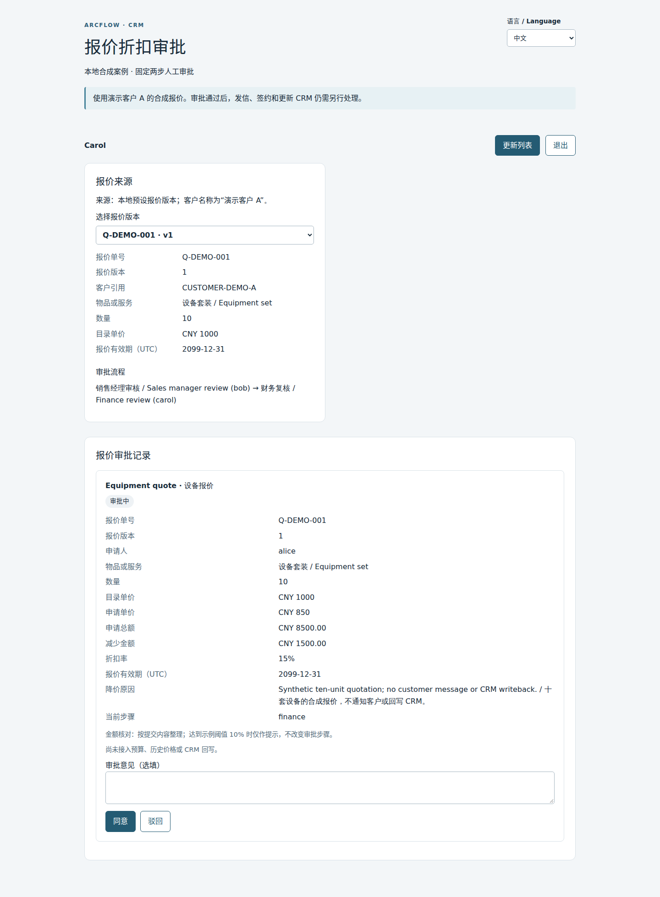
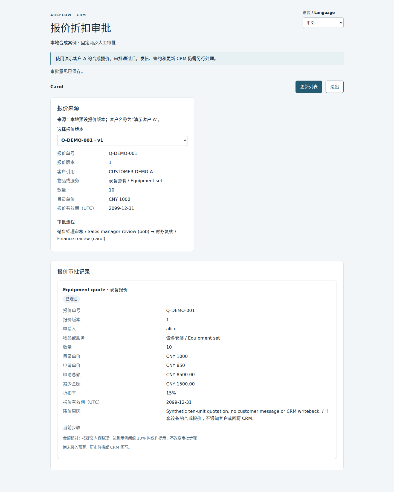

# ArcFlow｜弧流

给 Java 业务系统加审批流程。在 Vue 设计器里配置步骤和审批人，申请按顺序处理，提交时的流程版本和每次审批记录都会保存。

先从仓库里的请假示例跑起：发起申请、切换账号审批，再查看结果。需要接到现有系统时，可以参考若依集成。

[English](README.en.md) · [能力清单](#审批能力一览) · [快速开始](#快速开始) · [业务案例](#业务案例) · [接入若依](examples/ruoyi-vue3/README.md) · [文档](#文档与源码)

[](https://github.com/JamesCube/ArcFlow/actions/workflows/ci.yml)
[](https://github.com/JamesCube/ArcFlow/actions/workflows/approval-demo.yml)
[](https://github.com/JamesCube/ArcFlow/actions/workflows/ruoyi-integration.yml)

<a id="designer-preview"></a>

## 先看流程设计器

把主管审批、团队会签和最终复核放到一条流程里。选中节点就能设置人员与 ALL／ANY 规则，检查后发布；提交的申请保留自己的版本。

[](docs/images/gallery/designer-02-insert-all-zh.png)

[多级与单人](docs/DESIGNER_GALLERY.md#sequential) · [插入与会签](docs/DESIGNER_GALLERY.md#all) · [排序](docs/DESIGNER_GALLERY.md#reorder) · [撤销](docs/DESIGNER_GALLERY.md#undo) · [或签](docs/DESIGNER_GALLERY.md#any) · [校验](docs/DESIGNER_GALLERY.md#validation) · [发布](docs/DESIGNER_GALLERY.md#publish) · [版本快照](docs/DESIGNER_GALLERY.md#versions)

运行中的真实页面，使用合成数据。点击图片看原图，或打开[完整设计器图集](docs/DESIGNER_GALLERY.md)逐步看操作与结果。[本地试用](#快速开始)

<a id="设计流程与处理审批"></a>

## 审批能力一览

从流程配置到人员权限、任务处理、业务表单和存储，按七组逐项看。仓库分为**同步 Java DAG 内核、审批领域／存储、宿主与界面示例**；人工审批和持久化在后两层。

✅ 已实现，限于所述范围 · 🟡 有限支持，仍需接入或有客户端限制 · — 尚未实现。当前为源码预览，没有生产就绪承诺。

[先运行再看细节](#快速开始) · [完整能力、源码与测试](docs/CAPABILITIES.md#zh) · [现有场景与扩展顺序](docs/CAPABILITIES.md#zh-scenarios)

直接看业务：[OA 请假](docs/CASE_GALLERY.md#oa) · [费用报销](docs/EXPENSE_SCENARIO.md#gallery) · [ERP 采购](docs/CASE_GALLERY.md#erp) · [CRM 报价](docs/CASE_GALLERY.md#crm)

### 流程设计与版本
| 能力 | 状态 | 当前范围 |
| --- | --- | --- |
| [顺序步骤](docs/DESIGNER_GALLERY.md#sequential) | ✅ | 固定开始 → 1–8 个审批步骤 → 固定结束 |
| [插入步骤](docs/DESIGNER_GALLERY.md#all) | ✅ | 在指定位置插入步骤；可删除，至少保留一步 |
| [调整步骤顺序](docs/DESIGNER_GALLERY.md#reorder) | ✅ | 上下移动步骤，保留节点标识；不支持任意连线 |
| [节点属性配置](docs/DESIGNER_GALLERY.md#any) | ✅ | 名称、指定人员、SINGLE／ALL／ANY 在属性面板配置 |
| [草稿撤销／重做](docs/DESIGNER_GALLERY.md#undo) | 🟡 | 独立设计器的标签页内撤销／重做；没有持久草稿 |
| [发布与版本冲突](docs/DESIGNER_GALLERY.md#publish) | ✅ | 校验后发布新版本；期望版本冲突会被拒绝 |
| [申请固定流程版本](docs/DESIGNER_GALLERY.md#versions) | ✅ | 旧申请固定提交时的规则、参与人和流程版本 |
| 条件路由 | — | 没有金额／字段条件分支；报价阈值只是提示 |

[范围、缺失项和测试依据](docs/CAPABILITIES.md#zh-design)

### 审批规则与表决
| 能力 | 状态 | 当前范围 |
| --- | --- | --- |
| 单人审批 | ✅ | 一人同意后推进，拒绝则整笔结束 |
| [会签 ALL](docs/DESIGNER_GALLERY.md#votes) | ✅ | 2–16 个不同固定成员，全员同意；任一拒绝即结束 |
| [或签 ANY](docs/CASE_GALLERY.md#other-clients) | ✅ | 任一同意即可推进；全部拒绝才结束 |
| 同人跨步骤审批 | ✅ | 同一人可在多个步骤出现，每步分别审批 |

[范围、缺失项和测试依据](docs/CAPABILITIES.md#zh-rules)

### 人员、身份与权限
| 能力 | 状态 | 当前范围 |
| --- | --- | --- |
| 宿主人员目录 | 🟡 | 宿主通过 ActorDirectory 提供活动账号和发布资格 |
| [独立演示人员选择](docs/DESIGNER_GALLERY.md#all) | 🟡 | 独立演示使用 Alice／Bob／Carol，审批选择为 Bob、Carol |
| [若依真实账号选择](docs/CASE_GALLERY.md#other-clients) | ✅ | 若依目录选固定人员，复用原生登录和菜单／按钮权限 |
| 申请可见范围 | ✅ | 申请人和流程参与人可见；管理员不能替别人投票 |
| 动态角色选人 | — | 没有动态角色、部门或直属主管解析 |

[范围、缺失项和测试依据](docs/CAPABILITIES.md#zh-people)

### 任务处理与记录
| 能力 | 状态 | 当前范围 |
| --- | --- | --- |
| [我的待办](docs/CASE_GALLERY.md#oa-inbox) | ✅ | 只列当前步骤中本人未投票的申请，覆盖组内每位成员 |
| [我的已办](docs/CASE_GALLERY.md#oa-pending-next) | ✅ | 本人已有真实表决；整笔申请仍可等待其他人 |
| 游标分页与筛选 | ✅ | 每页 1–100 条；状态／版本筛选，身份绑定游标 |
| [审批意见](docs/CASE_GALLERY.md#oa-approved) | ✅ | 意见随表决保存；不是聊天，重试不能改写原意见 |
| [逐人审批历史](docs/CASE_GALLERY.md#erp-approved) | ✅ | 逐人保留决定、步骤、时间和意见 |
| 申请撤回 | — | 尚无撤回已提交申请的操作 |
| 退回指定步骤 | — | 拒绝即结束；没有退回节点或原单修改重提 |

[范围、缺失项和测试依据](docs/CAPABILITIES.md#zh-tasks)

### 业务表单与场景
| 能力 | 状态 | 当前范围 |
| --- | --- | --- |
| [OA 请假表单](docs/CASE_GALLERY.md#oa-form) | ✅ | 标题、理由、1–365 个整天；独立与若依可发起 |
| [ERP 采购表单](docs/CASE_GALLERY.md#erp-form) | ✅ | 单项物品、数量、精确单价和币种；不执行下单／付款 |
| [CRM 报价折扣表单](docs/CASE_GALLERY.md#crm-form) | 🟡 | 独立合成案例，固定经理 → 财务；共享工作区不支持 |
| [不可变业务快照](docs/CASE_GALLERY.md#erp-submitted) | ✅ | 业务字段提交后只读，审批不改写原单 |
| [费用报销](docs/EXPENSE_SCENARIO.md#gallery) | 🟡 | 独立场景工作区可配置流程、填写 1–20 行费用并审批；不付款、不上传凭证，未接入若依／H5 |
| 可视化表单设计器 | — | 现有表单由代码定义，没有拖拽字段或表单 schema 发布 |

[范围、缺失项和测试依据](docs/CAPABILITIES.md#zh-forms)

### 可靠性、存储与恢复
| 能力 | 状态 | 当前范围 |
| --- | --- | --- |
| 提交幂等 | ✅ | 可选申请人作用域键；同键同内容重放，不同内容冲突 |
| 审批决定幂等 | ✅ | 同一成员／步骤重试不多记一票；相反决定冲突 |
| 并发状态更新 | ✅ | 修订号和原子更新保护审批状态；不涵盖外部副作用 |
| 本地 JSON 恢复 | 🟡 | 默认文件持久化与重开恢复，只能单写者 |
| JDBC 事务存储 | ✅ | 可选事务适配器，须接线与迁移；数据库验证范围见详表 |
| 事务 outbox | — | 没有可靠外部消息投递或业务表联合事务 |

[范围、缺失项和测试依据](docs/CAPABILITIES.md#zh-reliability)

### 集成、客户端与内核
| 能力 | 状态 | 当前范围 |
| --- | --- | --- |
| 独立 Spring Boot + Vue | 🟡 | 中英文工作台，固定演示身份和本地 JSON |
| 原生 RuoYi-Vue + Vue3 | 🟡 | 原生宿主参考集成，审批不会自动写入若依 MySQL |
| [H5 手机浏览器](docs/CASE_GALLERY.md#other-clients) | 🟡 | 请假／采购的查看和审批；没有手机发起、设计器或报价 |
| DAG 同步执行 | ✅ | 零第三方运行时依赖的同步串行内核，不保存人工等待 |
| 飞书／企微／钉钉身份 | — | 飞书／企微／钉钉仅有未配置适配器占位 |

[范围、缺失项和测试依据](docs/CAPABILITIES.md#zh-integration)

除了上面标出的缺失项，完整目录还单列了任意分支／汇聚、多数表决、加签、领取、转办、抄送、批量审批、定时催办、逾期升级、附件、租户隔离、异步执行和 BPMN 等能力，均未实现。新场景和表单设计器见[按阶段推进的建设顺序](docs/CAPABILITIES.md#zh-next)。

[本地运行](#快速开始) · [看三类业务的完整过程](#业务案例) · [完整能力目录](docs/CAPABILITIES.md#zh)

<a id="先完成一笔请假审批"></a>
<a id="先完成一次请假审批"></a>
<a id="一键本地试用一个终端"></a>

## 快速开始

在 Linux、macOS 或 WSL 上，准备 Git、Python 3.9+、完整 JDK 17+、Maven 3.9+ 和 Node 22.22.2+（22.x，含 npm）。这是推荐组合；[完整版本范围](docs/TRYOUT.md#requirements)也列出了其他可用版本。不需要数据库。

```bash
git clone https://github.com/JamesCube/ArcFlow.git
cd ArcFlow
python3 scripts/tryout.py
```

打开终端打印的地址，从它提示的本地密码文件中获取演示账号密码：

1. **Alice 发起。** 填一份测试请假申请。
2. **Bob 审批。** 退出 Alice，换 Bob 登录，在待办中同意申请。
3. **Alice 查看。** 重新登录，查看结果、流程和审批记录。

想多加一级审批，就用 Alice 在设计器中给 Bob 后面加上 Carol，发布后再提交一份新申请。

同一次启动也能试采购和报价：采购在当前工作区的“申请类型”中选择；报价打开终端打印的 `/quote-discount.html` 独立页面，使用同一份密码文件重新登录。各案例的填写示例、审批顺序和入口见[三种业务案例](docs/GETTING_STARTED.md#try-other-cases-zh)。

按 Ctrl-C 会停止服务并删除这次试用数据。需要保留数据时，按[手动启动说明](docs/GETTING_STARTED.md#简体中文)运行。当前版本为 `0.1.0-SNAPSHOT`，请在本机使用测试数据；API 仍会调整。

## 业务案例

从 OA 请假开始，再把审批接到采购、报价等业务中。各个案例的进度如下：

| 应用 | 审批内容 | 当前进度 |
| --- | --- | --- |
| **智能 CRM** | 报价折扣：销售提交报价，经理核对折扣，财务复核金额 | [隔离的合成案例](docs/CRM_QUOTE_CASE.md)可运行，含独立中英文页面；尚未接入共享工作区或真实 CRM |
| **OA** | 请假申请：填写天数和事由，由指定审批人逐步处理 | [可以运行](docs/GETTING_STARTED.md#简体中文)，也有若依示例 |
| **ERP** | 采购申请：填写物品、数量和单价，审核采购需求与金额 | [接口与独立／若依表单](docs/PROCUREMENT_UI.md)均可运行，H5 可查看并审批采购单 |

报价案例使用合成客户和固定的销售经理 → 财务两步人工审批，通过专用 `/api/crm` 服务和 `/quote-discount.html` 页面运行。共享独立端、若依和 H5 工作区尚不支持报价；AI 功能、真实 CRM 连接、客户通知和业务回写均未实现。验收状态见 [CRM 兼容性与发布门槛](docs/CRM_COMPATIBILITY_READINESS.md)。

<a id="看看实际页面"></a>

### 每种业务都看完整过程

#### OA · 请假

| 填写 | 审批中 | 已通过 |
| --- | --- | --- |
| [](docs/images/gallery/oa-01-form-zh.png) | [](docs/images/gallery/oa-03-inbox-zh.png) | [](docs/images/gallery/oa-05-approved-zh.png) |

[完整六步图集：填写、提交、待审、下一步、通过与驳回](docs/CASE_GALLERY.md#oa)

#### ERP · 采购

| 填写 | 审批中 | 已通过 |
| --- | --- | --- |
| [](docs/images/gallery/erp-01-form-zh.png) | [](docs/images/gallery/erp-03-review-zh.png) | [](docs/images/gallery/erp-05-approved-zh.png) |

[完整六步图集：填写、提交、待审、下一步、通过与驳回](docs/CASE_GALLERY.md#erp)

#### CRM · 报价折扣

| 填写 | 审批中 | 已通过 |
| --- | --- | --- |
| [](docs/images/gallery/crm-01-form-zh.png) | [](docs/images/gallery/crm-04-finance-review-zh.png) | [](docs/images/gallery/crm-05-approved-zh.png) |

[完整六步图集：填写、提交、待审、下一步、通过与驳回](docs/CASE_GALLERY.md#crm)

以上都是不同实际状态的原始截图；报价仍使用独立页面。[若依与 H5](docs/CASE_GALLERY.md#other-clients) · [截图版本与来源](docs/CASE_GALLERY.md#provenance)

## 接到你的应用

若依示例把审批页面放进原生菜单，复用现有账号和权限。接其他 Java 应用时，可以从审批领域库及存储接口开始。

领域库支持类型化请假、采购、报价折扣和费用报销单，共用审批状态机、历史记录和提交重试。通用 Java／HTTP 示例及独立与若依工作区保留请假、采购体验；报价 HTTP 入口仅由专用宿主提供，额外核对源报价版本、业务读权和归属销售，通用单据入口拒绝报价。审批期间业务快照保持不变。字段、接口和升级限制见[业务单据契约](docs/BUSINESS_DOCUMENTS.md)。

| 从哪里看 | 用途 |
| --- | --- |
| [approval-domain](examples/approval-domain/README.md) | 审批规则、流程版本、状态流转及 `ApprovalStore` 接口 |
| [Spring Boot 后端](examples/approval-demo/backend/README.md) | HTTP 接口、身份校验和宿主配置 |
| [若依集成](examples/ruoyi-vue3/README.md) | RuoYi-Vue + RuoYi-Vue3 的接入步骤 |
| [JDBC 存储](examples/approval-jdbc/README.md) | 用数据库保存审批数据和审计记录 |

费用报销使用独立 `/scenarios.html` 页面和 `/api/scenarios/oa-expense` 宿主；通用单据入口不接受费用报销。首次费用写入升级为 schema 7，须先升级全部读取端并停止旧写者，回退不是无损操作。详见[费用报销及迁移说明](docs/EXPENSE_SCENARIO.md)。

类型化请假与采购写入至少使用 JSON 快照 schema 5；首次报价写入升级到 schema 6，后续写入不会降级。启用报价前须升级全部读取端并停止旧写入端；只支持 schema 5 的程序不能读取报价，也不支持新旧版本混写。成员待办索引继续使用 SQL revision 3，CRM 不新增 SQL 迁移；旧数据库仍需要显式迁移与分批回填。

两个演示默认把审批数据写进本地 JSON，只支持单实例。若依的 MySQL 保存的是用户、角色和菜单，审批不会自动改用数据库。JDBC 需要显式接入和迁移；已提供成员待办／已办分页。租户隔离、业务表联合事务及 outbox 仍未实现。

条件路由、动态角色解析、定时器、撤回和转办也还没有实现。App、小程序和飞书／企微／钉钉接入尚未完成；目前没有生产就绪承诺或 BPMN 兼容性。后续工作见[路线图](docs/ROADMAP.md)。

## 只运行 Java 内核

同步 DAG 内核可以单独使用，无第三方运行时依赖，不要求 Spring：

```bash
mvn verify
java -cp target/classes com.arcflow.example.QuickStart
```

[QuickStart.java](src/main/java/com/arcflow/example/QuickStart.java) 演示了按依赖顺序执行处理器。内核不保存运行状态，也不会等待人工审批；重跑会重新执行所有节点，外部操作不会自动回滚。

## 文档与源码

[首次审批与排障](docs/GETTING_STARTED.md#简体中文) · [分组审批规则](docs/PARALLEL_APPROVAL.md) · [提交幂等](docs/SUBMISSION_IDEMPOTENCY.md) · [集成设计](docs/INTEGRATION_DESIGN.md) · [贡献说明](CONTRIBUTING.md)

遇到问题请[提 issue](https://github.com/JamesCube/ArcFlow/issues)，附上提交版本、运行环境、命令和错误信息，去掉密码及真实个人数据。

需要固定版本时，可从[源码预览 `v0.1.0-alpha.3`](https://github.com/JamesCube/ArcFlow/releases/tag/v0.1.0-alpha.3) 下载 Source code 压缩包，解压后运行 `python3 scripts/tryout.py`。升级已有数据前，先看发布页的升级说明。

[`v0.1.0-alpha.2`](https://github.com/JamesCube/ArcFlow/releases/tag/v0.1.0-alpha.2) 不包含 alpha.3 的独立宿主依赖升级、读取后身份复核修订和根构建修订。[`v0.1.0-alpha.1`](https://github.com/JamesCube/ArcFlow/releases/tag/v0.1.0-alpha.1) 是早期顺序审批版本，不包含当前设计器、ALL/ANY、JDBC 和类型化业务单据。

[Apache License 2.0](LICENSE)。另行下载的若依项目保留 MIT 许可证；本项目未获得若依上游背书。

