# Business journeys in pictures

<!-- Legacy fragments remain entry points after the language split. -->

[简体中文](CASE_GALLERY.md) · [Documentation](README.en.md)

Each case follows entry, submission, pending review, the next stage, and approval or rejection. Click for the original image. The three business journeys have English and Chinese versions; the RuoYi/H5 supplements are Chinese-only. All are real UI captures with synthetic data, without reusing a capture as a different state.

<!-- topic:leave-end-to-end -->
## Leave, end to end

Alice requests three days of annual leave with a handover reason. Bob reviews first, then Carol. Images 1–5 follow one request; image 6 is a separate rejection branch.

### 1 ·  Enter three days and the handover reason

 Enter three days and the handover reason.

### 2 · Alice has submitted; Bob is the current reviewer

[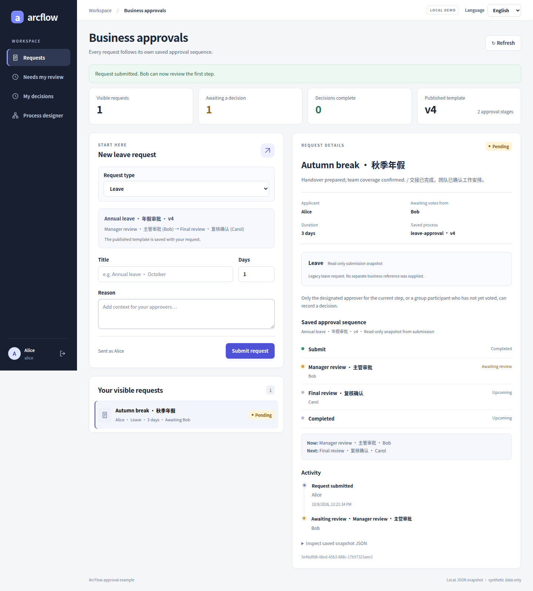](images/gallery/oa-02-submitted-en.png)

Alice has submitted; Bob is the current reviewer.

### 3 ·  Bob’s pending inbox shows the request and review controls

 Bob’s pending inbox shows the request and review controls.

### 4 · Bob’s handled entry remains pending at Carol’s stage

[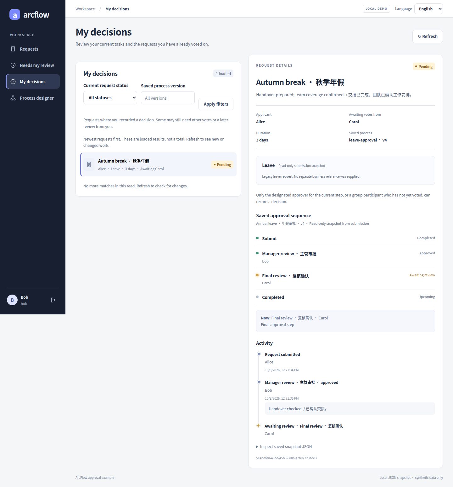](images/gallery/oa-04-pending-next-en.png)

Bob’s handled entry remains pending at Carol’s stage.

### 5 ·  Both stages have passed, with each saved decision and note

 Both stages have passed, with each saved decision and note.

### 6 · A separate request is rejected, with its reason retained

[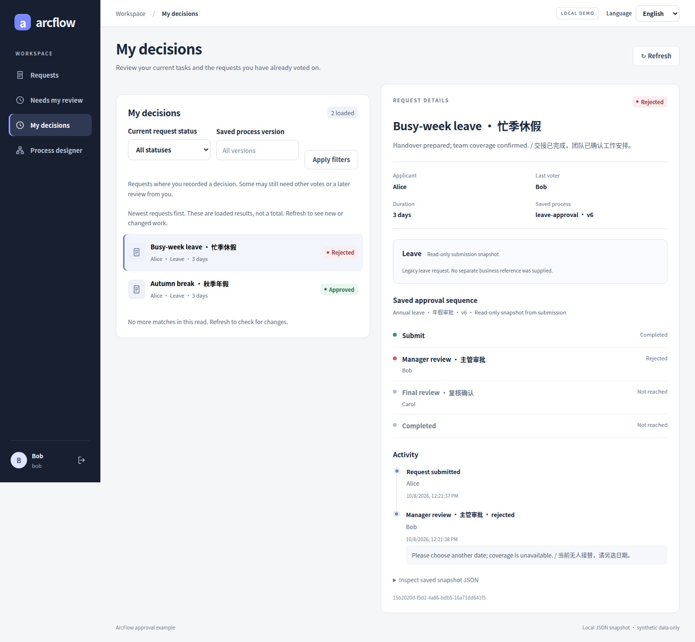](images/gallery/oa-06-rejected-en.png)

A separate request is rejected, with its reason retained.

The inbox is scoped to the signed-in member. Bob’s vote appears as handled while Carol is still pending; handled does not mean the request is complete. [Worklist semantics](MEMBER_INBOX.en.md) · [Walkthrough](GETTING_STARTED.en.md)

<!-- topic:procurement-from-amount-to-outcome -->
## Procurement, from amount to outcome

Three ergonomic chairs at CNY 199.50 total CNY 598.50. Images 1–5 follow one request; image 6 is a separate rejected additional purchase.

### 1 ·  Enter the item, quantity, unit price and currency

 Enter the item, quantity, unit price and currency.

### 2 · The submitted purchase request has a saved business snapshot

[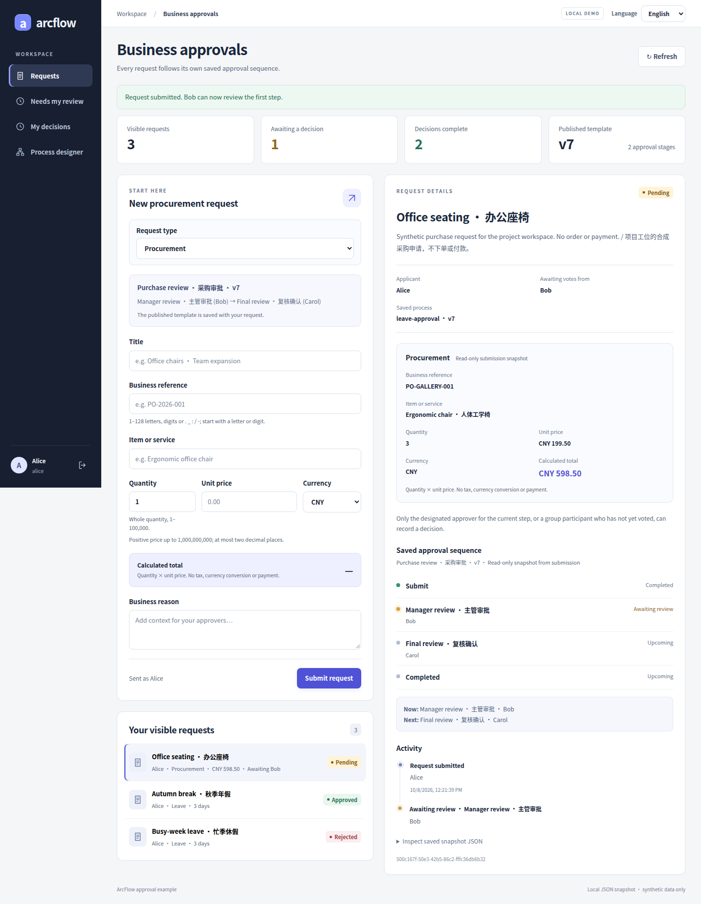](images/gallery/erp-02-submitted-en.png)

The submitted purchase request has a saved business snapshot.

### 3 ·  The manager checks three chairs at CNY 199.50, total CNY 598.50

 The manager checks three chairs at CNY 199.50, total CNY 598.50.

### 4 · After the manager’s approval, Carol performs the final review

[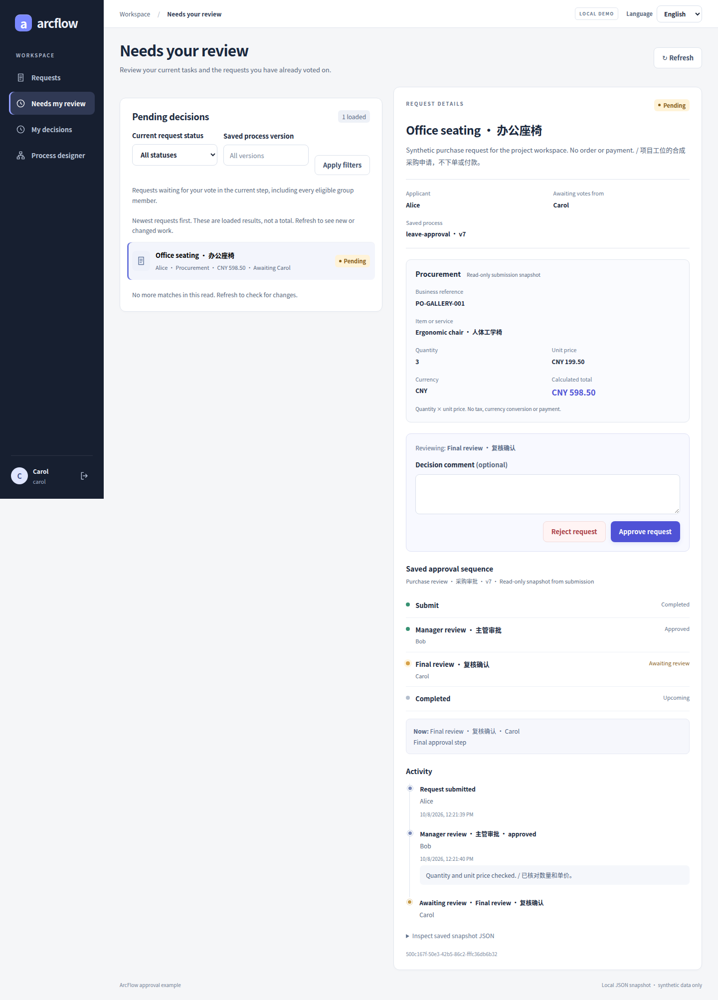](images/gallery/erp-04-final-review-en.png)

After the manager’s approval, Carol performs the final review.

### 5 ·  The completed request retains its exact amounts, flow and notes

 The completed request retains its exact amounts, flow and notes.

### 6 · A separate purchase is rejected in favor of existing stock

[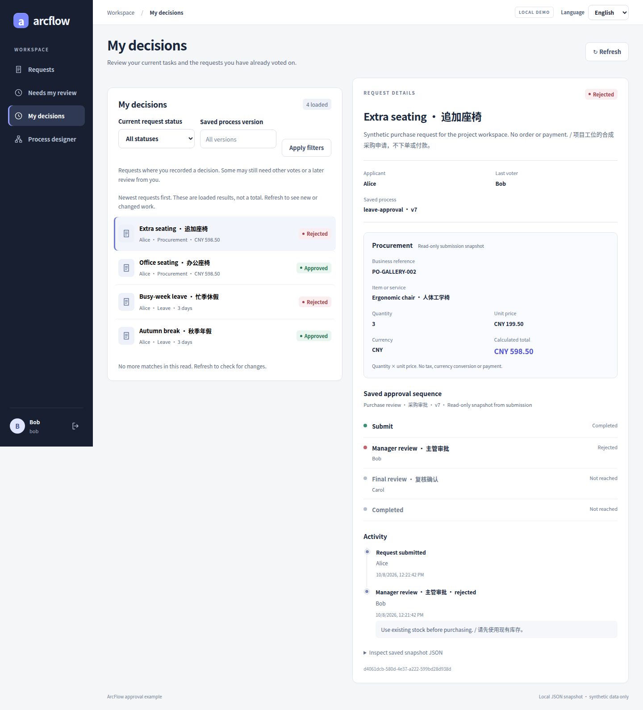](images/gallery/erp-06-rejected-en.png)

A separate purchase is rejected in favor of existing stock.

Leave and procurement use the workspace’s published flow, shown here with two human stages. Hosts define routing and eligibility. Approval does not order from a supplier, reserve funds, pay, or write back. [Procurement guide](PROCUREMENT_UI.en.md)

<!-- topic:quote-discount-manager-to-finance -->
## Quote discount, manager to finance

Ten equipment sets move from a CNY 1,000.00 list unit price to a requested CNY 850.00: CNY 8,500.00 total and CNY 1,500.00 reduction (15%). Images 1–5 follow one request; image 6 uses a fresh disposable backend for rejection, without changing the approved result.

### 1 ·  Review the source quote, requested price and CNY 1,500 reduction together

 Review the source quote, requested price and CNY 1,500 reduction together.

### 2 · The salesperson has submitted and is awaiting the manager

[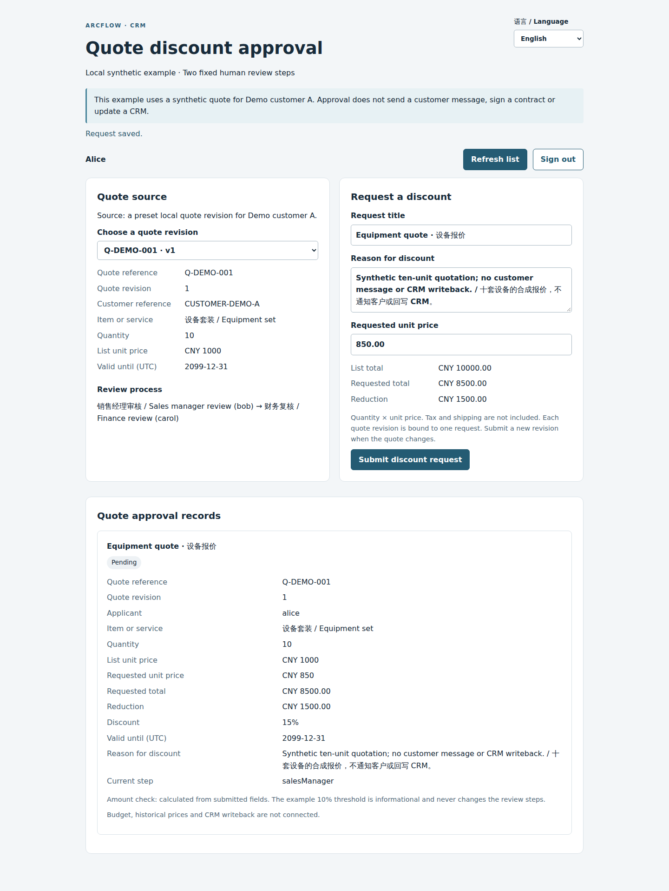](images/gallery/crm-02-submitted-en.png)

The salesperson has submitted and is awaiting the manager.

### 3 ·  Bob reviews the source quotation and discount rationale

[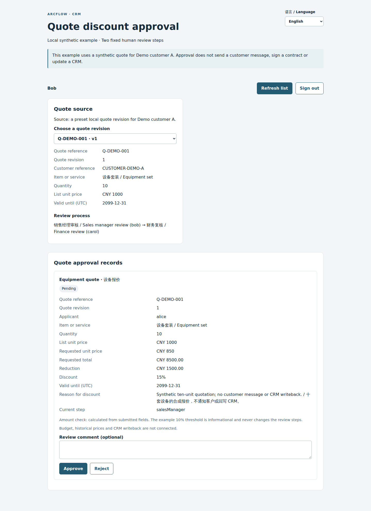](images/gallery/crm-03-manager-review-en.png)

 Bob reviews the source quotation and discount rationale.

### 4 · After Bob’s approval, Carol checks the amount

After Bob’s approval, Carol checks the amount.

### 5 ·  Both stages pass; the quote revision and original rationale remain

 Both stages pass; the quote revision and original rationale remain.

### 6 · A separate run shows the manager-rejected result

[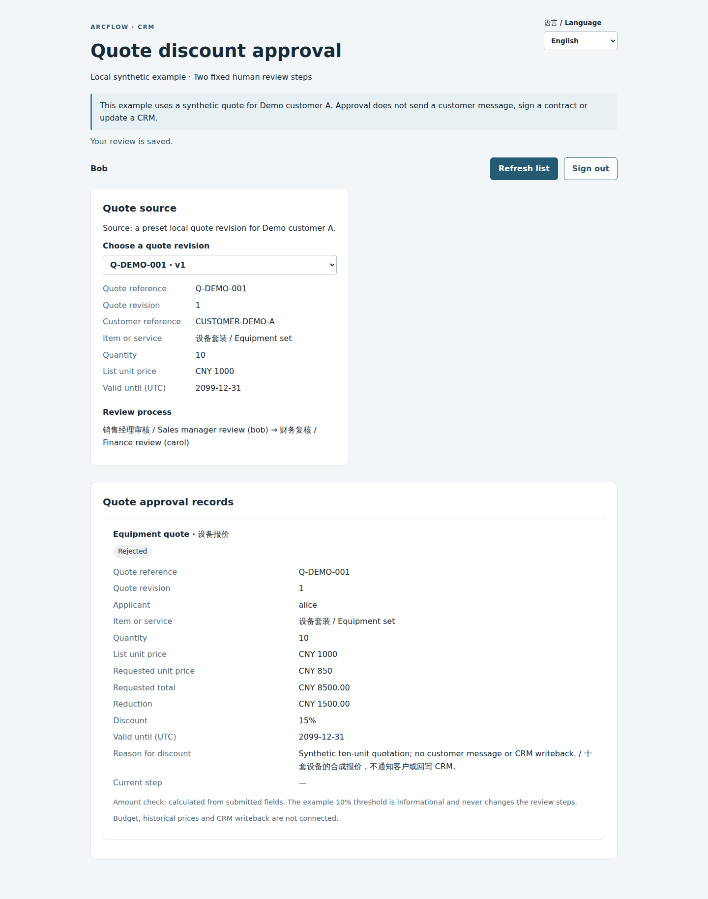](images/gallery/crm-06-rejected-en.png)

A separate run shows the manager-rejected result. The saved review reason is verified through the API; this page does not display it.

Quotes use isolated `/quote-discount.html` and `/api/crm` entries with fixed manager → finance stages. This list is not the shared inbox. Cards show status, current stage, and business data, but not individual comments or full history; capture tests verify those records through the API. Shared standalone, RuoYi, and H5 workspaces do not support quotes. There is no real CRM/LLM, notification, payment, or writeback. Narrow screens support review only; author on desktop. [Quote case](CRM_QUOTE_CASE.en.md)

<!-- topic:ruoyi-and-h5 -->
## RuoYi and H5

The native partial-ANY and H5 handled images are scrolled viewports, so account headers or navigation may be outside the frame. Other captures may be full-page.

### Native RuoYi

[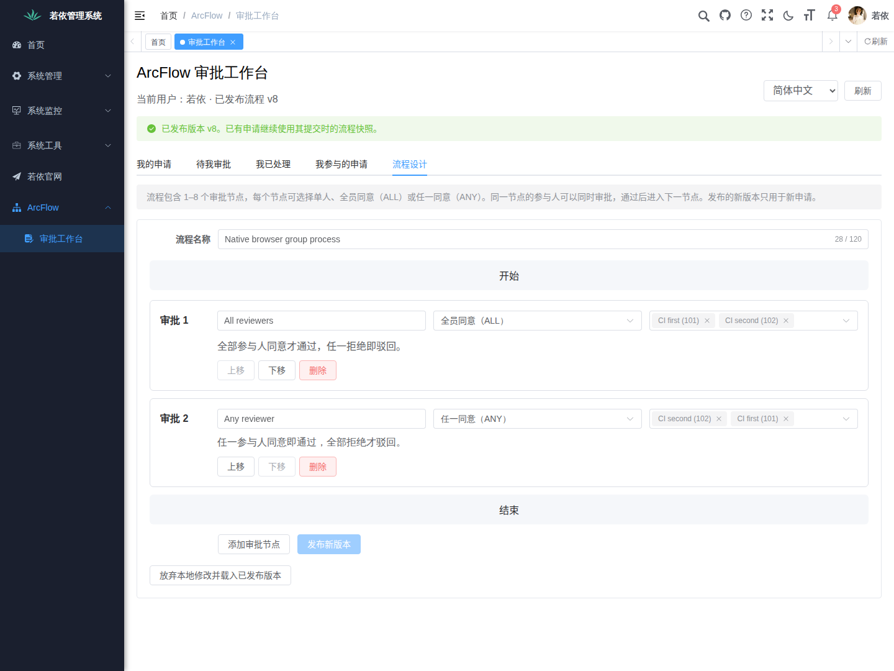](images/gallery/ruoyi-group-editor-zh.png)

RuoYi supplies real accounts, menus, and permissions. The editor selects fixed users, without dynamic role/department resolution.

[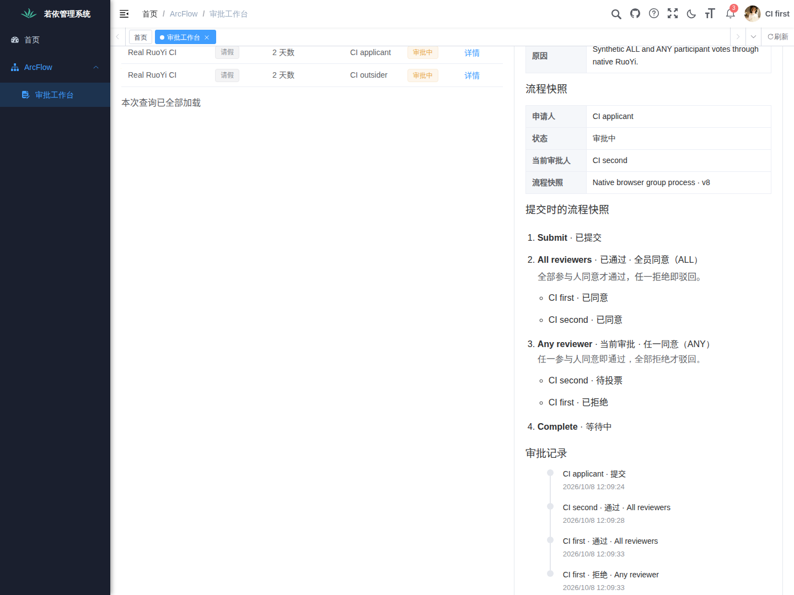](images/gallery/ruoyi-any-partial-zh.png)

This separate synthetic request remains pending after one rejection; another member can approve. It is not a terminal rejection. [Integration](../examples/ruoyi-vue3/README.en.md)

### H5 mobile browser

[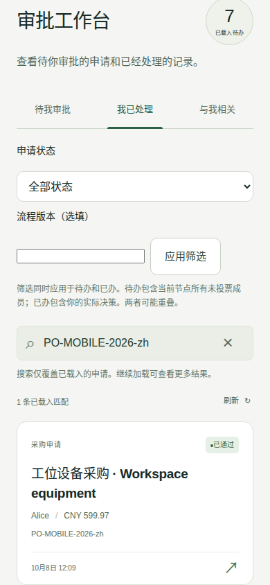](images/gallery/h5-handled-zh.png)
[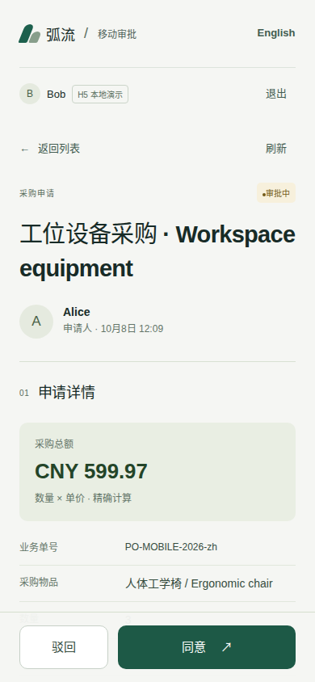](images/gallery/h5-procurement-review-zh.png)
[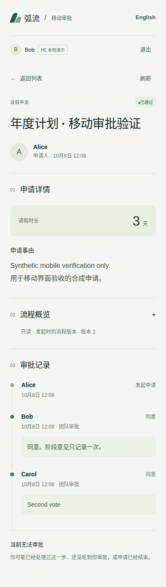](images/gallery/h5-completed-zh.png)

The first two show the handled card and review controls for CNY 599.97 procurement. The third is completed leave-group history from another test, not the same business journey. H5 reviews existing leave/procurement; it cannot author, design, or review quotes. These 390px Chromium captures are not physical-device or native-app tests. [H5 guide](../examples/approval-mobile/README.en.md)

<!-- topic:versions-sources-and-reproduction -->
## Versions, sources and reproduction

Dedicated capture tests drive the real backend for the new designer and leave/procurement/quote states. Other ALL/ANY, RuoYi, and H5 images come from passing main `c4b3135a`. The [manifest](images/gallery/provenance.json) gives every exact commit, workflow, original artifact path, dimensions, and SHA-256. Original PNG bytes are preserved, without cropping, retouching, redrawing, or generated UI.

[Capture commands and environment](GALLERY_CAPTURE.en.md) separate passing CI from local browser limitations. Images establish synthetic cases at the listed revisions, not production readiness, customer adoption, or later-commit acceptance. Repository copies outlive seven-day CI artifacts.

The [original manifest for ten earlier case images](images/cases/provenance.json) is unchanged. See the [earlier designer](DESIGNER_SHOWCASE.en.md) and [earlier RuoYi gallery](RUOYI_SHOWCASE.en.md) for their historical sources.
