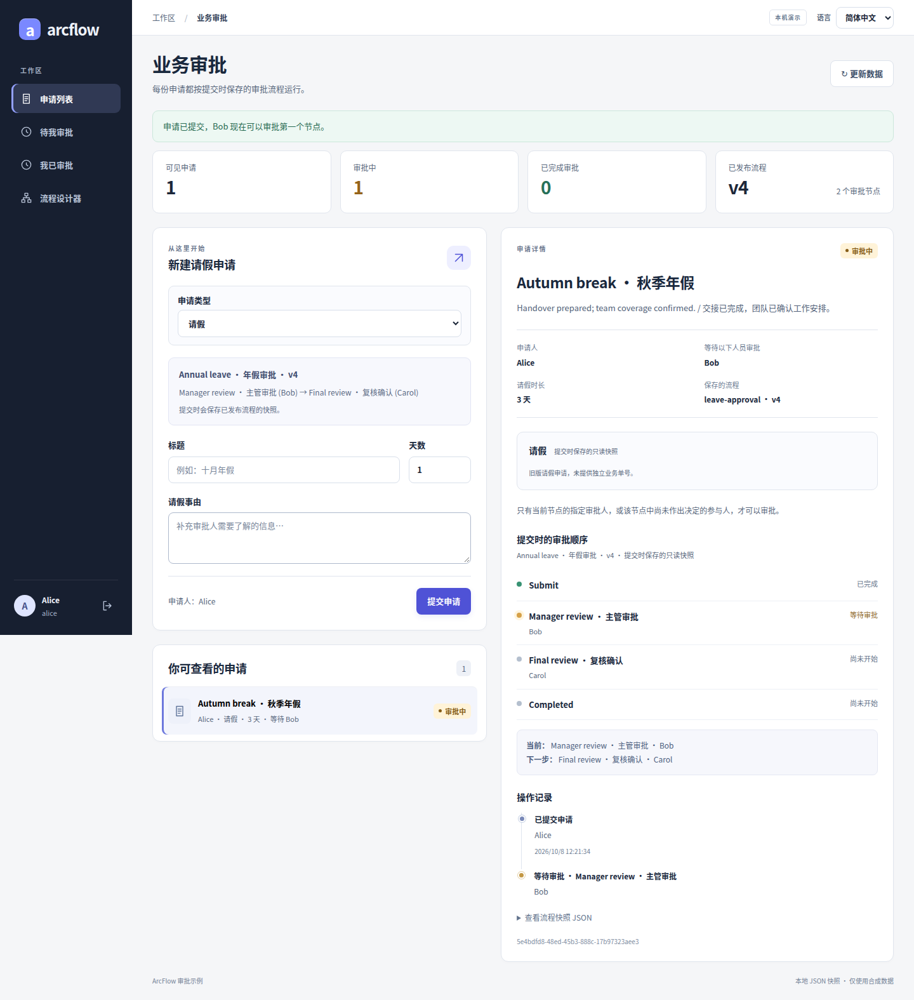
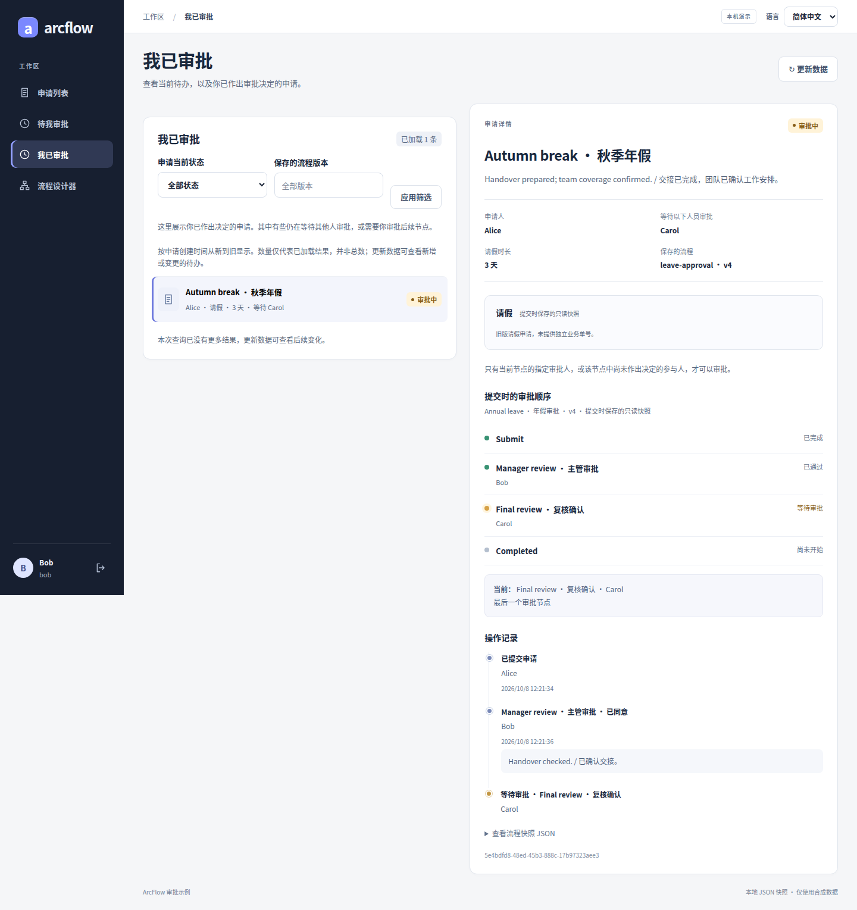
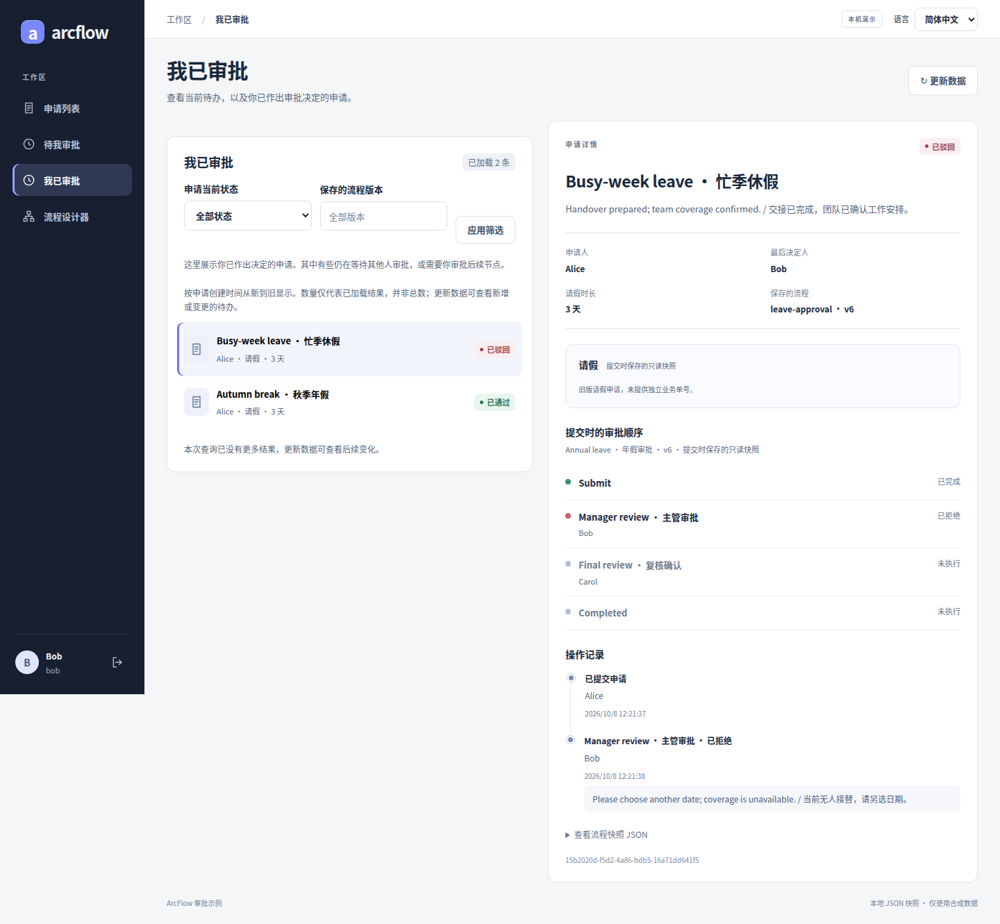
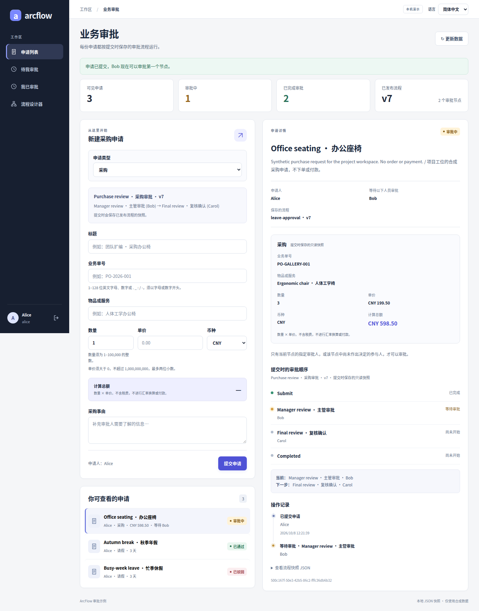
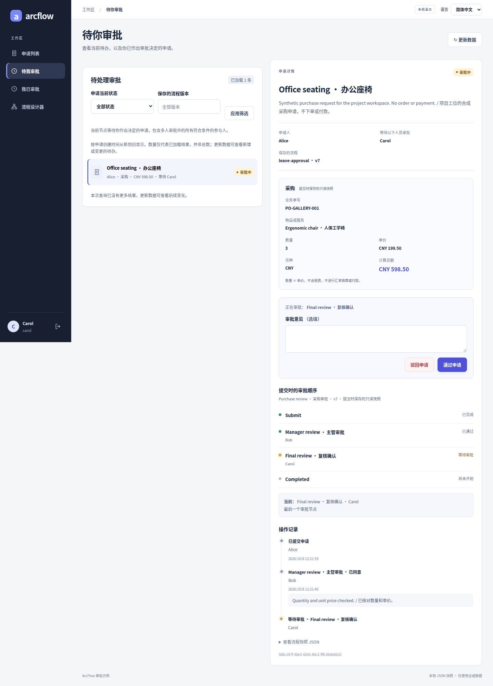
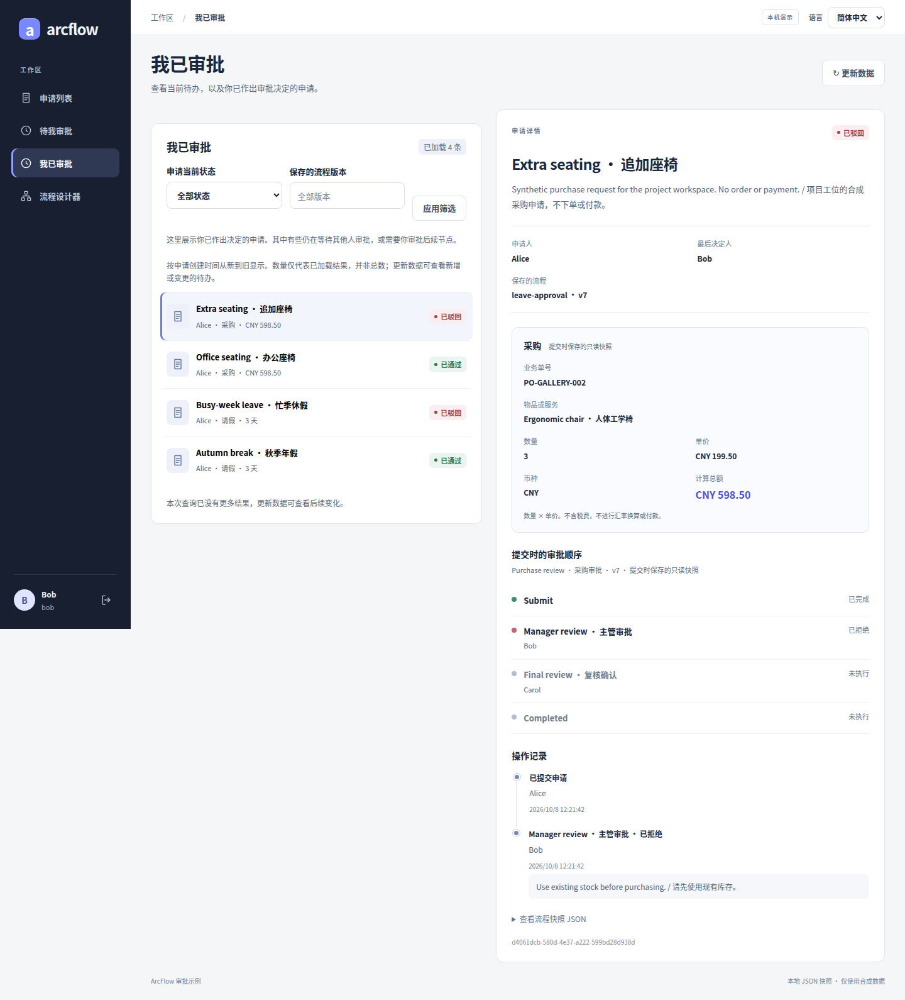
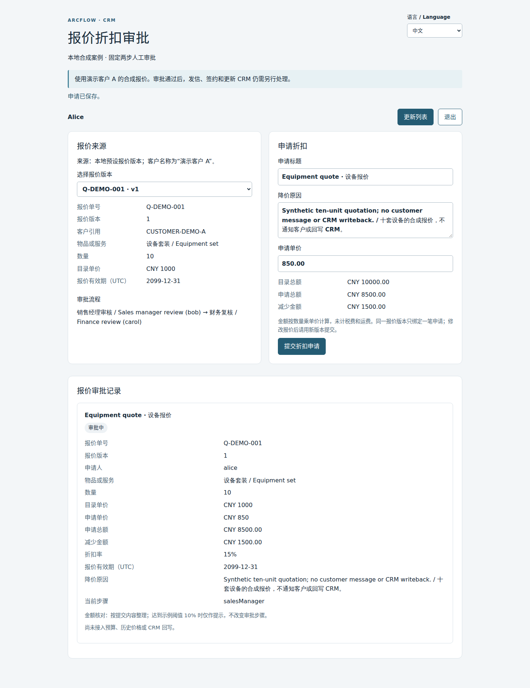
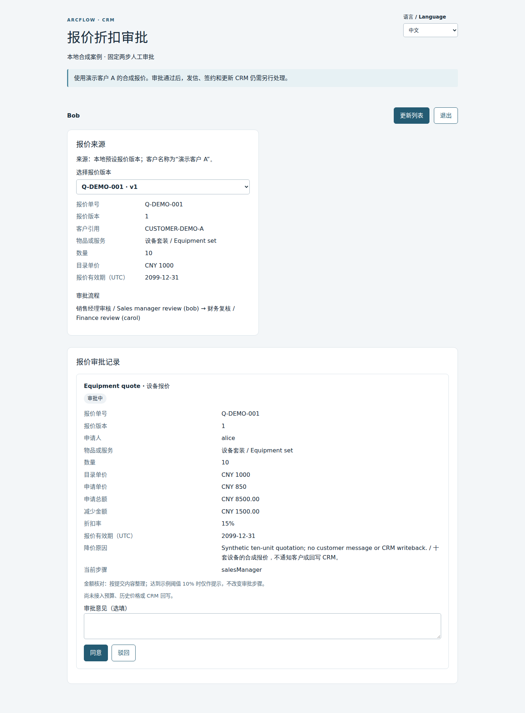
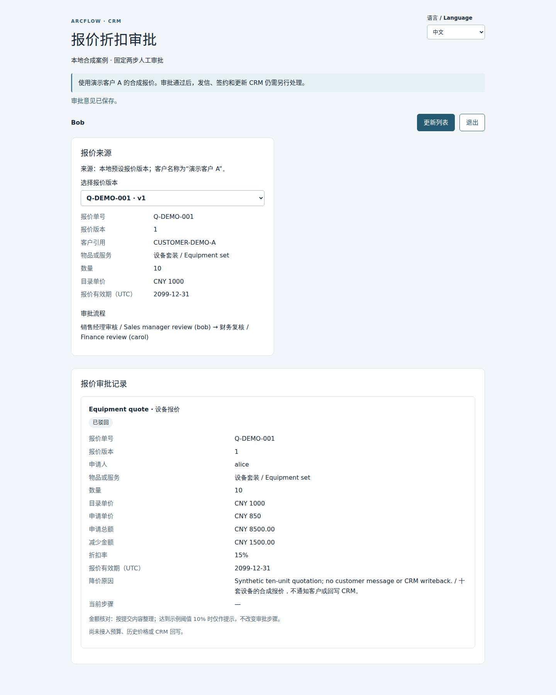

# 业务案例图集

<!-- Legacy fragments remain entry points after the language split. -->

[English](CASE_GALLERY.en.md) · [文档目录](README.md)

每种业务按填写、提交、待办、下一步、通过/驳回展开；点击可看原图。前三组提供中英文版本，若依/H5 补充图只有中文。全部来自真实应用与合成数据，没有将同一张图冒充不同状态。

<!-- topic:leave-end-to-end -->
## 请假：从发起到结束

Alice 提交三天年假和交接原因，Bob 先审、Carol 复核。1–5 为同一申请的连续状态，6 是另一申请的驳回分支。

### 1 · 填写三天请假与交接事由

### 2 · Alice 已提交，等待主管 Bob

### 3 · Bob 的待办：查看原单并填写意见

### 4 · Bob 已办，整笔仍等待 Carol

### 5 · 两级通过，保留两位审批人的记录

### 6 · 另一份申请被驳回，保留拒绝理由

真实待办按登录成员查询。Bob 投票后进入已办，即使 Carol 尚未处理；已办不等于申请全部结束。[待办契约](MEMBER_INBOX.md) · [操作步骤](GETTING_STARTED.md)

<!-- topic:procurement-from-amount-to-outcome -->
## 采购：先核金额，再看结果

三把人体工学椅，单价 CNY 199.50，合计 CNY 598.50。1–5 跟随同一采购单，6 是独立追加采购驳回分支。

### 1 · 填写物品、数量、单价与币种

### 2 · 采购单已保存，业务快照不可改写

### 3 · 主管核对 3 × CNY 199.50 = CNY 598.50

### 4 · 主管已通过，Carol 继续复核

### 5 · 两级通过后保留金额、流程和审批意见

### 6 · 追加采购被驳回：先使用现有库存

采购与请假共用工作区已发布流程，本组为两个人工阶段。实际宿主须定义路由和资格；通过不向供应商下单、不预留资金、付款或回写。[采购说明](PROCUREMENT_UI.md)

<!-- topic:quote-discount-manager-to-finance -->
## 报价折扣：经理到财务

十套设备从目录单价 CNY 1,000.00 申请到 CNY 850.00，合计 CNY 8,500.00，减价 CNY 1,500.00（15%）。1–5 为同一申请，6 在全新临时后端重走拒绝分支，没有修改已通过结果。

### 1 · 源报价、申请单价与减少金额一起核对

### 2 · 销售已提交，等待销售经理

### 3 · Bob 审核源报价与折扣理由

### 4 · Bob 已同意，Carol 复核金额

### 5 · 两级通过，保存报价版本和原始理由

### 6 · 独立驳回分支：经理拒绝后的状态

报价位于隔离的 `/quote-discount.html` 和 `/api/crm`，固定经理→财务；清单不是共享待办。结果卡仅展示状态、当前阶段和业务快照，不显示逐人意见或完整历史，采集测试通过 API 校验这些记录，驳回图中的理由也由 API 验证而非卡片展示。共享独立端、若依、H5 不支持报价，没有真实 CRM/LLM、通知、付款或回写；窄屏仅查看/审批，新建用桌面。[报价案例](CRM_QUOTE_CASE.md)

<!-- topic:ruoyi-and-h5 -->
## 若依与 H5

原生若依 ANY 部分拒绝和 H5 已办是滚动后的视口图，顶栏/账号可能不在画面；其他可能为全页图。

### 原生若依

使用若依真实账号、菜单和权限，选择固定用户，不按角色/部门动态选人。

这是另一合成请求：一人拒绝后 ANY 仍待决，其他成员可以同意，不是终态拒绝。[接入说明](../examples/ruoyi-vue3/README.md)

### H5 手机浏览器

前两张为 CNY 599.97 采购的已办卡和审批控件，第三张为另一请假分组申请的完成历史，是两个合成案例。H5 只审已有请假/采购，不能发起、设计或审报价。390px Chromium 不代表真机或原生应用测试。[H5 指南](../examples/approval-mobile/README.md)

<!-- topic:versions-sources-and-reproduction -->
## 版本、来源与复现

新设计器及请假/采购/报价由专用采集用例驱动真实后端；其他 ALL/ANY、若依和 H5 来自已通过的 main `c4b3135a`。逐图精确提交、工作流、原始产物路径、尺寸和 SHA-256 见[来源清单](images/gallery/provenance.json)。PNG 保留原字节，未裁剪、重绘、修图或生成 UI。

[采集命令与环境](GALLERY_CAPTURE.md)区分已通过的 CI 和本地浏览器限制。图片证明所列版本的合成案例，不代表生产就绪、真实客户或后续提交通过。CI 产物保留七天，仓库副本不受其影响。

早期十张案例图的[原来源清单](images/cases/provenance.json)不变；[早期设计器](DESIGNER_SHOWCASE.md)与[早期若依](RUOYI_SHOWCASE.md)仍可查阅。
