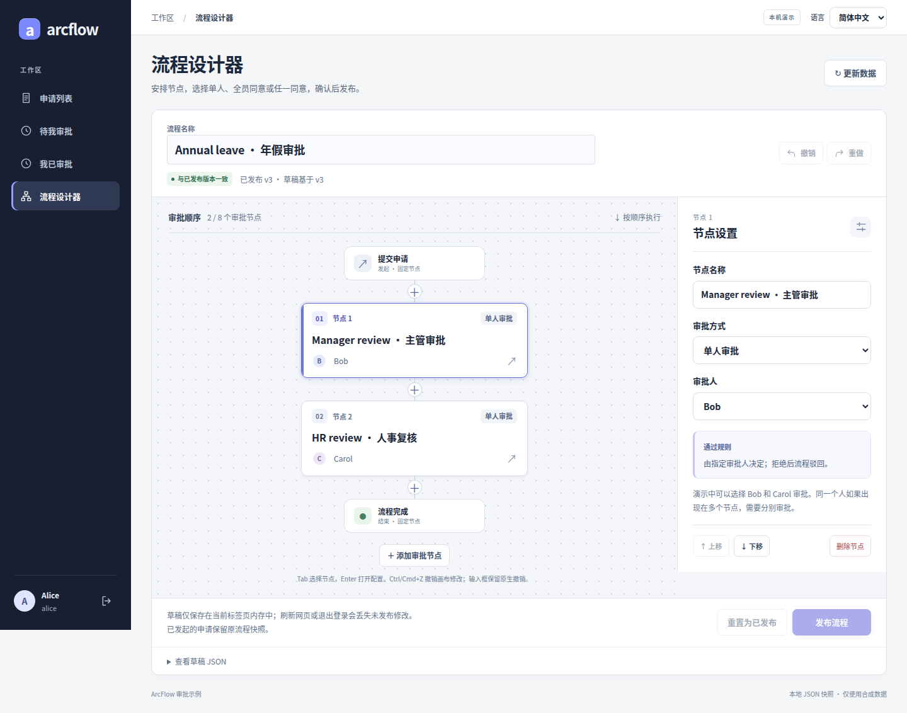
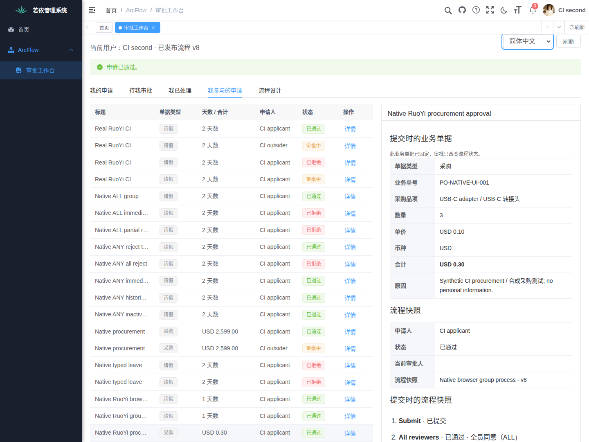
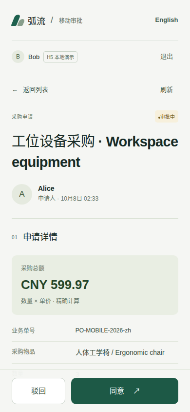

# 业务案例图集 / Cases in action

[README 中文](../README.md) · [English README](../README.en.md) · [本地试用 / Try locally](GETTING_STARTED.md)

先看一笔业务如何发起、审批和留档。下面都是 2026-10-08 在运行中的应用里拍摄的原始截图，使用测试账号和合成业务数据。点击图片可查看原始尺寸；每张图的版本、来源和校验值见[截图来源](#provenance)。

These are original screenshots from running applications, captured on 2026-10-08 with test accounts and synthetic data. Click an image to read it at full size. Each capture has its own version and source; see [provenance](#provenance).

## OA · 从请假开始 / Start with leave

Alice 填写天数和事由，提交时保存已发布的流程。审批人按顺序处理，之后发布新版本不会改变这份申请。[英文原图](images/cases/oa-leave-form-en-caece22.png) · [操作步骤](GETTING_STARTED.md#简体中文)

Alice enters the duration and reason; submission saves the published flow. Reviewers act in order, and later flow changes do not reroute this request. [English screenshot](images/cases/oa-leave-form-en-caece22.png) · [Walkthrough](GETTING_STARTED.md#english)

查看流程设计器 / See the flow designer

在右侧选择审批人和通过规则，检查后发布。这里是两个顺序节点；流程也支持 ALL 会签和 ANY 或签。[分组规则 / Group rules](PARALLEL_APPROVAL.md)

Choose reviewers and completion rules in the right-hand panel, then publish. This example has two sequential steps; ALL and ANY groups are also available.

## ERP · 核对采购金额 / Review a purchase request

3 把椅子，每把 CNY 199.50，合计 CNY 598.50。审批人看到提交时保存的数量、单价和币种，并留下处理记录。[新建表单](images/cases/erp-procurement-form-zh-caece22.png) · [英文原图](images/cases/erp-procurement-review-en-caece22.png) · [采购说明](PROCUREMENT_UI.md)

Three chairs at CNY 199.50 total CNY 598.50. The reviewer sees the saved quantity, unit price and currency, then records a decision. [Entry form](images/cases/erp-procurement-form-zh-caece22.png) · [English screenshot](images/cases/erp-procurement-review-en-caece22.png) · [Procurement guide](PROCUREMENT_UI.md)

这里只记录审批，不向供应商下单、不预留资金，也不付款或回写业务系统。

This records an approval; it does not order from a supplier, reserve funds, pay or write back to another system.

## CRM · 两步核对报价折扣 / Review a quote discount in two steps

10 套设备，单价从 CNY 1,000.00 申请降到 CNY 850.00。Bob 销售经理审核后，由 Carol 财务复核；已通过的记录保留报价版本、原始理由和 15% 折扣。[英文审批结果](images/cases/crm-quote-approved-en-878a565.png) · [报价案例](CRM_QUOTE_CASE.md)

For ten equipment sets, Alice requests a unit-price reduction from CNY 1,000.00 to CNY 850.00. Bob reviews first, then Carol; the approved record retains the quote revision, original reason and 15% discount. [English approval result](images/cases/crm-quote-approved-en-878a565.png) · [Quote case](CRM_QUOTE_CASE.md)

这是 `/quote-discount.html` 和 `/api/crm` 上的隔离合成案例，固定两步人工审批。没有接入真实 CRM、LLM、客户通知或业务回写；共享独立端、若依和 H5 工作区尚不支持报价。窄屏只查看和审批，新建使用桌面窗口。

This isolated synthetic case runs at `/quote-discount.html` and `/api/crm` with two fixed human review steps. It has no real CRM connection, LLM, customer notifications or business writeback. Quotes are not supported in the shared standalone, RuoYi or H5 workspaces. Narrow screens support viewing and review; authoring uses a desktop window.

## 若依与 H5 / RuoYi and H5

若依：在原生菜单里查看采购单 / RuoYi: procurement in native navigation

复用若依登录、菜单和权限。此图显示已通过采购的业务快照；当前视口以下的流程和记录不在图中。[接入说明](../examples/ruoyi-vue3/README.md)

Uses RuoYi's login, menus and permissions. This viewport shows an approved procurement snapshot; the remaining flow and history are below the captured area. [Setup](../examples/ruoyi-vue3/README.md)

H5 在手机浏览器里查看、审批已有采购单，不提供新建。这张图来自 390px Chromium 视口，是另一份合计 CNY 599.97 的测试单；不代表实体手机或原生 App 验收。[H5 说明](../examples/approval-mobile/README.md)

H5 views and reviews existing requests, without authoring. This 390px Chromium capture uses a separate CNY 599.97 test request; it does not establish physical-device or native-app testing. [H5 guide](../examples/approval-mobile/README.md)

## 截图来源 / Capture provenance

- **OA、ERP、设计器、若依与 H5：** 截于 main [`caece22f`](https://github.com/JamesCube/ArcFlow/commit/caece22fb52e645f303c6adec73f19a027d38e66)。来源为通过的[独立端](https://github.com/JamesCube/ArcFlow/actions/runs/37718170734)、[若依](https://github.com/JamesCube/ArcFlow/actions/runs/37718170686)和 [H5](https://github.com/JamesCube/ArcFlow/actions/runs/37718170698)浏览器工作流。
- **CRM：** 截于通过验收的 PR head [`878a5659`](https://github.com/JamesCube/ArcFlow/commit/878a5659220aaf546d9d7f77abfa31f42b054938)，来自[报价浏览器工作流](https://github.com/JamesCube/ArcFlow/actions/runs/37723133831)。其 Git tree `12b173536f69b093fd2c9d4ecdd51ceb8e7f5071` 与合并后的 main [`66ec5312`](https://github.com/JamesCube/ArcFlow/commit/66ec531270a513f884125065f19fe4e78762992f)一致。不是合并后重新拍摄的图片。
- **文件：** 10 张 PNG 均保留原始字节，没有裁剪、改写或生成界面。[逐图来源与 SHA-256](images/cases/provenance.json)列出原始产物路径、尺寸、提交及工作流。CI 产物保留 7 天；本页图片另存于仓库，过期后仍可查看。

OA, ERP, designer, RuoYi and H5 images were captured on main `caece22f`. CRM images were captured on accepted PR head `878a5659`, whose tree equals merged main `66ec5312`; they were not recaptured after the merge. All ten PNGs retain the original bytes. The [manifest](images/cases/provenance.json) records dimensions, original artifact paths, capture commits and SHA-256 hashes. Repository copies remain available after the seven-day CI artifact retention period.

本页按 main `9961ac44` 的功能边界整理；该提交只调整文档和启动入口。这些截图说明各自版本的合成案例，不代表真实客户采用、生产就绪或之后提交的测试结果。当前版本请检查对应 CI；历史设计器和若依截图仍可在[旧设计器图集](DESIGNER_SHOWCASE.md)与[旧若依图集](RUOYI_SHOWCASE.md)查看。

This gallery was assembled against main `9961ac44`, a documentation and launcher-entry update. The images demonstrate synthetic cases at their capture versions, not customer adoption, production readiness or test results for later commits. Check CI for the version you use. The [earlier designer](DESIGNER_SHOWCASE.md) and [RuoYi](RUOYI_SHOWCASE.md) galleries retain their historical captures.
