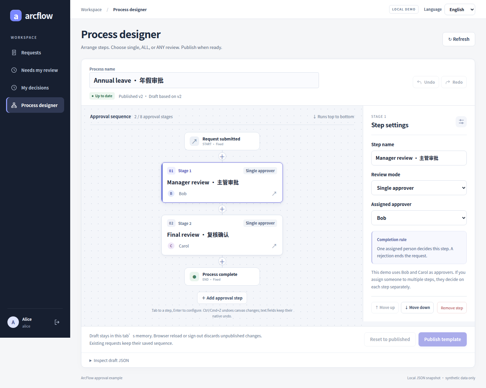
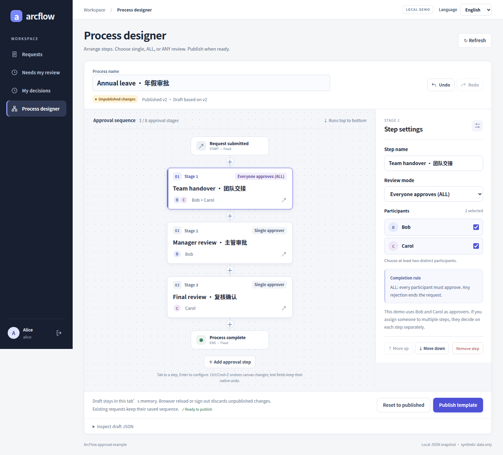
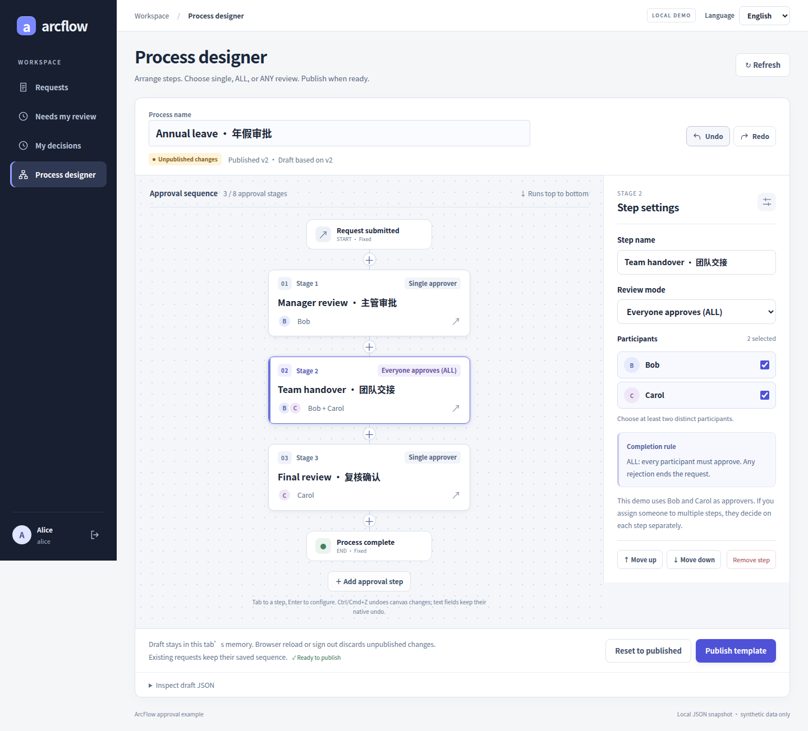
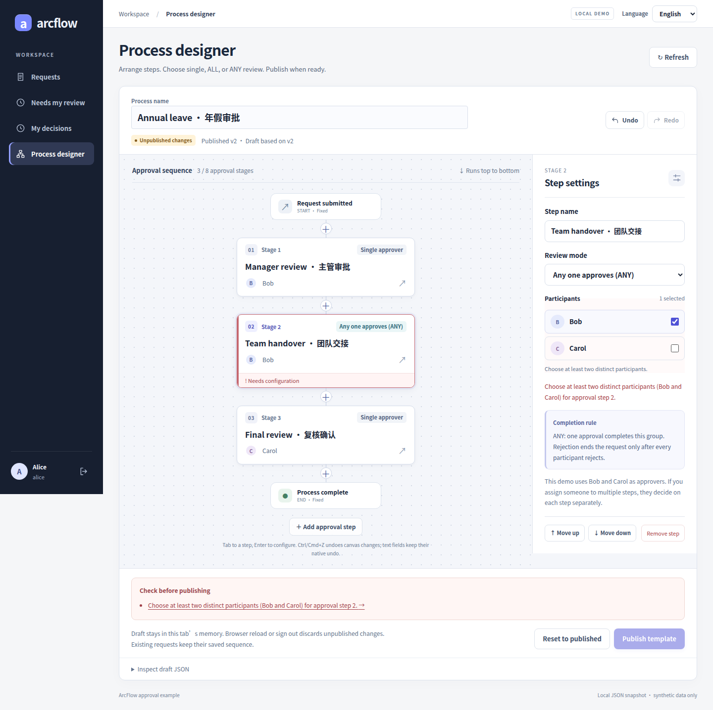
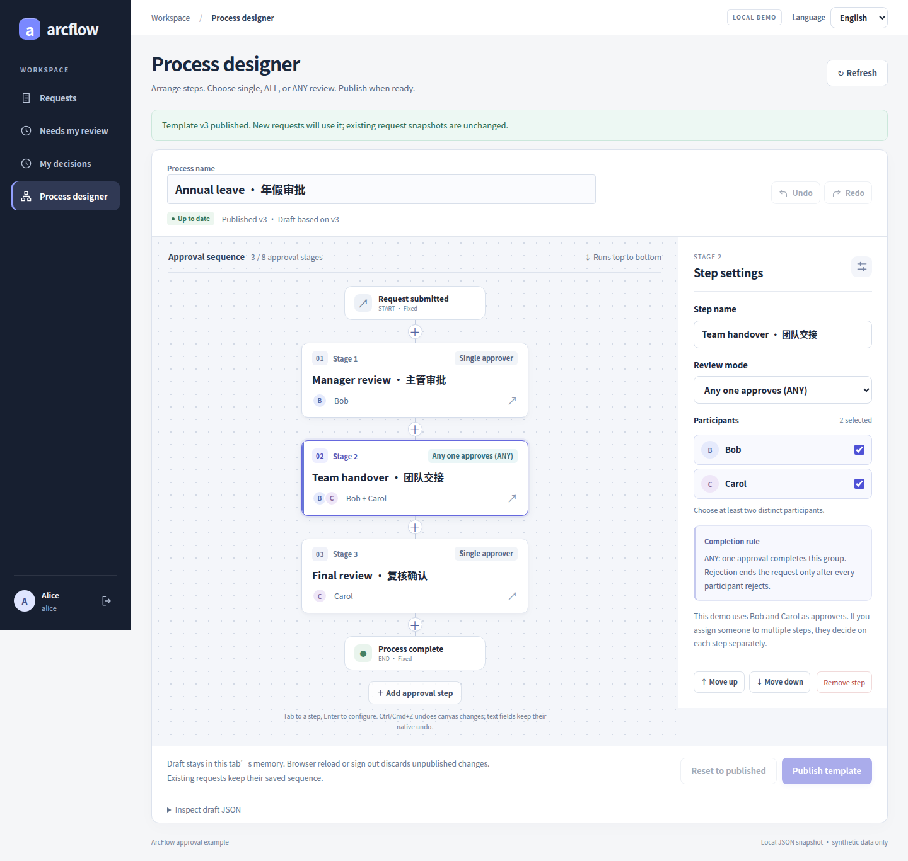
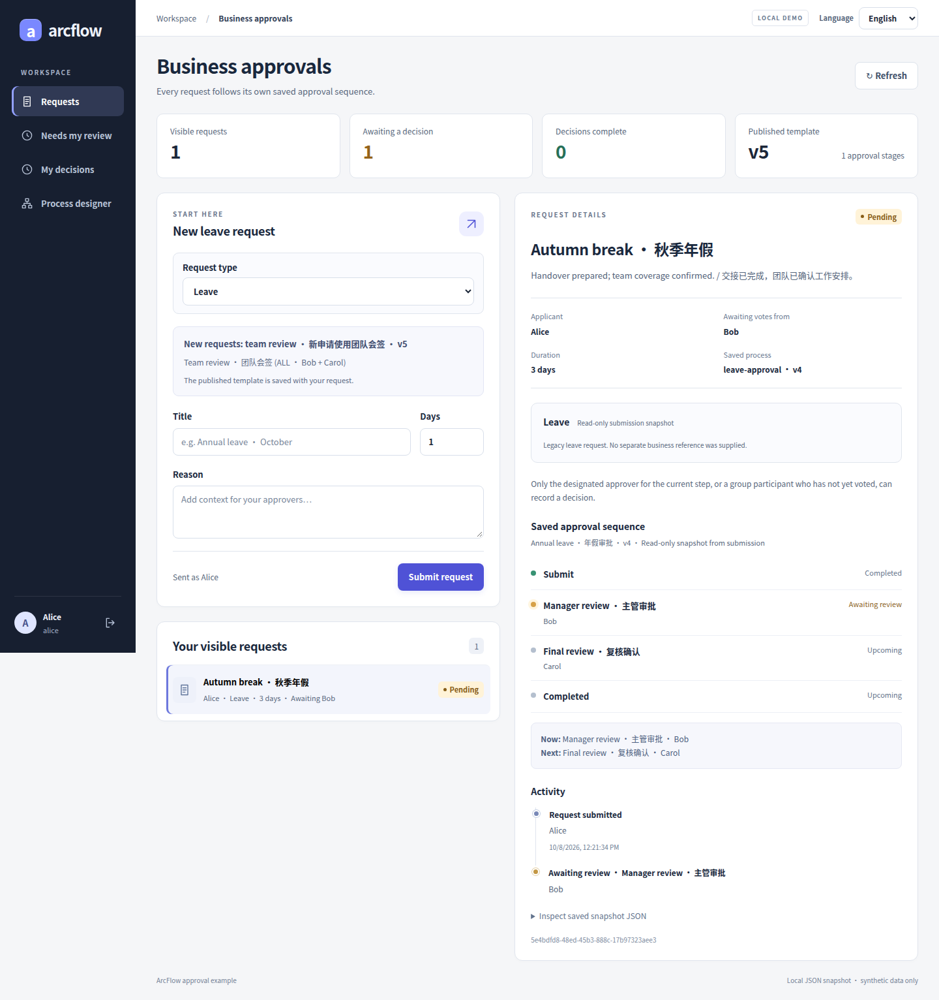
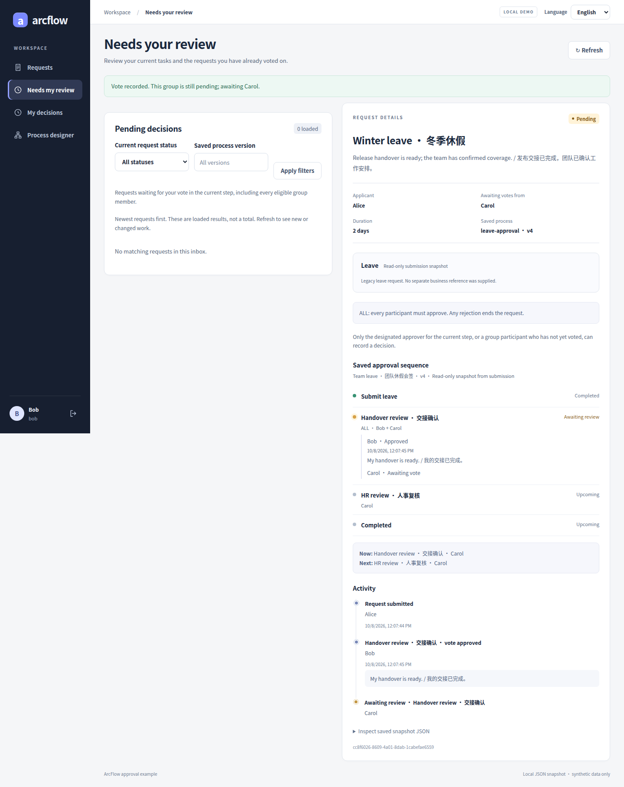
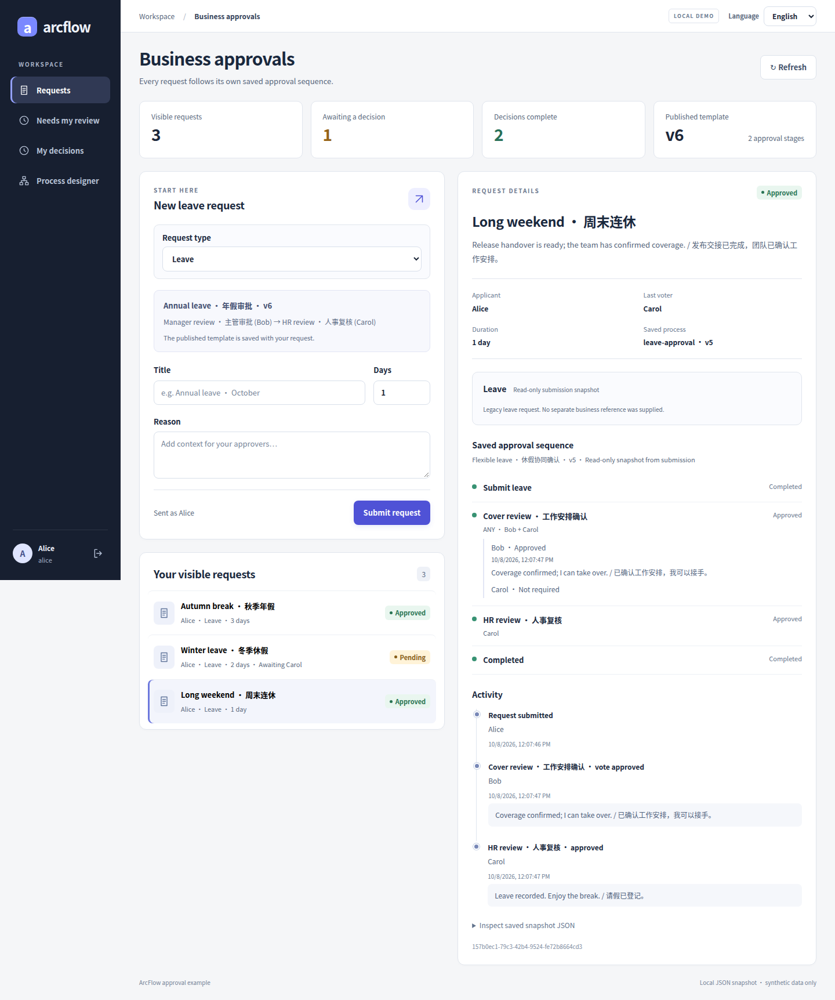

# Flow designer gallery

<!-- Legacy fragments remain entry points after the language split. -->

[简体中文](DESIGNER_GALLERY.md) · [Documentation](README.en.md)

Follow one editing journey from ordered stages to publication. These are real application captures with synthetic data, without generated or retouched UI. Click an image for full resolution. The Chinese page provides the same states in Chinese.

This main-workspace designer supports 1–8 ordered stages between fixed start/end nodes, with Bob and Carol in its picker. The domain supports 2–16 fixed participants for host integrations. Arbitrary graphs, BPMN, dynamic departments, delegation, and withdrawal are unsupported. This workspace has no condition editor; see [the capability catalog](CAPABILITIES.en.md) for restricted conditions in three dedicated scenarios.

<!-- topic:arrange-the-stages -->
## Arrange the stages

### 1 · Two named review stages

Two named sequential stages show who acts first and who follows. The selected stage exposes its reviewer and rejection rule.

### 2 · Insert an ALL stage

Insert a real stage between existing steps and select Bob + Carol with ALL. Both must approve; any rejection ends the request.

<!-- topic:edit-the-order -->
## Edit the order

### 3 · Change stage order

Move the handover group to the first position. The canvas and selected step number update together.

### 4 · Undo the change

Undo restores the group to the middle; Redo becomes available. Draft history exists only in this browser tab and is cleared on publication or sign-out.

<!-- topic:configure-and-validate -->
## Configure and validate

### 5 · Switch to ANY

Switch the same group to ANY. The inspector explains that one approval passes the group and only unanimous rejection ends the request.

### 6 · Block invalid publication

Deselecting Carol leaves only one group participant. The inline error and validation summary are visible, and Publish is disabled.

<!-- topic:publish-and-preserve -->
## Publish and preserve

### 7 · Publish a new version

Restore valid membership and publish through the UI. The real server returns the new version; the draft becomes up to date and Publish is disabled.

### 8 · Preserve an existing request

A later ALL template is already published, while this existing leave request still shows the earlier two-stage snapshot. The capture test verifies the saved definition is unchanged.

<!-- topic:the-rules-in-action -->
## The rules in action

Bob’s vote is saved while Carol remains pending. A handled entry does not mean the whole request is complete.

Bob’s approval passes ANY. Carol is not required in that group, then completes a separate final stage. No vote is invented for a non-voting member. [Rules and tests](PARALLEL_APPROVAL.en.md)

[Business journeys](CASE_GALLERY.en.md) · [Image revisions, sources and checksums](images/gallery/provenance.json) · [Reproduce the captures](GALLERY_CAPTURE.en.md)
