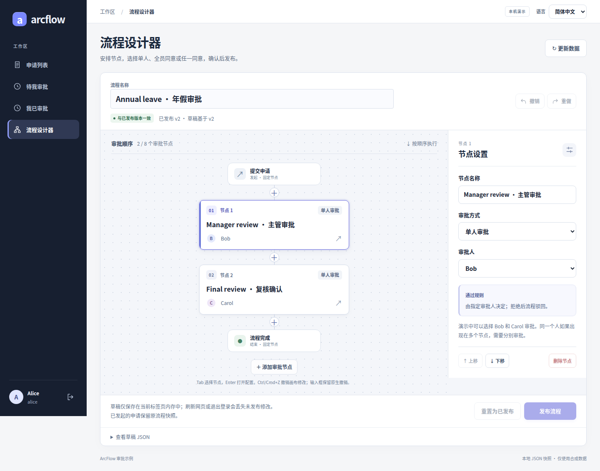
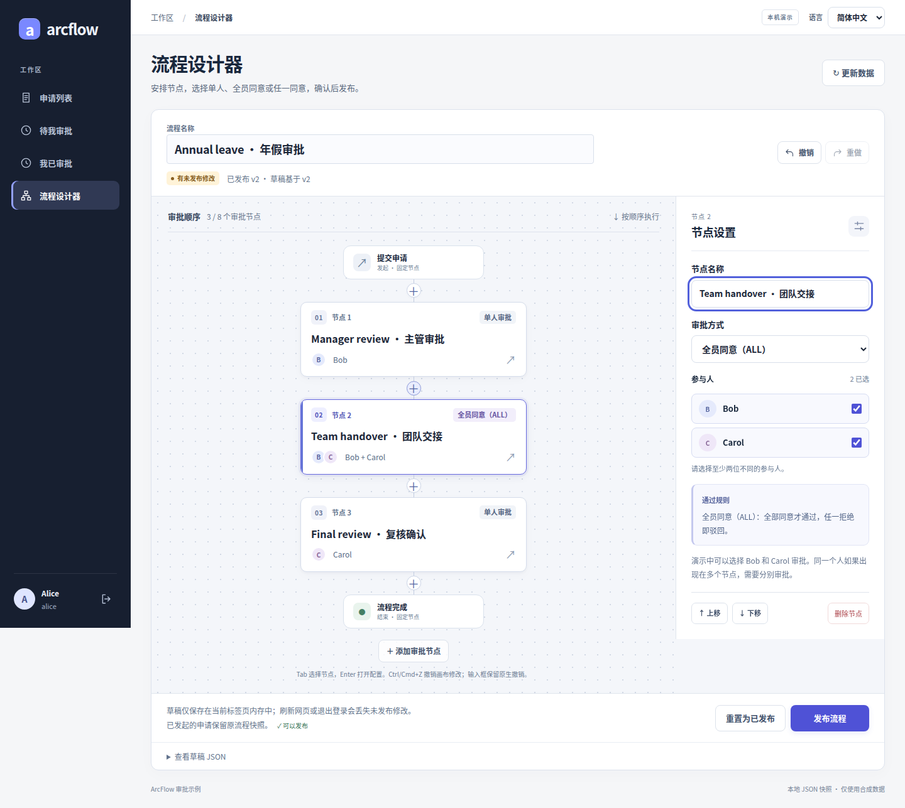
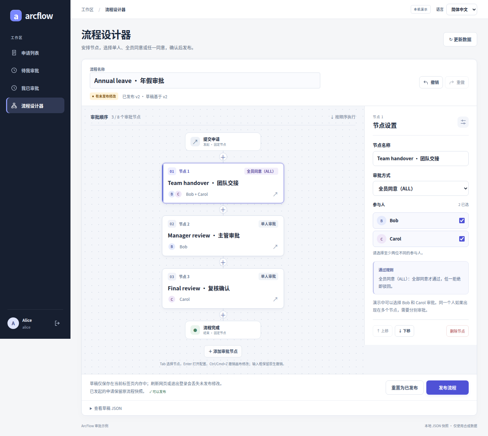
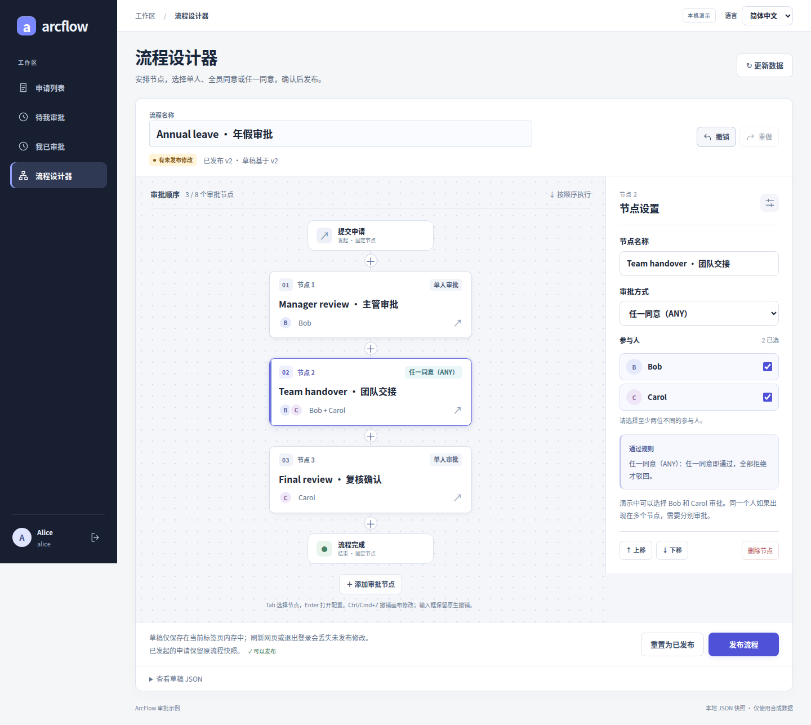
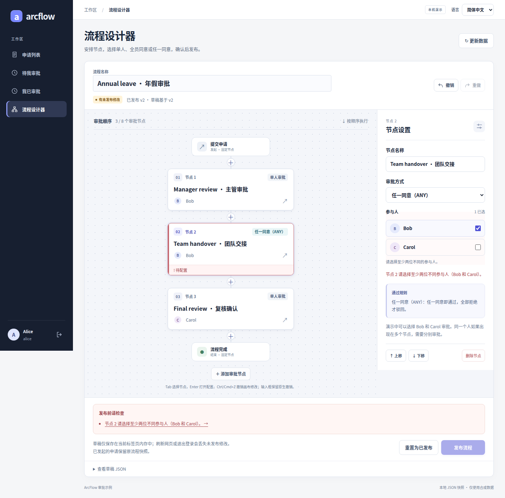
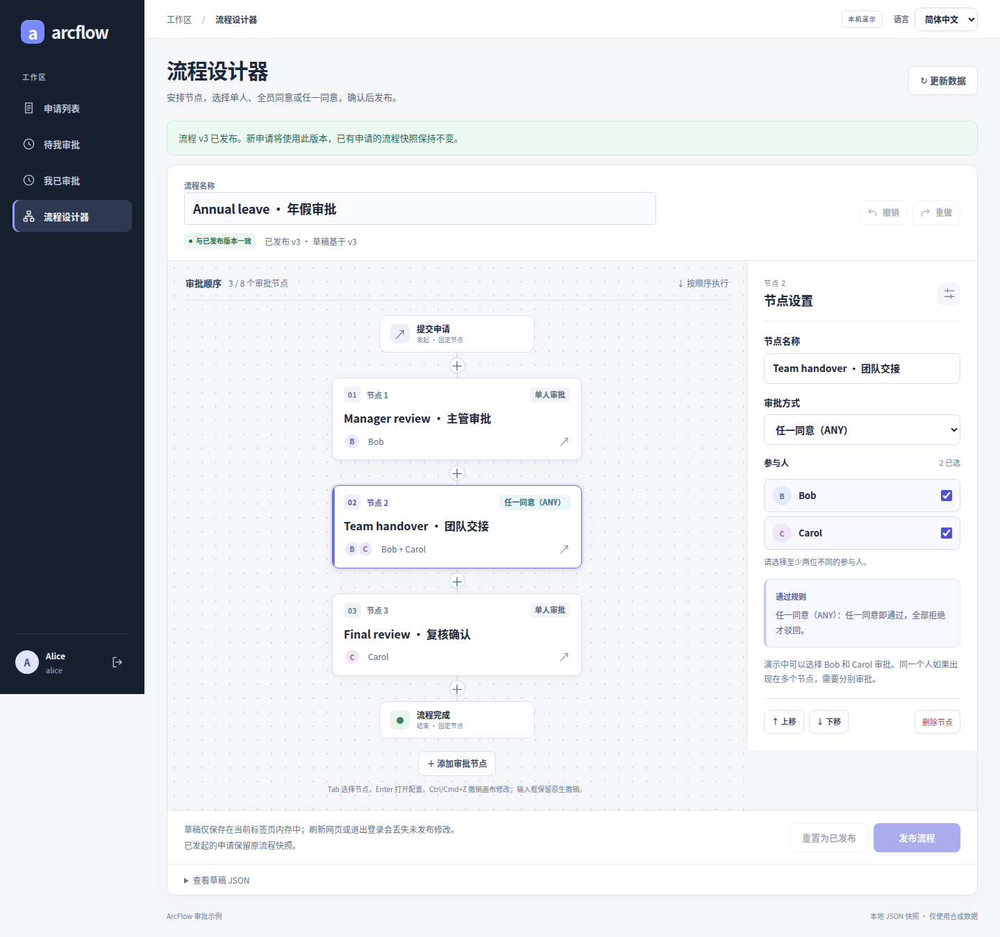
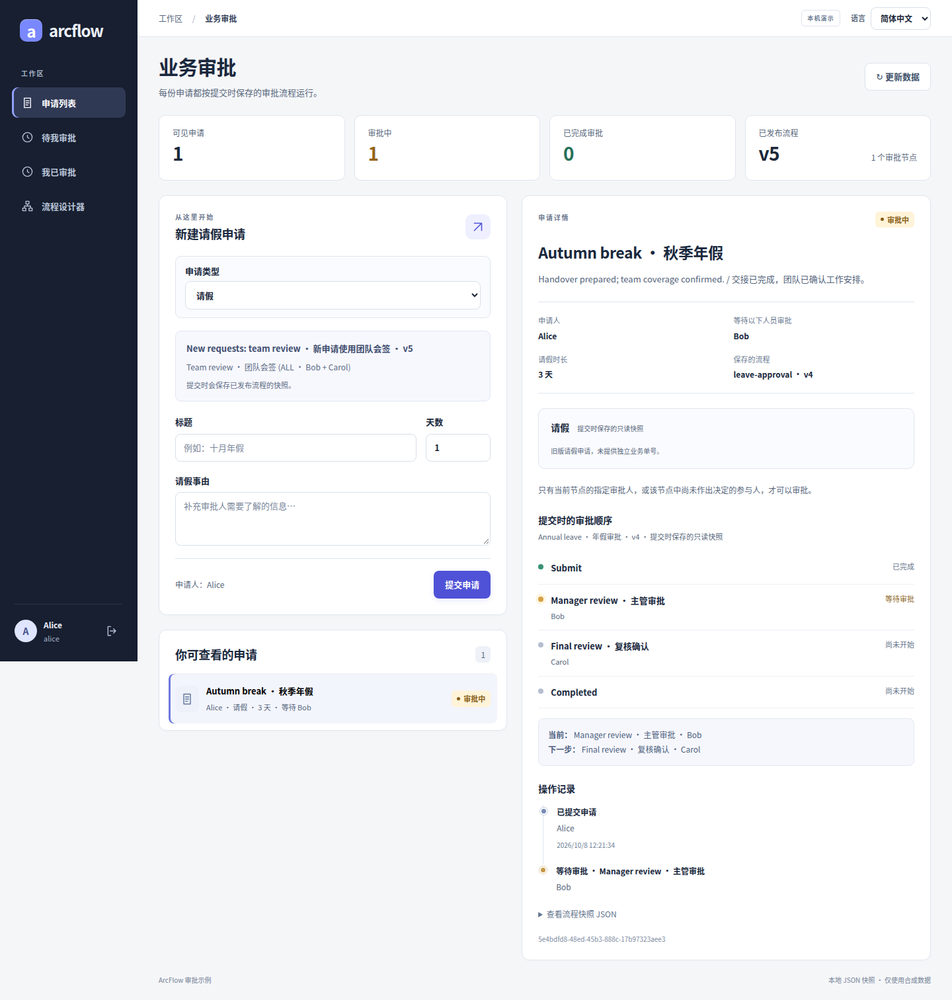
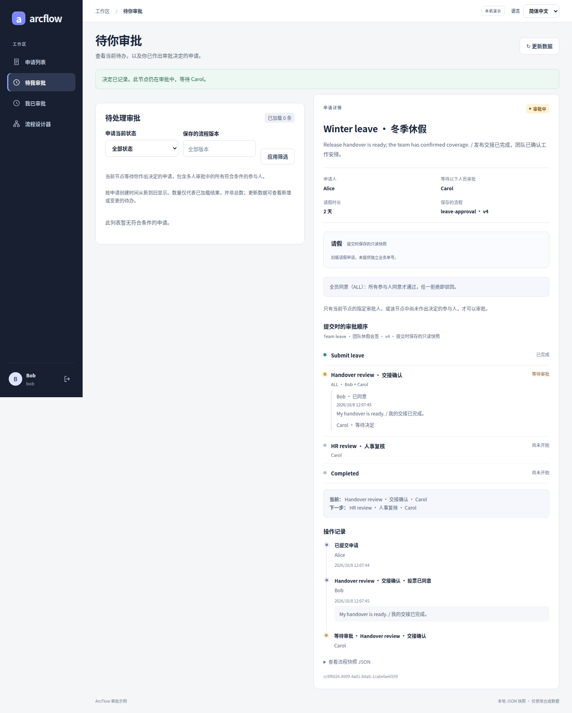
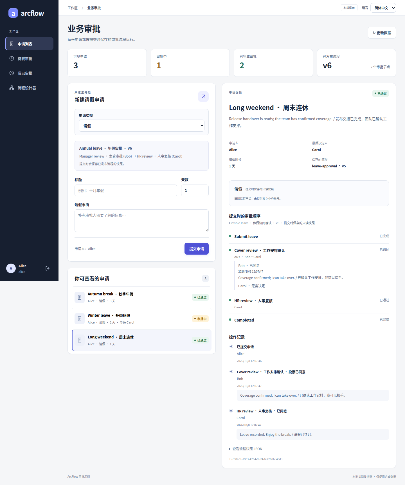

# 流程设计器图集 / Flow designer gallery

新增五类独立图集：[出差／用印／收货／付款／合同](galleries/README.md)，含各自设计器、真实业务状态与条件路由补充。

Five additional case galleries: [travel, seal use, receiving, payment and contracts](galleries/README.en.md), including their designers, real states and conditional-routing supplements.

[README 中文](../README.md) · [English README](../README.en.md) · [业务全流程](CASE_GALLERY.md) · [能力与边界](CAPABILITIES.md)

从安排步骤到真实发布，按一次编辑过程看设计器。每张图都是运行中的应用、真实控件和合成数据。中文图点击可放大，每节另附英文原图。

Follow one editing journey from ordered stages to publication. These are real application captures, with synthetic data and no generated or retouched UI. Click any image for full resolution.

[多级单人](#sequential) · [插入与 ALL](#all) · [排序](#reorder) · [撤销](#undo) · [ANY](#any) · [校验](#validation) · [发布](#publish) · [版本快照](#versions) · [逐人表决](#votes)

当前独立设计器支持固定开始／结束之间的 1–8 个顺序审批步骤，人员选择仅提供 Bob 和 Carol。审批领域的每组 2–16 人上限可供宿主接入使用；这不是任意 DAG 或 BPMN 编辑器，没有条件路由、动态部门选人、转办或撤回。[完整边界](CAPABILITIES.md#zh)

This standalone designer supports 1–8 ordered approval stages and offers Bob and Carol in its picker. The approval domain supports 2–16 fixed members per group for host integrations. Arbitrary graphs, BPMN, conditional routing, dynamic departments, delegation and withdrawal are outside the current scope. [Full limits](CAPABILITIES.md#en)

## 安排步骤 / Arrange the stages

| 1 · 多级单人审批：主管 → 复核 | 2 · 在两步之间插入会签节点 |
| --- | --- |
|  |  |
| 每一步都能选审批人；当前节点结束后才进入下一步。图中展示单人审批的实际配置面板。  Two named sequential stages show who acts first and who follows. The selected stage exposes its reviewer and rejection rule. [English full-size image](images/gallery/designer-01-sequential-en.png) | 保留主管和复核节点，在中间增加“团队交接”。选择 Bob 和 Carol，全员同意才推进，任一拒绝就结束。  Insert a real stage between existing steps and select Bob + Carol with ALL. Both must approve; any rejection ends the request. [English full-size image](images/gallery/designer-02-insert-all-en.png) |

## 编辑顺序 / Edit the order

| 3 · 调整审批顺序 | 4 · 撤销后恢复原顺序 |
| --- | --- |
|  |  |
| 把团队交接上移到第 1 步，左侧顺序和右侧节点编号一起更新。上下移动按钮处理顺序，不是任意连线画布。  Move the handover group to the first position. The canvas and selected step number update together. [English full-size image](images/gallery/designer-03-reorder-en.png) | 撤销上移后，团队交接回到中间，重做按钮可用。这里只保存当前浏览器标签页内的草稿编辑历史。  Undo restores the group to the middle; Redo becomes available. Draft history exists only in this browser tab and is cleared on publication or sign-out. [English full-size image](images/gallery/designer-04-undo-en.png) |

## 配置与校验 / Configure and validate

| 5 · 从会签切换为或签 | 6 · 校验错误直接阻止发布 |
| --- | --- |
|  |  |
| 同一个人员组切成 ANY 后，面板同步显示“任一同意即通过、全部拒绝才驳回”的规则。  Switch the same group to ANY. The inspector explains that one approval passes the group and only unanimous rejection ends the request. [English full-size image](images/gallery/designer-05-any-en.png) | 只剩一位参与人时，节点和底部错误列表同时提示，发布按钮不可用。点击错误可定位对应字段。  Deselecting Carol leaves only one group participant. The inline error and validation summary are visible, and Publish is disabled. [English full-size image](images/gallery/designer-06-validation-en.png) |

## 发布与快照 / Publish and preserve

| 7 · 发布后显示新版本 | 8 · 新版本不改动已提交申请 |
| --- | --- |
|  |  |
| 修复参与人后，通过页面发布到真实服务端。新版本号、已更新状态和不可再次点击的发布按钮一起确认结果。  Restore valid membership and publish through the UI. The real server returns the new version; the draft becomes up to date and Publish is disabled. [English full-size image](images/gallery/designer-07-published-en.png) | 测试先提交两步请假流程，再发布另一版 ALL 流程。原申请仍保留旧版本、原审批人和原顺序；新旧版本一致性由接口断言核对。  A later ALL template is already published, while this existing leave request still shows the earlier two-stage snapshot. The capture test verifies the saved definition is unchanged. [English full-size image](images/gallery/designer-08-saved-version-en.png) |

## 配置之外：实际逐人表决 / The rules in action

| ALL：一人同意后继续等待 | ANY：一人通过组审批，后续复核完成 |
| --- | --- |
|  |  |
| Bob 的投票已经保存；Carol 尚未投票，申请仍在审批中。已办不等于整笔申请已完成。 | Bob 同意后，ANY 组已通过，组内 Carol 标为无需处理；Carol 随后完成另一个复核步骤。未投票成员不会被补造组内投票。 |

ALL waits after one member's saved approval. In the ANY example, Bob passes the group, Carol is not required in that group, and Carol then completes a separate final stage; no group vote is fabricated. [ALL English](images/gallery/group-all-partial-en.png) · [ANY English](images/gallery/group-any-approved-en.png) · [Rules and tests](PARALLEL_APPROVAL.md)

[继续看 OA、ERP、CRM 的发起、待办、通过与驳回](CASE_GALLERY.md) · [逐图版本、来源和校验值](images/gallery/provenance.json) · [复现截图](GALLERY_CAPTURE.md)
