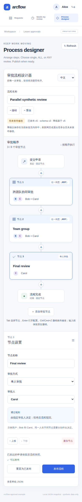

# ArcFlow 设计器实拍 / Designer in action

[简体中文](#简体中文) · [English](#english) · [README](../README.md) · [若依原生集成 / RuoYi](RUOYI_SHOWCASE.md)

## 简体中文

### 01 · 看清流程，在一个面板配置节点

[](images/designer-desktop-836e605.png)

连接处的「＋」在当前位置插入审批节点；卡片展示名称、参与人和完成方式。右侧面板配置选中节点，明确显示 **任一同意（ANY）：任一同意即通过，全部拒绝才驳回**。发布版本、草稿基准与未发布修改分别显示，撤销/重做只作用于本地草稿。

这是运行中的独立 Vue + Spring Boot 演示，截图使用 Alice、Bob、Carol 合成账号。中文优先覆盖设计器，外围导航与服务端消息仍为英文。

### 02 · 390px 窄屏：流程与节点设置上下排列

<a href="images/designer-mobile-836e605.png"></a>

窄屏将配置面板放到流程下方。浏览器测试点击最后一个节点后确认面板进入视口，并检查没有横向溢出。这是 390px Chromium 视口的完整页面截图，不是实体手机或所有移动浏览器的兼容性认证。

### 从源码一键试用

安装 [所需工具](TRYOUT.md#requirements)，在当前仓库根目录运行：

```sh
python3 scripts/tryout.py
```

使用当前 `main`，或检出下方已验证的 `e1ee9c6`。等启动器显示就绪后，以生成的 Alice 演示密码登录，打开 **Process designer**，选择单人、ALL 或 ANY，点击 **发布流程**。再用合成数据提交申请，切换 Bob / Carol 体验审批。Ctrl-C 会停止服务并删除本次演示数据。[完整步骤与分组规则](TRYOUT.md#what-to-try)

已有的 [`v0.1.0-alpha.1`](https://github.com/JamesCube/ArcFlow/releases/tag/v0.1.0-alpha.1) 固定在旧顺序审批源码；该发布包不包含本页的新设计器、ALL/ANY 或 JDBC。

### 能力与宿主边界

| 层次 | 本次已验证 | 保留的边界 |
| --- | --- | --- |
| 独立设计器与演示 | 单人 / ALL / ANY、逐人投票、固定流程快照、桌面 / 窄屏布局 | 固定合成账号；按顺序执行阶段；默认单写者 JSON |
| 官方若依参考集成 | 真实若依登录、菜单、权限与两级顺序审批实拍 | 当前宿主支持 [ALL/ANY 分组](../examples/ruoyi-vue3/README.md#configure-and-vote-in-groups)，审批仍为 JSON；[原生实拍](RUOYI_SHOWCASE.md#简体中文) |
| 可选 JDBC | MySQL 8.0.46 / 8.4.11 × Java 17 / 21，每组合 29 项真实服务器测试通过 | 需宿主显式接线与迁移；不会自动替换演示存储；[测试明细](../examples/approval-jdbc/MYSQL_VERIFICATION.md#verified-server-acceptance-2026-10-05) |

ALL 要求全员同意，任一拒绝即驳回；ANY 任一同意即通过，只有全员拒绝才驳回。分组属于有序阶段，不是条件分支或通用图形连线。草稿只在当前页面内存中；工作台 Refresh 保留草稿，浏览器刷新或退出会丢失未发布修改。尚无条件路由、定时器、转办、BPMN 兼容或生产就绪承诺。

### 来源与验证

- 两张图均为未修改的 CI 截图：桌面 `1440 × 1609`，窄屏 `390 × 2373`。原始文件为工作台测试的 `02-workbench-any-inspector.png` 与 `03-workbench-narrow-inspector.png`。
- 截图提交：[`836e6051a0c1198c9348e58c094e40cdcf11f3f1`](https://github.com/JamesCube/ArcFlow/commit/836e6051a0c1198c9348e58c094e40cdcf11f3f1)。[通过的截图工作流](https://github.com/JamesCube/ArcFlow/actions/runs/37257554086)产物 ID 为 `11323062579`；CI 产物保留 7 天，本页图片作为长期副本。
- 合并提交：[`e1ee9c6bdb971949c4f8746fe88b9ff49e6d4c36`](https://github.com/JamesCube/ArcFlow/commit/e1ee9c6bdb971949c4f8746fe88b9ff49e6d4c36)，与截图提交的 Git tree 均为 `302ecb8d9041429d8aabad2851ec7388f3b653e9`。
- 合并源码的五项工作流均通过：[Java](https://github.com/JamesCube/ArcFlow/actions/runs/37258262044)、[设计器 / API / Chromium](https://github.com/JamesCube/ArcFlow/actions/runs/37258262057)、[JDBC](https://github.com/JamesCube/ArcFlow/actions/runs/37258262111)、[原生若依](https://github.com/JamesCube/ArcFlow/actions/runs/37258262058)、[一键试用](https://github.com/JamesCube/ArcFlow/actions/runs/37258262036)。这是指定提交的证据，不是对以后所有提交的保证。
- [工作台浏览器测试](https://github.com/JamesCube/ArcFlow/blob/836e6051a0c1198c9348e58c094e40cdcf11f3f1/examples/approval-ui/e2e/workbench.spec.mjs)覆盖插入、无效分组定位、本地撤销、Escape 焦点返回、窄屏面板和发布。200% 缩放、原生文本撤销、其他浏览器与正式无障碍审计仍未验证。

## English

### Design, publish and run an approval sequence

The two unmodified screenshots above show the real standalone application: a **1440px desktop canvas with one ANY inspector**, and a **390px stacked layout** with the selected stage’s settings below the flow. Insert at any connector, select a stage, set its reviewer or participant group, and publish. Existing requests keep the definition they were submitted with.

The designer defaults to Chinese and offers an English toggle; the surrounding demo remains English. Accounts and request data are synthetic. The narrow capture is a Chromium viewport, not a physical-phone or all-mobile-browser certification.

From a current checkout, with the [required tools](TRYOUT.md#requirements), run `python3 scripts/tryout.py`. Use the generated Alice password, open **Process designer**, publish a sequence, submit synthetic data, then sign in as Bob or Carol to review. The launcher stops and deletes its temporary data on Ctrl-C. [Full journey](TRYOUT.md#what-to-try)

### What this proves

- **Standalone:** single-reviewer, ALL and ANY stages, participant votes, immutable request snapshots, local undo/redo and tested desktop/narrow layouts. ALL rejects on any rejection; ANY advances on one approval and rejects only after everyone rejects.
- **RuoYi:** the [real native integration](RUOYI_SHOWCASE.md#english) has its own [participant-aware group editor](../examples/ruoyi-vue3/README.md#configure-and-vote-in-groups) and JSON approval store. The older native screenshots remain evidence of its sequential journey.
- **Optional JDBC:** real MySQL 8.0.46 and 8.4.11 each passed 29 server tests on both Java 17 and 21. [Per-job results and limits](../examples/approval-jdbc/MYSQL_VERIFICATION.md#verified-server-acceptance-2026-10-05). Both demos still default to JSON; JDBC requires explicit host wiring and schema installation.

Capture source [`836e605`](https://github.com/JamesCube/ArcFlow/commit/836e6051a0c1198c9348e58c094e40cdcf11f3f1) passed the [browser workflow](https://github.com/JamesCube/ArcFlow/actions/runs/37257554086) and has the same Git tree as merged [`e1ee9c6`](https://github.com/JamesCube/ArcFlow/commit/e1ee9c6bdb971949c4f8746fe88b9ff49e6d4c36). The five merged-source workflow links and capture provenance are above. The older `v0.1.0-alpha.1` release remains unchanged and does not contain these new capabilities.

These are ordered stages, not arbitrary graph branches. There is no conditional routing, timer, reassignment, BPMN compatibility or production-readiness claim. Drafts live only in page memory: workspace Refresh preserves them, while reload/sign-out discards them. Native text undo, 200% zoom, other browsers and a formal accessibility audit remain unverified.
