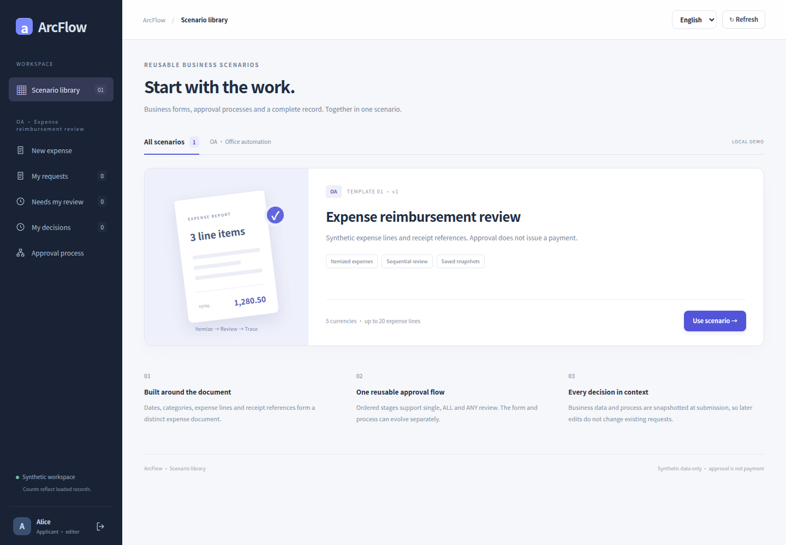
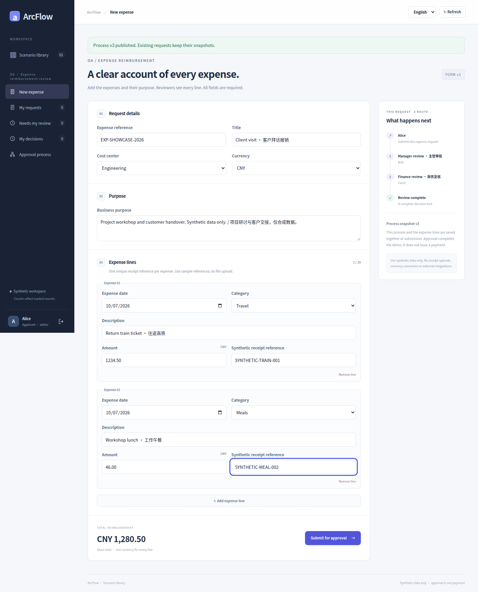
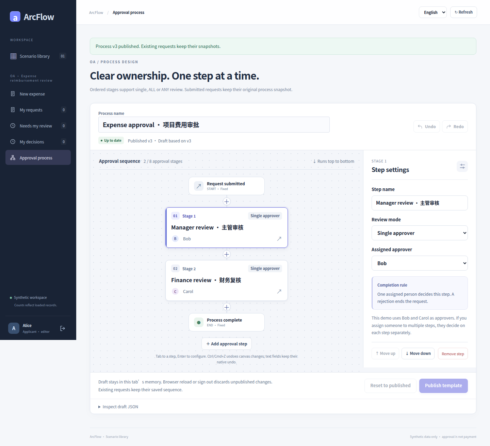
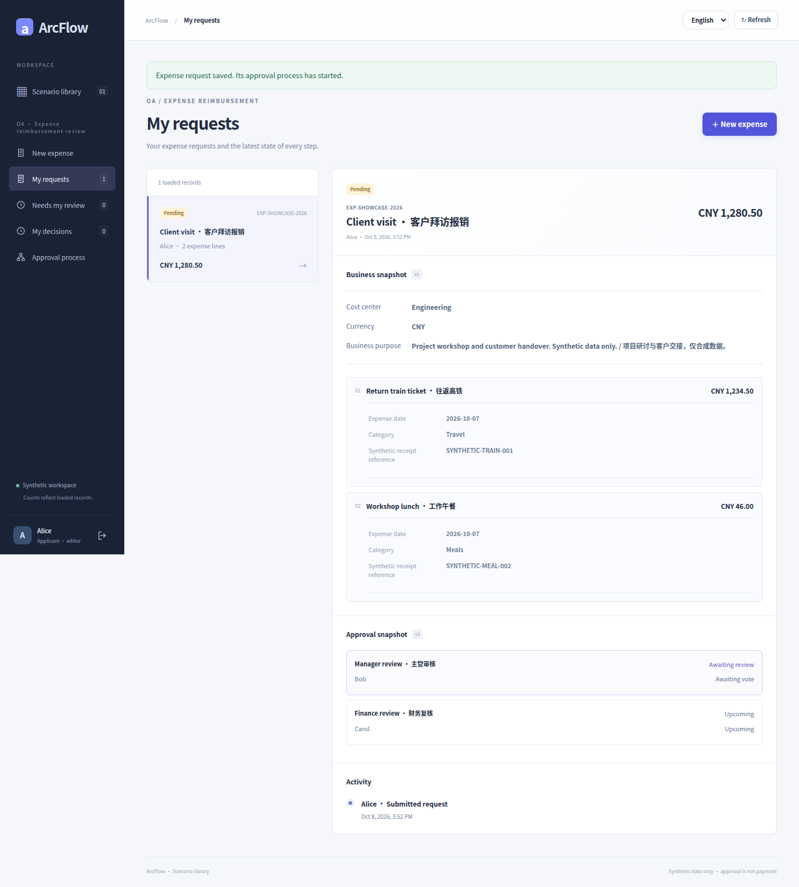
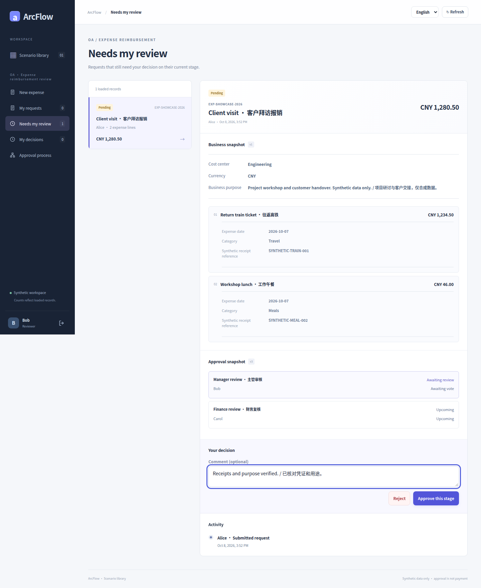
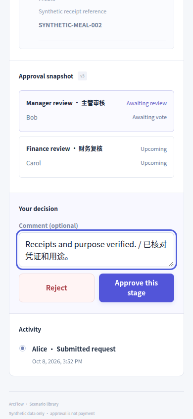
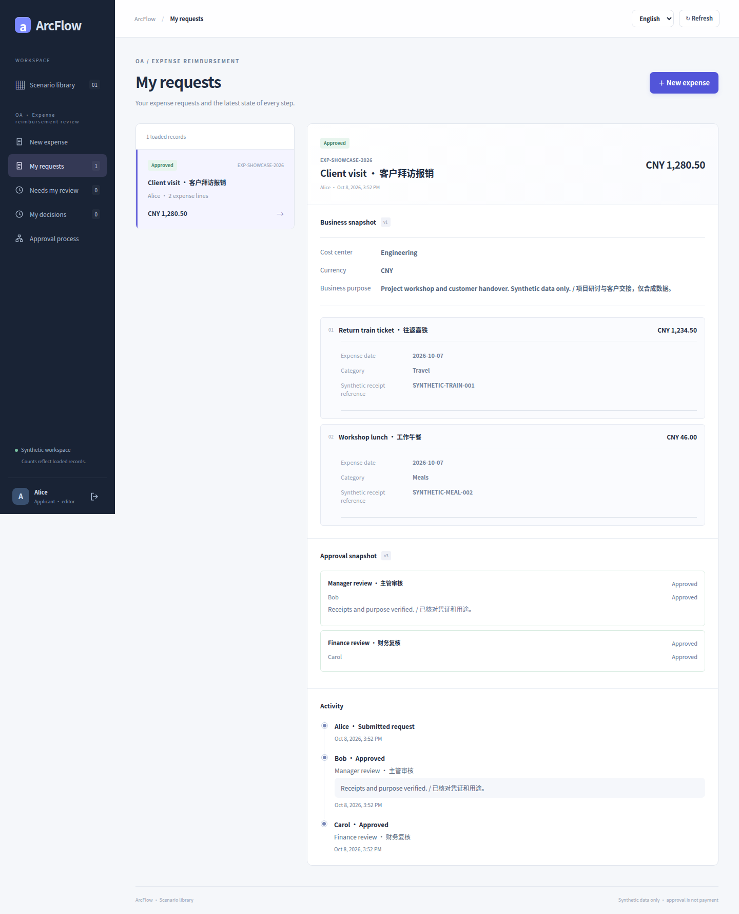
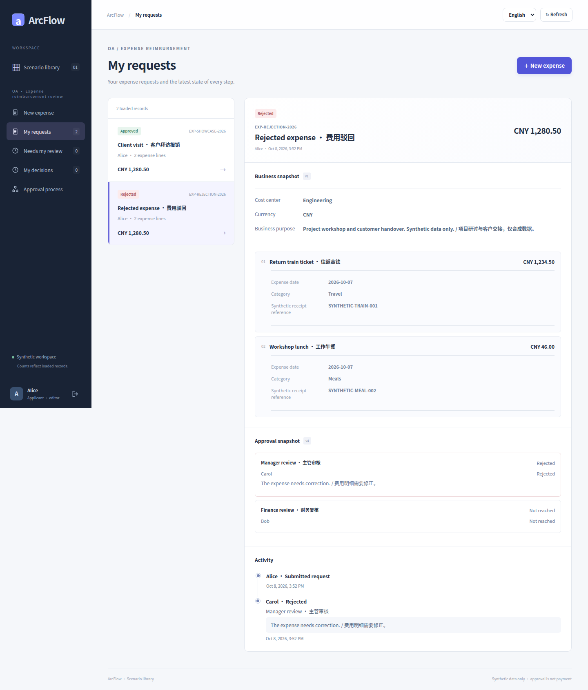

# Expense reimbursement

<!-- Legacy fragments remain entry points after the language split. -->
<a id="390px-窄屏审批--narrow-screen-review"></a>
<a id="fields-and-rules--字段与规则"></a>
<a id="gallery--全流程实拍"></a>
<a id="oa-费用报销--expense-scenario"></a>
<a id="retry-and-storage--重试与存储"></a>
<a id="start--启动"></a>
<a id="场景入口--scenario-catalog"></a>
<a id="填写费用--itemized-expense-form"></a>
<a id="审批通过--approved-request"></a>
<a id="审批驳回--rejected-request"></a>
<a id="当前审批--current-reviewer"></a>
<a id="流程设计器--workflow-designer"></a>
<a id="申请已提交--submitted-awaiting-review"></a>

<a id="zh"></a>
<a id="en"></a>
<a id="简体中文"></a>
<a id="english"></a>

[简体中文](EXPENSE_SCENARIO.md) · [Documentation](README.en.md)

This first dedicated catalog template has itemized expenses, immutable business snapshots, and visual fixed-reviewer workflows. All data is synthetic. Receipt references are text; approval does not pay, upload receipts, verify invoices, or write to accounting systems.

This bounded example is not a complete reimbursement system. Widgets and sections come from compiled, versioned `ScenarioCatalog` metadata; the server validates explicit `BusinessDocument.Expense` records. Arbitrary drag-and-drop fields, scripts, and formulas are unsupported. [Visual walkthrough](#gallery)

<!-- topic:start -->
## Start

Run `python3 scripts/tryout.py` from the repository root. After READY, open its printed
`/scenarios.html` URL. Use the disposable Alice/Bob/Carol passwords from the private credentials
file; never put passwords in screenshots, URLs or source. This page signs in separately and
keeps credentials only in memory. The manual [startup instructions](GETTING_STARTED.en.md) also apply.
Static builds must retain `dist/scenarios.html` and its generated assets.

<!-- topic:fields-and-rules -->
## Fields and rules

- businessId/title/reason, costCenter (ENGINEERING/SALES/OPERATIONS), currency and 1–20 expense lines.
- Each line: stable lineId, spentOn, category (TRAVEL/MEALS/OFFICE/OTHER), description, amount, receiptRef.
- lineId and receiptRef are each unique within a claim. They do not provide cross-claim invoice verification.
- References use 1–128 ASCII characters, begin with a letter/digit, and otherwise allow letters/digits plus `._:/-`.
- Title ≤120, reason ≤2000, description ≤240 characters. Text must remain nonblank after normalization.
- Dates must be real YYYY-MM-DD dates in years 0001–9999. No company calendar, tax or expense-period policy is inferred.
- Every amount is positive and ≤1,000,000,000 with at most 2 decimal places. JPY must be whole.
  CNY/USD/EUR/GBP/JPY are supported; no exchange-rate conversion occurs.
- Java BigDecimal and browser decimal text/BigInt preserve exact amounts. Total is derived, never submitted:
  0.10 + 0.20 = 0.30. Receipt references are synthetic text, not file uploads.

By default Bob reviews expenses and Carol checks finance. Alice can publish 1–8 fixed stages with SINGLE/ALL/ANY; names are not dynamic organizational roles. The current form structure is fixed, while the designer edits the approval flow. Submitted requests retain their business data, definition, and version. APPROVED/REJECTED are review states and never trigger payment.

The dedicated standalone page is separate from shared leave/procurement lists, native RuoYi and
the H5 application. It does not introduce a cross-scenario inbox or external business connector.

<!-- topic:http-and-authorization -->
## HTTP and authorization

- GET `/api/scenarios`: form metadata.
- GET/POST `/api/scenarios/oa-expense/process`: read/publish process; publication body is `{expectedVersion,definition}`.
- GET `/api/scenarios/oa-expense/requests`: caller-visible requests.
- POST `/api/scenarios/oa-expense/documents`: `{business,processVersion}` and exactly one `Idempotency-Key`.
- POST `/api/scenarios/oa-expense/requests/{id}/decisions`: `{stepId,decision,comment}`.

Business has `type:"expense"`, `documentVersion:1`, and all fields above. Amounts are JSON numbers,
not strings. Response is `{request,total}`; total is an exact display string fixed to 2 decimals,
except whole JPY. Compatibility request.days is 0; consumers must inspect business.type.

Identity comes from the authenticated principal. Existing Origin/client-header and domain
publication/participant permissions apply. Unknown fields, duplicate keys, malformed decimal
values, client-supplied identity/process/status/derived totals fail closed. Generic standalone
`/api/documents` and native `/arcflow/documents` explicitly allow only leave/procurement.

<!-- topic:retry-and-storage -->
## Retry and storage

Same caller/key and normalized intent replay the current durable request, including terminal
state or after restart. Changing any header/line or original process version with the same key
returns 409. New key means new intent; businessId alone is not a uniqueness constraint. JDBC key
scope remains global `(applicant_id,submission_key)` across processes.

The host uses process `oa-expense` and `approval.data-file + ".scenario-oa-expense.json"`.
A compiled registry maps ids to runtimes; untrusted paths never select filenames.

- JSON schemas 1–6 remain readable without rewriting. First Expense write uses schema 7.
- Expense inside schema 5/6 is rejected. Schema7 never downgrades after later legacy writes.
- Preserve exact bytes immediately before upgrade. Failed atomic replacement publishes neither
  request nor retry binding; retry preserves the pre-upgrade backup.
- JDBC stays SQL revision 3: typed values use request_json and existing member projections.
  Existing stopped-writer revision 3/backfill requirements still apply; no new DDL is introduced.
- Upgrade all readers and stop incompatible writers before Expense writes. Schema 6 readers do
  not understand Expense/schema 7. See the [migration guide](development/PERSISTENCE.en.md) for higher current versions. Backups are historical recovery, not a lossless downgrade.

<!-- topic:verification -->
## Verification

```sh
mvn install
mvn -f examples/approval-domain/pom.xml install
mvn -f examples/approval-demo/backend/pom.xml verify
mvn -f examples/approval-jdbc/pom.xml test
python3 examples/scenarios/http_smoke.py --jar examples/approval-demo/backend/target/approval-demo-0.1.0-SNAPSHOT.jar
cd examples/approval-ui
npm ci
npm test
npm run build
npm run test:e2e -- e2e/scenarios.spec.mjs
```

Missing PostgreSQL/MySQL settings mean skipped tests, not server verification. Unit/MVC passes
are not browser evidence. Check exact-candidate reports. Capture designer/form/pending/approved/
rejected images only from authenticated real UI and a disposable real backend, in both languages;
no mock success, altered DOM, image generation or retouching. Preserve per-image commit/run/hash provenance.


<a id="gallery"></a>

<!-- topic:visual-walkthrough -->
## Visual walkthrough

The 16 original Chinese/English captures use isolated demo accounts, a real browser/backend, and synthetic data without edits. This page shows eight English images; the Chinese page shows their counterparts.

Capture commit: `90007fc8d0499b45ca38a04d010029888ab5cbef`. [Passing browser run](https://github.com/JamesCube/ArcFlow/actions/runs/37803754153) · [Per-image provenance and SHA-256](images/expense/provenance.json).

Each language pair shows the same saved state; approved/rejected requests are separate branches. Workflow v3/v4, form v1, and storage 7 are independent versions. The scrolled 390px reviewer controls are not native-app or physical-phone certification. Approval does not pay.

### Scenario catalog



### Itemized expense form



### Workflow designer



### Submitted, awaiting review



### Current reviewer



### Narrow-screen review



### Approved request



### Rejected request


