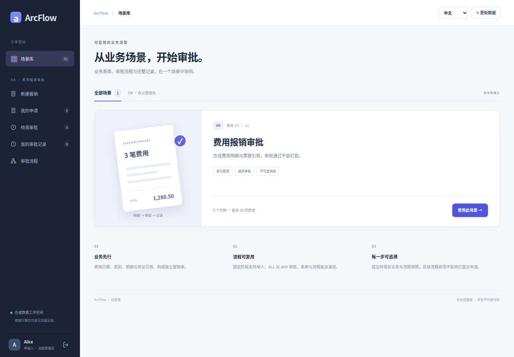
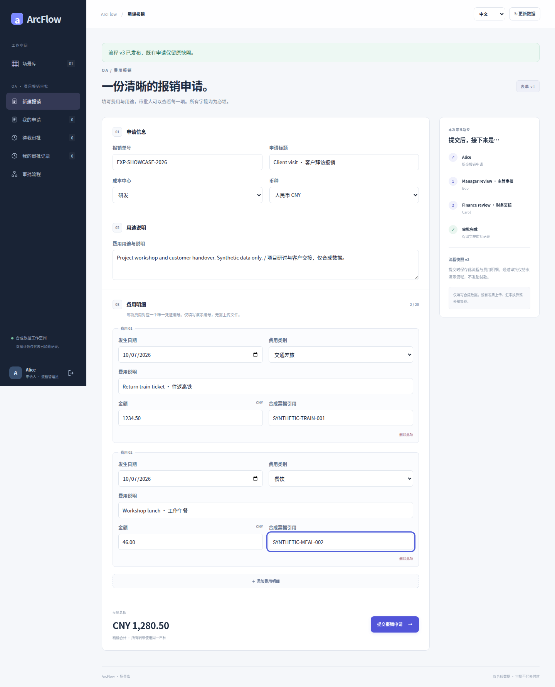
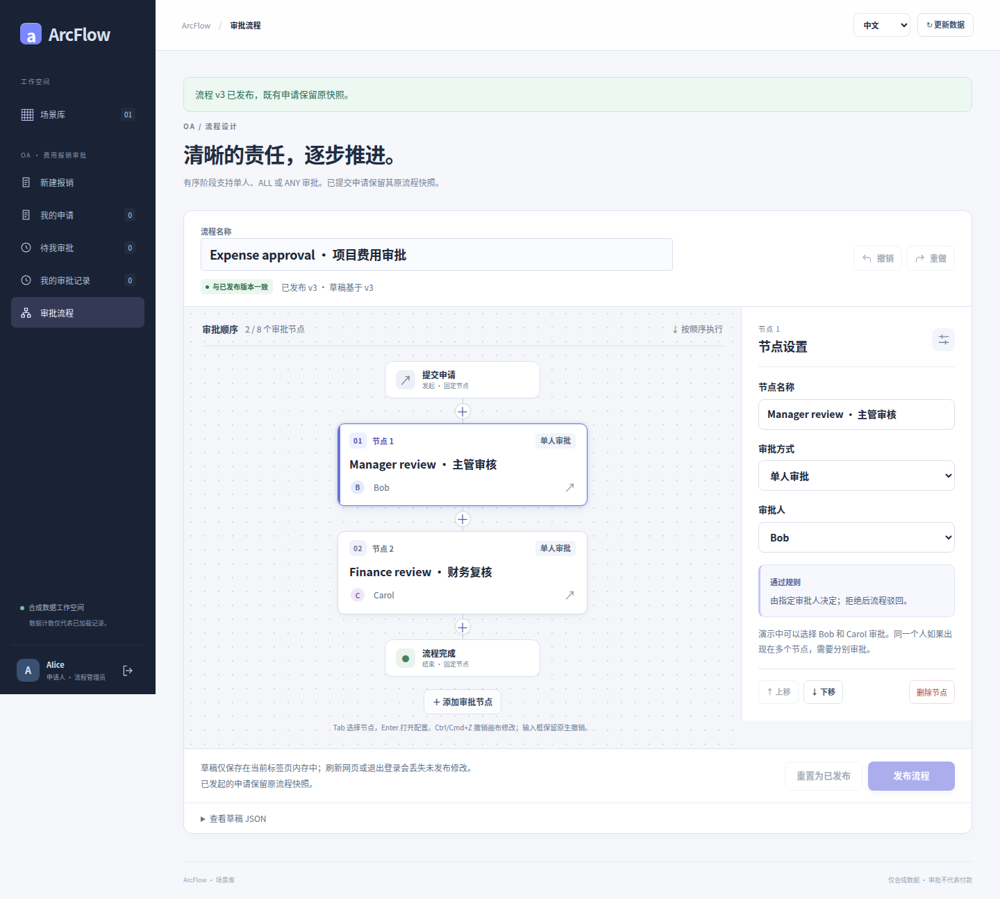
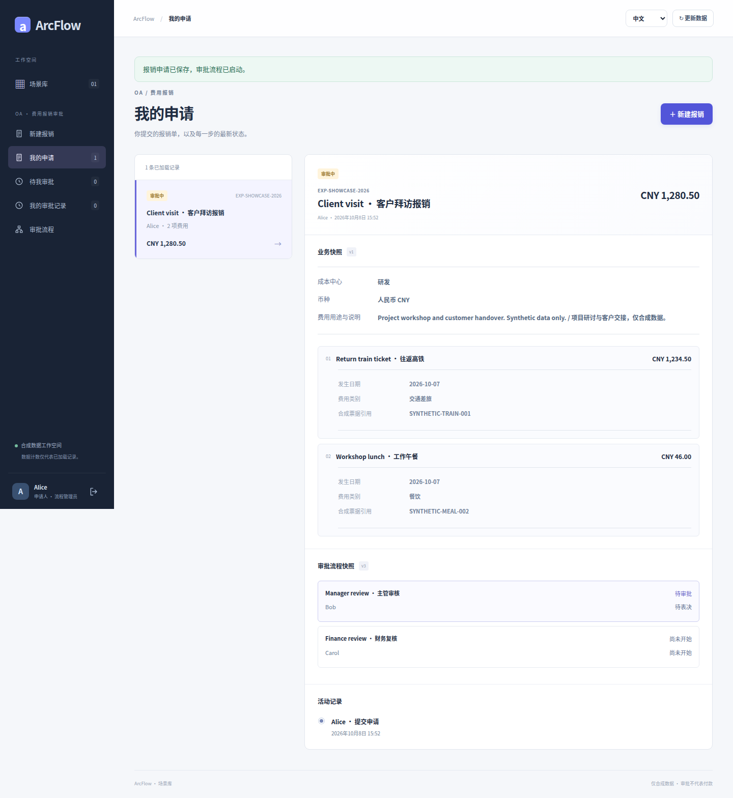
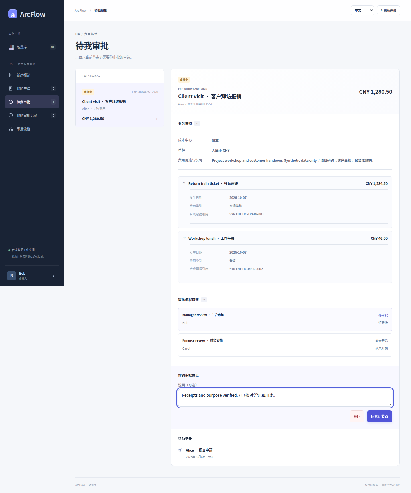
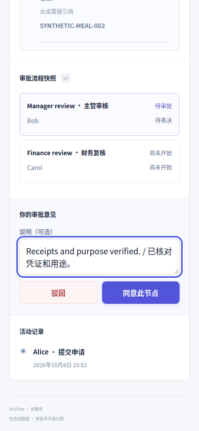
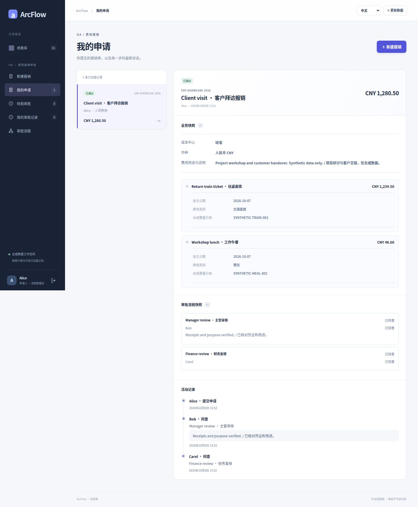
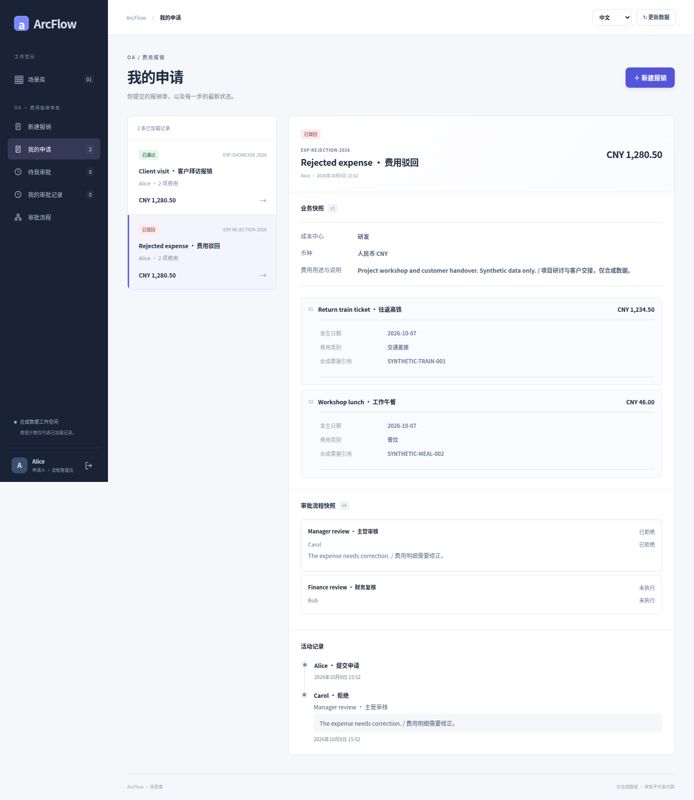

# 费用报销

<!-- Legacy fragments remain entry points after the language split. -->
<a id="390px-窄屏审批--narrow-screen-review"></a>
<a id="fields-and-rules--字段与规则"></a>
<a id="gallery--全流程实拍"></a>
<a id="http-and-authorization"></a>
<a id="oa-费用报销--expense-scenario"></a>
<a id="retry-and-storage--重试与存储"></a>
<a id="start--启动"></a>
<a id="verification"></a>
<a id="场景入口--scenario-catalog"></a>
<a id="填写费用--itemized-expense-form"></a>
<a id="审批通过--approved-request"></a>
<a id="审批驳回--rejected-request"></a>
<a id="当前审批--current-reviewer"></a>
<a id="流程设计器--workflow-designer"></a>
<a id="申请已提交--submitted-awaiting-review"></a>

<a id="zh"></a>
<a id="en"></a>
<a id="简体中文"></a>
<a id="english"></a>

[English](EXPENSE_SCENARIO.en.md) · [文档目录](README.md)

独立场景模板提供真实结构的费用明细、不可变业务快照与可视化固定审批。全部为合成数据，票据只是文字引用；通过不打款、上传票据、核验发票或写入财务系统。

这是有明确边界的演示，不是完整报销系统。表单分区/控件来自编译期版本化 `ScenarioCatalog`，服务端校验显式 `BusinessDocument.Expense`；不支持任意拖拽字段、脚本或公式执行。[完整实拍](#gallery)

<!-- topic:start -->
## 启动

仓库根目录运行 `python3 scripts/tryout.py`，READY 后打开打印的 `/scenarios.html`。从私有凭据文件读取一次性 Alice/Bob/Carol 密码，不放入截图、URL 或源码。本页独立登录，凭据只存内存，也可按[手动启动](GETTING_STARTED.md)。静态部署须保留 `dist/scenarios.html` 及生成资源。

<!-- topic:fields-and-rules -->
## 字段与规则

- businessId/title/reason、成本中心 ENGINEERING/SALES/OPERATIONS、币种及 1–20 条费用。
- 每行：稳定 lineId、spentOn、类别 TRAVEL/MEALS/OFFICE/OTHER、description、amount、receiptRef。
- lineId 和 receiptRef 各自在本单唯一，不提供跨单发票验证。
- 引用 1–128 ASCII 字符，字母/数字开头，余下允许字母/数字及 `._:/-`。
- 标题 ≤120、原因 ≤2000、描述 ≤240 字符，规范化后非空。
- 日期为年份 0001–9999 的真实 YYYY-MM-DD，不推断企业日历、税务或费用期间政策。
- 金额为正、≤1,000,000,000、最多两位小数，JPY 整数；支持 CNY/USD/EUR/GBP/JPY，不换汇。
- Java BigDecimal 和浏览器十进制文本/BigInt 保持精度，总额派生而非提交：0.10+0.20=0.30。票据引用不是上传。

默认 Bob 费用审核、Carol 财务复核。Alice 可发布 1–8 个固定 SINGLE/ALL/ANY 阶段，人名/步骤名不是动态角色。表单结构固定，设计器编辑流程；申请保留原业务/定义/版本，APPROVED/REJECTED 不触发付款。

专用独立页面与共享请假/采购、若依、H5 分离，不增加跨场景待办或外部连接器。

<!-- topic:http-and-authorization -->
## HTTP 与授权

- GET `/api/scenarios`：表单元数据。
- GET/POST `/api/scenarios/oa-expense/process`：读取/发布，发布为 `{expectedVersion,definition}`。
- GET `/api/scenarios/oa-expense/requests`：调用者可见申请。
- POST `/api/scenarios/oa-expense/documents`：`{business,processVersion}` 及恰好一个 `Idempotency-Key`。
- POST `/api/scenarios/oa-expense/requests/{id}/decisions`：`{stepId,decision,comment}`。

业务含 `type:"expense"`、`documentVersion:1` 及上述全部字段。金额为 JSON 数字，不是字符串。响应 `{request,total}` 中总额是精确显示字符串，除 JPY 整数外固定两位；兼容 `request.days` 为 0，须按 business.type 分支。

身份来自认证 Principal，沿用 Origin/客户端头、发布/参与人权限。未知字段、重复键、非法小数、客户端身份/流程/状态/派生总额全部拒绝；通用 `/api/documents` 和若依 `/arcflow/documents` 只允许请假/采购。

<!-- topic:retry-and-storage -->
## 重试与存储

同调用者/键/规范化意图返回当前持久申请，包括终态与重启后；同键改头字段、明细或原流程版本则 409。新键即新意图，businessId 不是唯一约束。JDBC 仍跨流程使用全局 `(applicant_id,submission_key)`。

宿主流程 `oa-expense`，文件 `approval.data-file + ".scenario-oa-expense.json"`；编译期注册表映射运行时，不可信路径不能选文件。

- JSON 1–6 保持严格只读兼容，首次报销最低 7。
- 报销在 5/6 拒绝，升到 7 后旧接口不降级。
- 升级保存紧邻之前原始字节，原子替换失败不发布申请/键，重试保留备份。
- JDBC 保持 SQL revision 3，沿用 request_json 与成员投影；原停写迁移/回填要求不变，不增加 DDL。
- 先升级全部 reader 并停不兼容 writer，schema 6 reader 不懂报销/7；备份是历史恢复而非无损降级。当前更高版本见[迁移指南](development/PERSISTENCE.md)。

<!-- topic:verification -->
## 验证

```sh
mvn install
mvn -f examples/approval-domain/pom.xml install
mvn -f examples/approval-demo/backend/pom.xml verify
mvn -f examples/approval-jdbc/pom.xml test
python3 examples/scenarios/http_smoke.py --jar examples/approval-demo/backend/target/approval-demo-0.1.0-SNAPSHOT.jar
cd examples/approval-ui
npm ci
npm test
npm run build
npm run test:e2e -- e2e/scenarios.spec.mjs
```

没配 PostgreSQL/MySQL 是跳过，不是服务器验收；单元/MVC 不是浏览器证据。核对精确候选报告，仅以认证真实 UI 和一次性真实后端采集中英设计器/表单/待审/通过/拒绝，不模拟成功、修改 DOM、生成或修图。每图保留提交/运行/hash。

<a id="gallery"></a>

<!-- topic:visual-walkthrough -->
## 全流程实拍

16 张中英原图来自隔离演示账号与真实浏览器/后端，全部合成数据且未修改；本页展示其中八张中文图，英文页面展示对应八张。

采集提交 `90007fc8d0499b45ca38a04d010029888ab5cbef`：[通过的浏览器运行](https://github.com/JamesCube/ArcFlow/actions/runs/37803754153) · [逐图来源及 SHA-256](images/expense/provenance.json)。

两种语言展示相同保存状态，通过与驳回是独立分支。流程 v3/v4、表单 v1、存储 7 是不同版本；390px 图为滚动后的审批控件，不证明原生应用或真机。通过不付款。

### 场景入口



### 填写费用



### 流程设计器



### 申请已提交



### 当前审批



### 390px 窄屏审批



### 审批通过



### 审批驳回


