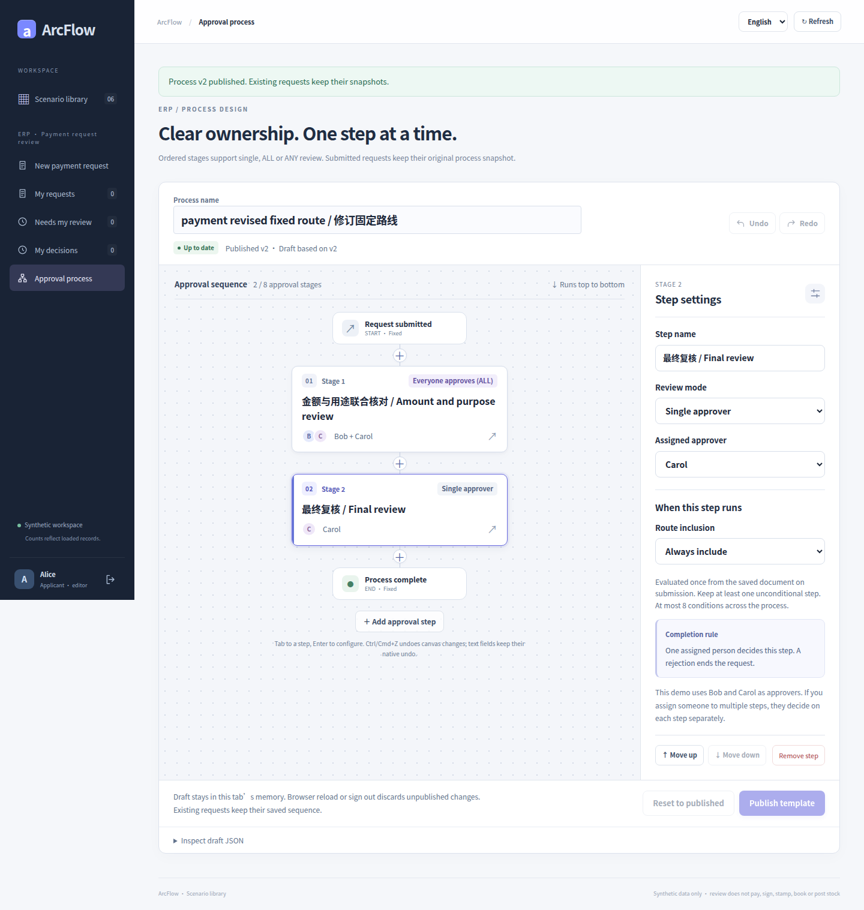
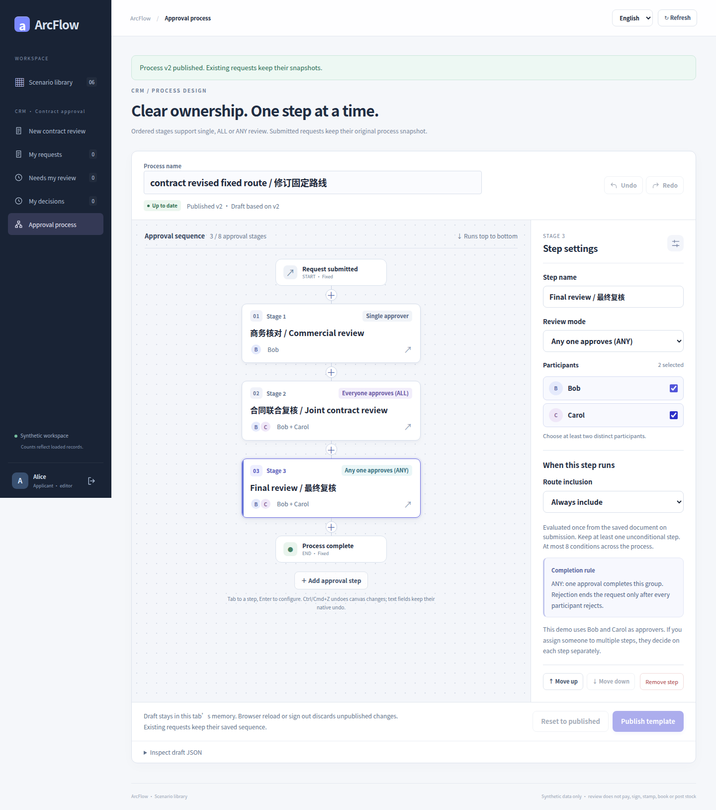

# Five approval cases · real UI galleries

[简体中文](README.md) · [English](README.en.md) · [Project README](../../README.en.md) · [Designer overview](../DESIGNER_GALLERY.en.md)

Start with process configuration, then inspect complete forms, validation, snapshots, individual decisions and approval/rejection. Each case has independently readable Chinese and English pages; payment, contract and receiving also include conditional routing.

<!-- topic:travel -->
## [OA travel](travel.en.md)

A synthetic Shanghai delivery trip runs from 2026-10-19 to 2026-10-21: 3 calendar days and CNY 2,480.50. Start with the two-stage designer, then follow Alice’s request, Bob’s trip review, Carol’s budget review, and a separate rejected request.

<!-- topic:seal-use -->
## [OA seal use](seal-use.en.md)

Synthetic delivery documents illustrate a non-monetary approval: document reference, seal category, purpose and copy count, followed by document review and seal-use review. Approval and rejection belong to separate requests.

<!-- topic:receiving -->
## [ERP receiving](receiving.en.md)

Two synthetic receipt lines contain 80 PCS and 10 BOX, with accepted and rejected quantities. Configure ALL/ANY, then inspect the old ALL snapshot, partial votes, procurement review and early advancement of a new ANY request. Different units are totaled separately.

<!-- topic:payment -->
## [ERP payment requests](payment.en.md)

Invoice allocations, declared settled amounts, deductions and the net request amount demonstrate exact-money validation. Inspect ALL voting, a partial ANY rejection, original snapshots after publication, and routes frozen from the net amount.

<!-- topic:contract -->
## [CRM contracts](contract.en.md)

Terms, dates, payment milestones and acceptance criteria form the synthetic contract. Inspect multi-stage and multi-member review, amount/date validation, saved process snapshots and additional review selected by standard/nonstandard terms.

<!-- topic:evidence-and-reading-notes -->
## Evidence and reading notes

- 104 original PNGs: travel 20, seal use 18, receiving 15, payment 20, contract 20, plus 11 conditional-routing images. This counts files, not 104 business scenarios; locale and viewport variants are not additional scenarios.
- All were captured at historical commit [`8c26d95`](https://github.com/JamesCube/ArcFlow/commit/8c26d953e53991d3e445aa69c530726f1d81daae) in [successful run 37918452685](https://github.com/JamesCube/ArcFlow/actions/runs/37918452685), not recaptured from current main. Relevant application source matches baseline `199db754`, as recorded in provenance.
- Original bytes only: no cropping, retouching or generated UI. Receiving/routing states lack some Chinese/English pairs; each image labels its actual language. A 390px full-page image is not a single phone screen.
- All business data is synthetic. Approval does not mean a transfer, stamping, signing, stock posting or real ERP/CRM integration. Screenshots do not prove authorization, idempotency, database correctness or production readiness.

[Per-image provenance](../images/scenarios/provenance.json) · [Reproduction and checks](CAPTURE.en.md)

Two catalog-image pairs are byte-identical originals from the separate travel and seal-use captures: 104 files contain 102 unique PNG byte sequences. They show the same shared six-card catalog, not additional states.
