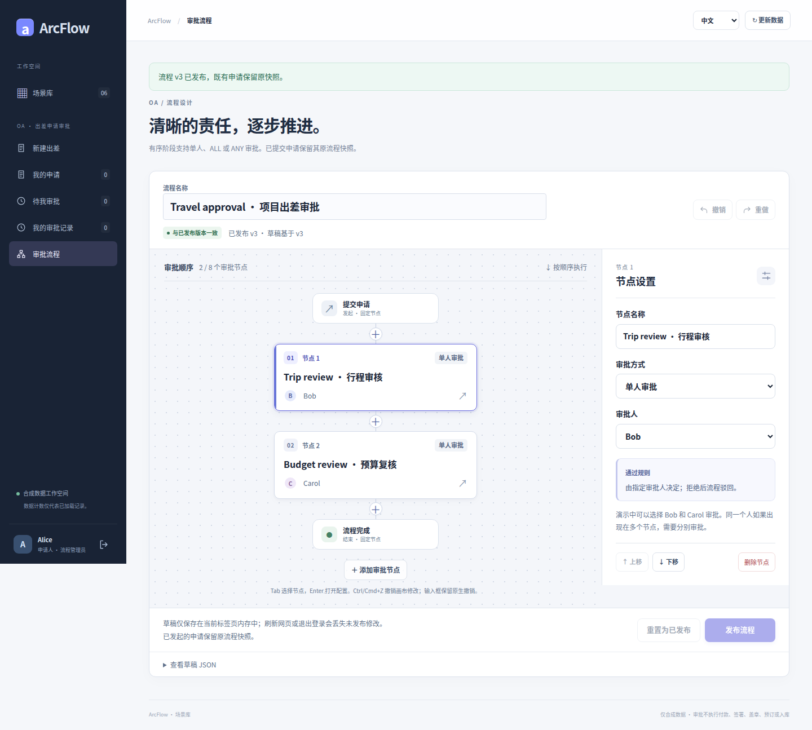

# 五类审批案例 · 真实界面图集

[简体中文](README.md) · [English](README.en.md) · [项目首页](../../README.md) · [流程设计器总览](../DESIGNER_GALLERY.md)

从流程配置看起，再看完整表单、校验、快照、逐人审批和通过／驳回。五类案例提供独立中文、英文说明，付款、合同与收货还展示条件路由。

<!-- topic:travel -->
## [OA 出差](travel.md)

上海项目交付出差：2026-10-19 至 2026-10-21，共 3 天，预算 CNY 2,480.50。先看两级流程配置，再跟随 Alice 提交、Bob 行程审核、Carol 预算复核，以及另一笔驳回分支。

<!-- topic:seal-use -->
## [OA 用印](seal-use.md)

以合成交付文件展示非金额审批：文件引用、印章类别、用途与份数，依次经过文件审核和用印复核。通过与驳回来自不同申请。

<!-- topic:receiving -->
## [ERP 收货](receiving.md)

两行合成收货单覆盖 80 PCS 与 10 BOX，记录验收与拒收数量。先配置 ALL／ANY，再看旧申请保留 ALL、部分投票、采购复核及新 ANY 申请提前推进。不同单位分别汇总。

<!-- topic:payment -->
## [ERP 付款申请](payment.md)

付款申请以发票分摊、申报已结算额、扣减和净申请金额展示精确金额校验。重点看 ALL 会签、ANY 部分拒绝、版本发布后旧单不变，以及按净金额冻结的条件路径。

<!-- topic:contract -->
## [CRM 合同](contract.md)

合同案例包含商务条款、日期、付款里程碑与验收条件。重点看多级与多人复核、金额／日期校验、历史流程快照，以及按标准／非标条款决定的附加复核。

<!-- topic:evidence-and-reading-notes -->
## 图片来源与阅读提醒

- 104 张原始 PNG：出差 20、用印 18、收货 15、付款 20、合同 20，另有 11 张条件路由补充图。这是文件数，不是 104 种业务场景；中英文及视口变体不重复计作场景。
- 全部采自历史提交 [`8c26d95`](https://github.com/JamesCube/ArcFlow/commit/8c26d953e53991d3e445aa69c530726f1d81daae) 的[成功运行 37918452685](https://github.com/JamesCube/ArcFlow/actions/runs/37918452685)；不是当前 main 重拍。相关应用源码与基线 `199db754` 相同，详情见来源清单。
- 原图原字节，无裁剪、修图或生成 UI。收货与路由图不是每个状态都有中英文配对，逐图标注真实语言。390px 长页不等于单屏手机效果。
- 所有业务为合成演示；审批通过不代表转账、盖章、签约、库存入账或真实 ERP／CRM 接通。截图不证明权限、幂等、数据库或生产就绪。

[逐图来源](../images/scenarios/provenance.json) · [复现与检查](CAPTURE.md)

出差与用印各自采集的目录原图有两组同字节副本：104 个文件包含 102 个唯一 PNG。它们展示同一个六卡场景目录，不增加业务状态。
