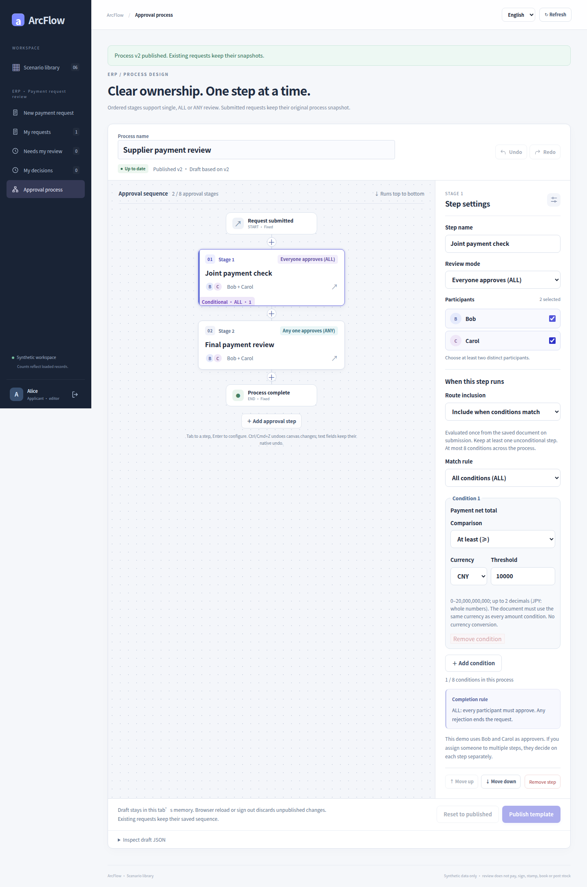
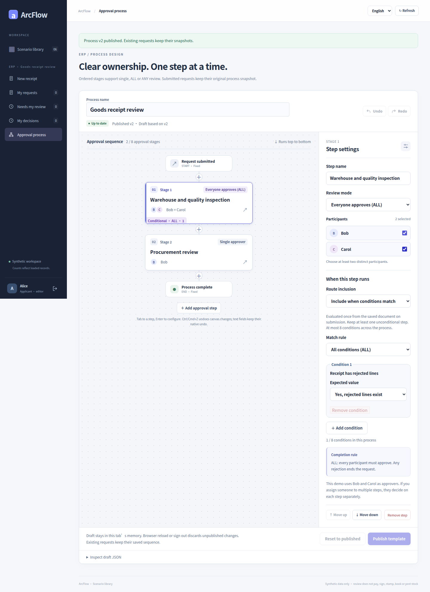

# Conditional routing · complete historical gallery

[简体中文](README.md) · [English](README.en.md) · [Gallery](README.en.md) · [Five case galleries](../README.en.md)

Follow the designer, individual decisions and saved terminal states. The three story pages link every one of the 80 original PNGs: 20 capture states across three scenarios, each with Chinese/English and desktop/390px variants. The file count is not a count of business scenarios.

<!-- topic:payment -->
## [Payment: amount conditions and individual decisions](payment.en.md)

One published process keeps different routes according to the net requested amount. CNY 6,500 skips finance and procurement joint review. CNY 10,000 meets the greater-than-or-equal threshold, so ALL must finish before the final ANY review.

7 capture states · 28 PNG · [All states and request IDs](payment.en.md#every-original-by-state)

<!-- topic:receiving -->
## [Receiving: exceptions, joint review and a separate rejection](receiving.en.md)

A receipt without rejected lines goes directly to procurement review. Rejected goods add warehouse and quality ALL review first. A separate request shows how one rejection terminates an ALL stage.

8 capture states · 32 PNG · [All states and request IDs](receiving.en.md#every-original-by-state)

<!-- topic:contract -->
## [Contract: different routes for standard and nonstandard terms](contract.en.md)

Commercial review always runs. NONSTANDARD terms add commercial and legal ALL review; STANDARD terms skip it. ANY condition matching and ALL approval voting are separate settings, and this example has one predicate.

5 capture states · 20 PNG · [All states and request IDs](contract.en.md#every-original-by-state)

<!-- topic:source-and-limits -->
## Source and limits

All images come from historical commit [`cb3f1077`](https://github.com/JamesCube/ArcFlow/commit/cb3f1077fc725e0031620b1210a819917d8684a4) / [run 38016643460](https://github.com/JamesCube/ArcFlow/actions/runs/38016643460). They were not recaptured on current main. Original PNGs, 80 sidecars, six journey receipts and one runtime report retain their bytes and hashes.

The captured application source matches baseline `10e092fa`. The broader UI tree hash changed only through documentation; the exact comparison is recorded. Approval does not transfer funds, sign contracts or post inventory. Conditions apply only to payment, receiving and contract. Different request IDs and language runs stay separate.

[Provenance](../../images/conditional-routing/cb3f1077/provenance.json) · [Capture, source comparison and checks](CAPTURE.en.md) · [Earlier 104-image gallery](../README.en.md) · [Documentation](../../README.en.md)
