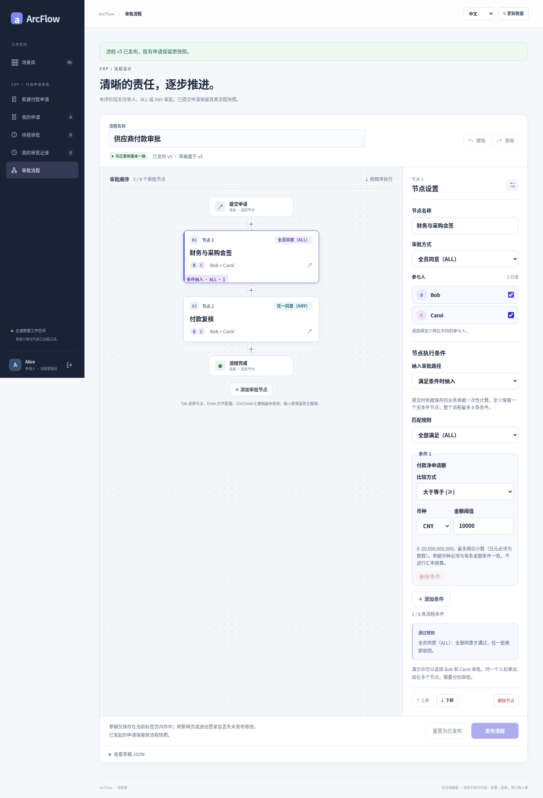
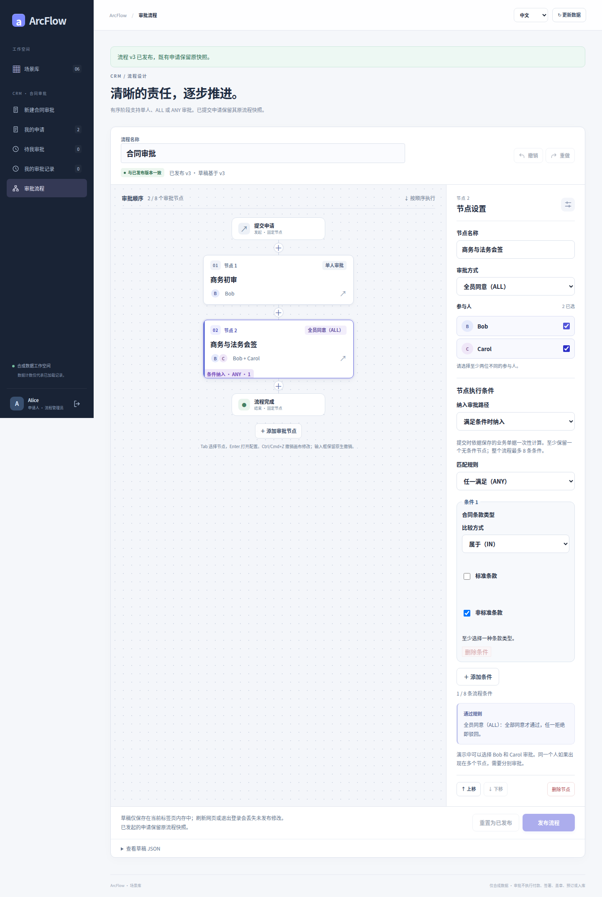

# 条件路由 · 完整历史图集

[简体中文](README.md) · [English](README.en.md) · [图集入口](README.md) · [五类案例图集](../README.md)

从设计器到逐人审批，再到保存的终态。下面的三个故事页可打开全部 80 张原始 PNG：3 类场景、20 个采集状态，每个都有中英文与桌面／390px 版本。图片数不是业务场景数。

<!-- topic:payment -->
## [付款：金额条件与逐人审批](payment.md)

同一条已发布流程，根据净申请金额保留不同路径。CNY 6,500 跳过财务与采购会签；CNY 10,000 恰好命中“大于等于”阈值，必须先完成 ALL，再进入最终 ANY。

7 个采集状态 · 28 PNG · [全部状态与申请 ID](payment.md#按状态打开全部原图)

<!-- topic:receiving -->
## [收货：异常条件、会签与独立驳回](receiving.md)

无拒收行时直接采购复核。有拒收行时先进入仓库与质量 ALL，完成后才到采购复核。另用一笔申请展示 ALL 一票拒绝后的终止。

8 个采集状态 · 32 PNG · [全部状态与申请 ID](receiving.md#按状态打开全部原图)

<!-- topic:contract -->
## [合同：标准与非标条款的不同路径](contract.md)

商务初审始终执行。条款类型为 NONSTANDARD 时再纳入商务与法务 ALL 会签；STANDARD 不进入这一步。条件匹配 ANY 与会签 ALL 是两件事，本例只有一个条件项。

5 个采集状态 · 20 PNG · [全部状态与申请 ID](contract.md#按状态打开全部原图)

<!-- topic:source-and-limits -->
## 来源与边界

所有图片来自历史提交 [`cb3f1077`](https://github.com/JamesCube/ArcFlow/commit/cb3f1077fc725e0031620b1210a819917d8684a4) / [run 38016643460](https://github.com/JamesCube/ArcFlow/actions/runs/38016643460)，不是当前 main 重拍。原 PNG、80 份 sidecar、6 份旅程回执和 1 份运行时报告均保留原字节与摘要。

采集涉及的应用源码同基线 `10e092fa` 一致；整个 UI 目录摘要因文档而变化，精确对照已登记。通过不执行付款、签约或库存写回。条件仅适用于付款、收货、合同。不同 requestId 和不同语言运行的申请分开阅读。

[逐图来源](../../images/conditional-routing/cb3f1077/provenance.json) · [采集、源码对照与核验](CAPTURE.md) · [较早的 104 图集](../README.md) · [文档目录](../../README.md)
