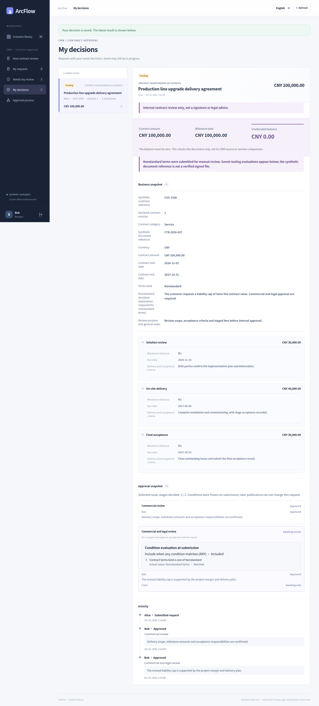
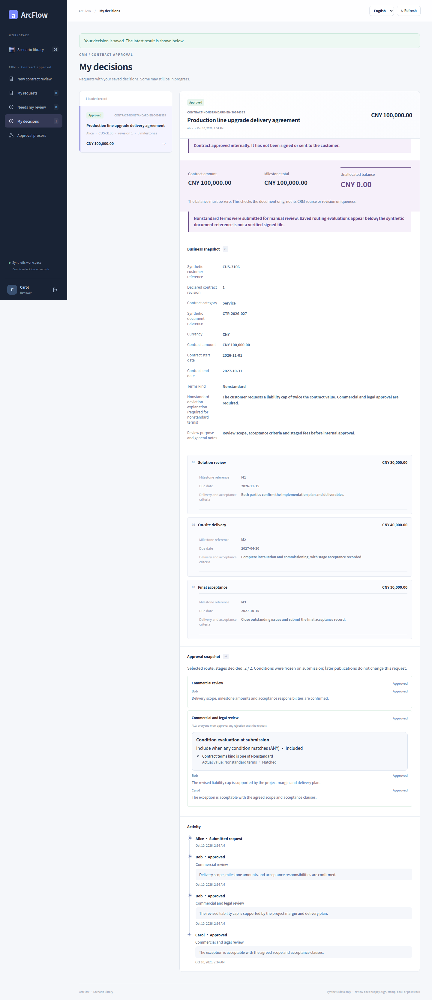

# Contract: different routes for standard and nonstandard terms

[简体中文](contract.md) · [English](contract.en.md) · [Gallery](README.en.md) · [Five case galleries](../README.en.md)

Commercial review always runs. NONSTANDARD terms add commercial and legal ALL review; STANDARD terms skip it. ANY condition matching and ALL approval voting are separate settings, and this example has one predicate.

<!-- topic:scope-and-capture -->
## Scope and capture

These are historical captures from [`cb3f1077`](https://github.com/JamesCube/ArcFlow/commit/cb3f1077fc725e0031620b1210a819917d8684a4) / [run 38016643460](https://github.com/JamesCube/ArcFlow/actions/runs/38016643460). They were not recaptured on current main. The captured application and fixture source matches baseline main `10e092fa`; the broader UI directory hash differs because documentation changed. [Exact comparison and limits](CAPTURE.en.md).

Only payment, receiving and contract support these restricted conditions. Synthetic data only: approval never transfers funds, signs a contract or posts inventory. Each language ran separate requests. The 390×844 browser viewport produces tall full-page PNGs; this is not native H5 or physical-phone acceptance.

<!-- topic:designer-partial-and-final-preview -->
## Designer, partial decisions and terminal states

| Designer: terms type IN NONSTANDARD | Partial joint approval: wait for Carol | Nonstandard: joint review complete and approved |
| --- | --- | --- |
|  |  |  |

Previews scale the full originals without cropping. Open an image for detail, or use the complete state index below.

<!-- topic:request-identities -->
## Keep requests separate

Labels below group continuous states within one language only. Chinese and English IDs are different requests. The designer has no request ID.

| Label / request | Chinese requestId | English requestId |
| --- | --- | --- |
| C1 · Nonstandard-terms request | `4048a98f-6b47-4ebb-bd40-2641091ecd1f` | `9c86f488-09a2-4277-ae2e-1eb18ba13763` |
| C2 · Standard-terms request | `830ac8ee-966d-415c-a74d-c44b78c1bafa` | `9db85cf6-b8ac-4f6e-8a54-0c9b5fd35c82` |

<!-- topic:complete-state-index -->
## Every original, by state

Each state has four originals: Chinese/English × desktop/390px. Desktop viewport: 1440×1000; narrow viewport: 390×844. Dimensions below are actual full-page PNG dimensions.

### 1. Designer: terms type IN NONSTANDARD

Set condition matching to ANY and select nonstandard terms. The stage still requires ALL approval from Bob and Carol.

`contract-conditions` · Request — · Status `—` · Decisions —

[中文 / desktop](../../images/conditional-routing/cb3f1077/contract/zh/contract-conditions-zh-desktop.png) 1440×2146 · [中文 / 390px](../../images/conditional-routing/cb3f1077/contract/zh/contract-conditions-zh-390px.png) 390×2431 · [English / desktop](../../images/conditional-routing/cb3f1077/contract/en/contract-conditions-en-desktop.png) 1440×2187 · [English / 390px](../../images/conditional-routing/cb3f1077/contract/en/contract-conditions-en-390px.png) 390×2524

### 2. Nonstandard: enter joint review after commercial approval

Bob has completed commercial-review on C1. It enters contract-review with both joint reviewers still pending.

`contract-nonstandard-entered` · Request C1 · Status `PENDING` · Decisions 1

[中文 / desktop](../../images/conditional-routing/cb3f1077/contract/zh/contract-nonstandard-entered-zh-desktop.png) 1440×2987 · [中文 / 390px](../../images/conditional-routing/cb3f1077/contract/zh/contract-nonstandard-entered-zh-390px.png) 390×4058 · [English / desktop](../../images/conditional-routing/cb3f1077/contract/en/contract-nonstandard-entered-en-desktop.png) 1440×3243 · [English / 390px](../../images/conditional-routing/cb3f1077/contract/en/contract-nonstandard-entered-en-390px.png) 390×4562

### 3. Partial joint approval: wait for Carol

Bob also approves the joint-review stage on C1. Carol is still pending. Two decisions overall do not mean ALL is complete.

`contract-nonstandard-partial` · Request C1 · Status `PENDING` · Decisions 2

[中文 / desktop](../../images/conditional-routing/cb3f1077/contract/zh/contract-nonstandard-partial-zh-desktop.png) 1440×2922 · [中文 / 390px](../../images/conditional-routing/cb3f1077/contract/zh/contract-nonstandard-partial-zh-390px.png) 390×4162 · [English / desktop](../../images/conditional-routing/cb3f1077/contract/en/contract-nonstandard-partial-en-desktop.png) 1440×3178 · [English / 390px](../../images/conditional-routing/cb3f1077/contract/en/contract-nonstandard-partial-en-390px.png) 390×4384

### 4. Nonstandard: joint review complete and approved

Carol approves and C1 becomes APPROVED, with three decisions across two selected stages.

`contract-nonstandard-approved` · Request C1 · Status `APPROVED` · Decisions 3

[中文 / desktop](../../images/conditional-routing/cb3f1077/contract/zh/contract-nonstandard-approved-zh-desktop.png) 1440×3078 · [中文 / 390px](../../images/conditional-routing/cb3f1077/contract/zh/contract-nonstandard-approved-zh-390px.png) 390×4185 · [English / desktop](../../images/conditional-routing/cb3f1077/contract/en/contract-nonstandard-approved-en-desktop.png) 1440×3333 · [English / 390px](../../images/conditional-routing/cb3f1077/contract/en/contract-nonstandard-approved-en-390px.png) 390×4582

### 5. Separate standard-terms request: skip joint review

C2 needs only Bob’s commercial approval. The excluded joint stage has no votes. C1 was not changed to standard terms.

`contract-standard-approved` · Request C2 · Status `APPROVED` · Decisions 1

[中文 / desktop](../../images/conditional-routing/cb3f1077/contract/zh/contract-standard-approved-zh-desktop.png) 1440×2695 · [中文 / 390px](../../images/conditional-routing/cb3f1077/contract/zh/contract-standard-approved-zh-390px.png) 390×4068 · [English / desktop](../../images/conditional-routing/cb3f1077/contract/en/contract-standard-approved-en-desktop.png) 1440×2930 · [English / 390px](../../images/conditional-routing/cb3f1077/contract/en/contract-standard-approved-en-390px.png) 390×4273

<!-- topic:receipts-and-next-steps -->
## Receipts and next steps

[Chinese journey receipt](../../images/conditional-routing/cb3f1077/contract/zh/routing-receipt.json) · [English journey receipt](../../images/conditional-routing/cb3f1077/contract/en/routing-receipt.json) · [Original bytes and metadata](../../images/conditional-routing/cb3f1077/provenance.json) · [Capture and verification](CAPTURE.en.md)

[Condition contract](../../CONDITIONAL_ROUTING.en.md) · [Earlier scenario gallery](../contract.en.md)
