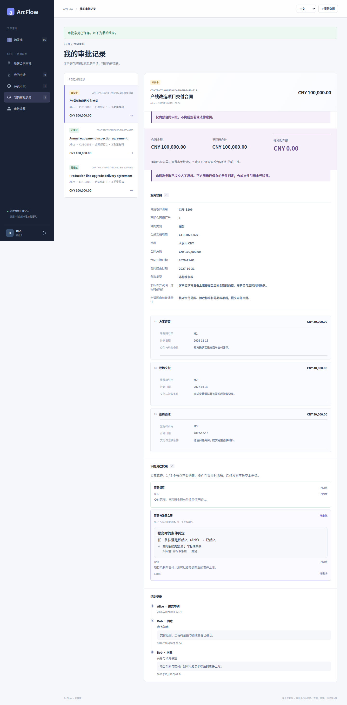
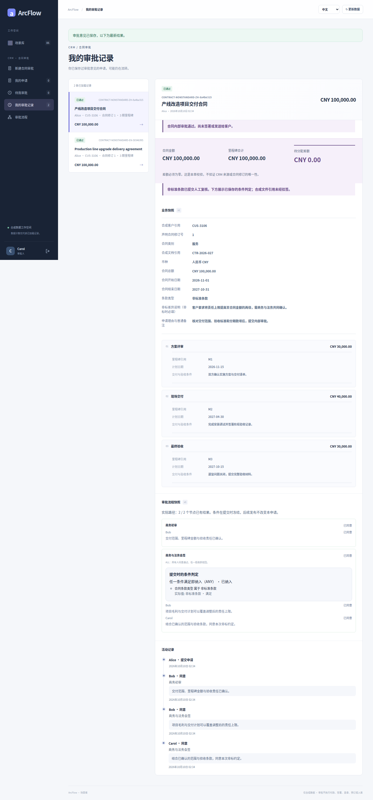

# 合同：标准与非标条款的不同路径

[简体中文](contract.md) · [English](contract.en.md) · [图集入口](README.md) · [五类案例图集](../README.md)

商务初审始终执行。条款类型为 NONSTANDARD 时再纳入商务与法务 ALL 会签；STANDARD 不进入这一步。条件匹配 ANY 与会签 ALL 是两件事，本例只有一个条件项。

<!-- topic:scope-and-capture -->
## 范围与采集

本页原图来自历史提交 [`cb3f1077`](https://github.com/JamesCube/ArcFlow/commit/cb3f1077fc725e0031620b1210a819917d8684a4) / [run 38016643460](https://github.com/JamesCube/ArcFlow/actions/runs/38016643460)，不是当前 main 重拍。采集涉及的应用与用例源码同基线 main `10e092fa` 一致；整个 UI 目录摘要因文档变化而不同。[精确对照与边界](CAPTURE.md)。

这些受限条件仅用于付款、收货、合同。全部是合成数据；通过不执行付款、签约或库存写回。每种语言分别运行申请。390×844 是浏览器视口，原图是长页，不是原生 H5 或实体手机验收。

<!-- topic:designer-partial-and-final-preview -->
## 先看设计器、部分票和终态

| 设计器：条款类型属于 NONSTANDARD | 会签部分通过：仍待 Carol | 非标申请：会签完成并通过 |
| --- | --- | --- |
|  |  |  |

预览只缩放原图显示，不裁剪、不改字节。点图看细节，或按下面的状态索引打开全部原图。

<!-- topic:request-identities -->
## 先分清是哪一笔申请

以下标签只串联同一语言、同一 requestId 的连续状态。中文与英文的 ID 是不同申请。设计器没有 requestId。

| 标签／申请 | 中文 requestId | 英文 requestId |
| --- | --- | --- |
| C1 · 非标条款申请 | `4048a98f-6b47-4ebb-bd40-2641091ecd1f` | `9c86f488-09a2-4277-ae2e-1eb18ba13763` |
| C2 · 标准条款申请 | `830ac8ee-966d-415c-a74d-c44b78c1bafa` | `9db85cf6-b8ac-4f6e-8a54-0c9b5fd35c82` |

<!-- topic:complete-state-index -->
## 按状态打开全部原图

每个状态都有 4 张原图：中文／英文 × 桌面／390px。桌面视口 1440×1000，窄屏视口 390×844。链接后的尺寸是实际全页 PNG 尺寸。

### 1. 设计器：条款类型属于 NONSTANDARD

条件匹配设为 ANY，选择非标准条款；节点审批仍为 Bob、Carol 的 ALL。

`contract-conditions` · 申请 — · 状态 `—` · 已决定次数 —

[中文 / desktop](../../images/conditional-routing/cb3f1077/contract/zh/contract-conditions-zh-desktop.png) 1440×2146 · [中文 / 390px](../../images/conditional-routing/cb3f1077/contract/zh/contract-conditions-zh-390px.png) 390×2431 · [English / desktop](../../images/conditional-routing/cb3f1077/contract/en/contract-conditions-en-desktop.png) 1440×2187 · [English / 390px](../../images/conditional-routing/cb3f1077/contract/en/contract-conditions-en-390px.png) 390×2524

### 2. 非标申请：商务初审后进入会签

C1 已由 Bob 完成 commercial-review，进入 contract-review；会签中的两个人均未表决。

`contract-nonstandard-entered` · 申请 C1 · 状态 `PENDING` · 已决定次数 1

[中文 / desktop](../../images/conditional-routing/cb3f1077/contract/zh/contract-nonstandard-entered-zh-desktop.png) 1440×2987 · [中文 / 390px](../../images/conditional-routing/cb3f1077/contract/zh/contract-nonstandard-entered-zh-390px.png) 390×4058 · [English / desktop](../../images/conditional-routing/cb3f1077/contract/en/contract-nonstandard-entered-en-desktop.png) 1440×3243 · [English / 390px](../../images/conditional-routing/cb3f1077/contract/en/contract-nonstandard-entered-en-390px.png) 390×4562

### 3. 会签部分通过：仍待 Carol

C1 的 Bob 再次在会签同意，Carol 仍未表决。共 2 次决定，不代表 ALL 已完成。

`contract-nonstandard-partial` · 申请 C1 · 状态 `PENDING` · 已决定次数 2

[中文 / desktop](../../images/conditional-routing/cb3f1077/contract/zh/contract-nonstandard-partial-zh-desktop.png) 1440×2922 · [中文 / 390px](../../images/conditional-routing/cb3f1077/contract/zh/contract-nonstandard-partial-zh-390px.png) 390×4162 · [English / desktop](../../images/conditional-routing/cb3f1077/contract/en/contract-nonstandard-partial-en-desktop.png) 1440×3178 · [English / 390px](../../images/conditional-routing/cb3f1077/contract/en/contract-nonstandard-partial-en-390px.png) 390×4384

### 4. 非标申请：会签完成并通过

Carol 同意后 C1 为 APPROVED；共 3 次决定，2 个实际路径节点。

`contract-nonstandard-approved` · 申请 C1 · 状态 `APPROVED` · 已决定次数 3

[中文 / desktop](../../images/conditional-routing/cb3f1077/contract/zh/contract-nonstandard-approved-zh-desktop.png) 1440×3078 · [中文 / 390px](../../images/conditional-routing/cb3f1077/contract/zh/contract-nonstandard-approved-zh-390px.png) 390×4185 · [English / desktop](../../images/conditional-routing/cb3f1077/contract/en/contract-nonstandard-approved-en-desktop.png) 1440×3333 · [English / 390px](../../images/conditional-routing/cb3f1077/contract/en/contract-nonstandard-approved-en-390px.png) 390×4582

### 5. 另一笔标准条款申请：跳过会签

C2 仅由 Bob 完成商务初审，跳过的会签没有审批票。不是 C1 改成标准条款。

`contract-standard-approved` · 申请 C2 · 状态 `APPROVED` · 已决定次数 1

[中文 / desktop](../../images/conditional-routing/cb3f1077/contract/zh/contract-standard-approved-zh-desktop.png) 1440×2695 · [中文 / 390px](../../images/conditional-routing/cb3f1077/contract/zh/contract-standard-approved-zh-390px.png) 390×4068 · [English / desktop](../../images/conditional-routing/cb3f1077/contract/en/contract-standard-approved-en-desktop.png) 1440×2930 · [English / 390px](../../images/conditional-routing/cb3f1077/contract/en/contract-standard-approved-en-390px.png) 390×4273

<!-- topic:receipts-and-next-steps -->
## 回执与继续阅读

[中文旅程回执](../../images/conditional-routing/cb3f1077/contract/zh/routing-receipt.json) · [英文旅程回执](../../images/conditional-routing/cb3f1077/contract/en/routing-receipt.json) · [逐图字节与元数据](../../images/conditional-routing/cb3f1077/provenance.json) · [采集与核验](CAPTURE.md)

[条件契约](../../CONDITIONAL_ROUTING.md) · [较早的场景图集](../contract.md)
