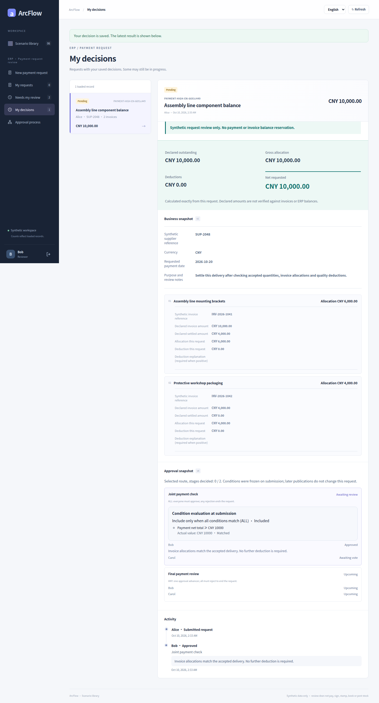
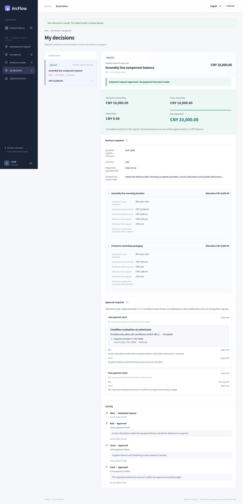

# Payment: amount conditions and individual decisions

[简体中文](payment.md) · [English](payment.en.md) · [Gallery](README.en.md) · [Five case galleries](../README.en.md)

One published process keeps different routes according to the net requested amount. CNY 6,500 skips finance and procurement joint review. CNY 10,000 meets the greater-than-or-equal threshold, so ALL must finish before the final ANY review.

<!-- topic:scope-and-capture -->
## Scope and capture

These are historical captures from [`cb3f1077`](https://github.com/JamesCube/ArcFlow/commit/cb3f1077fc725e0031620b1210a819917d8684a4) / [run 38016643460](https://github.com/JamesCube/ArcFlow/actions/runs/38016643460). They were not recaptured on current main. The captured application and fixture source matches baseline main `10e092fa`; the broader UI directory hash differs because documentation changed. [Exact comparison and limits](CAPTURE.en.md).

Only payment, receiving and contract support these restricted conditions. Synthetic data only: approval never transfers funds, signs a contract or posts inventory. Each language ran separate requests. The 390×844 browser viewport produces tall full-page PNGs; this is not native H5 or physical-phone acceptance.

<!-- topic:designer-partial-and-final-preview -->
## Designer, partial decisions and terminal states

| Designer: amount ≥ CNY 10,000 | Partial ALL approval: wait for Carol | Threshold-value request: approved |
| --- | --- | --- |
|  |  |  |

Previews scale the full originals without cropping. Open an image for detail, or use the complete state index below.

<!-- topic:request-identities -->
## Keep requests separate

Labels below group continuous states within one language only. Chinese and English IDs are different requests. The designer has no request ID.

| Label / request | Chinese requestId | English requestId |
| --- | --- | --- |
| P1 · Low-value request | `53259fe4-00de-496c-8408-286f39101c56` | `186c147b-c22f-4267-b788-b551ba07b1db` |
| P2 · Threshold-value request | `de801bad-d59f-4f6d-8f7d-f9b17fa867fb` | `62567754-d02f-4e02-90c8-b3e63167e0a5` |

<!-- topic:complete-state-index -->
## Every original, by state

Each state has four originals: Chinese/English × desktop/390px. Desktop viewport: 1440×1000; narrow viewport: 390×844. Dimensions below are actual full-page PNG dimensions.

### 1. Designer: amount ≥ CNY 10,000

Configure the joint-review condition and Bob/Carol, with an unconditional final ANY stage. Condition matching and approval voting are separate settings.

`payment-conditions` · Request — · Status `—` · Decisions —

[中文 / desktop](../../images/conditional-routing/cb3f1077/payment/zh/payment-conditions-zh-desktop.png) 1440×2112 · [中文 / 390px](../../images/conditional-routing/cb3f1077/payment/zh/payment-conditions-zh-390px.png) 390×2501 · [English / desktop](../../images/conditional-routing/cb3f1077/payment/en/payment-conditions-en-desktop.png) 1440×2172 · [English / 390px](../../images/conditional-routing/cb3f1077/payment/en/payment-conditions-en-390px.png) 390×2614

### 2. Low value: freeze a route without joint review

P1 saves CNY 6,500 and waits directly at payment-final, with no joint-review votes.

`payment-low-frozen` · Request P1 · Status `PENDING` · Decisions 0

[中文 / desktop](../../images/conditional-routing/cb3f1077/payment/zh/payment-low-frozen-zh-desktop.png) 1440×2383 · [中文 / 390px](../../images/conditional-routing/cb3f1077/payment/zh/payment-low-frozen-zh-390px.png) 390×3959 · [English / desktop](../../images/conditional-routing/cb3f1077/payment/en/payment-low-frozen-en-desktop.png) 1440×2515 · [English / 390px](../../images/conditional-routing/cb3f1077/payment/en/payment-low-frozen-en-390px.png) 390×3707

### 3. At the threshold: enter ALL

P2 saves CNY 10,000. Both Bob and Carol still need to vote.

`payment-high-entered` · Request P2 · Status `PENDING` · Decisions 0

[中文 / desktop](../../images/conditional-routing/cb3f1077/payment/zh/payment-high-entered-zh-desktop.png) 1440×2604 · [中文 / 390px](../../images/conditional-routing/cb3f1077/payment/zh/payment-high-entered-zh-390px.png) 390×3996 · [English / desktop](../../images/conditional-routing/cb3f1077/payment/en/payment-high-entered-en-desktop.png) 1440×2736 · [English / 390px](../../images/conditional-routing/cb3f1077/payment/en/payment-high-entered-en-390px.png) 390×4009

### 4. Partial ALL approval: wait for Carol

Bob has approved P2. It remains PENDING and cannot enter the final review yet.

`payment-high-partial` · Request P2 · Status `PENDING` · Decisions 1

[中文 / desktop](../../images/conditional-routing/cb3f1077/payment/zh/payment-high-partial-zh-desktop.png) 1440×2539 · [中文 / 390px](../../images/conditional-routing/cb3f1077/payment/zh/payment-high-partial-zh-390px.png) 390×3770 · [English / desktop](../../images/conditional-routing/cb3f1077/payment/en/payment-high-partial-en-desktop.png) 1440×2671 · [English / 390px](../../images/conditional-routing/cb3f1077/payment/en/payment-high-partial-en-390px.png) 390×3676

### 5. ALL complete: enter final ANY

Bob and Carol have both approved joint review on P2. Final payment review is now pending.

`payment-high-final-review` · Request P2 · Status `PENDING` · Decisions 2

[中文 / desktop](../../images/conditional-routing/cb3f1077/payment/zh/payment-high-final-review-zh-desktop.png) 1440×2916 · [中文 / 390px](../../images/conditional-routing/cb3f1077/payment/zh/payment-high-final-review-zh-390px.png) 390×4313 · [English / desktop](../../images/conditional-routing/cb3f1077/payment/en/payment-high-final-review-en-desktop.png) 1440×3048 · [English / 390px](../../images/conditional-routing/cb3f1077/payment/en/payment-high-final-review-en-390px.png) 390×4405

### 6. Threshold-value request: approved

Carol approves the final ANY stage. P2 is APPROVED, with three decisions across two selected stages.

`payment-high-complete` · Request P2 · Status `APPROVED` · Decisions 3

[中文 / desktop](../../images/conditional-routing/cb3f1077/payment/zh/payment-high-complete-zh-desktop.png) 1440×2851 · [中文 / 390px](../../images/conditional-routing/cb3f1077/payment/zh/payment-high-complete-zh-390px.png) 390×3932 · [English / desktop](../../images/conditional-routing/cb3f1077/payment/en/payment-high-complete-en-desktop.png) 1440×2983 · [English / 390px](../../images/conditional-routing/cb3f1077/payment/en/payment-high-complete-en-390px.png) 390×4072

### 7. Low-value request: one-stage approval

Bob approves the final ANY stage on the separate P1 request. Only one stage executes; this is not a later state of P2.

`payment-low-complete` · Request P1 · Status `APPROVED` · Decisions 1

[中文 / desktop](../../images/conditional-routing/cb3f1077/payment/zh/payment-low-complete-zh-desktop.png) 1440×2539 · [中文 / 390px](../../images/conditional-routing/cb3f1077/payment/zh/payment-low-complete-zh-390px.png) 390×3962 · [English / desktop](../../images/conditional-routing/cb3f1077/payment/en/payment-low-complete-en-desktop.png) 1440×2671 · [English / 390px](../../images/conditional-routing/cb3f1077/payment/en/payment-low-complete-en-390px.png) 390×3905

<!-- topic:receipts-and-next-steps -->
## Receipts and next steps

[Chinese journey receipt](../../images/conditional-routing/cb3f1077/payment/zh/routing-receipt.json) · [English journey receipt](../../images/conditional-routing/cb3f1077/payment/en/routing-receipt.json) · [Original bytes and metadata](../../images/conditional-routing/cb3f1077/provenance.json) · [Capture and verification](CAPTURE.en.md)

[Condition contract](../../CONDITIONAL_ROUTING.en.md) · [Earlier scenario gallery](../payment.en.md)
