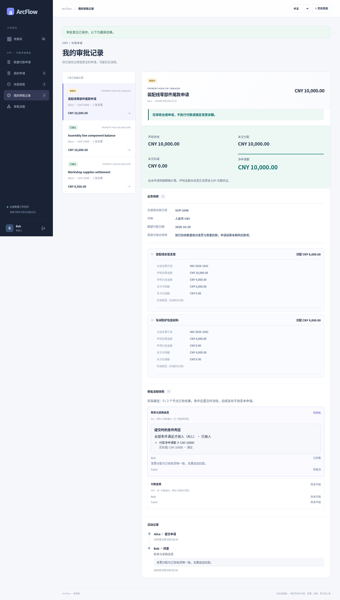
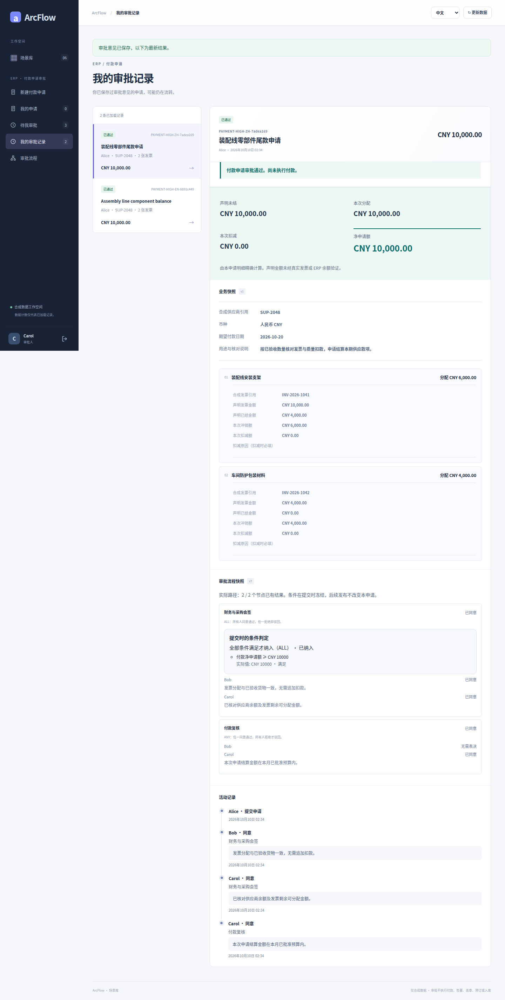

# 付款：金额条件与逐人审批

[简体中文](payment.md) · [English](payment.en.md) · [图集入口](README.md) · [五类案例图集](../README.md)

同一条已发布流程，根据净申请金额保留不同路径。CNY 6,500 跳过财务与采购会签；CNY 10,000 恰好命中“大于等于”阈值，必须先完成 ALL，再进入最终 ANY。

<!-- topic:scope-and-capture -->
## 范围与采集

本页原图来自历史提交 [`cb3f1077`](https://github.com/JamesCube/ArcFlow/commit/cb3f1077fc725e0031620b1210a819917d8684a4) / [run 38016643460](https://github.com/JamesCube/ArcFlow/actions/runs/38016643460)，不是当前 main 重拍。采集涉及的应用与用例源码同基线 main `10e092fa` 一致；整个 UI 目录摘要因文档变化而不同。[精确对照与边界](CAPTURE.md)。

这些受限条件仅用于付款、收货、合同。全部是合成数据；通过不执行付款、签约或库存写回。每种语言分别运行申请。390×844 是浏览器视口，原图是长页，不是原生 H5 或实体手机验收。

<!-- topic:designer-partial-and-final-preview -->
## 先看设计器、部分票和终态

| 设计器：金额 ≥ CNY 10,000 | ALL 部分通过：仍待 Carol | 达到阈值的申请：审批通过 |
| --- | --- | --- |
|  |  |  |

预览只缩放原图显示，不裁剪、不改字节。点图看细节，或按下面的状态索引打开全部原图。

<!-- topic:request-identities -->
## 先分清是哪一笔申请

以下标签只串联同一语言、同一 requestId 的连续状态。中文与英文的 ID 是不同申请。设计器没有 requestId。

| 标签／申请 | 中文 requestId | 英文 requestId |
| --- | --- | --- |
| P1 · 低金额申请 | `53259fe4-00de-496c-8408-286f39101c56` | `186c147b-c22f-4267-b788-b551ba07b1db` |
| P2 · 达到阈值的申请 | `de801bad-d59f-4f6d-8f7d-f9b17fa867fb` | `62567754-d02f-4e02-90c8-b3e63167e0a5` |

<!-- topic:complete-state-index -->
## 按状态打开全部原图

每个状态都有 4 张原图：中文／英文 × 桌面／390px。桌面视口 1440×1000，窄屏视口 390×844。链接后的尺寸是实际全页 PNG 尺寸。

### 1. 设计器：金额 ≥ CNY 10,000

配置会签条件与 Bob、Carol，再保留无条件的最终 ANY。条件匹配与审批表决分别设置。

`payment-conditions` · 申请 — · 状态 `—` · 已决定次数 —

[中文 / desktop](../../images/conditional-routing/cb3f1077/payment/zh/payment-conditions-zh-desktop.png) 1440×2112 · [中文 / 390px](../../images/conditional-routing/cb3f1077/payment/zh/payment-conditions-zh-390px.png) 390×2501 · [English / desktop](../../images/conditional-routing/cb3f1077/payment/en/payment-conditions-en-desktop.png) 1440×2172 · [English / 390px](../../images/conditional-routing/cb3f1077/payment/en/payment-conditions-en-390px.png) 390×2614

### 2. 低金额：冻结跳过会签的路径

P1 保存 CNY 6,500，当前直接等待 payment-final，没有会签投票。

`payment-low-frozen` · 申请 P1 · 状态 `PENDING` · 已决定次数 0

[中文 / desktop](../../images/conditional-routing/cb3f1077/payment/zh/payment-low-frozen-zh-desktop.png) 1440×2383 · [中文 / 390px](../../images/conditional-routing/cb3f1077/payment/zh/payment-low-frozen-zh-390px.png) 390×3959 · [English / desktop](../../images/conditional-routing/cb3f1077/payment/en/payment-low-frozen-en-desktop.png) 1440×2515 · [English / 390px](../../images/conditional-routing/cb3f1077/payment/en/payment-low-frozen-en-390px.png) 390×3707

### 3. 达到阈值：进入 ALL

P2 保存 CNY 10,000，Bob 与 Carol 均待表决。

`payment-high-entered` · 申请 P2 · 状态 `PENDING` · 已决定次数 0

[中文 / desktop](../../images/conditional-routing/cb3f1077/payment/zh/payment-high-entered-zh-desktop.png) 1440×2604 · [中文 / 390px](../../images/conditional-routing/cb3f1077/payment/zh/payment-high-entered-zh-390px.png) 390×3996 · [English / desktop](../../images/conditional-routing/cb3f1077/payment/en/payment-high-entered-en-desktop.png) 1440×2736 · [English / 390px](../../images/conditional-routing/cb3f1077/payment/en/payment-high-entered-en-390px.png) 390×4009

### 4. ALL 部分通过：仍待 Carol

P2 中 Bob 已同意，申请仍为 PENDING，不能提前进入最终复核。

`payment-high-partial` · 申请 P2 · 状态 `PENDING` · 已决定次数 1

[中文 / desktop](../../images/conditional-routing/cb3f1077/payment/zh/payment-high-partial-zh-desktop.png) 1440×2539 · [中文 / 390px](../../images/conditional-routing/cb3f1077/payment/zh/payment-high-partial-zh-390px.png) 390×3770 · [English / desktop](../../images/conditional-routing/cb3f1077/payment/en/payment-high-partial-en-desktop.png) 1440×2671 · [English / 390px](../../images/conditional-routing/cb3f1077/payment/en/payment-high-partial-en-390px.png) 390×3676

### 5. ALL 完成：进入最终 ANY

P2 的 Bob、Carol 都已同意会签，现在等待付款复核。

`payment-high-final-review` · 申请 P2 · 状态 `PENDING` · 已决定次数 2

[中文 / desktop](../../images/conditional-routing/cb3f1077/payment/zh/payment-high-final-review-zh-desktop.png) 1440×2916 · [中文 / 390px](../../images/conditional-routing/cb3f1077/payment/zh/payment-high-final-review-zh-390px.png) 390×4313 · [English / desktop](../../images/conditional-routing/cb3f1077/payment/en/payment-high-final-review-en-desktop.png) 1440×3048 · [English / 390px](../../images/conditional-routing/cb3f1077/payment/en/payment-high-final-review-en-390px.png) 390×4405

### 6. 达到阈值的申请：审批通过

Carol 在最终 ANY 同意，P2 变为 APPROVED；共 3 次决定，2 个实际路径节点。

`payment-high-complete` · 申请 P2 · 状态 `APPROVED` · 已决定次数 3

[中文 / desktop](../../images/conditional-routing/cb3f1077/payment/zh/payment-high-complete-zh-desktop.png) 1440×2851 · [中文 / 390px](../../images/conditional-routing/cb3f1077/payment/zh/payment-high-complete-zh-390px.png) 390×3932 · [English / desktop](../../images/conditional-routing/cb3f1077/payment/en/payment-high-complete-en-desktop.png) 1440×2983 · [English / 390px](../../images/conditional-routing/cb3f1077/payment/en/payment-high-complete-en-390px.png) 390×4072

### 7. 低金额申请：单步通过

另一笔 P1 由 Bob 在最终 ANY 同意，只执行 1 个节点。不是 P2 的后续变化。

`payment-low-complete` · 申请 P1 · 状态 `APPROVED` · 已决定次数 1

[中文 / desktop](../../images/conditional-routing/cb3f1077/payment/zh/payment-low-complete-zh-desktop.png) 1440×2539 · [中文 / 390px](../../images/conditional-routing/cb3f1077/payment/zh/payment-low-complete-zh-390px.png) 390×3962 · [English / desktop](../../images/conditional-routing/cb3f1077/payment/en/payment-low-complete-en-desktop.png) 1440×2671 · [English / 390px](../../images/conditional-routing/cb3f1077/payment/en/payment-low-complete-en-390px.png) 390×3905

<!-- topic:receipts-and-next-steps -->
## 回执与继续阅读

[中文旅程回执](../../images/conditional-routing/cb3f1077/payment/zh/routing-receipt.json) · [英文旅程回执](../../images/conditional-routing/cb3f1077/payment/en/routing-receipt.json) · [逐图字节与元数据](../../images/conditional-routing/cb3f1077/provenance.json) · [采集与核验](CAPTURE.md)

[条件契约](../../CONDITIONAL_ROUTING.md) · [较早的场景图集](../payment.md)
