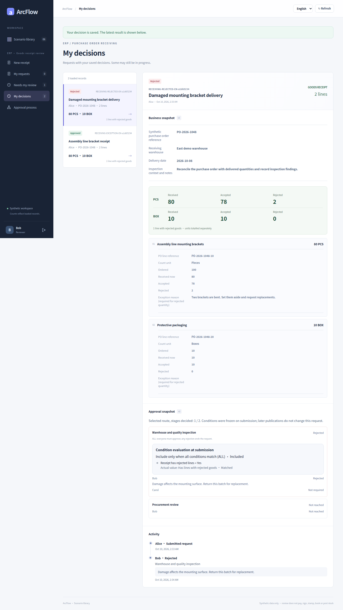

# Receiving: exceptions, joint review and a separate rejection

[简体中文](receiving.md) · [English](receiving.en.md) · [Gallery](README.en.md) · [Five case galleries](../README.en.md)

A receipt without rejected lines goes directly to procurement review. Rejected goods add warehouse and quality ALL review first. A separate request shows how one rejection terminates an ALL stage.

<!-- topic:scope-and-capture -->
## Scope and capture

These are historical captures from [`cb3f1077`](https://github.com/JamesCube/ArcFlow/commit/cb3f1077fc725e0031620b1210a819917d8684a4) / [run 38016643460](https://github.com/JamesCube/ArcFlow/actions/runs/38016643460). They were not recaptured on current main. The captured application and fixture source matches baseline main `10e092fa`; the broader UI directory hash differs because documentation changed. [Exact comparison and limits](CAPTURE.en.md).

Only payment, receiving and contract support these restricted conditions. Synthetic data only: approval never transfers funds, signs a contract or posts inventory. Each language ran separate requests. The 390×844 browser viewport produces tall full-page PNGs; this is not native H5 or physical-phone acceptance.

<!-- topic:designer-partial-and-final-preview -->
## Designer, partial decisions and terminal states

| Designer: include joint review for rejected goods | Bob approves: Carol is still pending | Another exception receipt: one rejection |
| --- | --- | --- |
|  |  |  |

Previews scale the full originals without cropping. Open an image for detail, or use the complete state index below.

<!-- topic:request-identities -->
## Keep requests separate

Labels below group continuous states within one language only. Chinese and English IDs are different requests. The designer has no request ID.

| Label / request | Chinese requestId | English requestId |
| --- | --- | --- |
| R1 · Clean receipt | `86d0e760-2678-40bc-b1c6-144425ed73f5` | `4b4fbe56-10fe-4a57-add0-48068aeb9064` |
| R2 · Approved exception receipt | `1993b53f-1f45-4e86-921b-91441dcf886e` | `0578220d-45cd-49aa-bd75-b35a56bb8f8b` |
| R3 · Separate rejected receipt | `74f82be2-c638-40e7-ad31-b90f734ddfd6` | `1e90e589-998d-48f6-ae35-2379f72ad24f` |

<!-- topic:complete-state-index -->
## Every original, by state

Each state has four originals: Chinese/English × desktop/390px. Desktop viewport: 1440×1000; narrow viewport: 390×844. Dimensions below are actual full-page PNG dimensions.

### 1. Designer: include joint review for rejected goods

Warehouse and quality review uses ALL condition matching and ALL voting by Bob and Carol. Procurement review always remains.

`receiving-conditions` · Request — · Status `—` · Decisions —

[中文 / desktop](../../images/conditional-routing/cb3f1077/receiving/zh/receiving-conditions-zh-desktop.png) 1440×1941 · [中文 / 390px](../../images/conditional-routing/cb3f1077/receiving/zh/receiving-conditions-zh-390px.png) 390×2228 · [English / desktop](../../images/conditional-routing/cb3f1077/receiving/en/receiving-conditions-en-desktop.png) 1440×1982 · [English / 390px](../../images/conditional-routing/cb3f1077/receiving/en/receiving-conditions-en-390px.png) 390×2321

### 2. Clean receipt: freeze a one-stage route

R1 has no rejected lines. Warehouse and quality review is excluded; the current step is procurement-review.

`receiving-clean-frozen` · Request R1 · Status `PENDING` · Decisions 0

[中文 / desktop](../../images/conditional-routing/cb3f1077/receiving/zh/receiving-clean-frozen-zh-desktop.png) 1440×2306 · [中文 / 390px](../../images/conditional-routing/cb3f1077/receiving/zh/receiving-clean-frozen-zh-390px.png) 390×3939 · [English / desktop](../../images/conditional-routing/cb3f1077/receiving/en/receiving-clean-frozen-en-desktop.png) 1440×2406 · [English / 390px](../../images/conditional-routing/cb3f1077/receiving/en/receiving-clean-frozen-en-390px.png) 390×3608

### 3. Rejected goods: enter joint inspection

R2 records 80 PCS: 78 accepted and two rejected, plus 10 BOX all accepted. Quantities are totaled separately by unit.

`receiving-exception-entered` · Request R2 · Status `PENDING` · Decisions 0

[中文 / desktop](../../images/conditional-routing/cb3f1077/receiving/zh/receiving-exception-entered-zh-desktop.png) 1440×2527 · [中文 / 390px](../../images/conditional-routing/cb3f1077/receiving/zh/receiving-exception-entered-zh-390px.png) 390×3660 · [English / desktop](../../images/conditional-routing/cb3f1077/receiving/en/receiving-exception-entered-en-desktop.png) 1440×2627 · [English / 390px](../../images/conditional-routing/cb3f1077/receiving/en/receiving-exception-entered-en-390px.png) 390×3822

### 4. Bob approves: Carol is still pending

Only Bob has approved the ALL stage on R2. It remains PENDING.

`receiving-exception-partial` · Request R2 · Status `PENDING` · Decisions 1

[中文 / desktop](../../images/conditional-routing/cb3f1077/receiving/zh/receiving-exception-partial-zh-desktop.png) 1440×2462 · [中文 / 390px](../../images/conditional-routing/cb3f1077/receiving/zh/receiving-exception-partial-zh-390px.png) 390×3764 · [English / desktop](../../images/conditional-routing/cb3f1077/receiving/en/receiving-exception-partial-en-desktop.png) 1440×2562 · [English / 390px](../../images/conditional-routing/cb3f1077/receiving/en/receiving-exception-partial-en-390px.png) 390×3469

### 5. Joint inspection complete: procurement review

Bob and Carol have both approved R2. Procurement review is now pending.

`receiving-procurement-review` · Request R2 · Status `PENDING` · Decisions 2

[中文 / desktop](../../images/conditional-routing/cb3f1077/receiving/zh/receiving-procurement-review-zh-desktop.png) 1440×2618 · [中文 / 390px](../../images/conditional-routing/cb3f1077/receiving/zh/receiving-procurement-review-zh-390px.png) 390×3632 · [English / desktop](../../images/conditional-routing/cb3f1077/receiving/en/receiving-procurement-review-en-desktop.png) 1440×2718 · [English / 390px](../../images/conditional-routing/cb3f1077/receiving/en/receiving-procurement-review-en-390px.png) 390×3647

### 6. Exception receipt approved

Bob approves procurement review. R2 is APPROVED, with three decisions across two selected stages.

`receiving-exception-approved` · Request R2 · Status `APPROVED` · Decisions 3

[中文 / desktop](../../images/conditional-routing/cb3f1077/receiving/zh/receiving-exception-approved-zh-desktop.png) 1440×2774 · [中文 / 390px](../../images/conditional-routing/cb3f1077/receiving/zh/receiving-exception-approved-zh-390px.png) 390×4121 · [English / desktop](../../images/conditional-routing/cb3f1077/receiving/en/receiving-exception-approved-en-desktop.png) 1440×2874 · [English / 390px](../../images/conditional-routing/cb3f1077/receiving/en/receiving-exception-approved-en-390px.png) 390×3845

### 7. Another exception receipt: one rejection

Bob rejects the inspection ALL stage on R3. Carol is no longer required and procurement review is not reached. It ends REJECTED; R2 is unchanged.

`receiving-exception-rejected` · Request R3 · Status `REJECTED` · Decisions 1

[中文 / desktop](../../images/conditional-routing/cb3f1077/receiving/zh/receiving-exception-rejected-zh-desktop.png) 1440×2462 · [中文 / 390px](../../images/conditional-routing/cb3f1077/receiving/zh/receiving-exception-rejected-zh-390px.png) 390×3940 · [English / desktop](../../images/conditional-routing/cb3f1077/receiving/en/receiving-exception-rejected-en-desktop.png) 1440×2562 · [English / 390px](../../images/conditional-routing/cb3f1077/receiving/en/receiving-exception-rejected-en-390px.png) 390×3624

### 8. Clean receipt: one-stage approval

Bob completes procurement review on the separate R1 request. Only one stage executes.

`receiving-clean-approved` · Request R1 · Status `APPROVED` · Decisions 1

[中文 / desktop](../../images/conditional-routing/cb3f1077/receiving/zh/receiving-clean-approved-zh-desktop.png) 1440×2462 · [中文 / 390px](../../images/conditional-routing/cb3f1077/receiving/zh/receiving-clean-approved-zh-390px.png) 390×4098 · [English / desktop](../../images/conditional-routing/cb3f1077/receiving/en/receiving-clean-approved-en-desktop.png) 1440×2562 · [English / 390px](../../images/conditional-routing/cb3f1077/receiving/en/receiving-clean-approved-en-390px.png) 390×3806

<!-- topic:receipts-and-next-steps -->
## Receipts and next steps

[Chinese journey receipt](../../images/conditional-routing/cb3f1077/receiving/zh/routing-receipt.json) · [English journey receipt](../../images/conditional-routing/cb3f1077/receiving/en/routing-receipt.json) · [Original bytes and metadata](../../images/conditional-routing/cb3f1077/provenance.json) · [Capture and verification](CAPTURE.en.md)

[Condition contract](../../CONDITIONAL_ROUTING.en.md) · [Earlier scenario gallery](../receiving.en.md)
