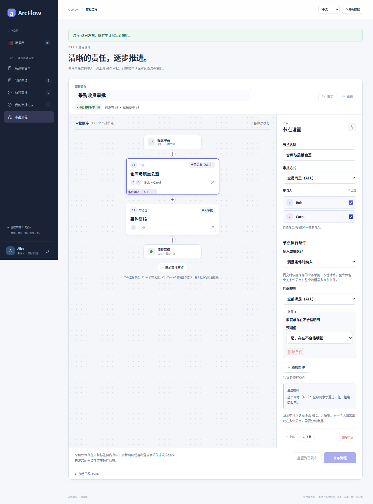
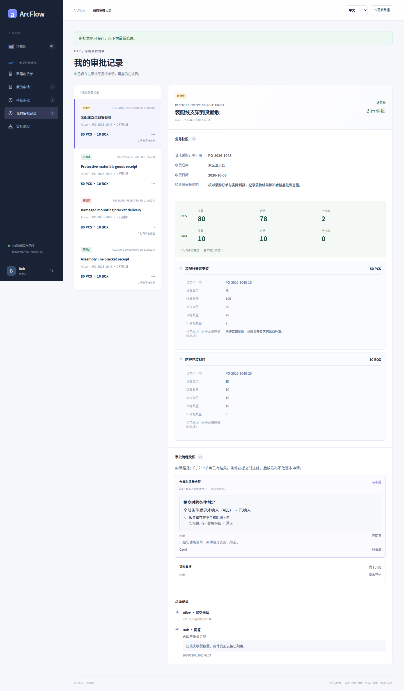
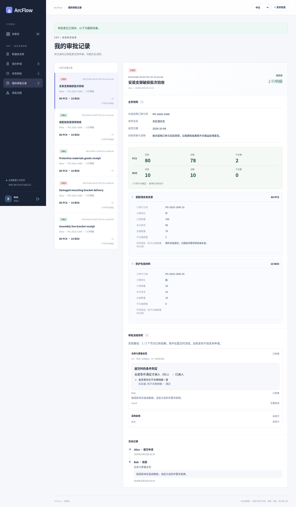

# 收货：异常条件、会签与独立驳回

[简体中文](receiving.md) · [English](receiving.en.md) · [图集入口](README.md) · [五类案例图集](../README.md)

无拒收行时直接采购复核。有拒收行时先进入仓库与质量 ALL，完成后才到采购复核。另用一笔申请展示 ALL 一票拒绝后的终止。

<!-- topic:scope-and-capture -->
## 范围与采集

本页原图来自历史提交 [`cb3f1077`](https://github.com/JamesCube/ArcFlow/commit/cb3f1077fc725e0031620b1210a819917d8684a4) / [run 38016643460](https://github.com/JamesCube/ArcFlow/actions/runs/38016643460)，不是当前 main 重拍。采集涉及的应用与用例源码同基线 main `10e092fa` 一致；整个 UI 目录摘要因文档变化而不同。[精确对照与边界](CAPTURE.md)。

这些受限条件仅用于付款、收货、合同。全部是合成数据；通过不执行付款、签约或库存写回。每种语言分别运行申请。390×844 是浏览器视口，原图是长页，不是原生 H5 或实体手机验收。

<!-- topic:designer-partial-and-final-preview -->
## 先看设计器、部分票和终态

| 设计器：存在拒收行时纳入会签 | Bob 同意：Carol 仍待表决 | 另一笔异常申请：一票驳回 |
| --- | --- | --- |
|  |  |  |

预览只缩放原图显示，不裁剪、不改字节。点图看细节，或按下面的状态索引打开全部原图。

<!-- topic:request-identities -->
## 先分清是哪一笔申请

以下标签只串联同一语言、同一 requestId 的连续状态。中文与英文的 ID 是不同申请。设计器没有 requestId。

| 标签／申请 | 中文 requestId | 英文 requestId |
| --- | --- | --- |
| R1 · 无拒收行申请 | `86d0e760-2678-40bc-b1c6-144425ed73f5` | `4b4fbe56-10fe-4a57-add0-48068aeb9064` |
| R2 · 异常后通过的申请 | `1993b53f-1f45-4e86-921b-91441dcf886e` | `0578220d-45cd-49aa-bd75-b35a56bb8f8b` |
| R3 · 独立驳回申请 | `74f82be2-c638-40e7-ad31-b90f734ddfd6` | `1e90e589-998d-48f6-ae35-2379f72ad24f` |

<!-- topic:complete-state-index -->
## 按状态打开全部原图

每个状态都有 4 张原图：中文／英文 × 桌面／390px。桌面视口 1440×1000，窄屏视口 390×844。链接后的尺寸是实际全页 PNG 尺寸。

### 1. 设计器：存在拒收行时纳入会签

仓库与质量节点使用条件匹配 ALL 和审批 ALL，参与人 Bob、Carol；采购复核始终保留。

`receiving-conditions` · 申请 — · 状态 `—` · 已决定次数 —

[中文 / desktop](../../images/conditional-routing/cb3f1077/receiving/zh/receiving-conditions-zh-desktop.png) 1440×1941 · [中文 / 390px](../../images/conditional-routing/cb3f1077/receiving/zh/receiving-conditions-zh-390px.png) 390×2228 · [English / desktop](../../images/conditional-routing/cb3f1077/receiving/en/receiving-conditions-en-desktop.png) 1440×1982 · [English / 390px](../../images/conditional-routing/cb3f1077/receiving/en/receiving-conditions-en-390px.png) 390×2321

### 2. 无拒收：冻结单节点路径

R1 无拒收行，排除仓库与质量节点，当前为 procurement-review。

`receiving-clean-frozen` · 申请 R1 · 状态 `PENDING` · 已决定次数 0

[中文 / desktop](../../images/conditional-routing/cb3f1077/receiving/zh/receiving-clean-frozen-zh-desktop.png) 1440×2306 · [中文 / 390px](../../images/conditional-routing/cb3f1077/receiving/zh/receiving-clean-frozen-zh-390px.png) 390×3939 · [English / desktop](../../images/conditional-routing/cb3f1077/receiving/en/receiving-clean-frozen-en-desktop.png) 1440×2406 · [English / 390px](../../images/conditional-routing/cb3f1077/receiving/en/receiving-clean-frozen-en-390px.png) 390×3608

### 3. 存在拒收：进入质量会签

R2 的 80 PCS 中验收 78、拒收 2；另有 10 BOX 全部验收。不同单位分别汇总。

`receiving-exception-entered` · 申请 R2 · 状态 `PENDING` · 已决定次数 0

[中文 / desktop](../../images/conditional-routing/cb3f1077/receiving/zh/receiving-exception-entered-zh-desktop.png) 1440×2527 · [中文 / 390px](../../images/conditional-routing/cb3f1077/receiving/zh/receiving-exception-entered-zh-390px.png) 390×3660 · [English / desktop](../../images/conditional-routing/cb3f1077/receiving/en/receiving-exception-entered-en-desktop.png) 1440×2627 · [English / 390px](../../images/conditional-routing/cb3f1077/receiving/en/receiving-exception-entered-en-390px.png) 390×3822

### 4. Bob 同意：Carol 仍待表决

R2 的 ALL 仅有 Bob 同意，仍为 PENDING。

`receiving-exception-partial` · 申请 R2 · 状态 `PENDING` · 已决定次数 1

[中文 / desktop](../../images/conditional-routing/cb3f1077/receiving/zh/receiving-exception-partial-zh-desktop.png) 1440×2462 · [中文 / 390px](../../images/conditional-routing/cb3f1077/receiving/zh/receiving-exception-partial-zh-390px.png) 390×3764 · [English / desktop](../../images/conditional-routing/cb3f1077/receiving/en/receiving-exception-partial-en-desktop.png) 1440×2562 · [English / 390px](../../images/conditional-routing/cb3f1077/receiving/en/receiving-exception-partial-en-390px.png) 390×3469

### 5. 质量会签完成：进入采购复核

R2 的 Bob、Carol 都已同意，当前等待采购复核。

`receiving-procurement-review` · 申请 R2 · 状态 `PENDING` · 已决定次数 2

[中文 / desktop](../../images/conditional-routing/cb3f1077/receiving/zh/receiving-procurement-review-zh-desktop.png) 1440×2618 · [中文 / 390px](../../images/conditional-routing/cb3f1077/receiving/zh/receiving-procurement-review-zh-390px.png) 390×3632 · [English / desktop](../../images/conditional-routing/cb3f1077/receiving/en/receiving-procurement-review-en-desktop.png) 1440×2718 · [English / 390px](../../images/conditional-routing/cb3f1077/receiving/en/receiving-procurement-review-en-390px.png) 390×3647

### 6. 异常申请审批通过

Bob 完成采购复核，R2 为 APPROVED。记录 3 次决定，2 个实际路径节点。

`receiving-exception-approved` · 申请 R2 · 状态 `APPROVED` · 已决定次数 3

[中文 / desktop](../../images/conditional-routing/cb3f1077/receiving/zh/receiving-exception-approved-zh-desktop.png) 1440×2774 · [中文 / 390px](../../images/conditional-routing/cb3f1077/receiving/zh/receiving-exception-approved-zh-390px.png) 390×4121 · [English / desktop](../../images/conditional-routing/cb3f1077/receiving/en/receiving-exception-approved-en-desktop.png) 1440×2874 · [English / 390px](../../images/conditional-routing/cb3f1077/receiving/en/receiving-exception-approved-en-390px.png) 390×3845

### 7. 另一笔异常申请：一票驳回

R3 由 Bob 在质量 ALL 拒绝，Carol 无需再表决，采购复核未到达。终态 REJECTED；不是 R2 被改写。

`receiving-exception-rejected` · 申请 R3 · 状态 `REJECTED` · 已决定次数 1

[中文 / desktop](../../images/conditional-routing/cb3f1077/receiving/zh/receiving-exception-rejected-zh-desktop.png) 1440×2462 · [中文 / 390px](../../images/conditional-routing/cb3f1077/receiving/zh/receiving-exception-rejected-zh-390px.png) 390×3940 · [English / desktop](../../images/conditional-routing/cb3f1077/receiving/en/receiving-exception-rejected-en-desktop.png) 1440×2562 · [English / 390px](../../images/conditional-routing/cb3f1077/receiving/en/receiving-exception-rejected-en-390px.png) 390×3624

### 8. 无拒收申请：单步通过

独立的 R1 由 Bob 完成采购复核，只执行 1 个节点。

`receiving-clean-approved` · 申请 R1 · 状态 `APPROVED` · 已决定次数 1

[中文 / desktop](../../images/conditional-routing/cb3f1077/receiving/zh/receiving-clean-approved-zh-desktop.png) 1440×2462 · [中文 / 390px](../../images/conditional-routing/cb3f1077/receiving/zh/receiving-clean-approved-zh-390px.png) 390×4098 · [English / desktop](../../images/conditional-routing/cb3f1077/receiving/en/receiving-clean-approved-en-desktop.png) 1440×2562 · [English / 390px](../../images/conditional-routing/cb3f1077/receiving/en/receiving-clean-approved-en-390px.png) 390×3806

<!-- topic:receipts-and-next-steps -->
## 回执与继续阅读

[中文旅程回执](../../images/conditional-routing/cb3f1077/receiving/zh/routing-receipt.json) · [英文旅程回执](../../images/conditional-routing/cb3f1077/receiving/en/routing-receipt.json) · [逐图字节与元数据](../../images/conditional-routing/cb3f1077/provenance.json) · [采集与核验](CAPTURE.md)

[条件契约](../../CONDITIONAL_ROUTING.md) · [较早的场景图集](../receiving.md)
