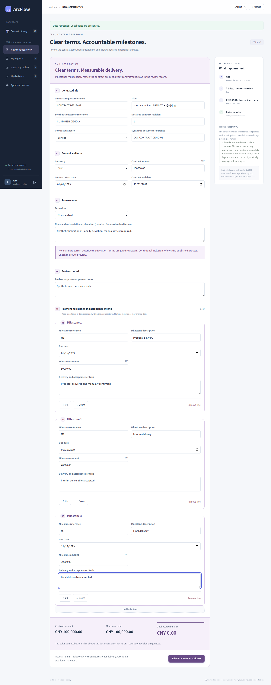
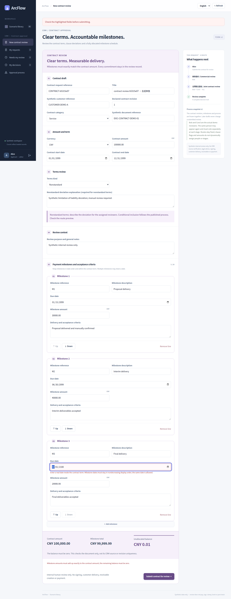
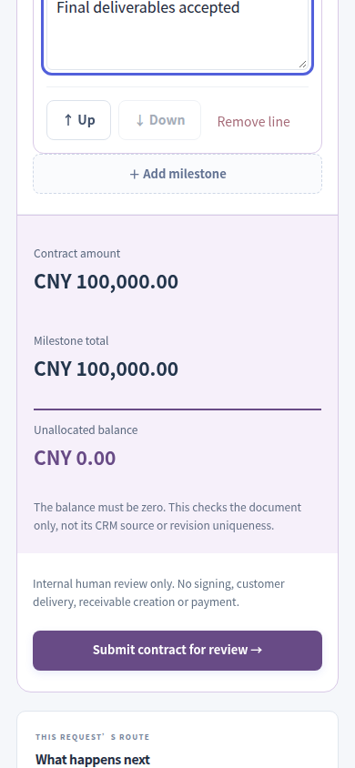
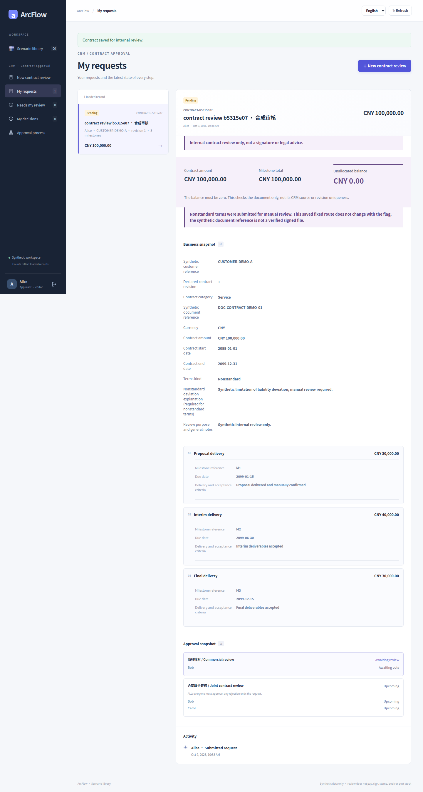
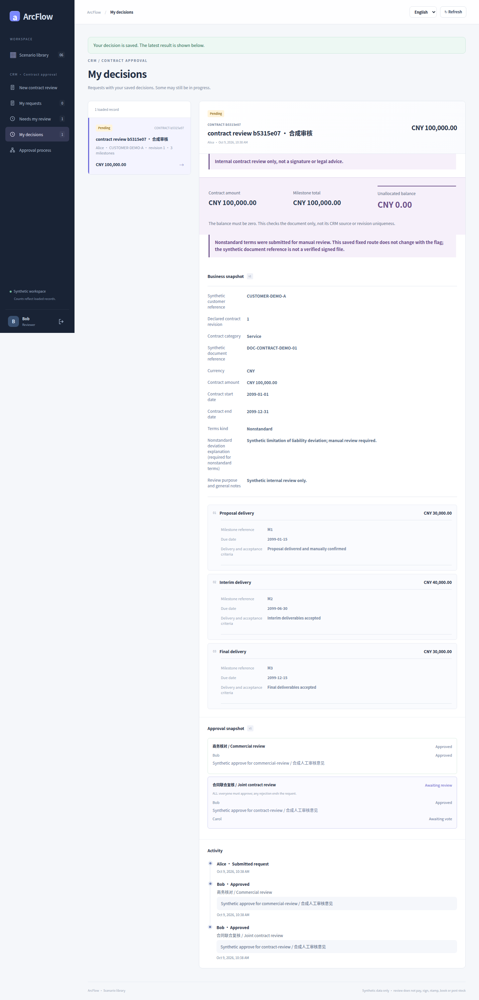
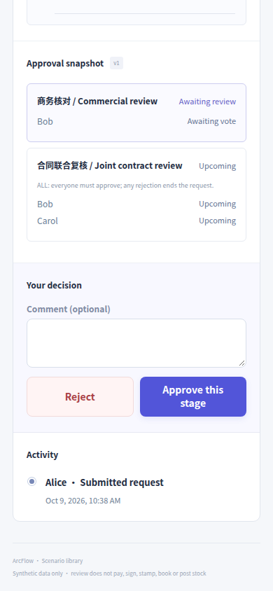
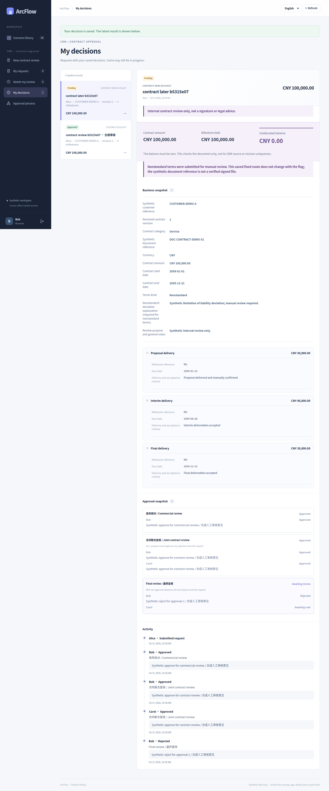
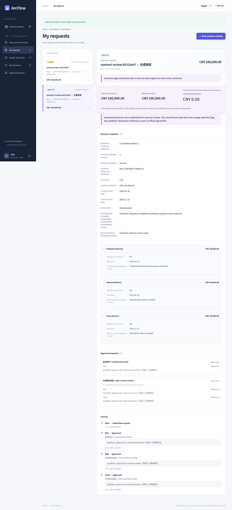
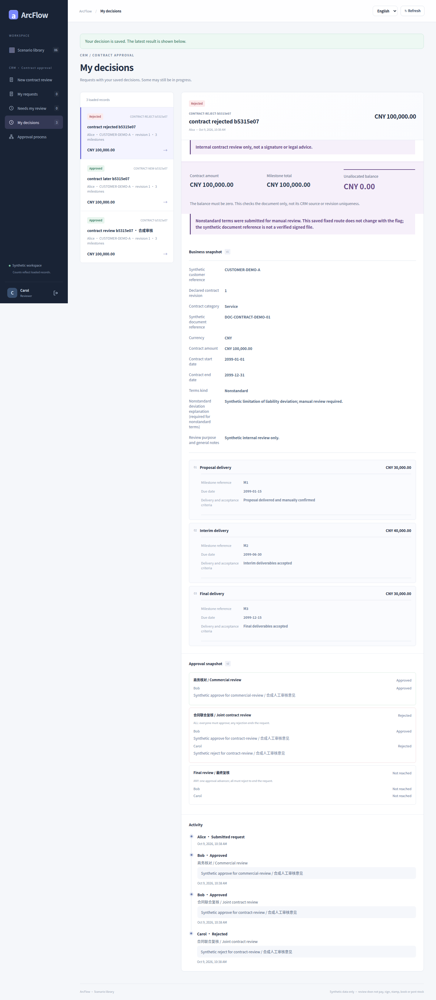

# CRM contracts · real UI gallery

[简体中文](contract.md) · [English](contract.en.md) · [Five galleries](README.en.md) · [Scenario contract](../PAYMENT_CONTRACT_SCENARIOS.md)

Terms, dates, payment milestones and acceptance criteria form the synthetic contract. Inspect multi-stage and multi-member review, amount/date validation, saved process snapshots and additional review selected by standard/nonstandard terms.

Every image is an original capture at [`8c26d95`](https://github.com/JamesCube/ArcFlow/commit/8c26d953e53991d3e445aa69c530726f1d81daae) from [run 37918452685](https://github.com/JamesCube/ArcFlow/actions/runs/37918452685), not a new capture of current main. The UI and relevant application source are unchanged at documentation baseline [`199db754`](https://github.com/JamesCube/ArcFlow/commit/199db7548f6faba5dfef105eaaf7311972adb388); this is not a test pass for a later commit. Each image labels its actual language, viewport, PNG size and capture state. Click to open the original.

## Scope and limits

No contract signing, customer notification or CRM writeback occurs. Fixed flows and conditional routes are separate synthetic tests; approved and rejected requests are separate branches. ANY in the condition editor combines conditions and can coexist with ALL voting at that stage.

Accounts and business data are synthetic. A 390px capture is a Chromium browser viewport, not the separate H5 client or physical-device acceptance; full-page height is not viewport height. UI language does not translate synthetic user-entered titles or process names.

## Process configuration and business states

### Designer: publish a new process version

v2 adds a final ANY stage after Bob’s commercial review and the Bob/Carol ALL joint review. Original v1 has only the first two stages.

UI language: English · browser viewport: 1440×1000 · full-page original: 1440×1627 px

Capture state: `designer-published` · [PNG SHA-256](../images/scenarios/provenance.json): `836da9f5d77930c641c0a6d5afa2462ccfb98a0c4a6c47899ac2ca8919c78eb9`

### Fill the complete multi-line business document

The synthetic CNY 100,000 contract has three milestones: CNY 30,000, 40,000 and 30,000.

UI language: English · browser viewport: 1440×1000 · full-page original: 1440×3631 px

Capture state: `form-filled` · [PNG SHA-256](../images/scenarios/provenance.json): `916a86474014b36519c832d338072657ed582966cf07ca2f5132344ac8ff0a33`

### Amount and field validation blocks invalid input

UI language: English · browser viewport: 1440×1000 · full-page original: 1440×3724 px

Capture state: `validation-errors` · [PNG SHA-256](../images/scenarios/provenance.json): `1b88924ded313a7c6afbc2ba393cf60ff2e330c499ff3f02a449b2617793d376`

### 390px form-summary viewport

UI language: English · browser viewport: 390×844 · viewport original: 390×844 px

Capture state: `form-summary` · [PNG SHA-256](../images/scenarios/provenance.json): `720600f44d84b1ea9fef673f0b816b191eb7e0bf44c93049a55d04d21098d9a7`

### An existing request keeps its original process snapshot

After a real v1 save and lost response, retry retains the original snapshot; the final ANY added in v2 is not appended.

UI language: English · browser viewport: 1440×1000 · full-page original: 1440×2692 px

Capture state: `saved-original-snapshot` · [PNG SHA-256](../images/scenarios/provenance.json): `788a3584baa315889e17a5b681dc13582078d5022da7648c53f07d0cacc144cc`

### Partial ALL approval: another member is still required

Original v1 request: Bob completed commercial review and voted again in joint review; Carol is still required, so status is PENDING.

UI language: English · browser viewport: 1440×1000 · full-page original: 1440×3004 px

Capture state: `all-partial` · [PNG SHA-256](../images/scenarios/provenance.json): `652660c76aec991ada9855fc3ecc2b4f5bef4f5f68c772116308f82e56ada7eb`

### 390px reviewer-control viewport

UI language: English · browser viewport: 390×844 · viewport original: 390×844 px

Capture state: `review-controls` · [PNG SHA-256](../images/scenarios/provenance.json): `0c04da3813dcb9d6136f74ef7383fe5e055165ab466e33fc6966de66cf7e0745`

### One ANY member rejects; another may still approve

This is a different v2 request: Bob rejected in the added final ANY stage, leaving it PENDING. It is not the earlier v1 request.

UI language: English · browser viewport: 1440×1000 · full-page original: 1440×3453 px

Capture state: `any-partial-rejection` · [PNG SHA-256](../images/scenarios/provenance.json): `15c6f0d2529d7f9352fdea77e689bd507cef4c03c353f0ddebfd0b38945eca8f`

### Approved request with final state and history

The original v1 request completed commercial and ALL joint review; the contract has not been signed.

UI language: English · browser viewport: 1440×1000 · full-page original: 1440×3159 px

Capture state: `approved` · [PNG SHA-256](../images/scenarios/provenance.json): `027302bf87718502c47ef85219e051cf94eb6ef4eded0bd72d4c7428b482fde4`

### A separate request reaches terminal rejection

A third request, using v2, was rejected by Carol in ALL joint review; its added final ANY never ran.

UI language: English · browser viewport: 1440×1000 · full-page original: 1440×3297 px

Capture state: `rejected` · [PNG SHA-256](../images/scenarios/provenance.json): `88fee5512aa34e00f27153bae244251e93fd08da79fa4f0a82f0d3f9771d8377`

## Additional conditional-routing test

These images come from a separate test. Typed, restricted conditions are evaluated at submission; the route and explanations stay with the request. This is not arbitrary BPMN, scripting or a free-form branching engine. Original languages and widths are preserved; missing language/viewport variants are not invented.

### Condition designer: terms IN and condition ANY

UI language: English · browser viewport: 1440×1000 · full-page original: 1440×2187 px

Capture state: `contract-in-any-editor-desktop` · [PNG SHA-256](../images/scenarios/provenance.json): `8a9dab163492e0232113b14844d2e0975f8621ca0f1ea1ac64313e570726075f`

### Chinese 390px full-page condition settings

UI language: Chinese · browser viewport: 390×844 · full-page original: 390×2431 px

Capture state: `contract-in-any-editor-zh-390px` · [PNG SHA-256](../images/scenarios/provenance.json): `122b46e0df88a0272fa77769724730cf94630536756898cd1aa91a5b6276bdc6`

### Standard terms complete their frozen route

UI language: English · browser viewport: 1440×1000 · full-page original: 1440×2859 px

Capture state: `contract-standard-complete-desktop` · [PNG SHA-256](../images/scenarios/provenance.json): `f9c67b6adfc3d0030a341242b870b613d58cfc42e99c771fa18e6cfacd7c3d86`

### Standard terms approved: Chinese 390px full page

UI language: Chinese · browser viewport: 390×844 · full-page original: 390×3548 px

Capture state: `contract-standard-complete-zh-390px` · [PNG SHA-256](../images/scenarios/provenance.json): `c07ef104beb4f77305f7e5c8e4c8f5ab673684c8a0a7902be396ce93ddee8129`

## Sources and reproduction

- [historical capture run](https://github.com/JamesCube/ArcFlow/actions/runs/37918452685) · [commit](https://github.com/JamesCube/ArcFlow/commit/8c26d953e53991d3e445aa69c530726f1d81daae)
- [Playwright fixture](https://github.com/JamesCube/ArcFlow/blob/8c26d953e53991d3e445aa69c530726f1d81daae/examples/approval-ui/e2e/complex-scenarios.spec.mjs)
- [Conditional-routing fixture](https://github.com/JamesCube/ArcFlow/blob/8c26d953e53991d3e445aa69c530726f1d81daae/examples/approval-ui/e2e/conditional-routing.spec.mjs)
- [Per-image provenance and SHA-256](../images/scenarios/provenance.json)
- [Capture commands, verification scope and gaps](CAPTURE.en.md)
