# CRM 合同 · 真实界面图集

[简体中文](contract.md) · [English](contract.en.md) · [五类图集](README.md) · [业务契约](../PAYMENT_CONTRACT_SCENARIOS.md)

合同案例包含商务条款、日期、付款里程碑与验收条件。重点看多级与多人复核、金额／日期校验、历史流程快照，以及按标准／非标条款决定的附加复核。

全部图片是提交 [`8c26d95`](https://github.com/JamesCube/ArcFlow/commit/8c26d953e53991d3e445aa69c530726f1d81daae) 的原始截图，来自[运行 37918452685](https://github.com/JamesCube/ArcFlow/actions/runs/37918452685)，不是当前 main 的重新采集。界面与相关应用源码在文档基线 [`199db754`](https://github.com/JamesCube/ArcFlow/commit/199db7548f6faba5dfef105eaaf7311972adb388) 保持一致；这不代表新提交通过了测试。每张图片下方标注实际语言、视口、PNG 尺寸和采集状态。点击图片查看原图。

[较新的一组完整条件路由采集（cb3f1077）](conditional-routing/contract.md)

<!-- topic:scope-and-limits -->
## 能力与边界

不会真实签署、通知客户或回写 CRM。固定流程与条件路由是不同合成用例；通过与驳回也是独立分支。条件编辑器的 ANY 指条件组合，可与节点的 ALL 会签同时存在。

所有账号和业务资料均为合成演示数据。390px 是 Chromium 浏览器视口，不是原生 H5 客户端或实体手机验收；长页高度不是视口高度。中英文只是界面语言，合成标题／流程名可能保留双语。

<!-- topic:process-configuration-and-business-states -->
## 流程配置与业务状态

### 流程设计器：发布新流程版本

v2 在 Bob 商务审核、Bob 与 Carol 的 ALL 联合复核之后新增最终 ANY；原 v1 只有前两步。

<a href="../images/scenarios/contract/crm-contract-designer-published-zh-desktop.png">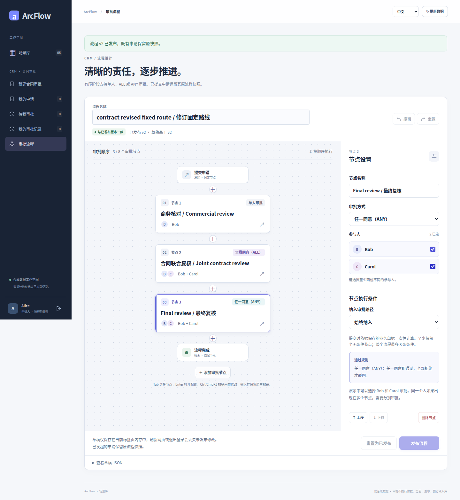</a>

界面语言: 中文 · 浏览器视口: 1440×1000 · 全页原图: 1440×1565 px

采集状态: `designer-published` · [PNG SHA-256](../images/scenarios/provenance.json): `579f0aced521775935907480fbdf24404446c83d29786218e5d9c1250b3b298a`

### 填写完整多行业务单据

合同合成总额 CNY 100,000，由 CNY 30,000、40,000、30,000 三个里程碑组成。

<a href="../images/scenarios/contract/crm-contract-form-filled-zh-desktop.png">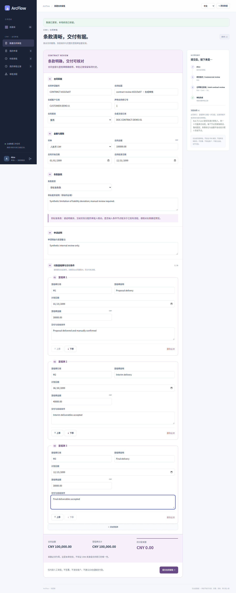</a>

界面语言: 中文 · 浏览器视口: 1440×1000 · 全页原图: 1440×3609 px

采集状态: `form-filled` · [PNG SHA-256](../images/scenarios/provenance.json): `35e6de60db68175d0af0d7b6414af29b8e23c48fd190d249735f8c263d108df5`

### 金额与字段校验：阻止无效提交

<a href="../images/scenarios/contract/crm-contract-validation-errors-zh-desktop.png">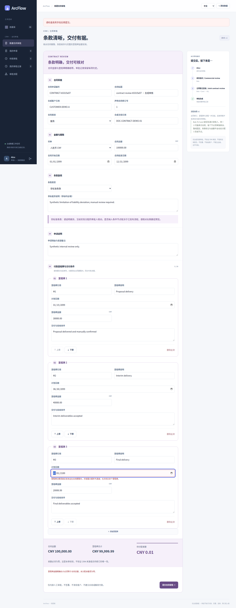</a>

界面语言: 中文 · 浏览器视口: 1440×1000 · 全页原图: 1440×3702 px

采集状态: `validation-errors` · [PNG SHA-256](../images/scenarios/provenance.json): `be7397a91e9a40e191a90b16a1d2a16ae56cdc1182cd7c039667e5ac5c3f31af`

### 390px 表单汇总视口

<a href="../images/scenarios/contract/crm-contract-form-summary-zh-390.png">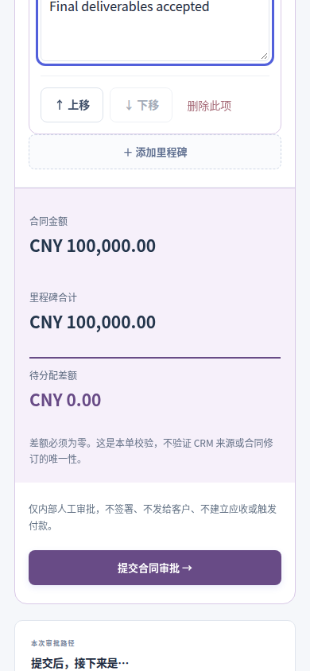</a>

界面语言: 中文 · 浏览器视口: 390×844 · 视口原图: 390×844 px

采集状态: `form-summary` · [PNG SHA-256](../images/scenarios/provenance.json): `9bc0c6f34a548318428076c2f0931d4855bc156bae1564aa242bad118a5f3fca`

### 旧申请继续使用原始流程快照

原 v1 请求在真实保存后丢失返回，重试继续使用原快照，不会追加 v2 新增的最终 ANY。

<a href="../images/scenarios/contract/crm-contract-saved-original-snapshot-zh-desktop.png">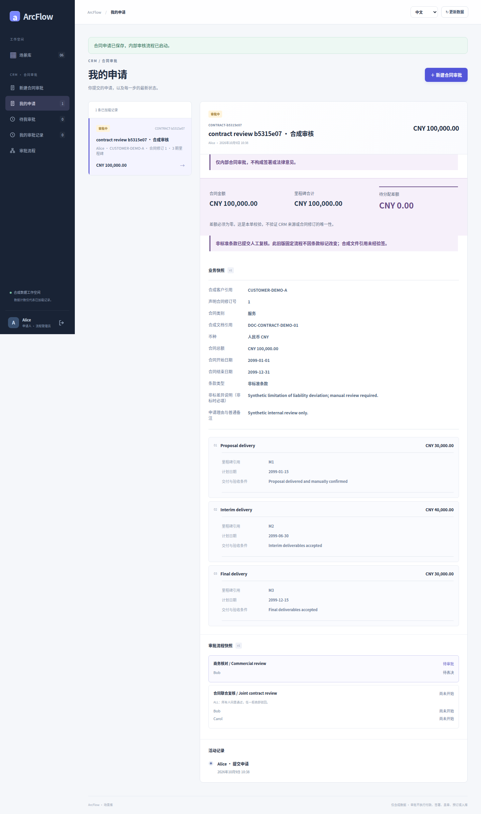</a>

界面语言: 中文 · 浏览器视口: 1440×1000 · 全页原图: 1440×2436 px

采集状态: `saved-original-snapshot` · [PNG SHA-256](../images/scenarios/provenance.json): `89e7b35ba83f1314f78d9d042a39f8a9e0244d2b4b962c35eb4422ef20ea9b50`

### ALL 部分通过：仍等待另一成员

原 v1 申请：Bob 已完成商务审核并再次在联合复核投票，仍等待 Carol；状态 PENDING。

<a href="../images/scenarios/contract/crm-contract-all-partial-zh-desktop.png">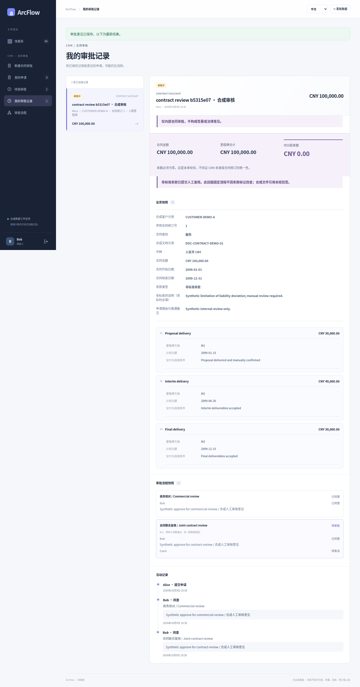</a>

界面语言: 中文 · 浏览器视口: 1440×1000 · 全页原图: 1440×2748 px

采集状态: `all-partial` · [PNG SHA-256](../images/scenarios/provenance.json): `8748b9e0101ea3881713a4f6bb06280a9b019820f0527e992b79cbba3c740548`

### 390px 审核操作视口

<a href="../images/scenarios/contract/crm-contract-review-controls-zh-390.png">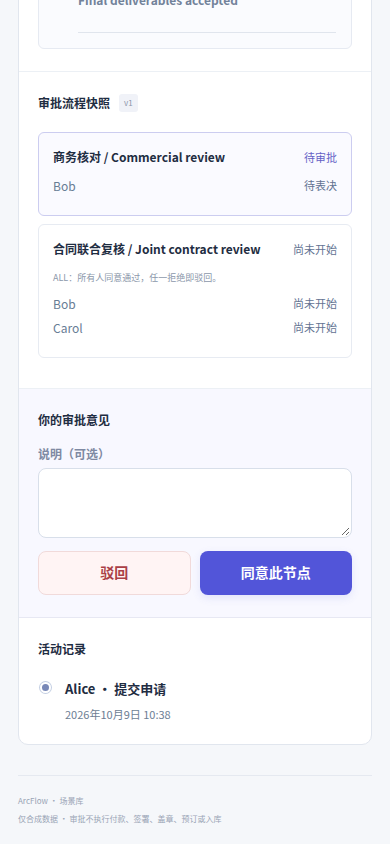</a>

界面语言: 中文 · 浏览器视口: 390×844 · 视口原图: 390×844 px

采集状态: `review-controls` · [PNG SHA-256](../images/scenarios/provenance.json): `7ceaa3b8c9564a2ceef031ef07fed789042b5ece93b433022ea4f3783c595e58`

### ANY 一人拒绝：其他成员仍可同意

这是另一笔 v2 申请：进入新增最终 ANY 后 Bob 拒绝，状态仍 PENDING。不是前面的 v1 申请。

<a href="../images/scenarios/contract/crm-contract-any-partial-rejection-zh-desktop.png">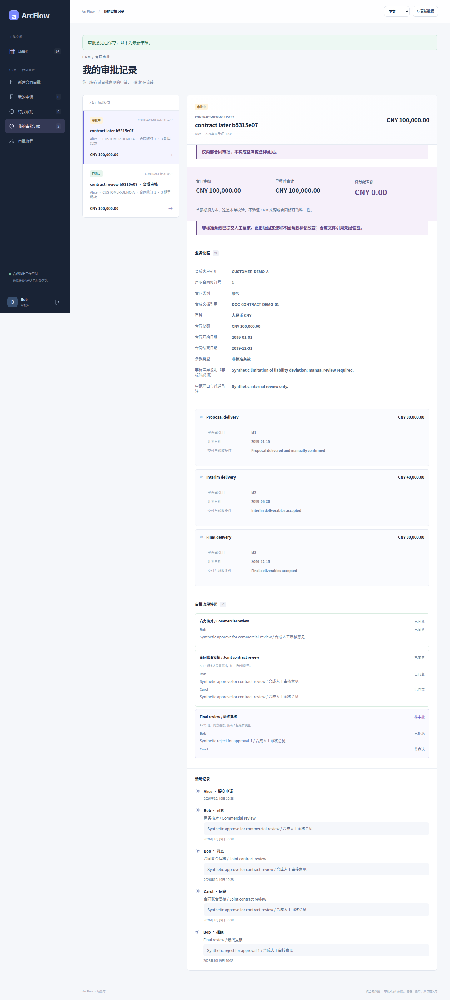</a>

界面语言: 中文 · 浏览器视口: 1440×1000 · 全页原图: 1440×3197 px

采集状态: `any-partial-rejection` · [PNG SHA-256](../images/scenarios/provenance.json): `764a2d583d2e0a3e02fcd68e1034831c4139163c13a04d52359c0e04188315b7`

### 申请通过：保存最终状态和历史

原 v1 申请完成商务审核与 ALL 联合复核；合同未被签署。

<a href="../images/scenarios/contract/crm-contract-approved-zh-desktop.png">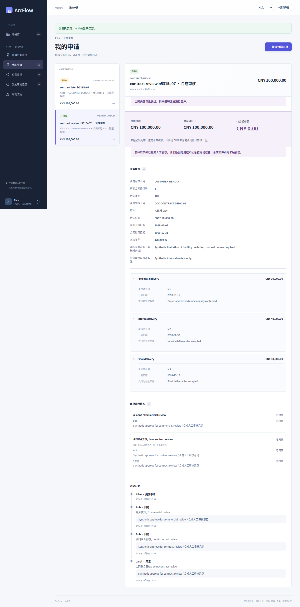</a>

界面语言: 中文 · 浏览器视口: 1440×1000 · 全页原图: 1440×2904 px

采集状态: `approved` · [PNG SHA-256](../images/scenarios/provenance.json): `e5eb27c0dc2a1a45d07308b84c4648b7110fbe53d0960d2191ffff00af3392b6`

### 独立申请：最终驳回

第三笔 v2 申请在 ALL 联合复核被 Carol 拒绝；新增的最终 ANY 未执行。

<a href="../images/scenarios/contract/crm-contract-rejected-zh-desktop.png">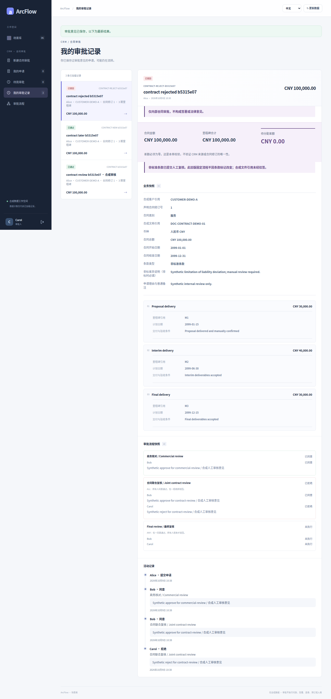</a>

界面语言: 中文 · 浏览器视口: 1440×1000 · 全页原图: 1440×3042 px

采集状态: `rejected` · [PNG SHA-256](../images/scenarios/provenance.json): `540ff82ba60279e889ad1857adaa04649a219ee19ddc50d633019d3bb4a213a4`

<!-- topic:conditional-routing-supplement -->
## 条件路由补充用例

以下图片来自另一独立用例。条件在提交时求值，路径与解释随申请保存；这是有类型的受限条件，不是任意 BPMN、脚本或自由分支引擎。截图保留真实语言与宽度，没有人为补齐不存在的语言／视口版本。

### 条件设计器：条款 IN 与条件 ANY

<a href="../images/scenarios/contract/contract-in-any-editor-desktop.png">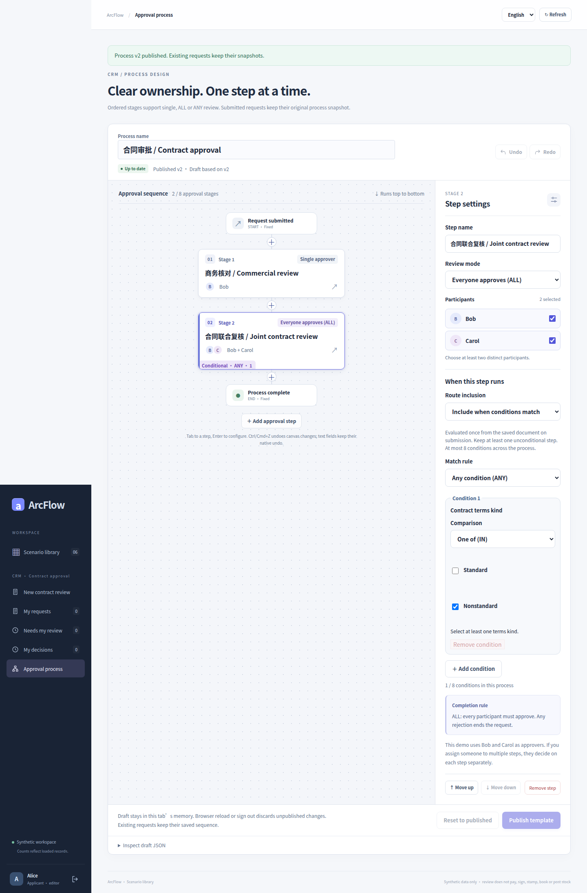</a>

界面语言: English · 浏览器视口: 1440×1000 · 全页原图: 1440×2187 px

采集状态: `contract-in-any-editor-desktop` · [PNG SHA-256](../images/scenarios/provenance.json): `8a9dab163492e0232113b14844d2e0975f8621ca0f1ea1ac64313e570726075f`

### 中文 390px 条件设置长页

<a href="../images/scenarios/contract/contract-in-any-editor-zh-390px.png">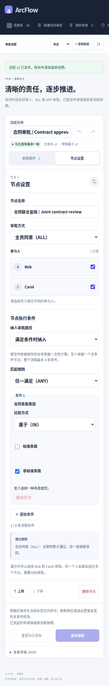</a>

界面语言: 中文 · 浏览器视口: 390×844 · 全页原图: 390×2431 px

采集状态: `contract-in-any-editor-zh-390px` · [PNG SHA-256](../images/scenarios/provenance.json): `122b46e0df88a0272fa77769724730cf94630536756898cd1aa91a5b6276bdc6`

### 标准条款：按冻结路径完成审批

<a href="../images/scenarios/contract/contract-standard-complete-desktop.png">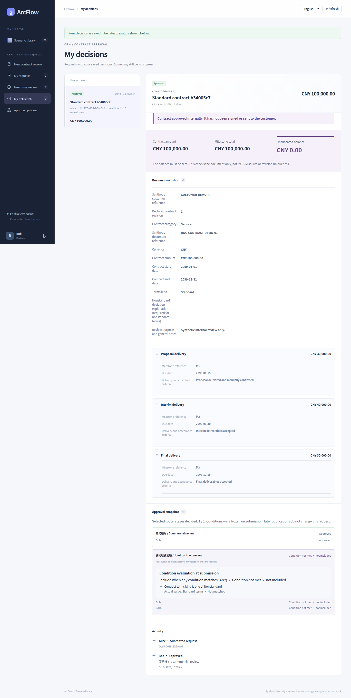</a>

界面语言: English · 浏览器视口: 1440×1000 · 全页原图: 1440×2859 px

采集状态: `contract-standard-complete-desktop` · [PNG SHA-256](../images/scenarios/provenance.json): `f9c67b6adfc3d0030a341242b870b613d58cfc42e99c771fa18e6cfacd7c3d86`

### 标准条款通过：中文 390px 长页

<a href="../images/scenarios/contract/contract-standard-complete-zh-390px.png">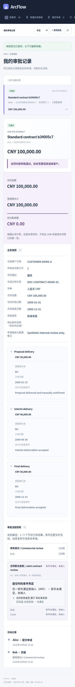</a>

界面语言: 中文 · 浏览器视口: 390×844 · 全页原图: 390×3548 px

采集状态: `contract-standard-complete-zh-390px` · [PNG SHA-256](../images/scenarios/provenance.json): `c07ef104beb4f77305f7e5c8e4c8f5ab673684c8a0a7902be396ce93ddee8129`

<!-- topic:sources-and-reproduction -->
## 来源与复现

- [历史采集运行](https://github.com/JamesCube/ArcFlow/actions/runs/37918452685) · [commit](https://github.com/JamesCube/ArcFlow/commit/8c26d953e53991d3e445aa69c530726f1d81daae)
- [Playwright fixture](https://github.com/JamesCube/ArcFlow/blob/8c26d953e53991d3e445aa69c530726f1d81daae/examples/approval-ui/e2e/complex-scenarios.spec.mjs)
- [Conditional-routing fixture](https://github.com/JamesCube/ArcFlow/blob/8c26d953e53991d3e445aa69c530726f1d81daae/examples/approval-ui/e2e/conditional-routing.spec.mjs)
- [逐图来源与 SHA-256](../images/scenarios/provenance.json)
- [采集命令、验证范围与缺口](CAPTURE.md)
