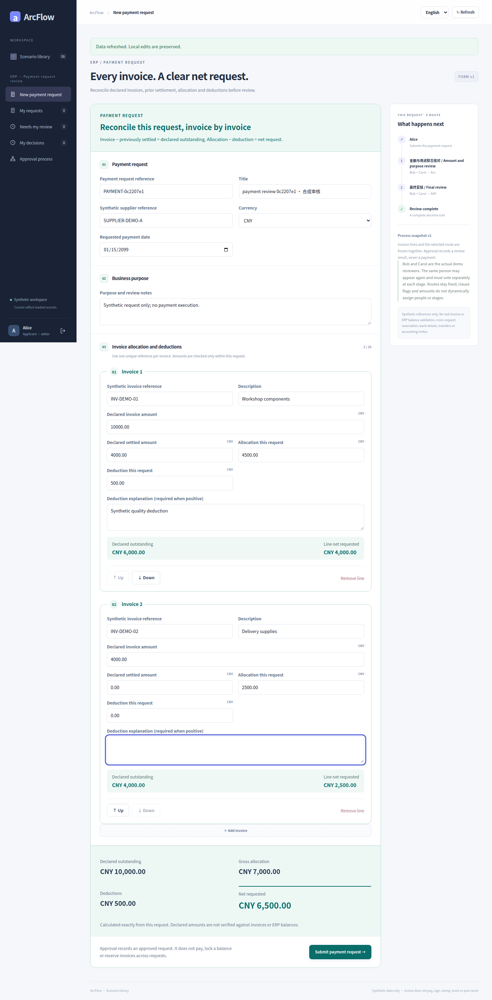
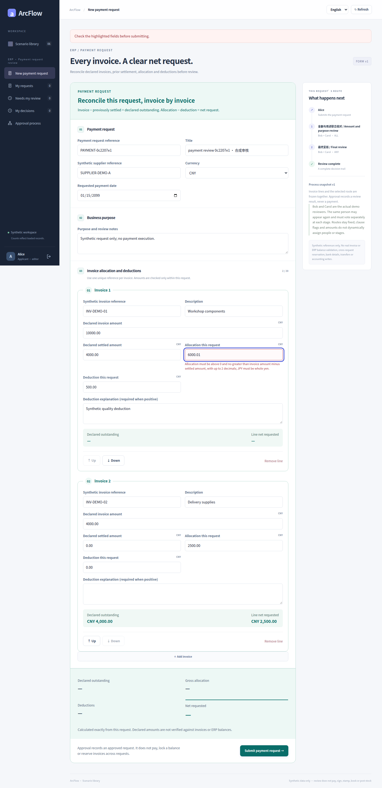
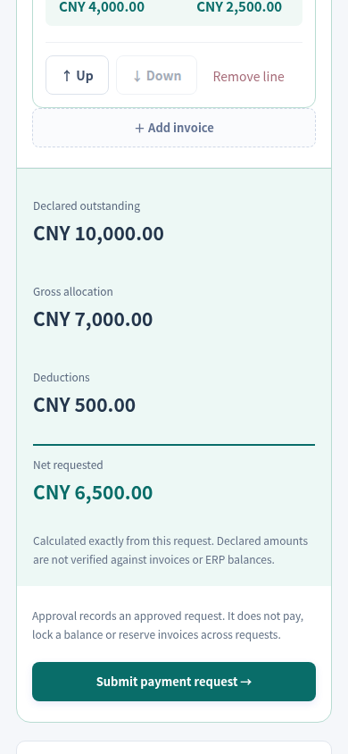
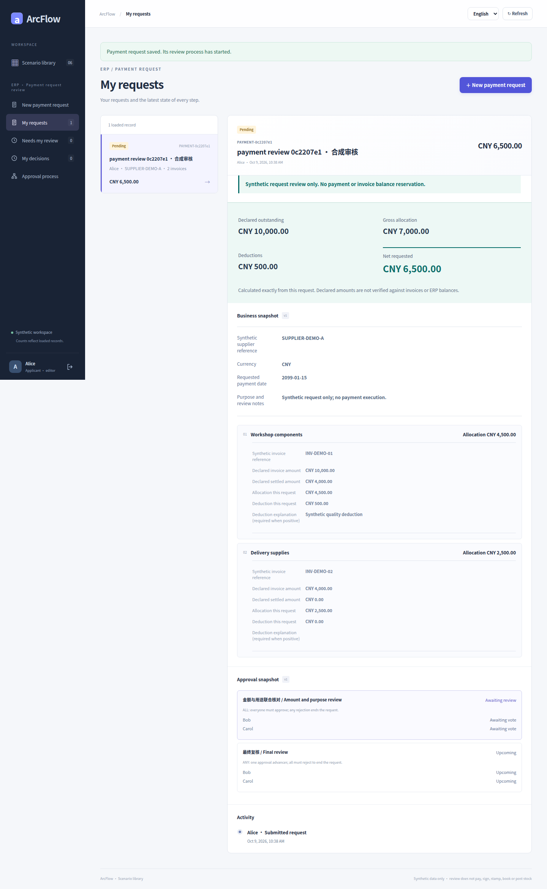
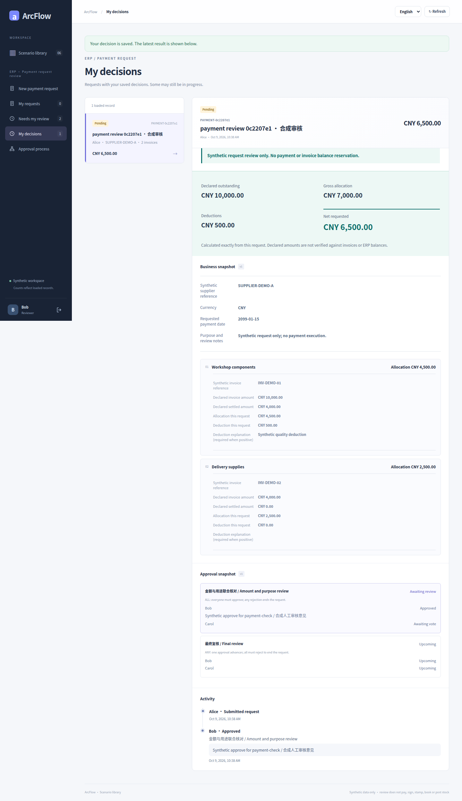
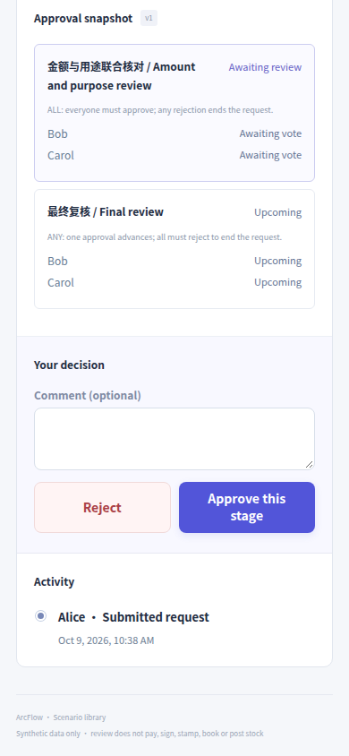
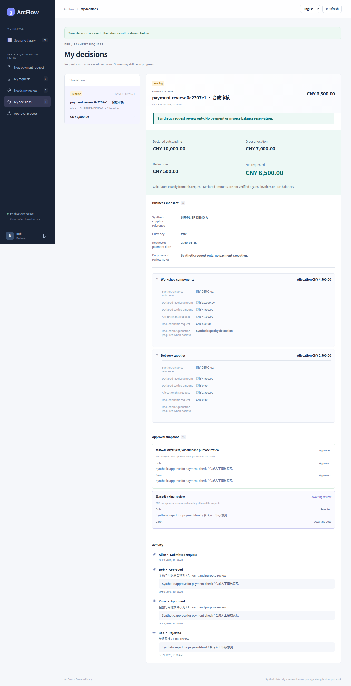
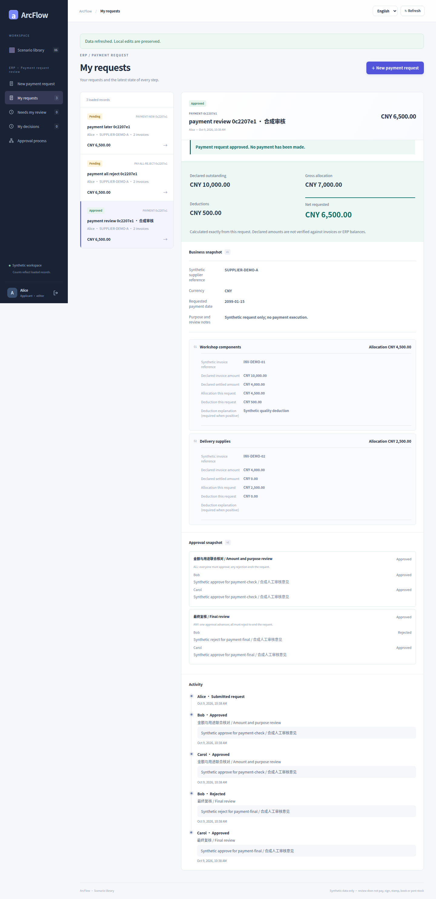
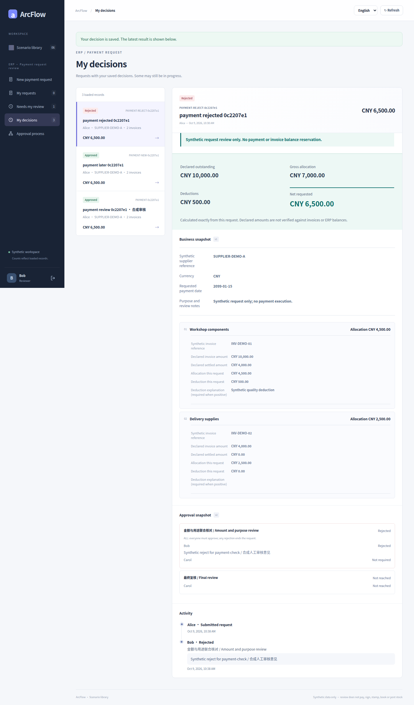

# ERP payment requests · real UI gallery

[简体中文](payment.md) · [English](payment.en.md) · [Five galleries](README.en.md) · [Scenario contract](../PAYMENT_CONTRACT_SCENARIOS.md)

Invoice allocations, declared settled amounts, deductions and the net request amount demonstrate exact-money validation. Inspect ALL voting, a partial ANY rejection, original snapshots after publication, and routes frozen from the net amount.

Every image is an original capture at [`8c26d95`](https://github.com/JamesCube/ArcFlow/commit/8c26d953e53991d3e445aa69c530726f1d81daae) from [run 37918452685](https://github.com/JamesCube/ArcFlow/actions/runs/37918452685), not a new capture of current main. The UI and relevant application source are unchanged at documentation baseline [`199db754`](https://github.com/JamesCube/ArcFlow/commit/199db7548f6faba5dfef105eaaf7311972adb388); this is not a test pass for a later commit. Each image labels its actual language, viewport, PNG size and capture state. Click to open the original.

## Scope and limits

This reviews a request; it does not transfer money, lock a balance or verify a real invoice. Fixed-flow and conditional-routing captures come from different tests and requests, not one continuous transaction. A partial ANY rejection can remain PENDING.

Accounts and business data are synthetic. A 390px capture is a Chromium browser viewport, not the separate H5 client or physical-device acceptance; full-page height is not viewport height. UI language does not translate synthetic user-entered titles or process names.

## Process configuration and business states

### Designer: publish a new process version

This publishes v2, changing the final stage from ANY to Carol alone. The original request below still follows v1 ALL → ANY.

UI language: English · browser viewport: 1440×1000 · full-page original: 1440×1517 px

Capture state: `designer-published` · [PNG SHA-256](../images/scenarios/provenance.json): `afbf07ac76117ad4a32c34e0f6119b1d5b58e32d03adfb8930100ea61732121f`

### Fill the complete multi-line business document

The synthetic request allocates CNY 7,000, deducts CNY 500 and requests a net CNY 6,500.

UI language: English · browser viewport: 1440×1000 · full-page original: 1440×2921 px

Capture state: `form-filled` · [PNG SHA-256](../images/scenarios/provenance.json): `006d0f8f33d79816753f7c2b85baa41a9bab7502089c99014e499afa80ff1f46`

### Amount and field validation blocks invalid input

UI language: English · browser viewport: 1440×1000 · full-page original: 1440×2968 px

Capture state: `validation-errors` · [PNG SHA-256](../images/scenarios/provenance.json): `28b238c2ef45ccee367164e3f6f5acf5532648c7f5a56c04d56a020f8b14a57e`

### 390px form-summary viewport

UI language: English · browser viewport: 390×844 · viewport original: 390×844 px

Capture state: `form-summary` · [PNG SHA-256](../images/scenarios/provenance.json): `7ad778b269128503c5c52168c4e3f0ab239bcc867b4f9901fbac87d8d187cac7`

### An existing request keeps its original process snapshot

This v1 request was really saved before response delivery was lost, then retried with its original key. Publishing v2 did not rewrite its ALL → ANY snapshot.

UI language: English · browser viewport: 1440×1000 · full-page original: 1440×2341 px

Capture state: `saved-original-snapshot` · [PNG SHA-256](../images/scenarios/provenance.json): `312879b7a33cb2f25c8a1d5ac778e0e61ca50dd579b518b681c07026ab4df801`

### Partial ALL approval: another member is still required

Original v1 request: Bob approved, Carol has not voted; status remains PENDING.

UI language: English · browser viewport: 1440×1000 · full-page original: 1440×2497 px

Capture state: `all-partial` · [PNG SHA-256](../images/scenarios/provenance.json): `a4e248a63634531a1467953ae978f53037dd164d31af9acae346bc3a0a3d5719`

### 390px reviewer-control viewport

UI language: English · browser viewport: 390×844 · viewport original: 390×844 px

Capture state: `review-controls` · [PNG SHA-256](../images/scenarios/provenance.json): `db6c16804ba1535425d56a3acc878ac7d1308d5d4ff1eb37b997b04760cd8ce0`

### One ANY member rejects; another may still approve

Final ANY stage of the original v1 request: Bob’s rejection leaves PENDING, and Carol may still approve.

UI language: English · browser viewport: 1440×1000 · full-page original: 1440×2809 px

Capture state: `any-partial-rejection` · [PNG SHA-256](../images/scenarios/provenance.json): `21688df7b530a40987977c989d4749829b969ab4ab0061084eb0e0b526b465b9`

### Approved request with final state and history

The original v1 request completed ALL → ANY and is approved; no payment occurred.

UI language: English · browser viewport: 1440×1000 · full-page original: 1440×2965 px

Capture state: `approved` · [PNG SHA-256](../images/scenarios/provenance.json): `8f198b6cddd1a50ff6a259edcd08539dfc2957d703c32520b994a04cdb2db1dd`

### A separate request reaches terminal rejection

A separate v2 request was rejected by Bob in the ALL group; the earlier approved request was not changed.

UI language: English · browser viewport: 1440×1000 · full-page original: 1440×2449 px

Capture state: `rejected` · [PNG SHA-256](../images/scenarios/provenance.json): `d78aff7bd53c2d0aeba7152c9427924108be4a4981aa32055e2107d8bcfd31eb`

## Additional conditional-routing test

These images come from a separate test. Typed, restricted conditions are evaluated at submission; the route and explanations stay with the request. This is not arbitrary BPMN, scripting or a free-form branching engine. Original languages and widths are preserved; missing language/viewport variants are not invented.

### Condition designer: select extra review by net amount

UI language: English · browser viewport: 1440×1000 · full-page original: 1440×2172 px

Capture state: `payment-conditions-en-desktop` · [PNG SHA-256](../images/scenarios/provenance.json): `fbeb614b6314df0e50077f338a32c6a77324541605caac725690d4fa2816c43a`

### Chinese 390px full-page condition settings

UI language: Chinese · browser viewport: 390×844 · full-page original: 390×2501 px

Capture state: `payment-conditions-zh-390px` · [PNG SHA-256](../images/scenarios/provenance.json): `971f82ece66978be5f03450f327f7aa9b5d5ff6f9d3366bb9ab8e75c275bf5f2`

### Lower amount: frozen route excludes a stage

UI language: English · browser viewport: 1440×1000 · full-page original: 1440×2515 px

Capture state: `payment-low-frozen-desktop` · [PNG SHA-256](../images/scenarios/provenance.json): `0824d3b56a1002d7fc8bfb76c6e59acde43cb09a92fb2f8675d244c01764ea27`

### Higher amount: approved after additional review

The net amount is exactly CNY 10,000, meeting the greater-than-or-equal-to CNY 10,000 threshold. It completes the additional ALL review and final ANY stage; it is not strictly above the threshold.

UI language: English · browser viewport: 1440×1000 · full-page original: 1440×2771 px

Capture state: `payment-high-complete-desktop` · [PNG SHA-256](../images/scenarios/provenance.json): `4e444bf5289b5bd779b351abba9a7fd563d0279f77bac933f35823582243c0ad`

### Lower amount approved: 390px full page

UI language: Chinese · browser viewport: 390×844 · full-page original: 390×3602 px

Capture state: `payment-low-complete-zh-390px` · [PNG SHA-256](../images/scenarios/provenance.json): `fcd2cf6728b4780f593f6f6e33e4a7b2d38feb5e56c4202760a5f84b3f5c2b92`

## Sources and reproduction

- [historical capture run](https://github.com/JamesCube/ArcFlow/actions/runs/37918452685) · [commit](https://github.com/JamesCube/ArcFlow/commit/8c26d953e53991d3e445aa69c530726f1d81daae)
- [Playwright fixture](https://github.com/JamesCube/ArcFlow/blob/8c26d953e53991d3e445aa69c530726f1d81daae/examples/approval-ui/e2e/complex-scenarios.spec.mjs)
- [Conditional-routing fixture](https://github.com/JamesCube/ArcFlow/blob/8c26d953e53991d3e445aa69c530726f1d81daae/examples/approval-ui/e2e/conditional-routing.spec.mjs)
- [Per-image provenance and SHA-256](../images/scenarios/provenance.json)
- [Capture commands, verification scope and gaps](CAPTURE.en.md)
