# ERP 付款申请 · 真实界面图集

[简体中文](payment.md) · [English](payment.en.md) · [五类图集](README.md) · [业务契约](../PAYMENT_CONTRACT_SCENARIOS.md)

付款申请以发票分摊、申报已结算额、扣减和净申请金额展示精确金额校验。重点看 ALL 会签、ANY 部分拒绝、版本发布后旧单不变，以及按净金额冻结的条件路径。

全部图片是提交 [`8c26d95`](https://github.com/JamesCube/ArcFlow/commit/8c26d953e53991d3e445aa69c530726f1d81daae) 的原始截图，来自[运行 37918452685](https://github.com/JamesCube/ArcFlow/actions/runs/37918452685)，不是当前 main 的重新采集。界面与相关应用源码在文档基线 [`199db754`](https://github.com/JamesCube/ArcFlow/commit/199db7548f6faba5dfef105eaaf7311972adb388) 保持一致；这不代表新提交通过了测试。每张图片下方标注实际语言、视口、PNG 尺寸和采集状态。点击图片查看原图。

<!-- topic:scope-and-limits -->
## 能力与边界

这是申请审批，不会转账、锁定余额或验证真实发票。固定流程与条件路由来自不同用例和申请，不能拼成同一笔交易的连续状态。ANY 部分拒绝仍可为 PENDING。

所有账号和业务资料均为合成演示数据。390px 是 Chromium 浏览器视口，不是原生 H5 客户端或实体手机验收；长页高度不是视口高度。中英文只是界面语言，合成标题／流程名可能保留双语。

<!-- topic:process-configuration-and-business-states -->
## 流程配置与业务状态

### 流程设计器：发布新流程版本

这里发布 v2：将末步从 ANY 改为 Carol 单人复核。后面的旧单仍按 v1 的 ALL → ANY 处理。

<a href="../images/scenarios/payment/erp-payment-designer-published-zh-desktop.png">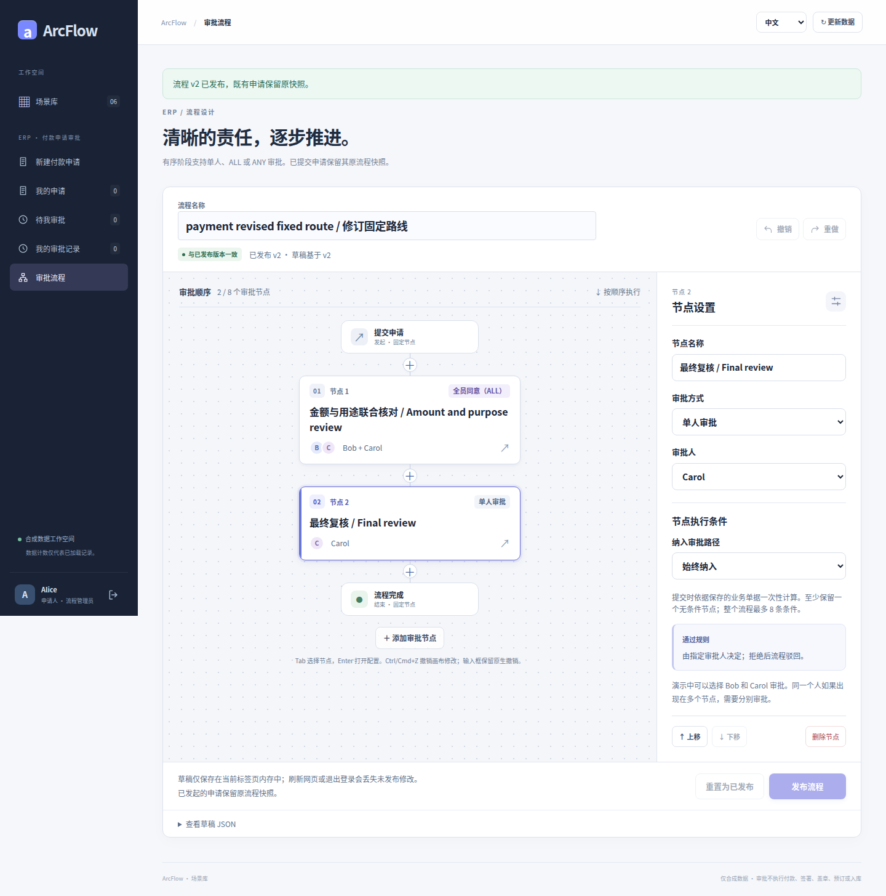</a>

界面语言: 中文 · 浏览器视口: 1440×1000 · 全页原图: 1440×1455 px

采集状态: `designer-published` · [PNG SHA-256](../images/scenarios/provenance.json): `7f9a5f0db4067296dc65d24a9e87d8d442b8ea68c4cdf6ac55d644fa7a73129d`

### 填写完整多行业务单据

示例分摊总额 CNY 7,000，扣减 CNY 500，净申请 CNY 6,500；这是合成付款申请金额。

<a href="../images/scenarios/payment/erp-payment-form-filled-zh-desktop.png">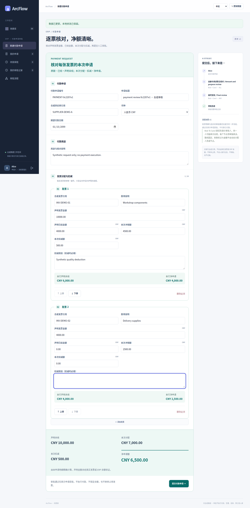</a>

界面语言: 中文 · 浏览器视口: 1440×1000 · 全页原图: 1440×2921 px

采集状态: `form-filled` · [PNG SHA-256](../images/scenarios/provenance.json): `c4c694e667b0e06f07aff707cf71a55cfe07276de07c7eeceb93b0cea21fdbd1`

### 金额与字段校验：阻止无效提交

<a href="../images/scenarios/payment/erp-payment-validation-errors-zh-desktop.png">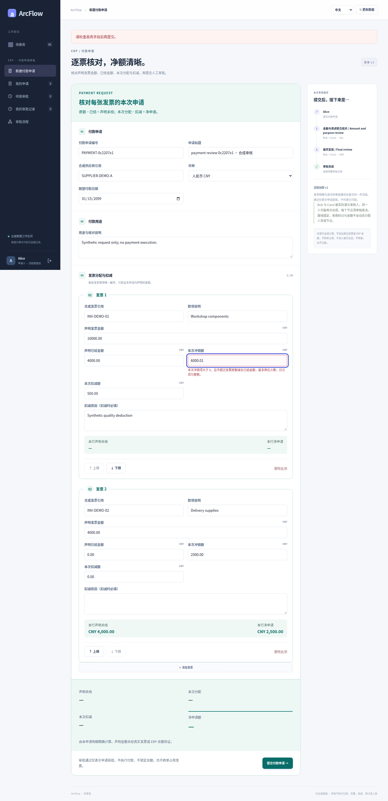</a>

界面语言: 中文 · 浏览器视口: 1440×1000 · 全页原图: 1440×2968 px

采集状态: `validation-errors` · [PNG SHA-256](../images/scenarios/provenance.json): `aa237b48511e70a73ed9c1d253393dced5c91267635e0cc85c59a4a74a367bda`

### 390px 表单汇总视口

<a href="../images/scenarios/payment/erp-payment-form-summary-zh-390.png">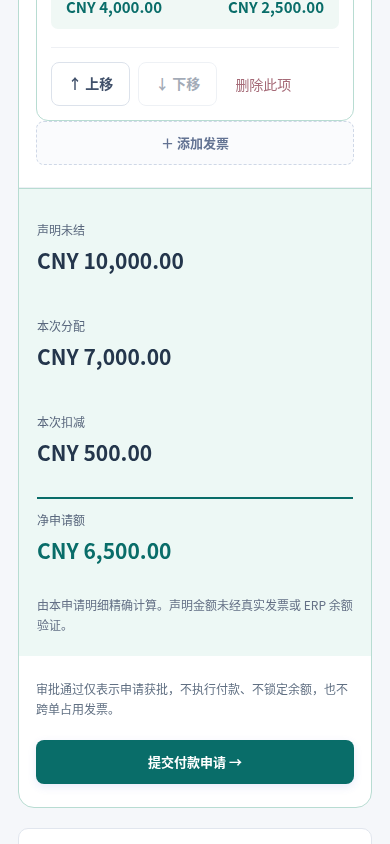</a>

界面语言: 中文 · 浏览器视口: 390×844 · 视口原图: 390×844 px

采集状态: `form-summary` · [PNG SHA-256](../images/scenarios/provenance.json): `b31d8ba81f99e3de68a46d21defa8db8e29da111864c7644b22469eae7aa8220`

### 旧申请继续使用原始流程快照

这笔 v1 申请真实保存后丢失返回，再按原键重试；后续发布 v2 不改写它的 ALL → ANY 快照。

<a href="../images/scenarios/payment/erp-payment-saved-original-snapshot-zh-desktop.png">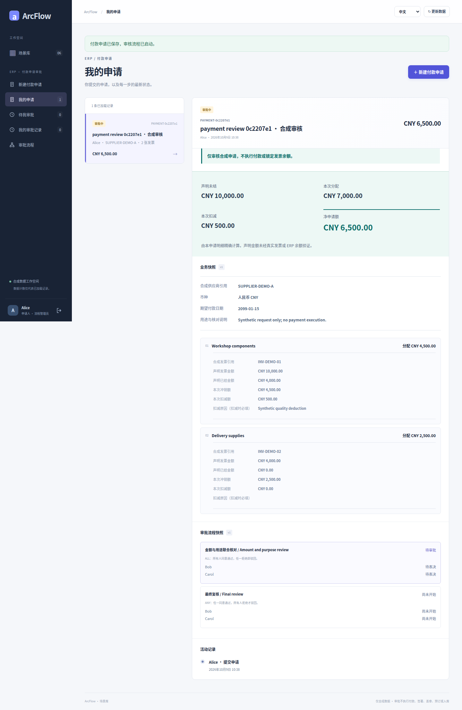</a>

界面语言: 中文 · 浏览器视口: 1440×1000 · 全页原图: 1440×2209 px

采集状态: `saved-original-snapshot` · [PNG SHA-256](../images/scenarios/provenance.json): `47f42c2e2f6f7df1c6d06899a397ea392bc5e32885c0091b8ff4e6558beac8ee`

### ALL 部分通过：仍等待另一成员

原 v1 申请：Bob 已同意，Carol 仍未投票，状态 PENDING。

<a href="../images/scenarios/payment/erp-payment-all-partial-zh-desktop.png">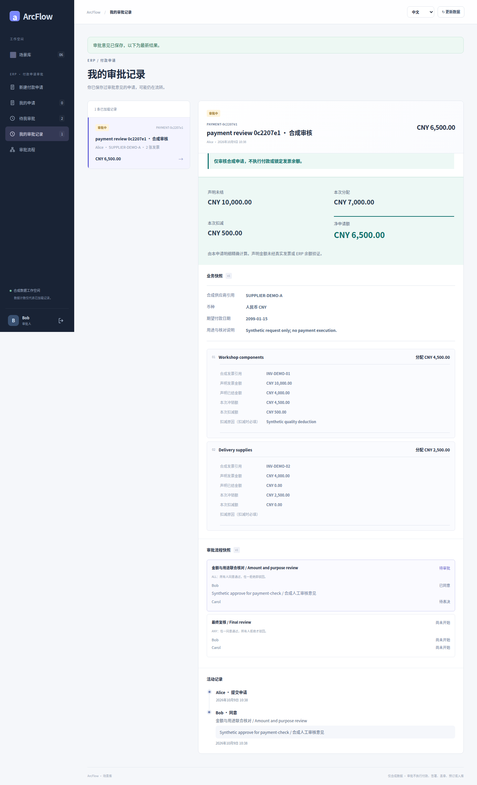</a>

界面语言: 中文 · 浏览器视口: 1440×1000 · 全页原图: 1440×2365 px

采集状态: `all-partial` · [PNG SHA-256](../images/scenarios/provenance.json): `96fa3755464003021a40787d95e4c0bc9b286615450690862171c2a9b62b6d11`

### 390px 审核操作视口

<a href="../images/scenarios/payment/erp-payment-review-controls-zh-390.png">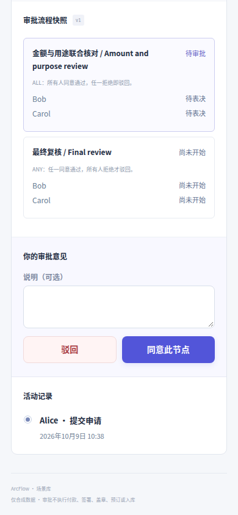</a>

界面语言: 中文 · 浏览器视口: 390×844 · 视口原图: 390×844 px

采集状态: `review-controls` · [PNG SHA-256](../images/scenarios/provenance.json): `0d4ad430fafbe17fca1176e2aa7aea1fbc105679a76a0bde8e69147f92e02a00`

### ANY 一人拒绝：其他成员仍可同意

原 v1 申请的末步 ANY：Bob 拒绝后仍为 PENDING，Carol 仍可同意。

<a href="../images/scenarios/payment/erp-payment-any-partial-rejection-zh-desktop.png">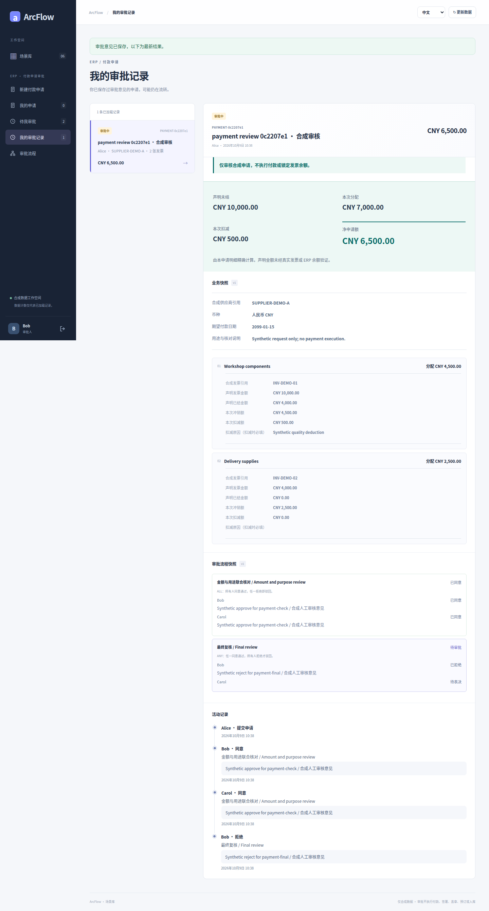</a>

界面语言: 中文 · 浏览器视口: 1440×1000 · 全页原图: 1440×2677 px

采集状态: `any-partial-rejection` · [PNG SHA-256](../images/scenarios/provenance.json): `9ca06967b3acc04b7ef18f8948aa7a6d9168f0c2a4f05087fa29622ef9a5d36c`

### 申请通过：保存最终状态和历史

原 v1 申请完成 ALL → ANY，审批通过；没有发生付款。

<a href="../images/scenarios/payment/erp-payment-approved-zh-desktop.png">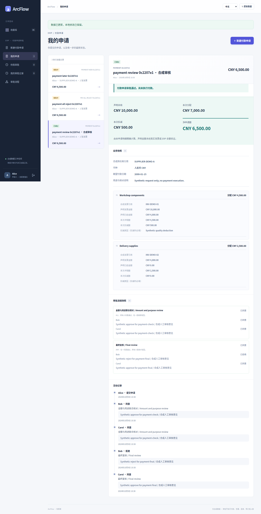</a>

界面语言: 中文 · 浏览器视口: 1440×1000 · 全页原图: 1440×2833 px

采集状态: `approved` · [PNG SHA-256](../images/scenarios/provenance.json): `5979dbdbe3167817a29548231a28bd1e37f4478371cedb573b71f0b9a08427ad`

### 独立申请：最终驳回

这是另一笔 v2 申请，被 Bob 在 ALL 组拒绝；不是修改前面已通过申请的结果。

<a href="../images/scenarios/payment/erp-payment-rejected-zh-desktop.png">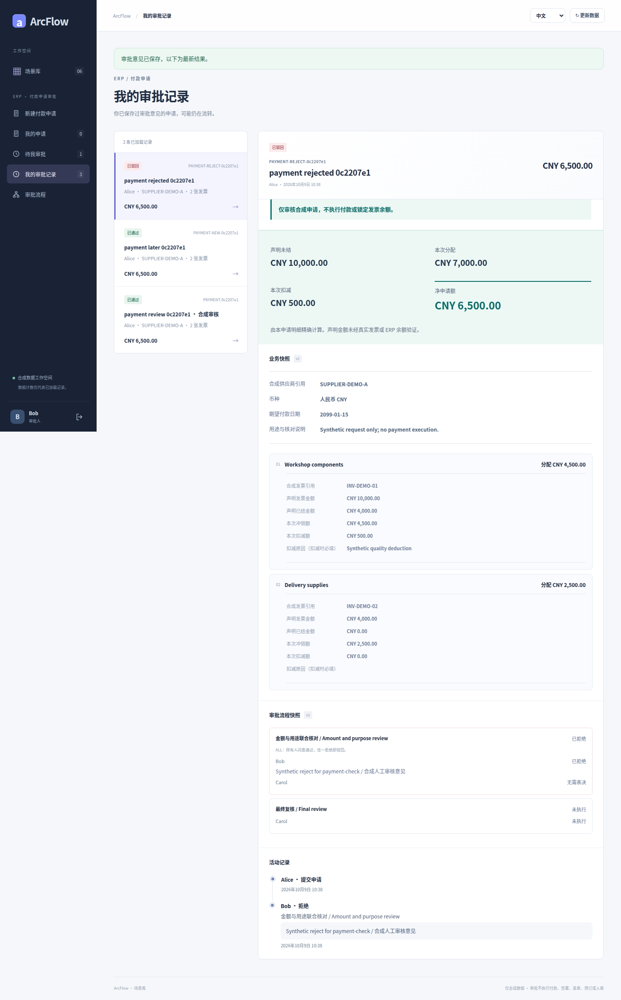</a>

界面语言: 中文 · 浏览器视口: 1440×1000 · 全页原图: 1440×2317 px

采集状态: `rejected` · [PNG SHA-256](../images/scenarios/provenance.json): `8e5ccfa35f421e3fea80f5c88f398e35a6d800541ed12cdce215b7cc6323e5f7`

<!-- topic:conditional-routing-supplement -->
## 条件路由补充用例

以下图片来自另一独立用例。条件在提交时求值，路径与解释随申请保存；这是有类型的受限条件，不是任意 BPMN、脚本或自由分支引擎。截图保留真实语言与宽度，没有人为补齐不存在的语言／视口版本。

### 条件设计器：按净金额选择附加复核

<a href="../images/scenarios/payment/payment-conditions-en-desktop.png">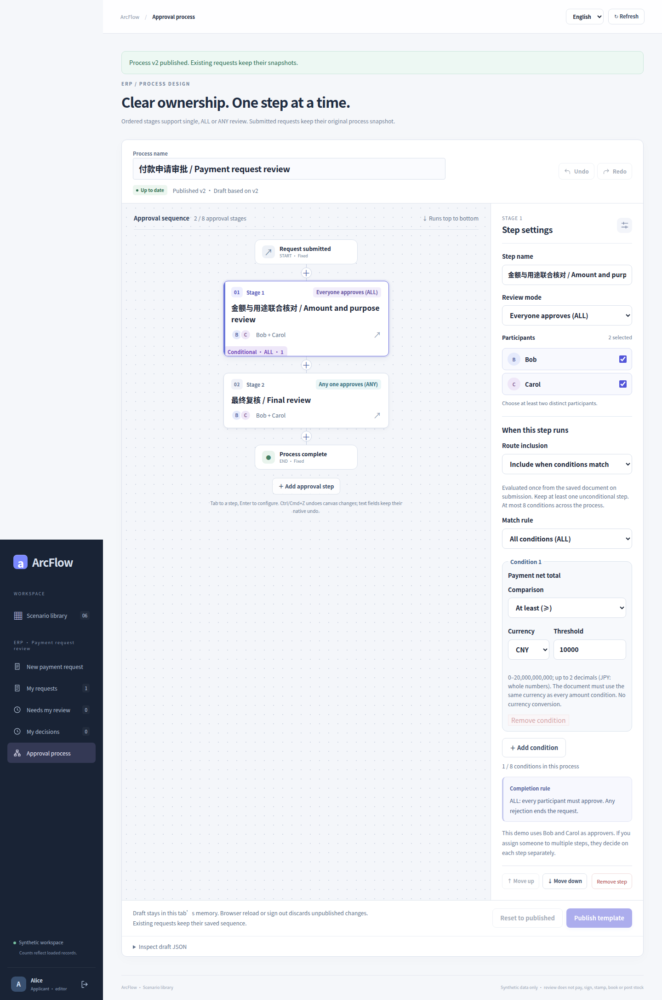</a>

界面语言: English · 浏览器视口: 1440×1000 · 全页原图: 1440×2172 px

采集状态: `payment-conditions-en-desktop` · [PNG SHA-256](../images/scenarios/provenance.json): `fbeb614b6314df0e50077f338a32c6a77324541605caac725690d4fa2816c43a`

### 中文 390px 条件设置长页

<a href="../images/scenarios/payment/payment-conditions-zh-390px.png">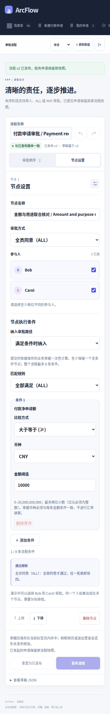</a>

界面语言: 中文 · 浏览器视口: 390×844 · 全页原图: 390×2501 px

采集状态: `payment-conditions-zh-390px` · [PNG SHA-256](../images/scenarios/provenance.json): `971f82ece66978be5f03450f327f7aa9b5d5ff6f9d3366bb9ab8e75c275bf5f2`

### 低金额申请：保存排除步骤的路径

<a href="../images/scenarios/payment/payment-low-frozen-desktop.png">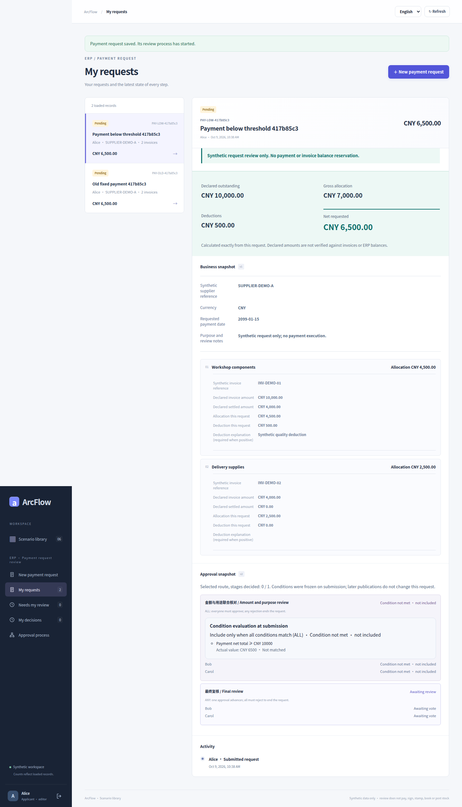</a>

界面语言: English · 浏览器视口: 1440×1000 · 全页原图: 1440×2515 px

采集状态: `payment-low-frozen-desktop` · [PNG SHA-256](../images/scenarios/provenance.json): `0824d3b56a1002d7fc8bfb76c6e59acde43cb09a92fb2f8675d244c01764ea27`

### 高金额申请：执行附加复核后通过

此申请净金额恰为 CNY 10,000，满足“大于或等于 CNY 10,000”的阈值，因此执行 ALL 附加复核再完成最终 ANY；不是严格大于阈值。

<a href="../images/scenarios/payment/payment-high-complete-desktop.png">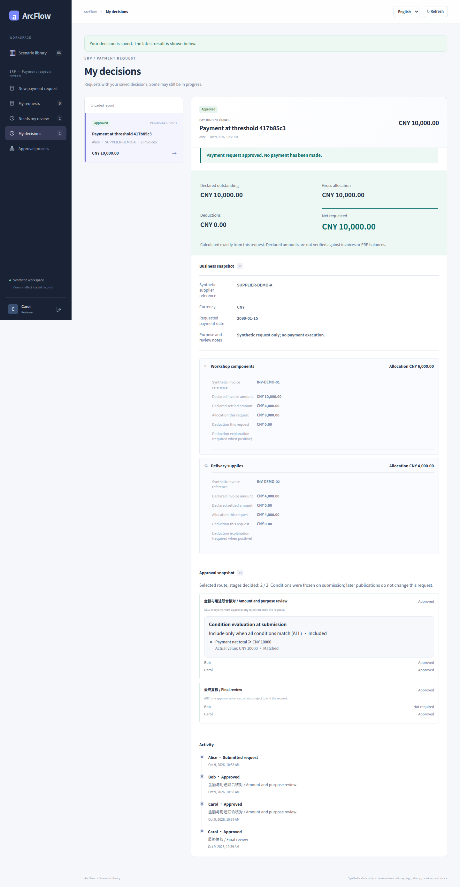</a>

界面语言: English · 浏览器视口: 1440×1000 · 全页原图: 1440×2771 px

采集状态: `payment-high-complete-desktop` · [PNG SHA-256](../images/scenarios/provenance.json): `4e444bf5289b5bd779b351abba9a7fd563d0279f77bac933f35823582243c0ad`

### 低金额申请通过：390px 长页

<a href="../images/scenarios/payment/payment-low-complete-zh-390px.png">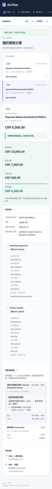</a>

界面语言: 中文 · 浏览器视口: 390×844 · 全页原图: 390×3602 px

采集状态: `payment-low-complete-zh-390px` · [PNG SHA-256](../images/scenarios/provenance.json): `fcd2cf6728b4780f593f6f6e33e4a7b2d38feb5e56c4202760a5f84b3f5c2b92`

<!-- topic:sources-and-reproduction -->
## 来源与复现

- [历史采集运行](https://github.com/JamesCube/ArcFlow/actions/runs/37918452685) · [commit](https://github.com/JamesCube/ArcFlow/commit/8c26d953e53991d3e445aa69c530726f1d81daae)
- [Playwright fixture](https://github.com/JamesCube/ArcFlow/blob/8c26d953e53991d3e445aa69c530726f1d81daae/examples/approval-ui/e2e/complex-scenarios.spec.mjs)
- [Conditional-routing fixture](https://github.com/JamesCube/ArcFlow/blob/8c26d953e53991d3e445aa69c530726f1d81daae/examples/approval-ui/e2e/conditional-routing.spec.mjs)
- [逐图来源与 SHA-256](../images/scenarios/provenance.json)
- [采集命令、验证范围与缺口](CAPTURE.md)
