# ERP receiving · real UI gallery

[简体中文](receiving.md) · [English](receiving.en.md) · [Five galleries](README.en.md) · [Scenario contract](../RECEIVING_SCENARIO.en.md)

Two synthetic receipt lines contain 80 PCS and 10 BOX, with accepted and rejected quantities. Configure ALL/ANY, then inspect the old ALL snapshot, partial votes, procurement review and early advancement of a new ANY request. Different units are totaled separately.

Every image is an original capture at [`8c26d95`](https://github.com/JamesCube/ArcFlow/commit/8c26d953e53991d3e445aa69c530726f1d81daae) from [run 37918452685](https://github.com/JamesCube/ArcFlow/actions/runs/37918452685), not a new capture of current main. The UI and relevant application source are unchanged at documentation baseline [`199db754`](https://github.com/JamesCube/ArcFlow/commit/199db7548f6faba5dfef105eaaf7311972adb388); this is not a test pass for a later commit. Each image labels its actual language, viewport, PNG size and capture state. Click to open the original.

[Newer complete conditional-routing capture (cb3f1077)](conditional-routing/receiving.en.md)

<!-- topic:scope-and-limits -->
## Scope and limits

No live purchase-order balance, inventory posting or ERP writeback is connected. Receiving states do not have complete Chinese/English pairs: both language pages label each original’s actual UI language. All 390px receiving and routing images are long full-page captures, not one visible phone screen. Conditional receiving captures remain PENDING, not approved.

Accounts and business data are synthetic. A 390px capture is a Chromium browser viewport, not the separate H5 client or physical-device acceptance; full-page height is not viewport height. UI language does not translate synthetic user-entered titles or process names.

<!-- topic:process-configuration-and-business-states -->
## Process configuration and business states

### Designer: publish a new ANY version

<a href="../images/scenarios/receiving/06-published-any-designer-en-desktop.png">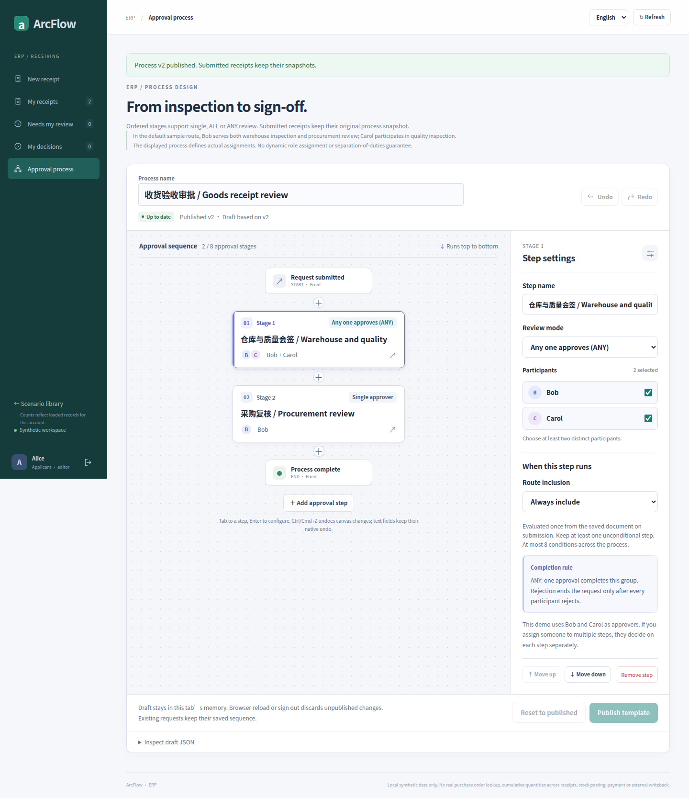</a>

UI language: English · browser viewport: 1440×1000 · full-page original: 1440×1667 px

Capture state: `06-published-any-designer-en-desktop` · [PNG SHA-256](../images/scenarios/provenance.json): `d15ee1075d8deec2ba215c36e12b2c146b9ed4592e47b5458725350b67d54864`

### 390px full-page process settings

<a href="../images/scenarios/receiving/07-published-any-designer-zh-390.png">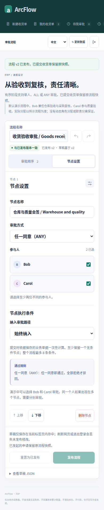</a>

UI language: Chinese · browser viewport: 390×844 · full-page original: 390×1900 px

Capture state: `07-published-any-designer-zh-390` · [PNG SHA-256](../images/scenarios/provenance.json): `39c9a3bae4de6f2870a72021c21b571a5fc4a5ff7850300ea93a342abd237796`

### Two receipt lines, totals grouped by unit

<a href="../images/scenarios/receiving/01-form-en-desktop.png">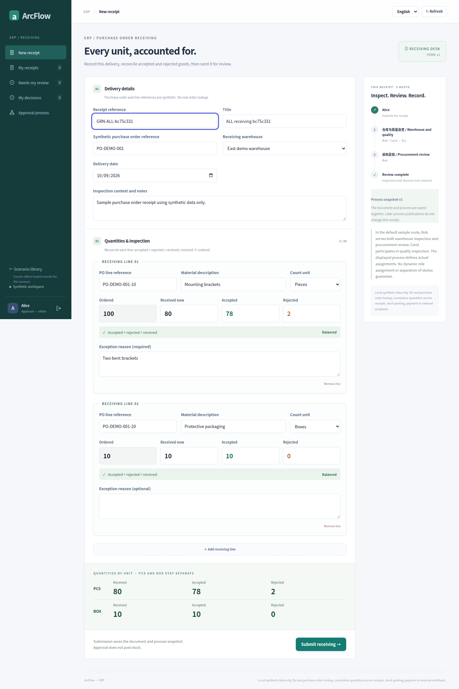</a>

UI language: English · browser viewport: 1440×1000 · full-page original: 1440×2159 px

Capture state: `01-form-en-desktop` · [PNG SHA-256](../images/scenarios/provenance.json): `dd598377e583b4b8ab140f7547dc66690decd1a2fddb668d38a7b27dd780ab7c`

### Chinese UI for the same form

<a href="../images/scenarios/receiving/02-form-zh-desktop.png">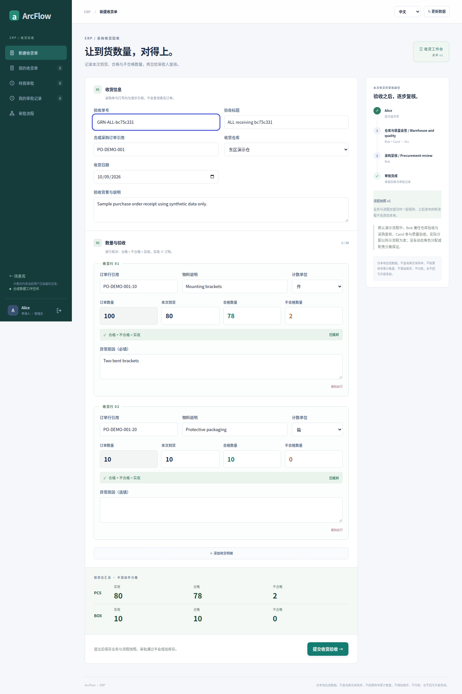</a>

UI language: Chinese · browser viewport: 1440×1000 · full-page original: 1440×2159 px

Capture state: `02-form-zh-desktop` · [PNG SHA-256](../images/scenarios/provenance.json): `d601237f15f066ee3f0794b6aca4fd595a112b3dc8bcdd2baf970617223144d3`

### 390px full-page receipt form

<a href="../images/scenarios/receiving/03-form-zh-390.png">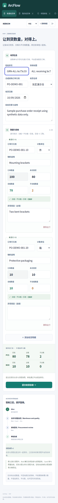</a>

UI language: Chinese · browser viewport: 390×844 · full-page original: 390×3331 px

Capture state: `03-form-zh-390` · [PNG SHA-256](../images/scenarios/provenance.json): `10785692981f53091e34255269a08079668ba3fe34821cccf53cf694edaa15ab`

### Accepted plus rejected must equal received

<a href="../images/scenarios/receiving/04-quantity-error-en-desktop.png">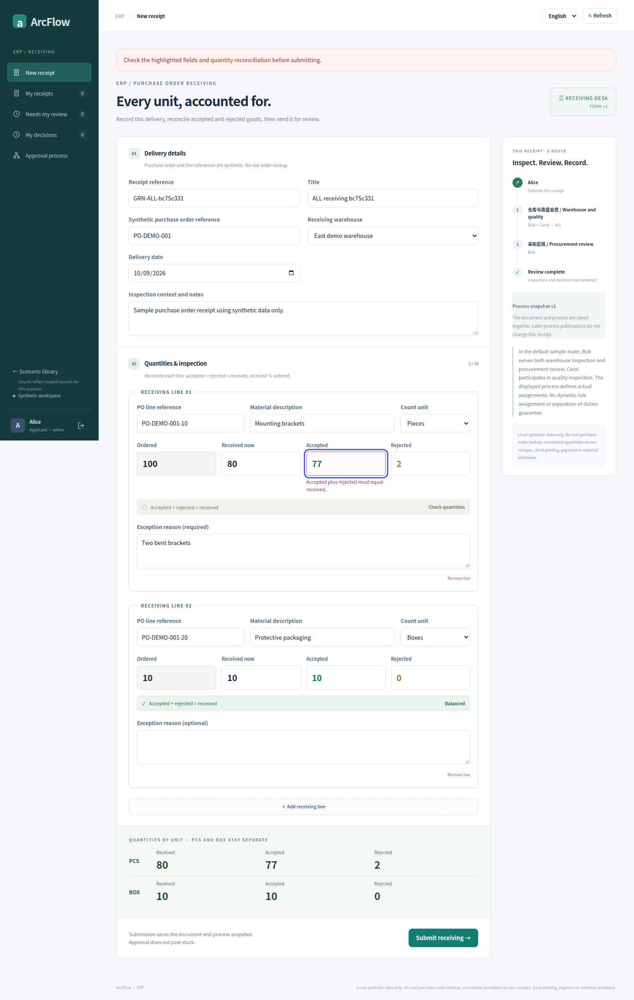</a>

UI language: English · browser viewport: 1440×1000 · full-page original: 1440×2270 px

Capture state: `04-quantity-error-en-desktop` · [PNG SHA-256](../images/scenarios/provenance.json): `d8355077fb22a1cf36e07c46f29464a3d0f15dd7b8919d50767ffd4dc7bd8813`

### 390px full-page quantity error

<a href="../images/scenarios/receiving/05-quantity-error-zh-390.png">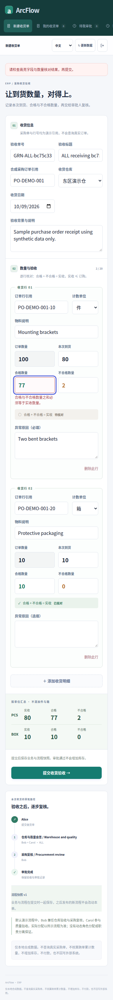</a>

UI language: Chinese · browser viewport: 390×844 · full-page original: 390×3438 px

Capture state: `05-quantity-error-zh-390` · [PNG SHA-256](../images/scenarios/provenance.json): `3aaa2cd317d9f18d43000ca22fe9ae8e87f3cb7f3cf2dd7b1489f6642ef98d42`

### Old request retains ALL after the new ANY publication

<a href="../images/scenarios/receiving/08-immutable-all-snapshot-en-desktop.png">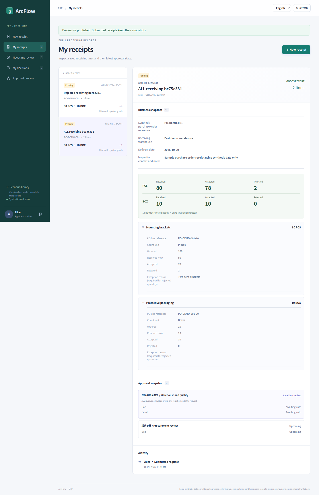</a>

UI language: English · browser viewport: 1440×1000 · full-page original: 1440×2232 px

Capture state: `08-immutable-all-snapshot-en-desktop` · [PNG SHA-256](../images/scenarios/provenance.json): `247b022066b48fcd019039f526325dfac6e00a592cbce283dea9a006a7265d16`

### Bob approved; ALL still waits for Carol

<a href="../images/scenarios/receiving/09-all-partial-bob-vote-en-desktop.png">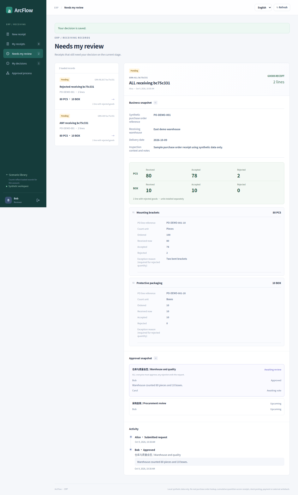</a>

UI language: English · browser viewport: 1440×1000 · full-page original: 1440×2388 px

Capture state: `09-all-partial-bob-vote-en-desktop` · [PNG SHA-256](../images/scenarios/provenance.json): `2e454de858348806e98385c579b8497f98b4e69665efe876879d620b6f4dc4c5`

### Carol’s quality review: 390px full page

<a href="../images/scenarios/receiving/10-all-quality-review-zh-390.png">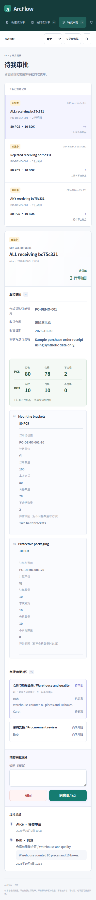</a>

UI language: Chinese · browser viewport: 390×844 · full-page original: 390×3614 px

Capture state: `10-all-quality-review-zh-390` · [PNG SHA-256](../images/scenarios/provenance.json): `cb85a8a82a588180a42f7292aba3e9611cd8605fff77843e8b3139c3db85e69b`

### Bob acts again at the separate procurement stage

<a href="../images/scenarios/receiving/11-bob-procurement-review-en-desktop.png">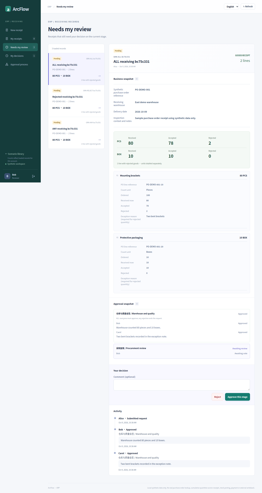</a>

UI language: English · browser viewport: 1440×1000 · full-page original: 1440×2702 px

Capture state: `11-bob-procurement-review-en-desktop` · [PNG SHA-256](../images/scenarios/provenance.json): `50a5b38060c358d0f85dd0cc665c02fc542d0c4d54f239b70156a36394493a72`

### Original ALL request finishes after three votes

<a href="../images/scenarios/receiving/12-all-approved-en-desktop.png">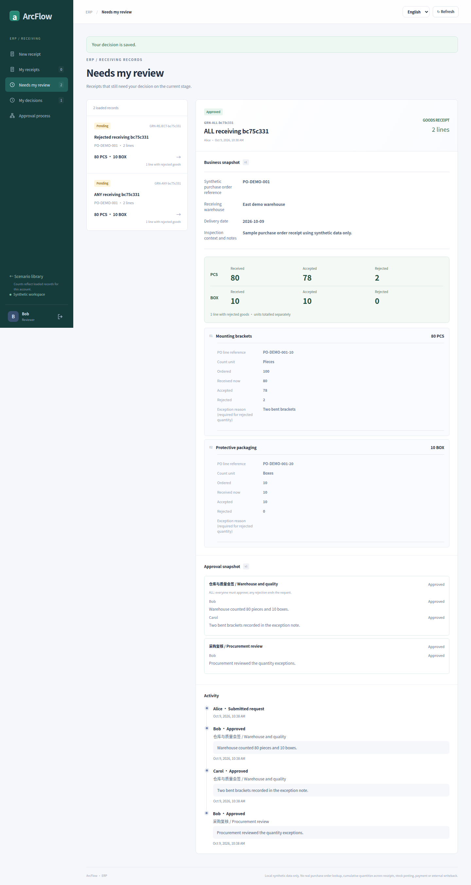</a>

UI language: English · browser viewport: 1440×1000 · full-page original: 1440×2700 px

Capture state: `12-all-approved-en-desktop` · [PNG SHA-256](../images/scenarios/provenance.json): `bba6e227cf9f64a9cabfa49dd9089245decf5786983782ada1a30201ead9259b`

### A separate ALL request is rejected

<a href="../images/scenarios/receiving/13-all-rejected-zh-desktop.png">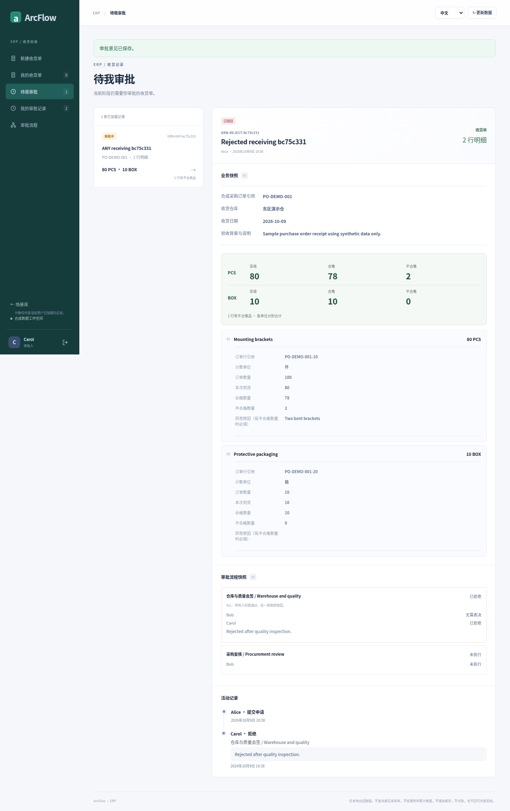</a>

UI language: Chinese · browser viewport: 1440×1000 · full-page original: 1440×2288 px

Capture state: `13-all-rejected-zh-desktop` · [PNG SHA-256](../images/scenarios/provenance.json): `bd0a2a28bf6879089bcf4afff3fcb7dd8209190189f8b906557ad12d47d0a2f1`

### New ANY request advances after one approval

<a href="../images/scenarios/receiving/14-any-early-advance-en-desktop.png">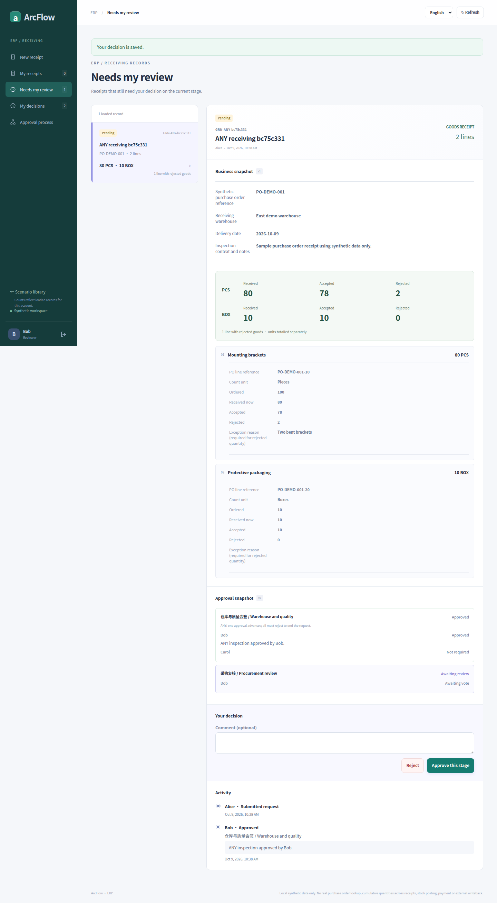</a>

UI language: English · browser viewport: 1440×1000 · full-page original: 1440×2609 px

Capture state: `14-any-early-advance-en-desktop` · [PNG SHA-256](../images/scenarios/provenance.json): `e00799655d35ca477261a3d93165b8493197ca7e067cadd3faaa345454d83f44`

### Approved ANY request: 390px full page

<a href="../images/scenarios/receiving/15-any-approved-zh-390.png">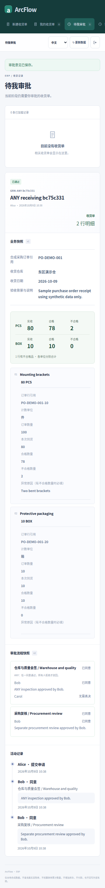</a>

UI language: Chinese · browser viewport: 390×844 · full-page original: 390×3270 px

Capture state: `15-any-approved-zh-390` · [PNG SHA-256](../images/scenarios/provenance.json): `00c439f81bc1d85bacef43ea40261994d101ba44bc2ed1e2cc991a2500484cc3`

<!-- topic:conditional-routing-supplement -->
## Additional conditional-routing test

These images come from a separate test. Typed, restricted conditions are evaluated at submission; the route and explanations stay with the request. This is not arbitrary BPMN, scripting or a free-form branching engine. Original languages and widths are preserved; missing language/viewport variants are not invented.

### No rejected lines: frozen route skips extra review, still pending

<a href="../images/scenarios/receiving/receiving-clean-frozen-desktop.png">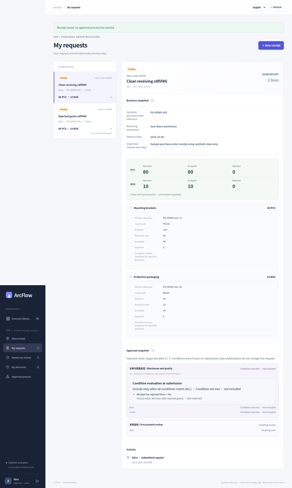</a>

UI language: English · browser viewport: 1440×1000 · full-page original: 1440×2406 px

Capture state: `receiving-clean-frozen-desktop` · [PNG SHA-256](../images/scenarios/provenance.json): `af24a39e7d6c665e4d14eb7ed3423413fbd7bb46ce9d6ec996bf2f4395c48062`

### Chinese 390px full-page receiving route, still pending

<a href="../images/scenarios/receiving/receiving-clean-zh-390px.png">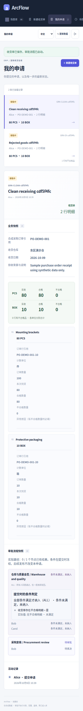</a>

UI language: Chinese · browser viewport: 390×844 · full-page original: 390×3279 px

Capture state: `receiving-clean-zh-390px` · [PNG SHA-256](../images/scenarios/provenance.json): `1e55edb0b7642a2f65bd400f6d8f33a5b6890c2f63e6bfd68cb1418b0d31d581`

<!-- topic:sources-and-reproduction -->
## Sources and reproduction

- [historical capture run](https://github.com/JamesCube/ArcFlow/actions/runs/37918452685) · [commit](https://github.com/JamesCube/ArcFlow/commit/8c26d953e53991d3e445aa69c530726f1d81daae)
- [Playwright fixture](https://github.com/JamesCube/ArcFlow/blob/8c26d953e53991d3e445aa69c530726f1d81daae/examples/approval-ui/e2e/receiving.spec.mjs)
- [Conditional-routing fixture](https://github.com/JamesCube/ArcFlow/blob/8c26d953e53991d3e445aa69c530726f1d81daae/examples/approval-ui/e2e/conditional-routing.spec.mjs)
- [Per-image provenance and SHA-256](../images/scenarios/provenance.json)
- [Capture commands, verification scope and gaps](CAPTURE.en.md)
