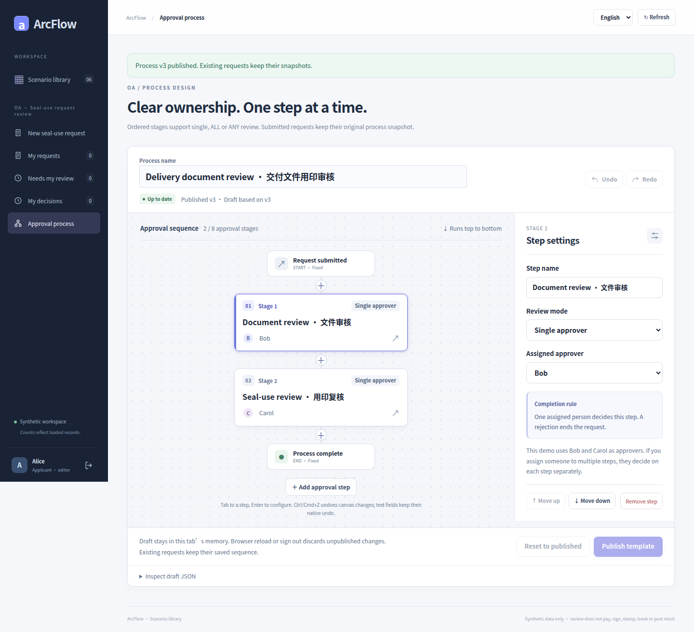
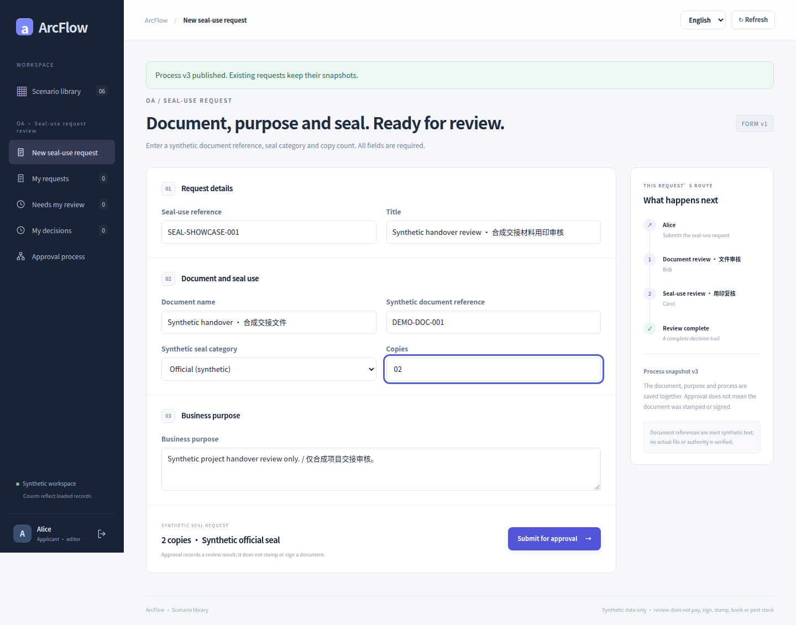
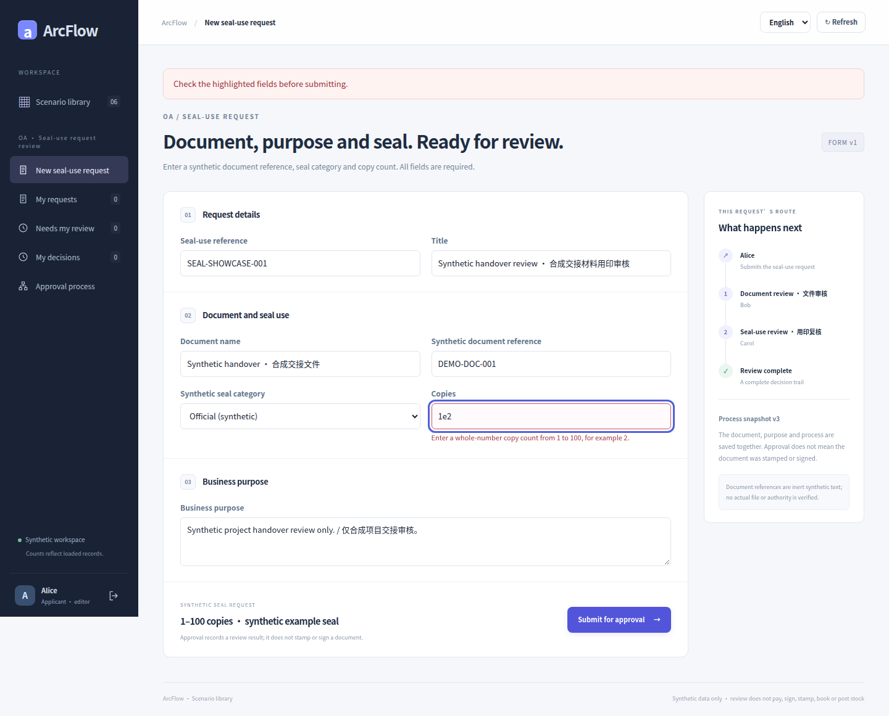
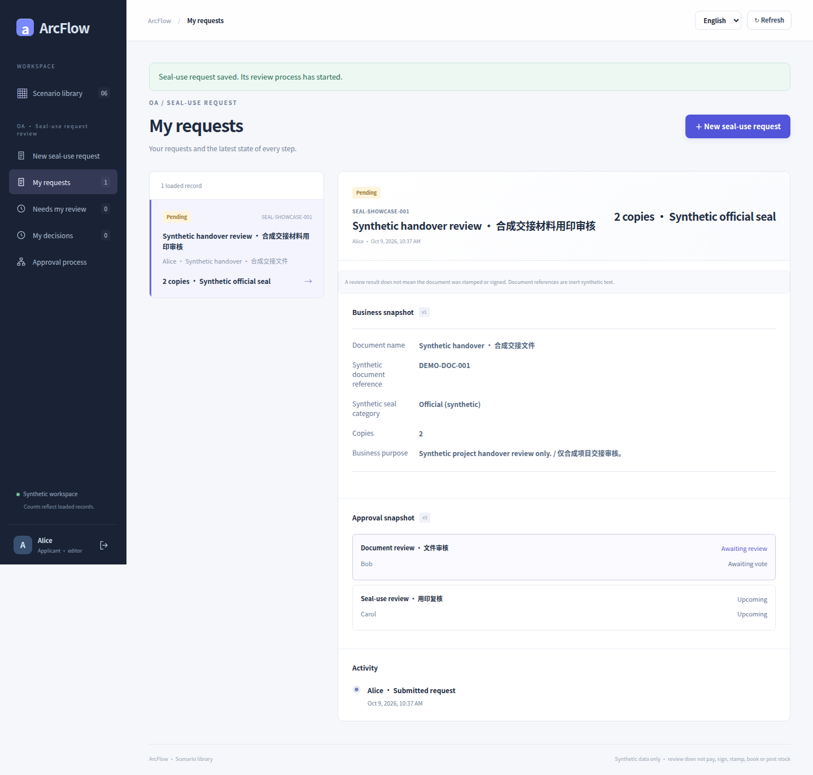
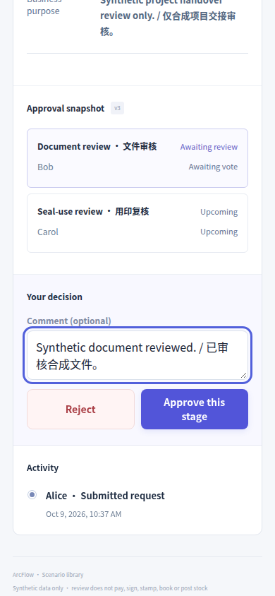
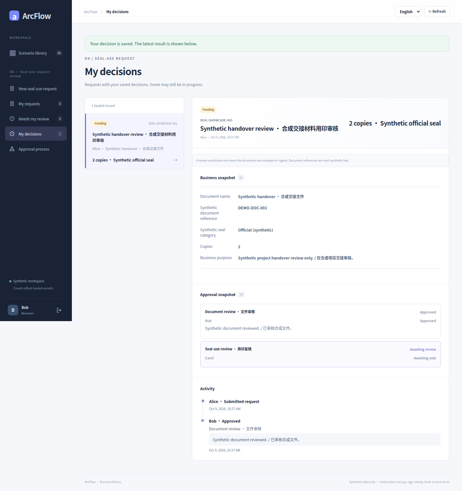
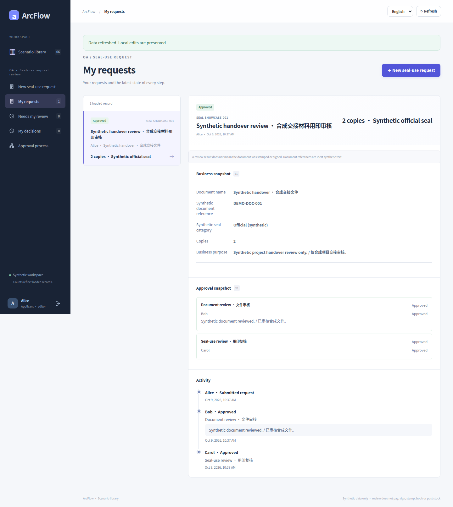
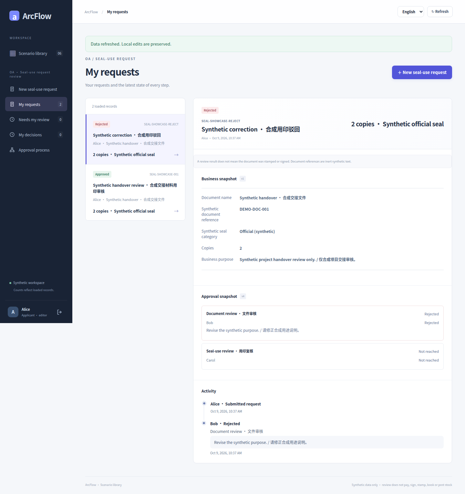
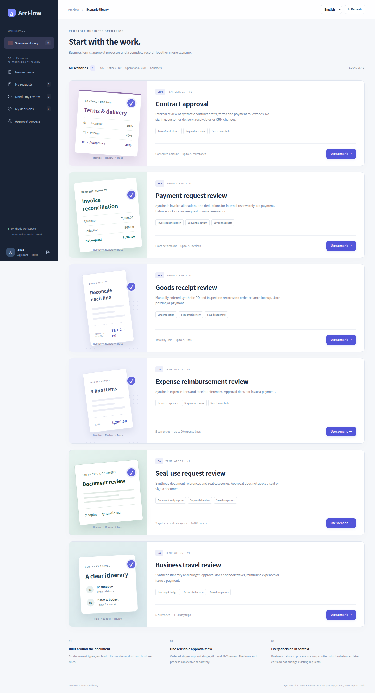

# OA seal use · real UI gallery

[简体中文](seal-use.md) · [English](seal-use.en.md) · [Five galleries](README.en.md) · [Scenario contract](../SEAL_USE_SCENARIO.en.md)

Synthetic delivery documents illustrate a non-monetary approval: document reference, seal category, purpose and copy count, followed by document review and seal-use review. Approval and rejection belong to separate requests.

Every image is an original capture at [`8c26d95`](https://github.com/JamesCube/ArcFlow/commit/8c26d953e53991d3e445aa69c530726f1d81daae) from [run 37918452685](https://github.com/JamesCube/ArcFlow/actions/runs/37918452685), not a new capture of current main. The UI and relevant application source are unchanged at documentation baseline [`199db754`](https://github.com/JamesCube/ArcFlow/commit/199db7548f6faba5dfef105eaaf7311972adb388); this is not a test pass for a later commit. Each image labels its actual language, viewport, PNG size and capture state. Click to open the original.

<!-- topic:scope-and-limits -->
## Scope and limits

Approval records a human decision; it does not stamp, electronically sign, upload a document or notify another system. Document references and seal information are synthetic.

Accounts and business data are synthetic. A 390px capture is a Chromium browser viewport, not the separate H5 client or physical-device acceptance; full-page height is not viewport height. UI language does not translate synthetic user-entered titles or process names.

<!-- topic:process-configuration-and-business-states -->
## Process configuration and business states

### Designer: document review → seal-use review

UI language: English · browser viewport: 1440×1000 · full-page original: 1440×1312 px

Capture state: `seal-designer` · [PNG SHA-256](../images/scenarios/provenance.json): `d721e33a3b9d8cd608363ca4fa430228ea0c53f4b9837870b096d6fd0e4223b3`

### Fill document reference, seal purpose and copies

UI language: English · browser viewport: 1440×1000 · full-page original: 1440×1131 px

Capture state: `seal-form` · [PNG SHA-256](../images/scenarios/provenance.json): `a918489e8b444327097abfaff390a9cea3c7df86dd5813d0b56c961f5b7e3492`

### Field validation with visible errors

UI language: English · browser viewport: 1440×1000 · full-page original: 1440×1161 px

Capture state: `seal-validation` · [PNG SHA-256](../images/scenarios/provenance.json): `7105326256701a9f3f546e6a2eaf5a16cb612d380b549981ca49c0314d7849ff`

### Submitted request with its seal-use snapshot

UI language: English · browser viewport: 1440×1000 · full-page original: 1440×1373 px

Capture state: `seal-pending` · [PNG SHA-256](../images/scenarios/provenance.json): `9dfc7c9239201dc3b9514dfa9db33c059940bc72c6fd634ae3a8687c080c6515`

### 390px reviewer-control viewport

UI language: English · browser viewport: 390×844 · viewport original: 390×844 px

Capture state: `seal-review` · [PNG SHA-256](../images/scenarios/provenance.json): `538055f3c9c52a6b294410e083b40c7edf4a27d714655de299af50a144cc3ef4`

### First stage approved; seal-use review follows

UI language: English · browser viewport: 1440×1000 · full-page original: 1440×1529 px

Capture state: `seal-next-stage` · [PNG SHA-256](../images/scenarios/provenance.json): `3fa1479d5aca34b5c349c1d7c507c102ad9ae45021e60c12ef4cc0f82288fb93`

### Both stages approved, with human decisions

UI language: English · browser viewport: 1440×1000 · full-page original: 1440×1614 px

Capture state: `seal-approved` · [PNG SHA-256](../images/scenarios/provenance.json): `7f11735076983fc8f5a6c909923cca9a70886de184a06bb9ac89ac0499922b4c`

### A separate request’s rejection branch

This is a new request under later v4; the approved request above uses v3.

UI language: English · browser viewport: 1440×1000 · full-page original: 1440×1529 px

Capture state: `seal-rejected` · [PNG SHA-256](../images/scenarios/provenance.json): `4ce2b94273a36ef050bcce6419d424930e07c9656e5781624a2341fd2c88a0bc`

### Scenario library: open seal use

UI language: English · browser viewport: 1440×1000 · full-page original: 1440×2653 px

Capture state: `seal-catalog` · [PNG SHA-256](../images/scenarios/provenance.json): `8d83c13cd7d69df7d89bf1b59eebc6d4d9a5cc47117224034a8fb0e04c26fa0e`

<!-- topic:sources-and-reproduction -->
## Sources and reproduction

- [historical capture run](https://github.com/JamesCube/ArcFlow/actions/runs/37918452685) · [commit](https://github.com/JamesCube/ArcFlow/commit/8c26d953e53991d3e445aa69c530726f1d81daae)
- [Playwright fixture](https://github.com/JamesCube/ArcFlow/blob/8c26d953e53991d3e445aa69c530726f1d81daae/examples/approval-ui/e2e/seal-use.spec.mjs)
- [Per-image provenance and SHA-256](../images/scenarios/provenance.json)
- [Capture commands, verification scope and gaps](CAPTURE.en.md)
