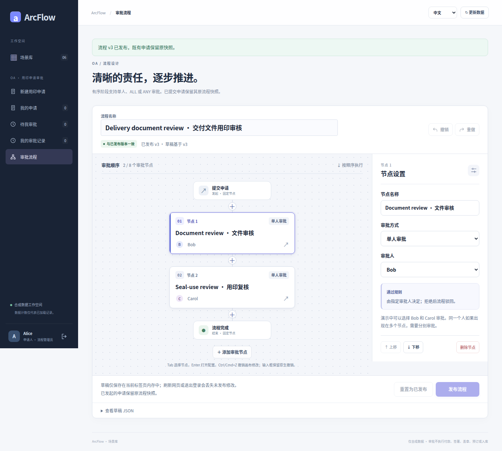
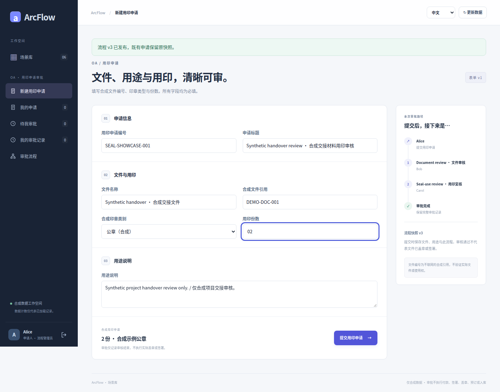
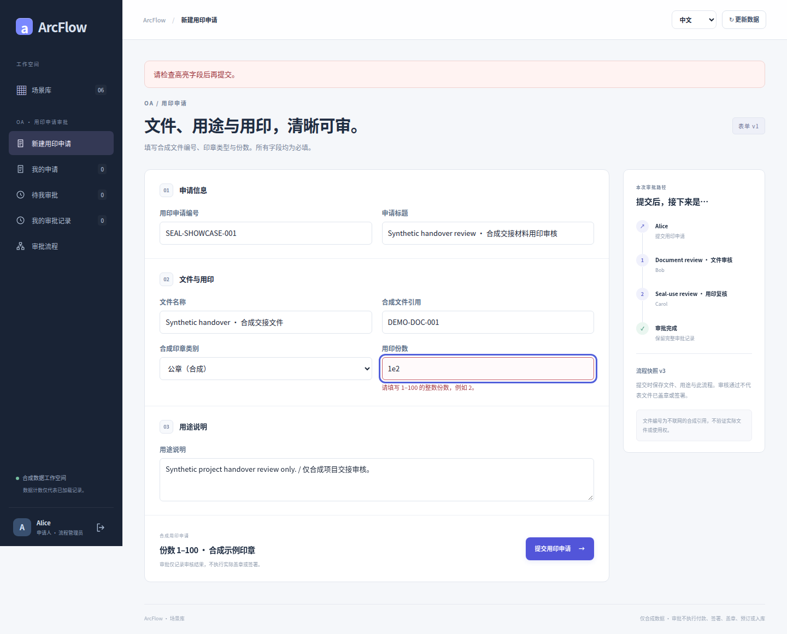
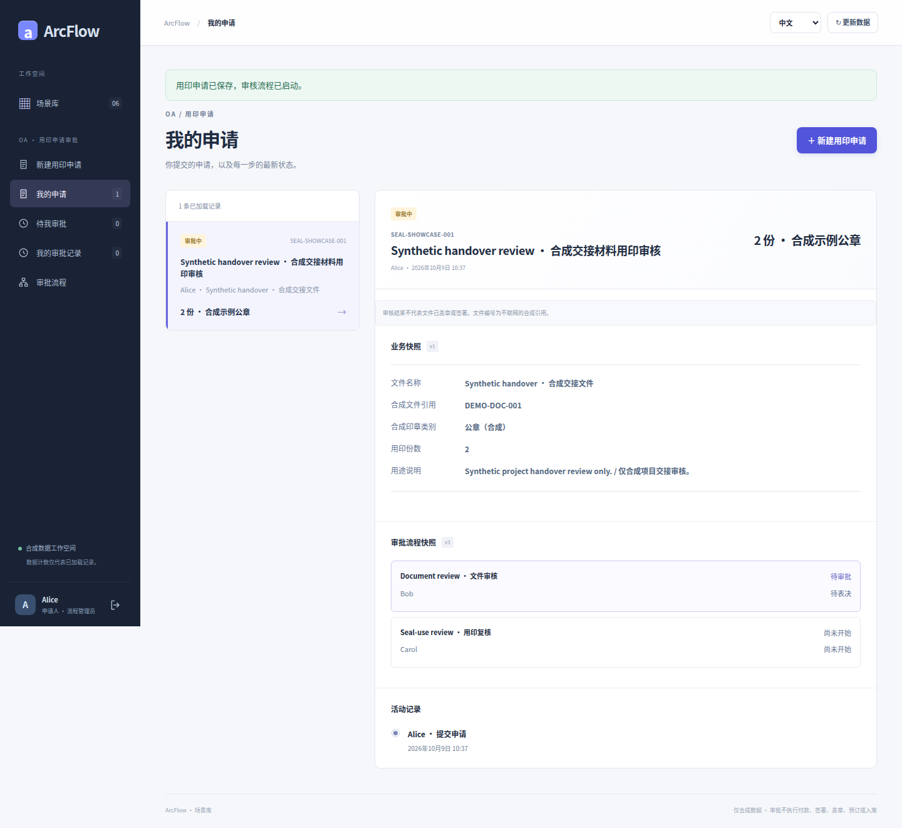
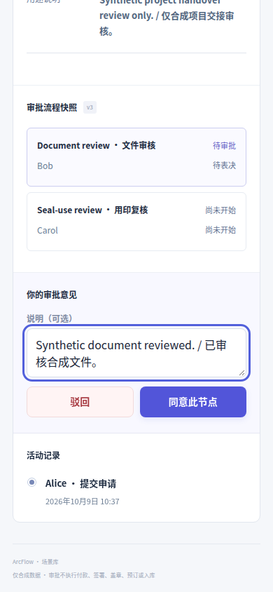
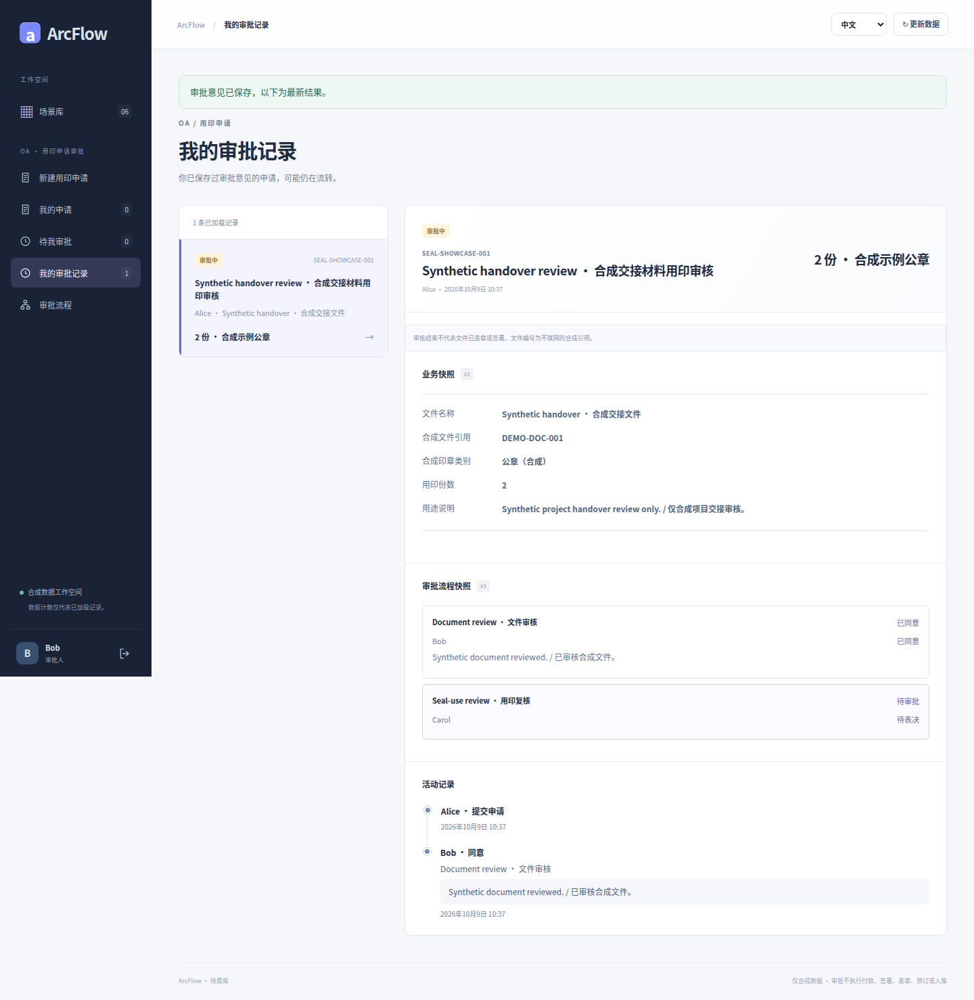
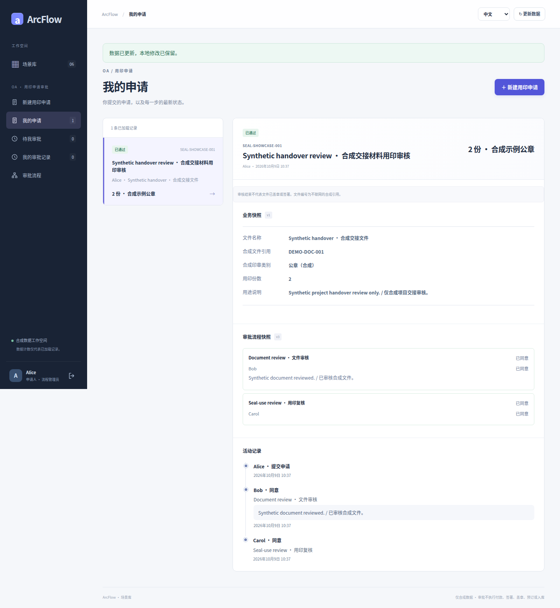
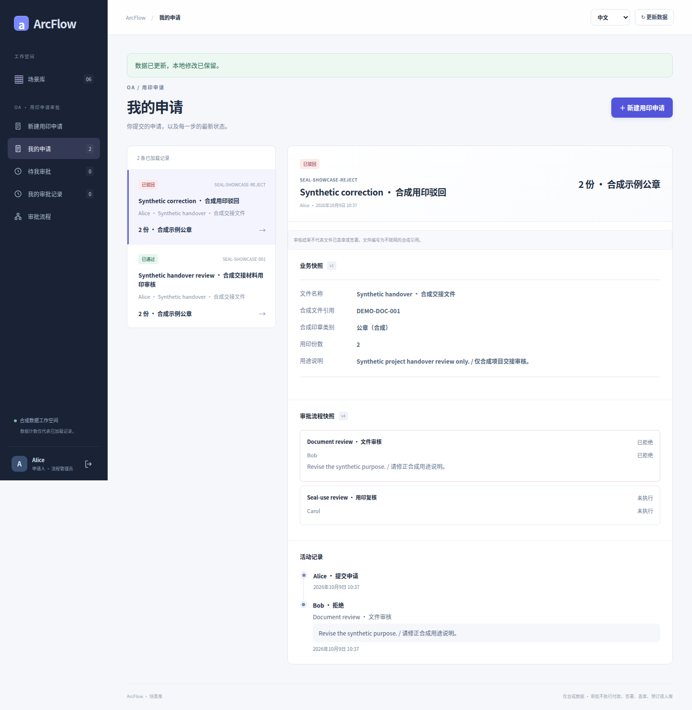

# OA 用印 · 真实界面图集

[简体中文](seal-use.md) · [English](seal-use.en.md) · [五类图集](README.md) · [业务契约](../SEAL_USE_SCENARIO.md)

以合成交付文件展示非金额审批：文件引用、印章类别、用途与份数，依次经过文件审核和用印复核。通过与驳回来自不同申请。

全部图片是提交 [`8c26d95`](https://github.com/JamesCube/ArcFlow/commit/8c26d953e53991d3e445aa69c530726f1d81daae) 的原始截图，来自[运行 37918452685](https://github.com/JamesCube/ArcFlow/actions/runs/37918452685)，不是当前 main 的重新采集。界面与相关应用源码在文档基线 [`199db754`](https://github.com/JamesCube/ArcFlow/commit/199db7548f6faba5dfef105eaaf7311972adb388) 保持一致；这不代表新提交通过了测试。每张图片下方标注实际语言、视口、PNG 尺寸和采集状态。点击图片查看原图。

<!-- topic:scope-and-limits -->
## 能力与边界

通过仅表示人工审批完成，不会真实盖章、电子签署、上传文件或通知外部系统；文件引用与印章信息均为合成数据。

所有账号和业务资料均为合成演示数据。390px 是 Chromium 浏览器视口，不是原生 H5 客户端或实体手机验收；长页高度不是视口高度。中英文只是界面语言，合成标题／流程名可能保留双语。

<!-- topic:process-configuration-and-business-states -->
## 流程配置与业务状态

### 流程设计器：文件审核 → 用印复核

界面语言: 中文 · 浏览器视口: 1440×1000 · 全页原图: 1440×1295 px

采集状态: `seal-designer` · [PNG SHA-256](../images/scenarios/provenance.json): `6933f4de28f45f004afd5fa24fd5660143f855d47196f3d62bfe3e05dc064ac5`

### 填写文件引用、印章用途与份数

界面语言: 中文 · 浏览器视口: 1440×1000 · 全页原图: 1440×1131 px

采集状态: `seal-form` · [PNG SHA-256](../images/scenarios/provenance.json): `ce5df0de0d45642298b3e16d59a1ee020f7586e1000b3722c84560355c9cb7e6`

### 字段校验：明确显示无效输入

界面语言: 中文 · 浏览器视口: 1440×1000 · 全页原图: 1440×1161 px

采集状态: `seal-validation` · [PNG SHA-256](../images/scenarios/provenance.json): `8514a19cb87a1859a0515c90c0975b7dba169f88c7a28661676b0c684deb7782`

### 已提交：保留用印业务快照

界面语言: 中文 · 浏览器视口: 1440×1000 · 全页原图: 1440×1322 px

采集状态: `seal-pending` · [PNG SHA-256](../images/scenarios/provenance.json): `5fe41b169a5362bbdc7e3f7940f0cab488d014a79555fd10a3b425b1a85047a0`

### 390px 审核操作视口

界面语言: 中文 · 浏览器视口: 390×844 · 视口原图: 390×844 px

采集状态: `seal-review` · [PNG SHA-256](../images/scenarios/provenance.json): `097cdca7408992583acd8c9f4c99a82899cbd5a3ba678296828548b67a44f083`

### 第一步通过：继续用印复核

界面语言: 中文 · 浏览器视口: 1440×1000 · 全页原图: 1440×1478 px

采集状态: `seal-next-stage` · [PNG SHA-256](../images/scenarios/provenance.json): `8b9818381fbe2f6d855775f46803dccc2b6bf9af9a028246f6dd9ab58a7fa2ba`

### 两级通过：保留人工审批记录

界面语言: 中文 · 浏览器视口: 1440×1000 · 全页原图: 1440×1563 px

采集状态: `seal-approved` · [PNG SHA-256](../images/scenarios/provenance.json): `b7697c526e630b8135d69ef2dd82ad23472d591f556443d0eed931ff49af398e`

### 独立申请：驳回分支

这是后续 v4 下的新申请；前面的通过申请使用 v3。

界面语言: 中文 · 浏览器视口: 1440×1000 · 全页原图: 1440×1478 px

采集状态: `seal-rejected` · [PNG SHA-256](../images/scenarios/provenance.json): `2ebd298479cbc65e0ac7171e1cc3e1d93f477874534d4b6df48c991d5cc57cd2`

### 场景库：从目录进入用印

界面语言: 中文 · 浏览器视口: 1440×1000 · 全页原图: 1440×2622 px

采集状态: `seal-catalog` · [PNG SHA-256](../images/scenarios/provenance.json): `e086828e8861694133b7803d96a918522f3998465ddb7fdd637b3f213821e9c3`

<!-- topic:sources-and-reproduction -->
## 来源与复现

- [历史采集运行](https://github.com/JamesCube/ArcFlow/actions/runs/37918452685) · [commit](https://github.com/JamesCube/ArcFlow/commit/8c26d953e53991d3e445aa69c530726f1d81daae)
- [Playwright fixture](https://github.com/JamesCube/ArcFlow/blob/8c26d953e53991d3e445aa69c530726f1d81daae/examples/approval-ui/e2e/seal-use.spec.mjs)
- [逐图来源与 SHA-256](../images/scenarios/provenance.json)
- [采集命令、验证范围与缺口](CAPTURE.md)
