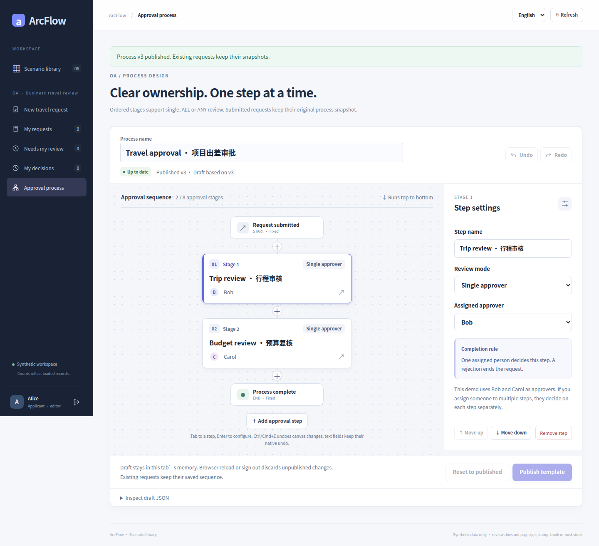
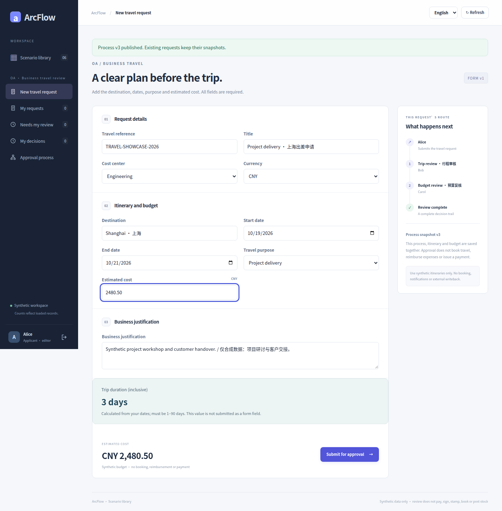
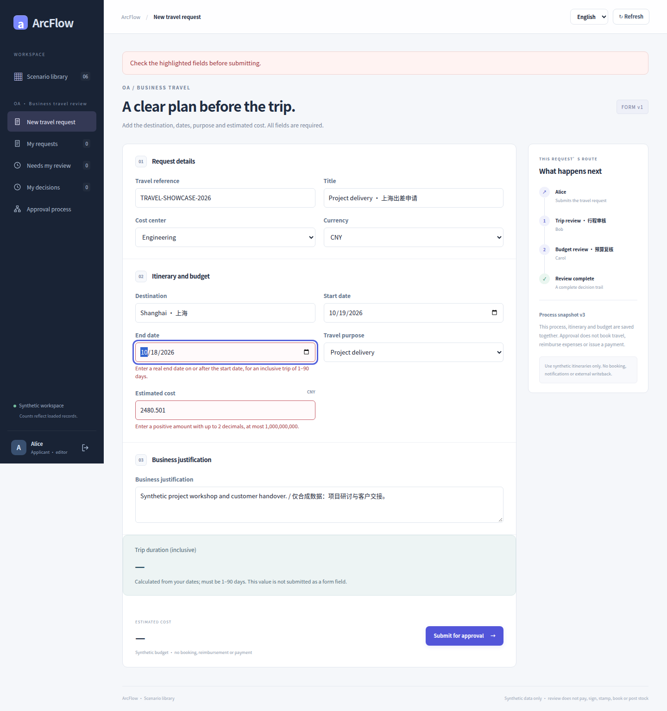
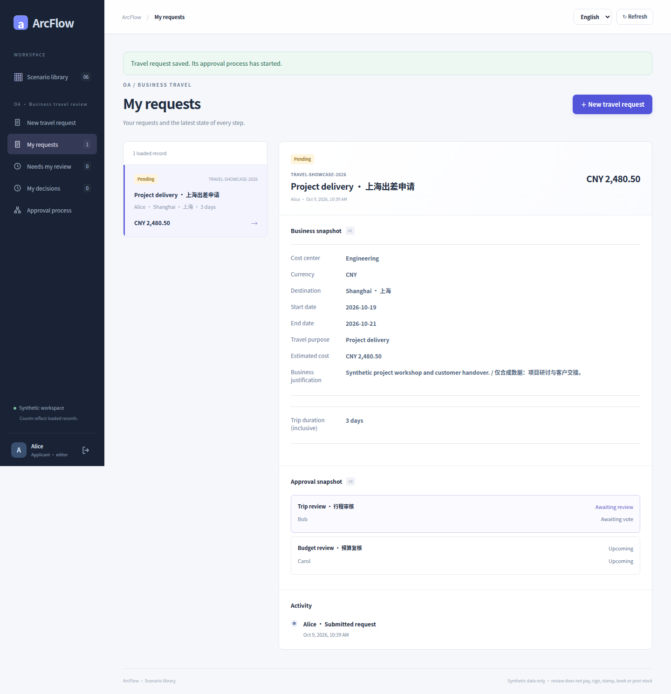
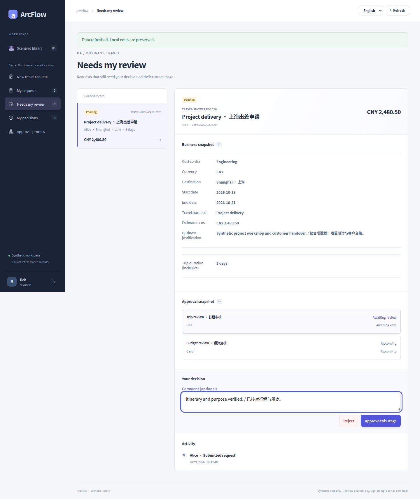
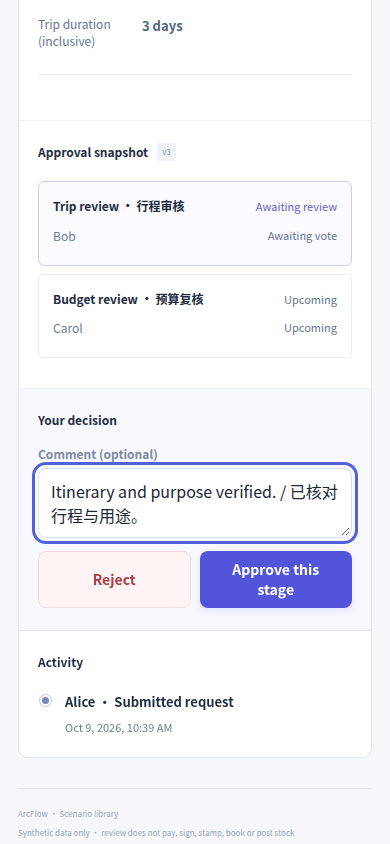
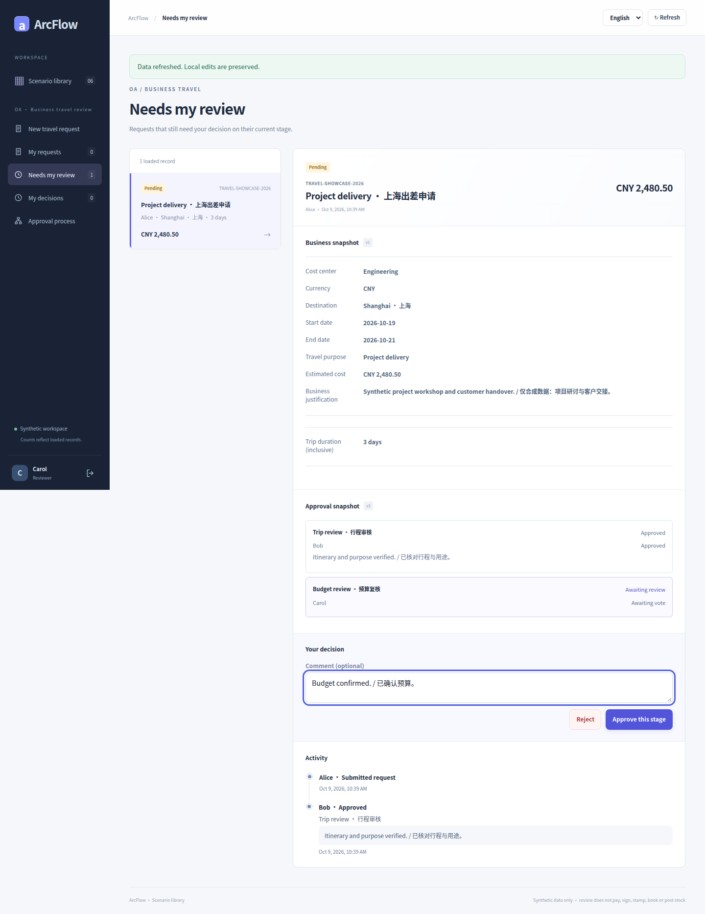
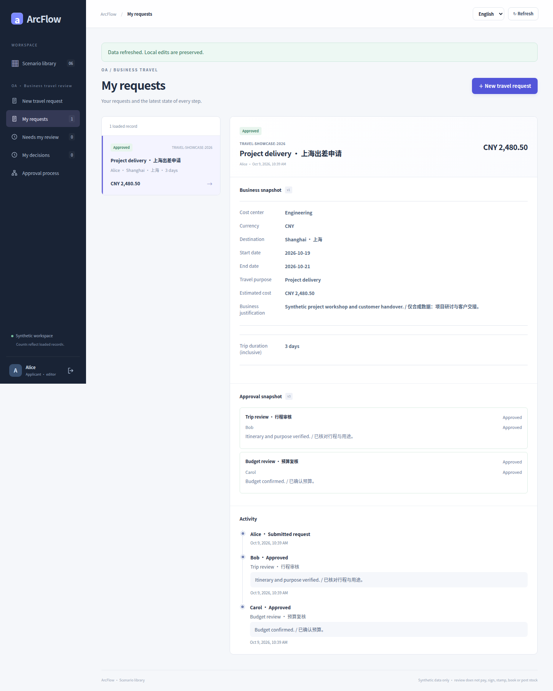
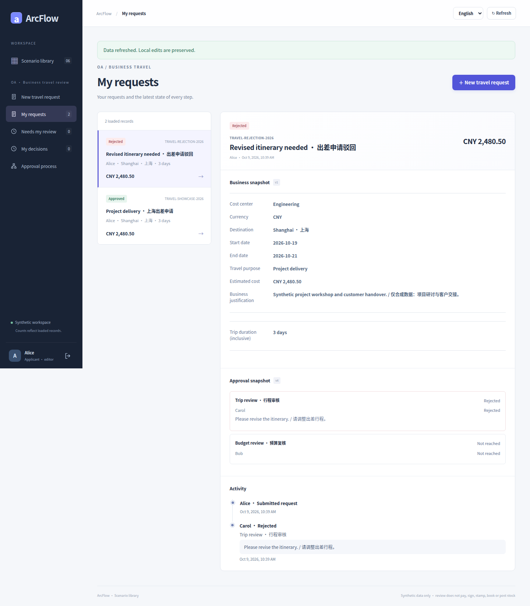

# OA travel · real UI gallery

[简体中文](travel.md) · [English](travel.en.md) · [Five galleries](README.en.md) · [Scenario contract](../TRAVEL_SCENARIO.md)

A synthetic Shanghai delivery trip runs from 2026-10-19 to 2026-10-21: 3 calendar days and CNY 2,480.50. Start with the two-stage designer, then follow Alice’s request, Bob’s trip review, Carol’s budget review, and a separate rejected request.

Every image is an original capture at [`8c26d95`](https://github.com/JamesCube/ArcFlow/commit/8c26d953e53991d3e445aa69c530726f1d81daae) from [run 37918452685](https://github.com/JamesCube/ArcFlow/actions/runs/37918452685), not a new capture of current main. The UI and relevant application source are unchanged at documentation baseline [`199db754`](https://github.com/JamesCube/ArcFlow/commit/199db7548f6faba5dfef105eaaf7311972adb388); this is not a test pass for a later commit. Each image labels its actual language, viewport, PNG size and capture state. Click to open the original.

## Scope and limits

Approval does not book travel or hotels, reimburse expenses, reserve funds or pay. This travel capture uses two fixed human stages, with no travel amount-based routing.

Accounts and business data are synthetic. A 390px capture is a Chromium browser viewport, not the separate H5 client or physical-device acceptance; full-page height is not viewport height. UI language does not translate synthetic user-entered titles or process names.

## Process configuration and business states

### Designer: trip review → budget review

UI language: English · browser viewport: 1440×1000 · full-page original: 1440×1312 px

Capture state: `designer` · [PNG SHA-256](../images/scenarios/provenance.json): `eba71fe4984ebb639a2a53b0fef5e0050ace76a079ae1ab499e012daae3c010c`

### Fill dates, destination and exact budget

UI language: English · browser viewport: 1440×1000 · full-page original: 1440×1464 px

Capture state: `filled-travel` · [PNG SHA-256](../images/scenarios/provenance.json): `fc135db4f4544da83305cb49ad787c01db4c363b61ca2fb14e2894280ef7b160`

### Field validation before submission

UI language: English · browser viewport: 1440×1000 · full-page original: 1440×1534 px

Capture state: `validation-errors` · [PNG SHA-256](../images/scenarios/provenance.json): `7345ea48882c797cb9d8ad1360f6f21c20c8b8c309ca03bc966efc4d49239e91`

### Alice’s submitted request and saved snapshot

UI language: English · browser viewport: 1440×1000 · full-page original: 1440×1489 px

Capture state: `request-detail-pending` · [PNG SHA-256](../images/scenarios/provenance.json): `1bbdbc87286255a54ee1c1fd58af03947234556e5d7957ee7c607c1546d7071d`

### Bob’s pending trip review and controls

UI language: English · browser viewport: 1440×1000 · full-page original: 1440×1710 px

Capture state: `review-pending` · [PNG SHA-256](../images/scenarios/provenance.json): `f1a4a8188addb53f4c45470736dc22344ca78d502d0612fb3369e6ba85459070`

### 390px reviewer-control viewport

UI language: English · browser viewport: 390×844 · viewport original: 390×844 px

Capture state: `review-pending` · [PNG SHA-256](../images/scenarios/provenance.json): `7e829f8384bcd30e924b949237bbd97e825dd871694b62259cf32071a20e7a70`

### Next stage: Carol’s budget review

UI language: English · browser viewport: 1440×1000 · full-page original: 1440×1866 px

Capture state: `review-next` · [PNG SHA-256](../images/scenarios/provenance.json): `70235825aeda839db019e3247d0eaa5ccc978164d483b14160119e6f2ab943c7`

### Both stages approved, with saved history

UI language: English · browser viewport: 1440×1000 · full-page original: 1440×1801 px

Capture state: `request-detail-approved` · [PNG SHA-256](../images/scenarios/provenance.json): `11875084683d43cec71a5cc4cce04f4fe4625bbe8cb9be101f12253704c7ca88`

### A separate request’s rejection branch

This is a new request under later v4; the approved request above uses v3.

UI language: English · browser viewport: 1440×1000 · full-page original: 1440×1645 px

Capture state: `request-detail-rejected` · [PNG SHA-256](../images/scenarios/provenance.json): `b2aa2676fee29526168905f0734f37fbe971a3da8092941b607d852c6e8a606c`

### Scenario library: open travel

UI language: English · browser viewport: 1440×1000 · full-page original: 1440×2653 px

Capture state: `catalog` · [PNG SHA-256](../images/scenarios/provenance.json): `8d83c13cd7d69df7d89bf1b59eebc6d4d9a5cc47117224034a8fb0e04c26fa0e`

## Sources and reproduction

- [historical capture run](https://github.com/JamesCube/ArcFlow/actions/runs/37918452685) · [commit](https://github.com/JamesCube/ArcFlow/commit/8c26d953e53991d3e445aa69c530726f1d81daae)
- [Playwright fixture](https://github.com/JamesCube/ArcFlow/blob/8c26d953e53991d3e445aa69c530726f1d81daae/examples/approval-ui/e2e/travel-scenarios.spec.mjs)
- [Per-image provenance and SHA-256](../images/scenarios/provenance.json)
- [Capture commands, verification scope and gaps](CAPTURE.en.md)
