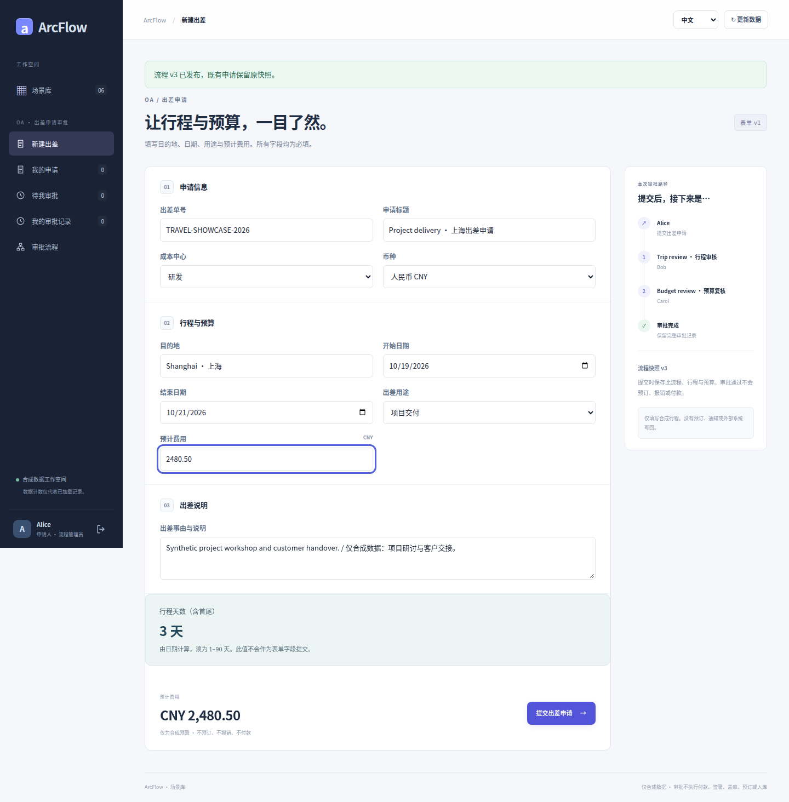
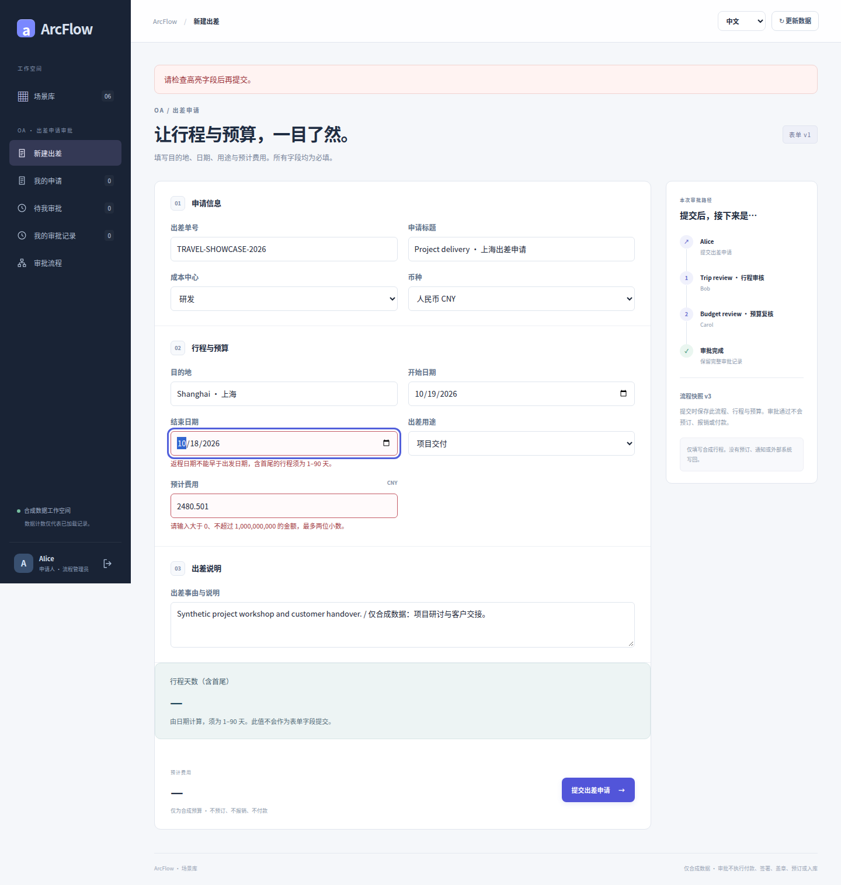
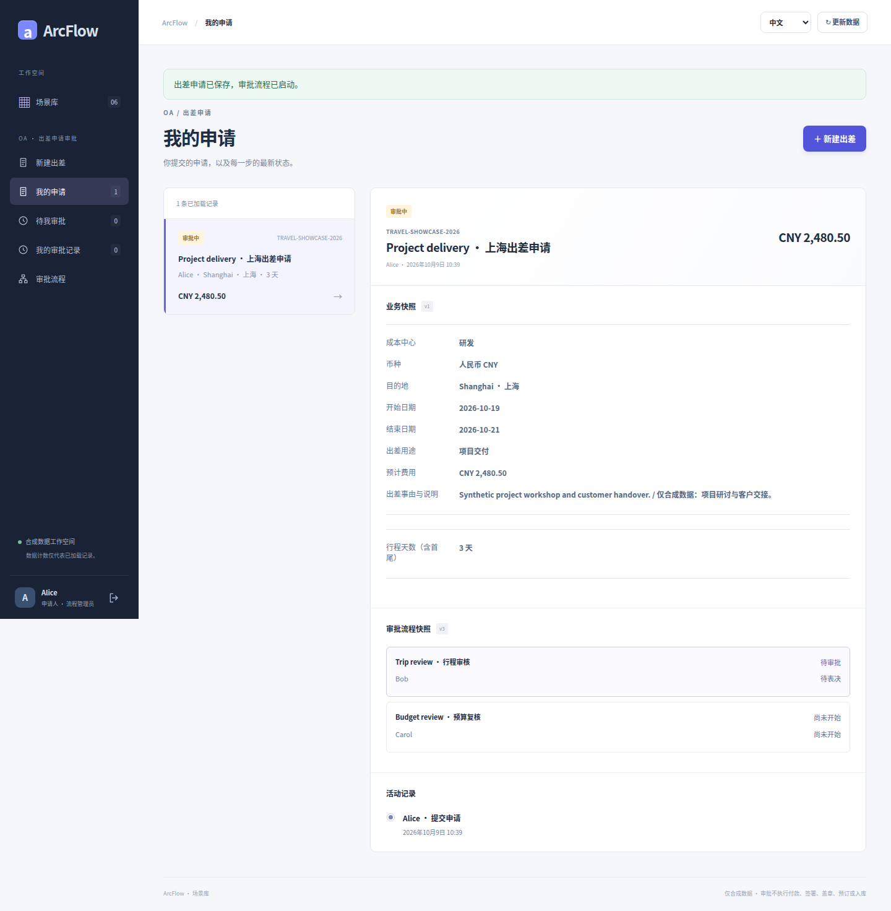
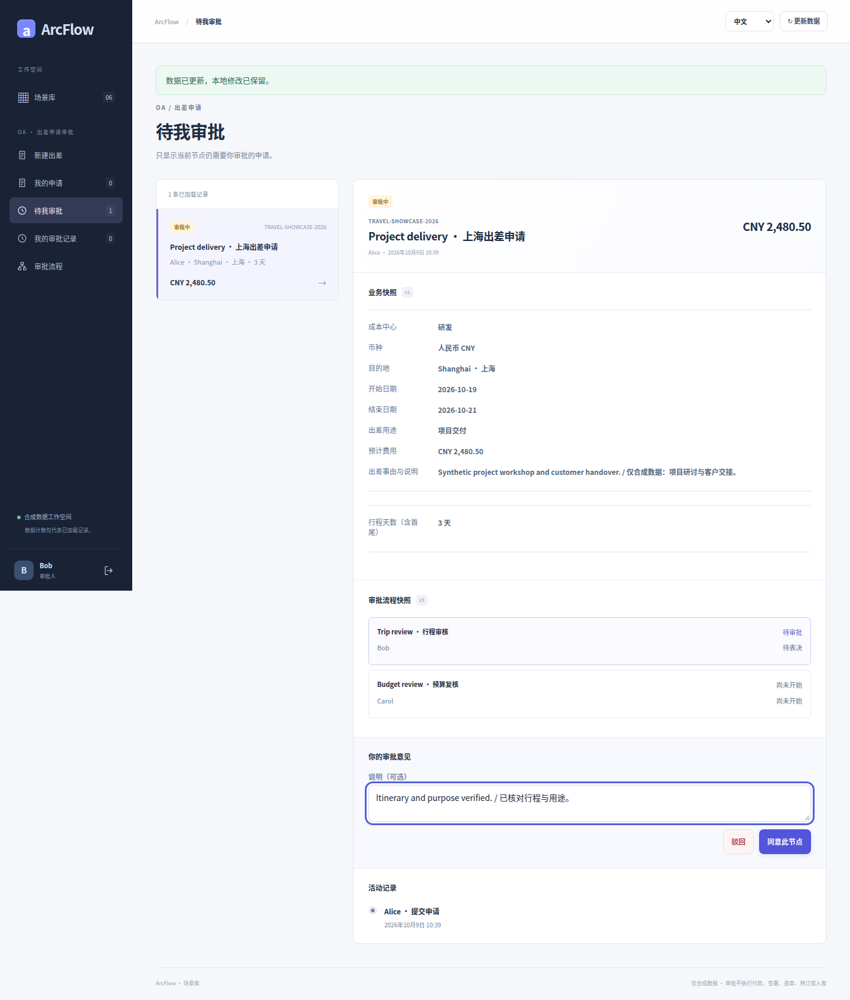
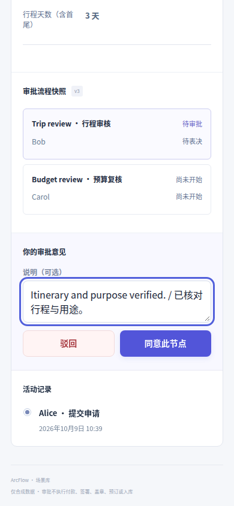
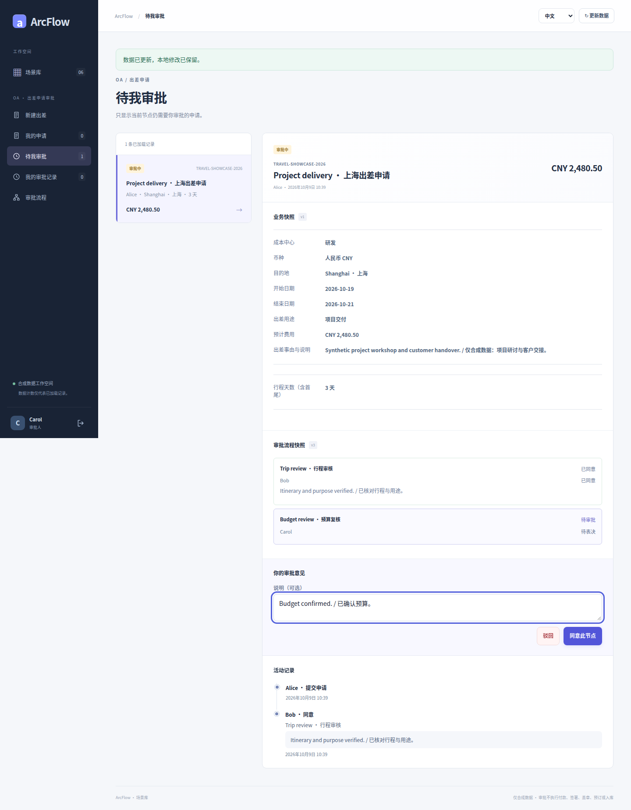
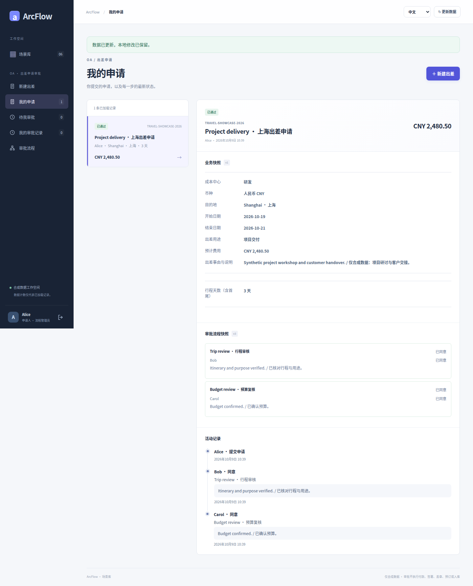
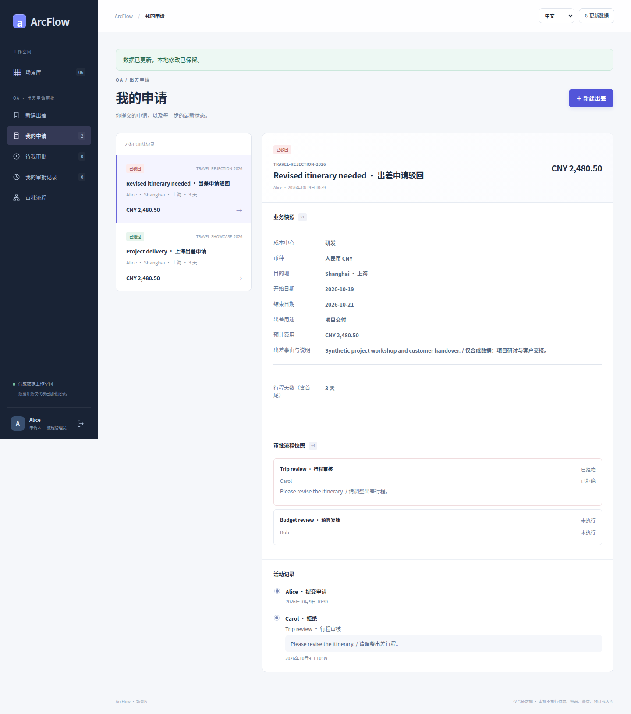
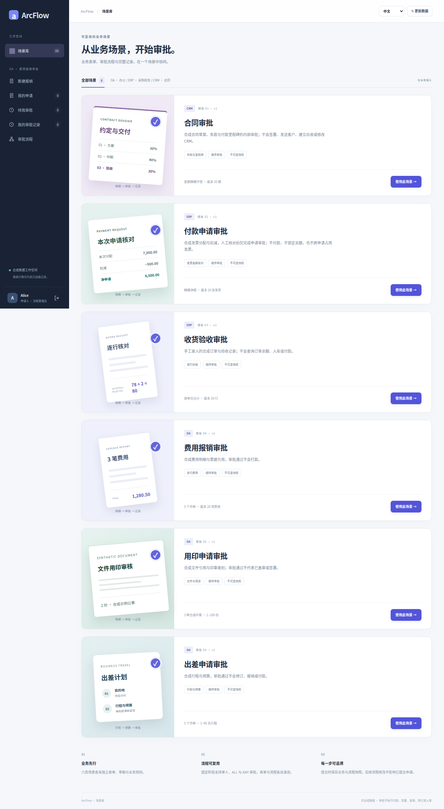

# OA 出差 · 真实界面图集

[简体中文](travel.md) · [English](travel.en.md) · [五类图集](README.md) · [业务契约](../TRAVEL_SCENARIO.md)

上海项目交付出差：2026-10-19 至 2026-10-21，共 3 天，预算 CNY 2,480.50。先看两级流程配置，再跟随 Alice 提交、Bob 行程审核、Carol 预算复核，以及另一笔驳回分支。

全部图片是提交 [`8c26d95`](https://github.com/JamesCube/ArcFlow/commit/8c26d953e53991d3e445aa69c530726f1d81daae) 的原始截图，来自[运行 37918452685](https://github.com/JamesCube/ArcFlow/actions/runs/37918452685)，不是当前 main 的重新采集。界面与相关应用源码在文档基线 [`199db754`](https://github.com/JamesCube/ArcFlow/commit/199db7548f6faba5dfef105eaaf7311972adb388) 保持一致；这不代表新提交通过了测试。每张图片下方标注实际语言、视口、PNG 尺寸和采集状态。点击图片查看原图。

<!-- topic:scope-and-limits -->
## 能力与边界

审批不会预订交通或酒店、报销、预留资金或付款；本组出差图是固定两级人工流程，没有出差金额条件路由。

所有账号和业务资料均为合成演示数据。390px 是 Chromium 浏览器视口，不是原生 H5 客户端或实体手机验收；长页高度不是视口高度。中英文只是界面语言，合成标题／流程名可能保留双语。

<!-- topic:process-configuration-and-business-states -->
## 流程配置与业务状态

### 流程设计器：行程审核 → 预算复核

界面语言: 中文 · 浏览器视口: 1440×1000 · 全页原图: 1440×1295 px

采集状态: `designer` · [PNG SHA-256](../images/scenarios/provenance.json): `b357bce99cbeea4a6a92f64865b1c8bf62d5429533583854a007f9ce7184f229`

### 填写出差日期、目的地与精确预算

界面语言: 中文 · 浏览器视口: 1440×1000 · 全页原图: 1440×1464 px

采集状态: `filled-travel` · [PNG SHA-256](../images/scenarios/provenance.json): `c5d262685c9b2ec46c6a2c0f66ea0a7831ed7324c9f116613c7dc23dce89bdcf`

### 字段校验：错误在提交前可见

界面语言: 中文 · 浏览器视口: 1440×1000 · 全页原图: 1440×1517 px

采集状态: `validation-errors` · [PNG SHA-256](../images/scenarios/provenance.json): `17a0885ab8684aa12ba560a150bdb4ab3f49ccfd08639a07904564e15b1b7a24`

### Alice 已提交：保存业务与流程快照

界面语言: 中文 · 浏览器视口: 1440×1000 · 全页原图: 1440×1472 px

采集状态: `request-detail-pending` · [PNG SHA-256](../images/scenarios/provenance.json): `bf536d5eb51e7253194b71649fd80efd1c622a9b96c54739bd93e47c478d3c98`

### Bob 审核行程：待处理申请与操作

界面语言: 中文 · 浏览器视口: 1440×1000 · 全页原图: 1440×1693 px

采集状态: `review-pending` · [PNG SHA-256](../images/scenarios/provenance.json): `87965c3cf03b2d08aefc84525bae3cd34ddc44e239bd6078324dbdb9bca6d659`

### 390px 审核操作视口

界面语言: 中文 · 浏览器视口: 390×844 · 视口原图: 390×844 px

采集状态: `review-pending` · [PNG SHA-256](../images/scenarios/provenance.json): `d97b2d244162292a47df1392c35e0fc4ea9a0ec85bc123dbed6b736493644ae1`

### 下一步：等待 Carol 预算复核

界面语言: 中文 · 浏览器视口: 1440×1000 · 全页原图: 1440×1849 px

采集状态: `review-next` · [PNG SHA-256](../images/scenarios/provenance.json): `66ab049943cd6083540aa5ff5466168aa7669db0db9246cb0d1dc4e68661ae1e`

### 两级通过：保留结果与审批历史

界面语言: 中文 · 浏览器视口: 1440×1000 · 全页原图: 1440×1784 px

采集状态: `request-detail-approved` · [PNG SHA-256](../images/scenarios/provenance.json): `5378a4b98a0d7397ec256f555e86656369c9e0cc6be07de430457c902554c71f`

### 独立申请：驳回分支

这是后续 v4 下的新申请；前面的通过申请使用 v3。

界面语言: 中文 · 浏览器视口: 1440×1000 · 全页原图: 1440×1628 px

采集状态: `request-detail-rejected` · [PNG SHA-256](../images/scenarios/provenance.json): `2597ba5956021cfd934149623ba4594a5e2bccb87bf5dfe9d3abf919dee7551c`

### 场景库：从目录进入出差

界面语言: 中文 · 浏览器视口: 1440×1000 · 全页原图: 1440×2622 px

采集状态: `catalog` · [PNG SHA-256](../images/scenarios/provenance.json): `e086828e8861694133b7803d96a918522f3998465ddb7fdd637b3f213821e9c3`

<!-- topic:sources-and-reproduction -->
## 来源与复现

- [历史采集运行](https://github.com/JamesCube/ArcFlow/actions/runs/37918452685) · [commit](https://github.com/JamesCube/ArcFlow/commit/8c26d953e53991d3e445aa69c530726f1d81daae)
- [Playwright fixture](https://github.com/JamesCube/ArcFlow/blob/8c26d953e53991d3e445aa69c530726f1d81daae/examples/approval-ui/e2e/travel-scenarios.spec.mjs)
- [逐图来源与 SHA-256](../images/scenarios/provenance.json)
- [采集命令、验证范围与缺口](CAPTURE.md)
